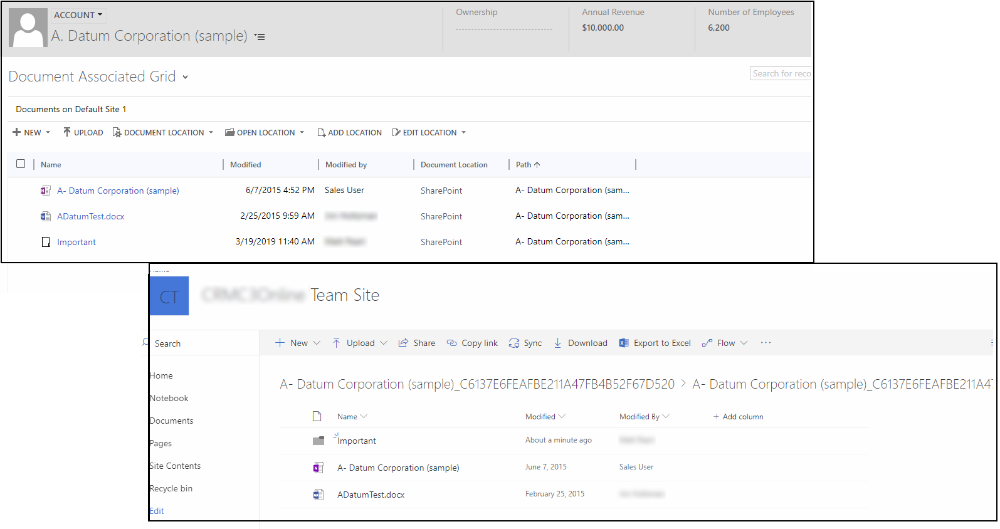

# Manage your documents using SharePoint

*This content also applies to the on-premises version.*

Dynamics 365 for Customer Engagement apps document management with SharePoint lets users manage common document types, such as Word, Excel, PowerPoint, OneNote, and create folders to save and manage those documents in Dynamics 365 for Customer Engagement apps that are seamlessly stored in [!INCLUDE[pn_SharePoint_short](../includes/pn-sharepoint-short.md)]. 

> [!div class="mx-imgBorder"] 
> 

Depending on your environment, there are several Dynamics 365 for Customer Engagement apps and SharePoint configurations possible. 

|Configuration  |More information  |
|---------|---------|
|Dynamics 365 for Customer Enagement apps (online) with SharePoint Online     |  [Set up Dynamics 365 for Customer Engagement to use SharePoint Online](set-up-dynamics-365-online-to-use-sharepoint-online.md)    |
|Dynamics 365 for Customer Enagement apps (online) with SharePoint on-premises     | [Configure server-based authentication with Dynamics 365 for Customer Engagement apps (online) and SharePoint on-premises](configure-server-based-authentication-sharepoint-on-premises.md)        |
|Dynamics 365 for Customer Engagement on-premises with with SharePoint Online     |  [Configure server-based authentication with Dynamics 365 for Customer Engagement apps (on-premises) and SharePoint Online](on-prem-server-based-sharepoint-online.md)     |
|Dynamics 365 for Customer Engagement on-premises with with SharePoint on-premises     |  [Configure server-based authentication with Dynamics 365 for Customer Engagement apps(on-premises) and SharePoint on-premises](on-prem-server-based-sharepoint-on-prem.md)    |

Administrators set up document management, specify permissions for managing tasks, and ensure that the [!INCLUDE[pn_SharePoint_short](../includes/pn-sharepoint-short.md)] site URLs are correct.  
  
## See also
[SharePoint Document Management software requirements](sharepoint-document-management-software-requirements.md)  
