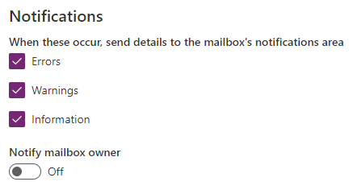

# Manage email notifications to admins

The service team regularly sends email notifications to the administrators in your  organization. Now, with a simple approach of mailbox rules, you have complete control over who should receive these email communications. As an administrator, you can set up mailbox rules to automatically redirect email communications from model-driven apps in Dynamics 365, (crmoln@microsoft.com) to additional recipients that you choose. For example, you can add to the list of recipients:  
  
- People outside of your organization, such as your partners.  
  
- People inside and outside of your company.  
  
  All redirected emails retain the original sender context, such as model-driven apps in Dynamics 365 (crmoln@microsoft.com).  
  
  You can automatically redirect the email notifications in [!INCLUDE[pn_ms_Exchange_Server_2010_short](../includes/pn-ms-exchange-server-2010-short.md)] or later versions. You can also set up automatic email redirection in the following deployments:  
  
- [!INCLUDE[pn_Exchange_Server_full](../includes/pn-exchange-server-full.md)] on-premises deployment  
  
- [!INCLUDE[pn_Office_365](../includes/pn-office-365.md)] – [!INCLUDE[pn_Exchange_Online](../includes/pn-exchange-online.md)] service  
  
- Hybrid deployment: [!INCLUDE[pn_Exchange_Server_short](../includes/pn-exchange-server-short.md)] on-premises and [!INCLUDE[pn_Office_365](../includes/pn-office-365.md)] subscription with [!INCLUDE[pn_Exchange_Online](../includes/pn-exchange-online.md)]  
  
- Email deployments other than [!INCLUDE[pn_Exchange](../includes/pn-exchange.md)]  
  
  If you have been added as an additional recipient, and you want to stop receiving email notifications, please contact your admin. If you’re not sure who your  admin is, see: [Find your administrator or support person](https://docs.microsoft.com/powerapps/user/find-admin).  
  
  For more information, download the white paper: [Create your Mailbox rule](https://download.microsoft.com/download/D/1/A/D1A64A1D-FD55-43E4-AD71-9D32D16E5F9E/Create%20your%20Mailbox%20rule.docx)  
    
## Set email notifications
 By default, admins will receive update notifications. You can add others to receive update notifications.  
  
1. Sign in to the Power Platform admin center at [https://admin.powerplatform.microsoft.com](https://admin.powerplatform.microsoft.com) as an admin (Dynamics 365 admin, Global admin, or Power Platform admin).

2. In the navigation pane, select **Environments**, and then select an environment that has notifications you want to change.
  
3. Select **Settings** > **Email** > **Email settings**.

4. Specify the settings under **Notifications**.  

   > [!div class="mx-imgBorder"] 
   > 
  
5. Select **Save**.
  

