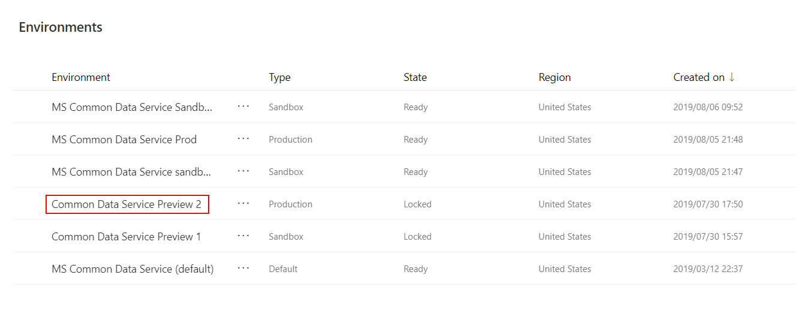
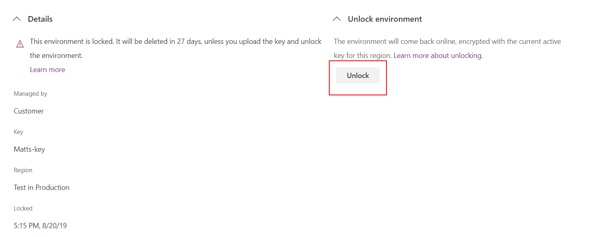
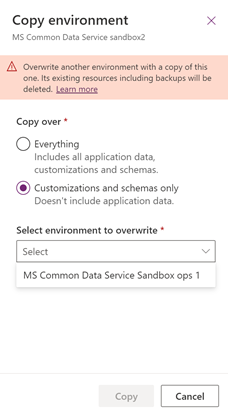

# Manage the encryption key
All environments of Microsoft Dataverse use [!INCLUDE[pn_MS_SQL_Server](../includes/pn-ms-sql-server.md)] Transparent Data Encryption (TDE) to perform real-time encryption of data when written to disk, also known as encryption at rest.  
  
 By default, [!INCLUDE[cc_Microsoft](../includes/cc-microsoft.md)] stores and manages the database encryption key for your environments so you don't have to.  The manage keys feature in the Power Platform admin center gives administrators the ability to self-manage the database encryption key that is associated with the Dataverse tenant. 

<!--  [!IMPORTANT]
>  Self-managed database encryption keys are only available in the [!INCLUDE[pn_CRM_Online](../includes/pn-crm-8-2-0-online.md)] and may not be made available for later versions. --> 

> [!IMPORTANT]
> Self-managed database encryption keys are only available for customers who have more than 1000 Power Apps plan and/or Dynamics 365 plan licensed user seats and who have opted in to the feature.  To opt in to this program, submit a [support request](https://docs.microsoft.com/power-platform/admin/support-overview#using-support).
>
> Encryption key management is only applicable to Azure SQL environment databases. The following features and services use their own key to encrypt their data and can't be encrypted with the self-managed encryption key:
> - Relevance Search
> - Mobile Offline
> - Activity Log (Microsoft 365 portal)
> - Exchange (Server-side sync)
> 
> Note the following: 
> - The self-manage the database encryption key feature must be turned on by Microsoft for your tenant before you can use the feature.  
> - To use the data encryption management features for an environment, the environment must be created *after* the self-manage the database encryption key feature is turned on by Microsoft.  
> - Encryption key management cannot be applied to environments that have data stored in [File](https://docs.microsoft.com/powerapps/maker/common-data-service/types-of-fields#file-fields) and [Image](https://docs.microsoft.com/powerapps/maker/common-data-service/types-of-fields#image-fields) fields. 
> - A majority of existing environments have file and log stored in non-Azure SQL databases. These environments cannot be opted in to self-managed encryption key. Only new environments (once you signed up for this program) can be enabled with self-managed encryption key.
  
   
## Introduction to key management  
 With key management, administrators can provide their own encryption key or have an encryption key generated for them, which is used to protect the database for an environment.  
  
 The key management feature supports both PFX and BYOK encryption key files, such as those stored in a hardware security module (HSM). To use the upload encryption key option you need both the public and private encryption key.  
  
 The key management feature takes the complexity out of encryption key management by using [!INCLUDE[pn_azure_key_vault](../includes/pn-azure-key-vault.md)] to securely store encryption keys. [!INCLUDE[pn_azure_key_vault](../includes/pn-azure-key-vault.md)] helps safeguard cryptographic keys and secrets used by cloud applications and services. The key management feature doesn't require that you have an [!INCLUDE[pn_azure_key_vault](../includes/pn-azure-key-vault.md)] subscription and for most situations there is no need to access encryption keys used for Dataverse within the vault.  
  
 The manage keys feature lets you perform the following tasks.  
  
- Enable the ability to self-manage database encryption keys that are associated with Dataverse environments.  
  
- Generate new encryption keys or upload existing .PFX or .BYOK encryption key files.  
  
- Lock and unlock tenant environments.   
    > [!WARNING]
    > While a tenant is locked, all environments within the tenant can't be accessed by anyone. More information: [Lock the tenant](#lock-the-tenant).    
  
  
 
## Understand the potential risk when you manage your keys  
 As with any business critical application, personnel within your organization who have administrative-level access must be trusted. Before you use the key management feature, you should understand the risk when you manage your database encryption keys. It is conceivable that a malicious administrator (a person who is granted or has gained administrator-level access with intent to harm an organization's security or business processes) working within your organization might use the manage keys feature to create a key and use it to lock all environments in the tenant. 

Consider the following sequence of events.  
  
The malicious administrator signs in to the Power Platform admin center, goes to the **Environments** tab and selects **Manage encryption key**. The malicious administrator then creates a new key with a password and downloads the encryption key to their local drive, and activates the new key. Now all the environment databases are encrypted with the new key. Next, the malicious administrator locks the tenant with the newly downloaded key, and then takes or deletes the downloaded encryption key.  

These actions will result in disabling all the environments within the tenant from online access and make all database backups un-restorable.
  
> [!IMPORTANT]
> To prevent the malicious administrator from interrupting the business operations by locking the database, the managed keys feature doesn't allow tenant environments to be locked for 72 hours after the encryption key has changed or activated. Additionally, anytime an encryption key is changed for a tenant, all administrators receive an email message alerting them of the key change. This provides up to 72 hours for other administrators to roll back any unauthorized key changes. 
  
   

## Key management requirements  
  
### Privileges required  
 To use the manage keys feature you need one of the following privileges:  
  
- Global admin membership.  
  
- Microsoft 365 Service administrators group membership.  
  
- System administrator security role for the environment that you want to manage the encryption key.  
  
### Encryption key requirements  
 If you provide your own encryption key, your key must meet  these  requirements that are accepted by [!INCLUDE[pn_azure_key_vault](../includes/pn-azure-key-vault.md)].  
  
-   The encryption key file format must be PFX or BYOK.  
  
-   2048-bit RSA or RSA-HSM key type.  
  
-   PFX encryption key files must be password protected.  
  
For more information about generating and transferring an HSM-protected key over the Internet see [How to generate and transfer HSM-protected keys for Azure Key Vault](https://docs.microsoft.com/azure/key-vault/key-vault-hsm-protected-keys).  
  
   

## Key management tasks  
 To simplify the key management tasks, the tasks are broken down into three areas:
1.    [Generate or upload the encryption key for a tenant](#generate-or-upload-the-encryption-key-for-a-tenant)
2.  [Activate an encryption key for a tenant](#activate-an-encryption-key-for-a-tenant) 
3.    [Manage encryption for an environment](#manage-encryption-for-an-environment) 

Administrators can use the [Power Platform admin center](https://admin.powerplatform.microsoft.com/environments) or the [Microsoft.Xrm.OnlineManagementAPI PowerShell module](https://docs.microsoft.com/powershell/module/microsoft.xrm.onlinemanagementapi/?view=dynamics365ce-ps) cmdlets to perform the key management tasks described here.
  
### Generate or upload the encryption key for a tenant  
All encryption keys are stored in the Azure Key Vault, and there can only be one active key at any time. Since the active key is used to encrypt all the environments in the tenant, managing the encryption is operated at the tenant level. Once the key is activated, each individual environment can then be selected to use the key for encryption. 

Use this procedure to set the manage key feature the first time for an environment or to change (or roll-over) an encryption key for an already self-managed tenant.  

> [!WARNING]
> When you perform the steps described here for the first time you are opting in to self-managing your encryption keys. More information: [Understand the potential risk when you manage your keys](#understand-the-potential-risk-when-you-manage-your-keys).  
1. Sign in to the [Power Platform admin center](https://admin.powerplatform.microsoft.com/environments).  
  
2. Select the **Environments** tab, and then select **Manage encryption keys** on the toolbar. 

3. Select **Confirm** to acknowledge the manage key risk.

4. Select **New key** on the toolbar.  
  
5. On the left pane, complete the details to generate or upload a key: 
     - Select a **Region**. This option is only shown if your tenant has multiple regions.
     - Enter a **Key name**.  
     - Choose from the following options: 
         - To create a new key, select **Generate new (.pfx)**. More information: [Generate a new key (.pfx)](#generate-a-new-key-pfx).
         - To use your own generated key, select **Upload (.pfx or .byok)**. More information: [Upload a key (.pfx or .byok)](#upload-a-key-pfx-or-byok).

6. Select **Next**. 

7. Email notification is sent to all administrators. More information: [Encryption key change notification](#encryption-key-change-notification).

#### Generate a new key (.pfx)   
1.    Enter a password, and then re-enter the password to confirm.
2.    Select **Create**, and then select the created file notification on your browser.
3.    The encryption key .PFX file is downloaded to your web browser's default download folder. Save the file in a secure location (we recommend that this key is backed up along with its password). 
  
To perform this task using PowerShell, see [Get-CRMGenerateProtectionkey](/powershell/module/microsoft.xrm.onlinemanagementapi/Get-CrmGenerateProtectionKey?view=dynamics365ce-ps) and [Set-CrmTenantProtectionKey](/powershell/module/microsoft.xrm.onlinemanagementapi/set-crmtenantprotectionkey?view=dynamics365ce-ps).

#### Upload a key (.pfx or .byok)
1.    Select **Upload the Key**, select the .pfx or .byok1 file, and then select **Open**. 
2.    Enter the password for the key, and then select **Create**.

1 For .byok encryption key files, make sure you use the subscription id as shown on the screen when you export the encryption key from your local HSM. More information: [How to generate and transfer HSM-protected keys for Azure Key Vault](https://docs.microsoft.com/azure/key-vault/key-vault-hsm-protected-keys). 

To perform this task using PowerShell, see [New-CRMImportProtectionKey](/powershell/module/microsoft.xrm.onlinemanagementapi/new-crmimportprotectionkey?view=dynamics365ce-ps) and [Set-CrmTenantProtectionKey](/powershell/module/microsoft.xrm.onlinemanagementapi/set-crmtenantprotectionkey?view=dynamics365ce-ps).

> [!NOTE]
> To reduce the number of steps for the administrator to manage the key process, the key is automatically activated when it is uploaded the first time. All subsequent key uploads require an additional step to activate the key.

### Activate an encryption key for a tenant
Once an encryption key is generated or uploaded for the tenant, it can be activated. 

1.    Sign in to the [Power Platform admin center](https://admin.powerplatform.microsoft.com/environments).  
2.    Select the **Environments** tab, and then select **Manage encryption keys** on the toolbar.
1.  Select **Confirm** to acknowledge the manage key risk.
2.  Select a key that has an **Available** state and then select **Activate key** on the toolbar.
3.  Select **Confirm** to acknowledge the key change and that all administrators will be notified.
    More information: [Encryption key change notification](#encryption-key-change-notification)

When you activate a key for the tenant, it takes a while for the key management service to activate the key. The status of the **Key state** displays the key as **Installing** when the new or uploaded key is activated. 
Once the key is activated, the following occurs: 
- All encrypted environments automatically get encrypted with the active key (there is no downtime with this action).
- When activated, the encryption key will be applied to all environments that are changed from Microsoft-provided to self-managed encryption key.

To perform this task using PowerShell, see [Set-CrmProtectWithTenantKey](/powershell/module/microsoft.xrm.onlinemanagementapi/set-crmprotectwithtenantkey?view=dynamics365ce-ps).

> [!IMPORTANT]
> To streamline the key management process so that all environments are managed by the same key, the active key can't be updated when there are locked environments.  All locked environments must be unlocked before a new key can be activated. If there are locked environments that don't need to be unlocked, they must be deleted. 

> [!NOTE]
> After an encryption key is activated, you can't activate another key for 24 hours.

### Manage encryption for an environment
By default, each environment is encrypted with the Microsoft-provided encryption key. Once an encryption key is activated for the tenant, administrators can elect to change the default encryption to use the activated encryption key. To use the activated key, follow these steps.

#### Apply encryption key to an environment
1.  Sign in to the [Power Platform admin center](https://admin.powerplatform.microsoft.com/environments).  
2.    Select the **Environments** tab.
1.  Open a **Microsoft-provided** encrypted environment. 
2.  Select **See all**. 
3.  In the **Environment Encryption** section, select **Manage**. 
6.    Select **Confirm** to acknowledge the manage key risk.
1.  Select **Apply this key** to accept changing the encryption to use the activated key. 
2.  Select **Confirm** to acknowledge that you are managing the key directly and that there is downtime for this action.

#### Return a managed encryption key back to Microsoft-provided encryption key
 Returning to the Microsoft-provided encryption key configures the environment back to the default behavior where [!INCLUDE[cc_Microsoft](../includes/cc-microsoft.md)] manages the encryption key for you.  
  
1.    Sign in to the [Power Platform admin center](https://admin.powerplatform.microsoft.com/environments).
2.    Select the **Environments** tab, and then select an environment that is encrypted with a self-managed key.
3.    Select **See all**.
1.  In the **Environment Encryption** section, select **Manage**, and then select **Confirm**. 
5.    Under **Return to standard encryption management**, select **Return** .
1.  For production environments, confirm the environment by entering the environment's name.
2.  Select **Confirm** to return to standard encryption key management.

To perform this task using PowerShell, see [Set-CrmProtectWithMicrosoftKey](/powershell/module/microsoft.xrm.onlinemanagementapi/set-crmprotectwithmicrosoftkey?view=dynamics365ce-ps).
  
#### Lock the tenant  
Since there is only one active key per tenant, locking the encryption for the tenant *disables all the environments* that are in the tenant. All locked environments remain inaccessible to everyone, including [!INCLUDE[cc_Microsoft](../includes/cc-microsoft.md)], until a Power Platform admin in your organization unlocks it by using the key that was used to lock it.  
  
> [!CAUTION]
>  You should never lock the tenant environments as part of your normal business process. When you lock a Dataverse tenant, all the environments will be taken completely offline and they can't be accessed by anyone, including Microsoft. Additionally, services such as synchronization and maintenance are all stopped. If you decide to leave the service, locking the tenant can ensure that your online data is never accessed again by anyone.  
> Note the following about tenant environments locking: 
> - Locked environments can't be restored from backup.  
> - Locked environments are deleted if not unlocked after 28 days.
> -    You can't lock environments for 72 hours after an encryption key change. 
> - Locking a tenant *locks all active environments* within the tenant. 

> [!IMPORTANT]
> - You must wait at least one hour after you lock active environments before you can unlock them. 
> - Once the lock process begins, all encryption keys with either an Active or Available state are deleted. The lock process can take up to an hour and during this time unlocking locked environments is not allowed. 

1. Sign into the [Power Platform admin center](https://admin.powerplatform.microsoft.com).
2. Select the **Environments** tab and then on the command bar select **Manage encryption keys**. 
3. Select the **Active** key and then select **Lock active environments**. 
4. On the right pane select **Upload active key**, browse to and select the key, enter the password, and then select **Lock**. 
5. When prompted, enter the text that is displayed on your screen to confirm that you want to lock all environments in the region, and then select **Confirm**.

To lock a tenant using the PowerShell cmdlet, see [Set-CrmLockTenantProtectedInstances](https://docs.microsoft.com/powershell/module/microsoft.xrm.onlinemanagementapi/set-crmlocktenantprotectedinstances?view=dynamics365ce-ps).
  
#### Unlock locked environments
To unlock environments you must first [upload](#upload-a-key-pfx-or-byok) and then [activate](#activate-an-encryption-key-for-a-tenant) the tenant encryption key with the same key that was used to [lock the tenant](#lock-the-tenant). Please note that locked environments do not get unlocked automatically once the key has been activated. Each locked environment has to be unlocked individually. 

> [!IMPORTANT]
> - You must wait at least one hour after you lock active environments before you can unlock them. 
> - The unlock process can take up to an hour. Once the key is unlocked, you can use the key to [Manage encryption for an environment](#manage-encryption-for-an-environment). 
> - You can't generate a new or upload an existing key until all locked environments are unlocked. 

##### Unlock encryption key
1. Sign into the [Power Platform admin center](https://admin.powerplatform.microsoft.com).
2. Select the **Environments** tab and then select **Manage encryption keys**.  
3. Select the key that has a **Locked** state, and then on the command bar select **Unlock key**. 
4. Select **Upload locked key**, browse to and select the key that was used to lock the tenant, enter the password, and then select **Unlock**. 
   The key goes into an **Installing** state. You must wait until the key is in an **Active** state before you can unlock locked environments. 
5. To unlock an environment, see the next section. 

##### Unlock environments
1. Select the **Environments** tab, and then select the locked environment name. 
    > [!TIP]
    > Don't select the row. Select the environment name. 
    

2. In the **Details** section, select **See all** to display the **Details** pane on the right. 
3. In the **Environment** encryption section on the **Details** pane select **Manage**. 

     > [!div class="mx-imgBorder"] 
     > 

4. On the **Environment encryption** page select **Unlock**. 

     > [!div class="mx-imgBorder"] 
     > 

5. Select **Confirm** to confirm that you want to unlock the environment. 
6. Repeat the previous steps to unlock additional environments. 

To unlock an environment using the PowerShell cmdlet, see [Set-CrmUnlockTenantProtectedInstance](https://docs.microsoft.com/powershell/module/microsoft.xrm.onlinemanagementapi/set-crmunlocktenantprotectedinstance?view=dynamics365ce-ps).

## Environment database operations 
A customer tenant can have environments that are encrypted using the Microsoft managed key and environments that are encrypted with the customer managed key. To maintain data integrity and data protection, the following controls are available when managing environment database operations.

1. [Restore](backup-restore-environments.md) 
   The environment to overwrite (the restored to environment) is restricted to the same environment that the backup was taken from or to another environment that is encrypted with the same customer managed key. 

   > [!div class="mx-imgBorder"] 
   > 

2. [Copy](copy-environment.md)
   The environment to overwrite (the copied to environment) is restricted to another environment that is encrypted with the same customer managed key. 

   > [!div class="mx-imgBorder"] 
   > 

   > [!NOTE]
   > If a Support Investigation environment was created to resolve support issue in a customer managed environment, the encryption key for the Support Investigation environment must be changed to customer managed key before the Copy environment operation can be performed. 

3. [Reset](sandbox-environments.md#reset-a-sandbox-environment)
   The environment's encrypted data will be deleted including backups. After the environment is reset, the environment encryption will revert back to the Microsoft managed key. 

## Encryption key change notification
> [!IMPORTANT]
> When an encryption key is activated or changed, all administrators receive an email message alerting them of the change. This provides a means to allow other administrators to verify and confirm that the key was updated by an authorized administrator.  Since it takes time to activate the key and to encrypt all the environments, and to send out the email notification, an encryption key can only be updated once every 24 hours.

### See also  
[Microsoft.Xrm.OnlineManagementAPI PowerShell reference](/powershell/module/microsoft.xrm.onlinemanagementapi/?view=dynamics365ce-ps)  
[SQL Server: Transparent Data Encryption (TDE)](/sql/relational-databases/security/encryption/transparent-data-encryption?view=sql-server-2017)
