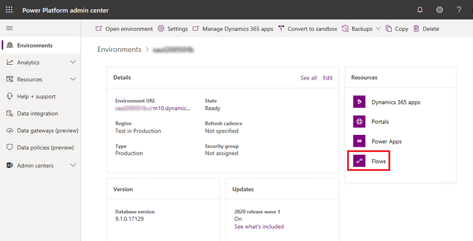
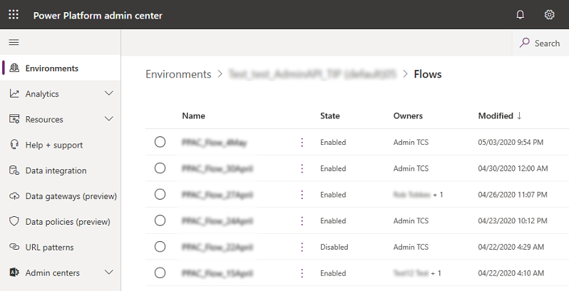
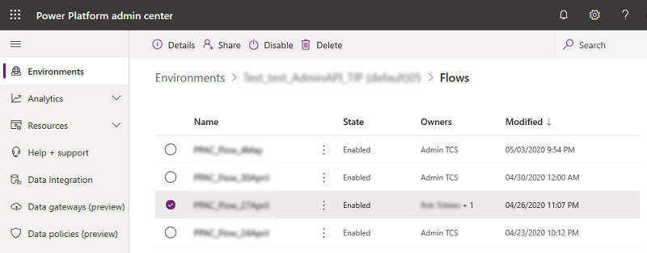

# Manage Power Automate flows

If you're an Environment Admin, Global admin, or Power Platform admin, you can manage the flows created in your organization.

Admins can do the following from the Power Platform admin center:

- View flow details, connections, and owners
- Share the flow with others  
- Disable the flow
- Delete the flow

## Prerequisites

- Either a Power Apps plan or Power Automate plan. Alternatively, you can sign up for a [free Power Apps trial](https://docs.microsoft.com/powerapps/maker/signup-for-powerapps).

- Power Apps Environment Admin, Global admin, or Power Platform admin permissions. For more information, see [Environments administration in Power Apps](environments-administration.md).

## Manage Power Automate flows

1. Sign in to the [Power Platform admin center](https://admin.powerplatform.microsoft.com).

2. In the navigation pane, select **Environments**, select an environment with resources, and then select the **Power Automate (Flows)** resource.

   > [!div class="mx-imgBorder"] 
   > 

3. Select a flow to manage.

   > [!div class="mx-imgBorder"] 
   >  

4. Select your desired action.

   > [!div class="mx-imgBorder"] 
   >  

   |Action  |Description  |
   |---------|---------|
   |**Details**     | View details, connections, and owners        |
   |**Share**     | Share the flow with others        |
   |**Disable**     | Disable the flow        |
   |**Delete**     | Delete the flow        |
