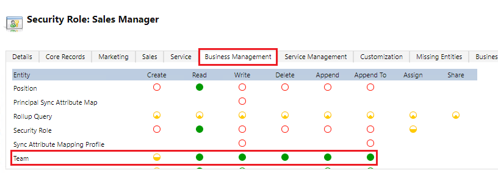
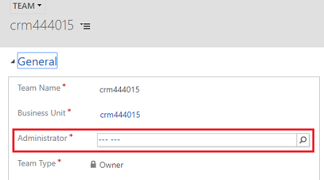

# Manage teams

<!-- legacy procedure -->

Using teams is optional. However, teams provide an easy way to share business objects and let you collaborate with other people across business units. While a team belongs to one business unit, it can include users from other business units. You can associate a user with more than one team.  
  
 You can use three types of teams:  
  

- An *owner* team owns records and has security roles assigned to the team. The team's privileges are defined by these security roles. In addition to privileges provided by the team, team members have the privileges defined by their individual security roles and team [member's privilege inheritance](security-roles-privileges.md#team-members-privilege-inheritance) roles, and by the roles from other teams in which they are members. A team has full access rights on the records that the team owns. Team members are added manually to the owner team.

- An Azure Active Directory (Azure AD) *group* team. Similar to *owner* team, an Azure AD group team can own records and can have security roles assigned to the team. There are two *group* team types, and they correspond directly to the Azure AD group types – Security and Office. The *group* security role can be just for the team or for team member with User privileges [member's privilege inheritance](security-roles-privileges.md#team-members-privilege-inheritance). Team members are dynamically derived (added and removed) when they access the environment based on their Azure AD group membership.  
  
- An *access* team doesn't own records and doesn't have security roles assigned to the team. The team members have privileges defined by their individual security roles and by roles from the teams in which they are members. The records are shared with an access team, and the team is granted access rights on the records, such as Read, Write, or Append.  
  
## Owner/group team or access team? 

The type of team you choose depends on the goals, nature of the project, and even the size of your organization. There are a few guidelines that you can use when choosing the team type. 

### When to use owner or group teams 

- Your organization's policies require the ability for records to be owned by entities other than users, such as the team entity. 
- The number of teams is known at the design time of your system. 
- Daily reporting on progress by owning teams is required. 

### When to use access teams 

- The teams are dynamically formed and dissolved. This typically happens if clear criteria for defining the teams, such as established territory, product, or volume are not provided. 
- The number of teams is not known at the design time of your system. 
- The team members require different access rights on the records. You can share a record with several access teams, each team providing different access rights on the record. For example, one team is granted the Read access right on the account and another team, the Read, Write, and Share access rights on the same account. 
- A unique set of users requires access to a single record without having ownership of the record. 

## Common to all team types

### Who can create teams?
Anyone who has Create, Read, Update (Write), Delete (CRUD) privileges on the Team entity, can create any of the team types.

> [!div class="mx-imgBorder"] 
>  

### Add a Team administrator
When you create a team, you need to add a Team administrator with a security role that has Read privilege to the Team entity. In the web app, go to **Settings** > **Security** > **Teams** and select a team to enter the Team administrator.

> [!div class="mx-imgBorder"] 
> 

### What inherited privilege do Team administrators have?
Team administrators have access to Team owned records. Team administrators do not need to be added to a team and do not show up as a member of the team.

## About owner teams 
An owner team can own one or more records. To make a team an owner of the record, you must assign a record to the team.

While teams provide access to a group of users, you must still associate individual users with security roles that grant the privileges they need to create, update, or delete user-owned records. These privileges can't be applied by assigning security roles to a team and then adding the user to that team. If you need to provide your team members the team privileges directly without their own security role, you can assign the team a security role that has [member's privilege inheritance](security-roles-privileges.md#team-members-privilege-inheritance).

If an owner team doesn't own records and doesn't have security roles assigned to the team, it can be converted to an access team. It is a one-way conversion. You can't convert the access team back to the owner team. During conversion, all queues and mailboxes associated with the team are deleted. When you create a team in the web application, you have to choose the team type **Owner**.

For more information, see [Assign a record to a user or team](https://docs.microsoft.com/powerapps/user/assign-or-share-records).

## Create an owner team

1. Make sure that you have the System Administrator, Sales Manager, Vice President of Sales, Vice President of Marketing, or CEO-Business Manager security role or equivalent permissions.
   
   Check your security role:
   - Follow the steps in [View your user profile](https://docs.microsoft.com/powerapps/user/view-your-user-profile).
   - Don't have the correct permissions? Contact your system administrator.

2. In the web app, go to **Settings** > **Security**. In Microsoft Dynamics 365 for Outlook, go to **Settings** > **System** > **Security**.

3. Select **Teams**.

4. On the Actions toolbar, select **New** button.

5. Enter a team name.

6. Select a business unit.

7. Enter an administrator.

8. Select **Owner** in **Team Type**.

9. Complete other required fields, and then select **Save**.

   If you don't select the business unit to which the team will belong, by default, the root business unit is selected. The root business unit is the first business unit created for an organization.

## Edit an owner team

1. Make sure that you have the System Administrator, Sales Manager, Vice President of Sales, Vice President of Marketing, or CEO-Business Manager security role or equivalent permissions.
   
   Check your security role:
   - Follow the steps in [View your user profile](https://docs.microsoft.com/powerapps/user/view-your-user-profile).
   - Don't have the correct permissions? Contact your system administrator.

2. In the web app, go to **Settings** > **Security**. In Dynamics 365 for Outlook, go to **Settings** > **System** > **Security**.

3. Select **Teams**.

4. In the **Teams** drop-down list, select **All Owner Teams** or another appropriate view.

5. In the grid, select the team you want to edit.

6. On the Actions toolbar, select **Edit**, change the desired fields, and then select **Save**.

## About group teams

Applies to Common Data Service

### Using Azure Active Directory groups to manage a user's app and data access 

The administration of app and data access for Microsoft Common Data Service has been extended to allow administrators to use their organization's Azure Active Directory (Azure AD) groups to manage access rights for licensed Common Data Service users.

Both types of Azure AD groups—Office and Security—can be used to secure user-access rights. Using groups lets administrators assign a security role with its respective privileges to all the members of the group, instead of having to provide the access rights to an individual team member.

Both types of Azure AD groups — Office and Security — with a Membership type *Assigned* can be used to secure user-access rights. Membership type *Dynamic User* and *Dynamic Device* is not supported. Using groups lets administrators assign a security role with its respective privileges to all the members of the group, instead of having to provide the access rights to an individual team member.

The administrator can create Azure AD group teams that are associated to the Azure AD groups in each of the Common Data Service environments and assign a security role to these group teams. For each Azure AD group, the administrator can create group teams based on the Azure AD group membership types. The administrator can create separate group teams for owners, members, guests and members, and guests, and assign a respective security role to each of these teams.

When members of these group teams access these environments, their access rights are automatically granted based on the group team's security role.

#### Provision and deprovision users 

Once the group team and its security role is established in an environment, user access to the environment is based on the user membership of the Azure AD groups. When a new user is created in the tenant, all the administrator needs to do is assign the user to the appropriate Azure AD group, and assign Common Data Service licenses. The user can immediately access the environment without the need to wait for the administrator to assign a security role.

When users are deleted/disabled in Azure AD or removed from the Azure AD groups, they lose their group membership and won't be able to access the environment when they try to sign in.  

#### Remove user access at run time 

When a user is removed from the Azure AD groups by an administrator, the user is removed from the group team, and they lose their access rights the next time they access the environment. The memberships for the user's Azure AD groups and Common Data Service group teams are synchronized, and the user's access rights are dynamically derived at run time.

#### Administer user security role 

Administrators no longer have to wait for the user to sync to the environment and then to assign a security role to the user individually by using Azure AD group teams. Once a group team is established and created in an environment with a security role, any licensed Common Data Service users who are added to the Azure AD group can immediately access the environment. 

#### Lock down user access to environments 

Administrators can continue to use an Azure AD security group to lock down the list of users synced to an environment. This can be further reinforced by using Azure AD group teams. To lock down environment or app access to restricted environments, the administrator can create separate Azure AD groups for each environment and assign the appropriate security role for these groups. Only these Azure AD group team members have the access rights to the environment.

#### Share Power Apps to team members of an Azure AD group 

When canvas and model-driven apps are shared to an Azure AD group team, team members can immediately run the apps.

#### User-owned and team-owned records 

A new property has been added to the security role definition to provide special team privileges when the role is assigned to group teams. This type of security role allows team members to be granted User/Basic-level privileges as if the security role is directly assigned to them. Team members can create and be an owner of records without the need to have an additional security role assigned.

A group team can own one or more records. To make a team an owner of the record, you must assign the record to the team.

While teams provide access to a group of users, you must still associate individual users with security roles that grant the privileges that they need to create, update, or delete user-owned records. These privileges can't be applied by assigning a nonmember's privilege inherited security role to a team and then adding the user to that team. If you need to provide your team members the team privileges directly, without their own security role, you can assign the team a security role that has [member's privilege inheritance](security-roles-privileges.md#team-members-privilege-inheritance).

For more information, see [Assign a record to a user or team](https://docs.microsoft.com/powerapps/user/assign-or-share-records).

## Create a group team

1. Make sure that you have the System Administrator, Sales Manager, Vice President of Sales, Vice President of Marketing, or CEO-Business Manager security role or equivalent permissions.

   Check your security role:
   - Follow the steps in [View your user profile](https://docs.microsoft.com/powerapps/user/view-your-user-profile).
   - Don't have the correct permissions? Contact your system administrator.

   Prerequisites:
   1.    An Azure Active Directory (Azure AD) Group is required for each group team.
   2.    Obtain the Azure AD Group's **ObjectID** from your https://portal.azure.com site.
   3.    Create a custom security role that contains privileges per your team's collaboration requirement. Please see the discussion of [member's inherited privileges](security-roles-privileges.md#team-members-privilege-inheritance) if you need to extend the team member's privileges directly to a user.

2. In the web app, go to **Settings** > **Security**. In Microsoft Dynamics 365 for Outlook, go to **Settings** > **System** > **Security**.

3. Select **Teams**.

4. On the Actions toolbar, select **New** button.

5. Enter a team name.

6. Select a business unit.

7. Enter an administrator.

8. Select **Team Type** (a drop-down list is displayed).

9. Select **AAD Security** or **Office group** (this must match the Azure AD Group type).

10. Enter the respective Azure AD **ObjectID** of the Azure AD Security or Office group.

11. Select **Membership Type**, and then one of the following:
  
    - **Members and guests**
    - **Members**
    - **Owners**
    - **Guests**

    The Azure AD group members from the selected membership type will be mapped to the group team when the member accesses the system.   

12. Select **Save**. 
    
    If you don't select the business unit to which the team will belong, by default, the root business unit is selected. The root business unit is the first business unit created for an organization.

## Edit a group team

1. Make sure that you have the System Administrator, Sales Manager, Vice President of Sales, Vice President of Marketing, or CEO-Business Manager security role or equivalent permissions.
   
   Check your security role:
   - Follow the steps in [View your user profile](https://docs.microsoft.com/powerapps/user/view-your-user-profile).
   - Don't have the correct permissions? Contact your system administrator.

2. In the web app, go to **Settings** > **Security**. In Dynamics 365 for Outlook, go to **Settings** > **System** > **Security**.

3. Select **Teams**.

4. In the **Teams** drop-down list, select **All AAD Office or Security Teams**.

5. In the grid, select the team you want to edit.

6. On the Actions toolbar, select **Edit**, change the desired fields (Membership Type cannot be updated), and then select **Save**.

> [!NOTE]
> - You can only create one group team for each Azure AD group membership type per environment, and the Azure AD ObjectId of the group team cannot be edited once the group team is created.
> - Membership Type cannot be changed after the group team is created.  If you need to update this field, you will need to delete the group team and create a new one.
> - All existing group teams created prior to the new **Membership Type** field being added are automatically updated as **Members and guests**. There is no loss in functionality with these group teams as the default group team is mapped to the Azure AD Group **Members and guests** membership type. 
> - If your environment has a security group, you will need to add the group team's Azure AD group as a member of that security group in order for the group team's users to be able to access the environment.
> - The list of team members listed in each group team only displays the user members who have accessed the environment. This list doesn't show all the group members of the Azure AD group. The team member's privileges are derived dynamically at run-time when the team member accesses the application. The security role of the team is not assigned directly to the team member. Since team member's privileges are derived dynamically at run-time, the team member's Azure AD group memberships are cached upon the team member's log-in.  This means that any Azure AD group membership maintenance done on the team member in Azure AD will not be reflected until the next time the team member logs in or when the system refreshes the cache (after 8 hours of continuous log-in).
> - Team members are maintained in each group team at run-time and the operation is done at the database level; therefore, the update to group team event is not available for plugin.
> - You do not need to assign team members with an individual security role if your group team's security role has a [member's privilege inheritance](security-roles-privileges.md#team-members-privilege-inheritance) and the security role contains at least one privilege that has User level permission.

## About access teams and team templates  
 You can create an access team manually by choosing the team type **Access**, or let the system create and manage an access team for you. When you create an access team, you can share multiple records with the team.  
  
 A system-managed access team is created for a specific record, other records can't be shared with this team. You have to provide a team template that the system uses to create a team. In this template, you define the entity type and the access rights on the record that are granted to the team members when the team is created.  
  
 A team template is displayed on all record forms for the specified entity as a list. When you add the first user to the list, the actual access team for this record is created. You can add and remove members in the team by using this list. The team template applies to the records of the specified entity type and the related entities, according to the cascading rules. To give team members different access on the record, you can provide several team templates, each template specifying different access rights. 

For example, you can create a team template for the Account entity with the Read access right, which allows the team members to view the specified account. For another team that requires more access to the same account, you can create a team template with Read, Write, Share and other access rights. To be added to the team, a minimum access level a user must have on the entity specified in the template is Basic (User) Read.  
  
 Because of the parental relationship between the team template and system-managed access teams, when you delete a template, all teams associated with the template are deleted according to the cascading rules. If you change access rights for the team template, the changes are applied only to the new auto-created (system-managed) access teams. The existing teams are not affected.  
  
> [!NOTE]
> A user must have sufficient privileges to join an access team. For example, if the access team has Delete access rights on an account, the user must have Delete privileges on the Account entity to join the team. If you're trying to add a user with insufficient privileges, you'll see this error message: "You can't add the user to the access team because the user doesn't have sufficient privileges on the entity."  
  
 For step-by-step instructions on how to create a team template and add the entity form, see [Create a team template and add to an entity form](create-team-template-add-entity-form.md)  
 
## Maximum settings for system-managed access teams  
 The maximum number of team templates that you can create for an entity is specified in the `MaxAutoCreatedAccessTeamsPerEntity` deployment setting. The default value is 2. The maximum number of entities that you can enable for auto-created access teams is specified in the `MaxEntitiesEnabledForAutoCreatedAccessTeams` deployment setting. The default value is 100. You can use the `Set-CrmSetting`[!INCLUDE[pn_PowerShell](../includes/pn-powershell.md)] command to update this value.   
  
### See also  
 [Create a team template and add to an entity form](create-team-template-add-entity-form.md)   
 [About team templates](../admin/about-team-templates.md)   
 [Add teams or users to a field security profile](../admin/add-teams-users-field-security-profile.md)   
 [About team templates](about-team-templates.md)   
 [Download: Access Teams in Microsoft Dynamics CRM](https://download.microsoft.com/download/E/9/0/E9009308-CA01-4B37-B03C-435B8ACB49B4/Access%20Teams%20with%20Microsoft%20Dynamics%20CRM%202013.pdf)   
 [Download: Scalable security modeling with Microsoft Dynamics CRM](https://go.microsoft.com/fwlink/p/?LinkID=328757)   
 [Entity relationship behavior](https://docs.microsoft.com/powerapps/maker/common-data-service/create-edit-entity-relationships#entity-relationship-behavior)
