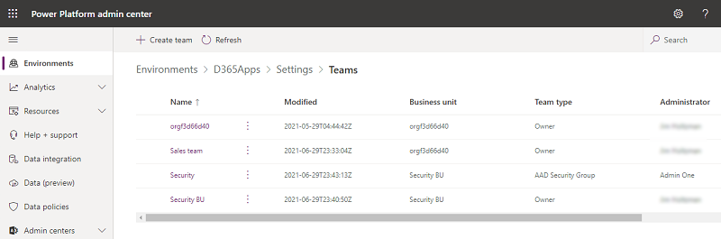

# Microsoft Dataverse teams management

Using Microsoft Dataverse teams is optional. However, teams provide an easy way to share business objects and let you collaborate with other people across business units. Although a team belongs to one business unit, it can include users from other business units. You can associate a user with more than one team. This topic discusses the different types of teams and their various operations.

> [!TIP]
> Check out the video: [Administer application users, security roles, teams, and users in the Power Platform admin center](https://www.microsoft.com/videoplayer/embed/RWJBr8).

## Types of teams

**Owner team:** An *owner team* owns records and has security roles assigned to the team. A user's privileges can come from their individual security roles, those of the teams that they're part of or the ones they inherit. A team has full access rights on the records that the team owns. Team members are added manually to the owner team.

**Access team:** An *access team* doesn't own records and doesn't have security roles assigned to the team. The team members have privileges defined by their individual security roles and by roles from the teams they're members of. These members share records with an access team, and the team is granted access rights to the records. Access rights include Read, Write, and Append.

**Azure AD group team:** Similar to owner teams, an *Azure Active Directory (Azure AD) group team* can own records and can have security roles assigned to the team. Security and Office are two group team types, and they correspond directly to Azure AD group types. Group security roles can be assigned only for a specific team or for a team member with user privileges that include [members' privilege inheritance](security-roles-privileges.md#team-members-privilege-inheritance). Team members are dynamically derived (added and removed) when they access an environment based on their Azure AD group membership. More information: [Manage group teams](manage-group-teams.md)

> [!NOTE]
> You can assign security roles directly to owner teams and Azure AD group teams and users. The environment picker only recognizes users who are members of Azure AD group teams and users who have security roles assigned to them directly. 

## Team operations

### Access your team's page

1. Sign in to the [Power Platform admin center](https://admin.powerplatform.microsoft.com). 

2. Select an environment, and then select **Settings** > **Users + permissions** > **Teams**.

A list of all of the teams in the environment is displayed.

### Create a new team

1. Sign in to the [Power Platform admin center](https://admin.powerplatform.microsoft.com). 

2. Select an environment, and then select **Settings** > **Users + permissions** > **Teams**.

3. Select **+ Create team**.

4. Specify the following fields:   

   - **Team name:** Be sure this name is unique within a business unit.
   - **Description:** Enter a description of the team.
   - **Business unit:** Select the business unit from the dropdown list.
   - **Administrator:** Search for users in the organization. Start entering characters.
   - **Team type:** Select the team type from the dropdown list.

   :::image type="content" source="media/dataverse-team-manage-new-team.png" alt-text="Screenshot of settings for a new Dataverse team.":::
   
   > [!NOTE]
   > A team can be one of the following types: Owner, Access, Azure AD Security group, or Azure AD Office group. 

5. If the team type is Azure AD Security group or Azure AD Office group, you must also enter these fields:

   - **Group name:** Start entering text to select an existing Azure AD group names.These groups are pre-created in Azure AD.
   - **Membership type:** Select the membership type from the dropdown list.

   :::image type="content" source="media/dataverse-team-manage-new-team-azuread.png" alt-text="Screenshot of settings for a new Azure AD team.":::

After you create the team, you can add team members and select corresponding security roles. This step is optional, but recommended.

### Edit a team

1. Sign in to the [Power Platform admin center](https://admin.powerplatform.microsoft.com). 

2. Select an environment, and then select **Settings** > **Users + permissions** > **Teams**.

3. Select a team, and then select **Edit team**. Only the **Team name**, **Description**, and **Administrator** are available for editing.

4. Update the fields as required, and then select **Update**.

   :::image type="content" source="media/dataverse-team-manage-edit.png" alt-text="Screenshot of editing a team.":::

### Delete a team

1. Sign in to the [Power Platform admin center](https://admin.powerplatform.microsoft.com). 

2. Select an environment, and then select **Settings** > **Users + permissions** > **Teams**.

3. Select a team, and then select **Delete team**. 

4. Select **Delete** to confirm. Note that this action can't be undone.

### Manage team members

You can add and delete members from a team.

> [!NOTE]
> Managing team members is allowed only for the Owner and Access team types. For Azure AD group teams, managing team members must be performed by an Azure AD admin.

1. Sign in to the [Power Platform admin center](https://admin.powerplatform.microsoft.com). 

2. Select an environment, and then select **Settings** > **Users + permissions** > **Teams**.

3. Select a team, and then select **Manage team members**. 

4. Do one of the following:

   - To add new team members, select **+ Add team members** and then specify users.

     :::image type="content" source="media/dataverse-team-manage-add-members.png" alt-text="Screenshot of adding team members.":::

   - To delete a team member, select the user and then select **Remove**.

> [!NOTE]
> Privilege requirement: To add or remove a team member from an owner team, the user needs to have more than or equal to the privileges that the team has. For example, if the team is assigned with a System Customizer security role, the user will need a System Customizer or a System Administrator security role.

> Adding users with disabled status: By default, you can't add disabled users into your owner teams. If you need to add disabled users, you can enable the organization DB setting **AllowDisabledUsersAddedToOwnerTeams** using the [OrgDBOrgSettings tool for Microsoft Dynamics CRM](https://support.microsoft.com/help/2691237/orgdborgsettings-tool-for-microsoft-dynamics-crm).

> You can use [plug-ins](/powerapps/developer/data-platform/plug-ins) to manage team membership, example to add and to remove team members based on a certain business condition. Since there is a sequence of events that needs to be run in this business process, team membership process can only be run in **asynchronous** plug-ins.

### Manage the security roles of a team

1. Select a team, and then select **Manage security roles**. 

2. Select the role or roles you want, and then select **Save**.

   :::image type="content" source="media/dataverse-team-manage-security-roles.png" alt-text="Screenshot of managing security roles.":::

### See also

 [Create a team template and add to an entity form](create-team-template-add-entity-form.md)   
 [Manage group teams](manage-group-teams.md)   
 [About team templates](../admin/about-team-templates.md)   
 [Add teams or users to a field security profile](add-teams-users-field-security-profile.md)   
 [About team templates](about-team-templates.md)   
 [Entity relationship behavior](/powerapps/maker/common-data-service/create-edit-entity-relationships#entity-relationship-behavior)

[!INCLUDE[footer-include](../includes/footer-banner.md)]
