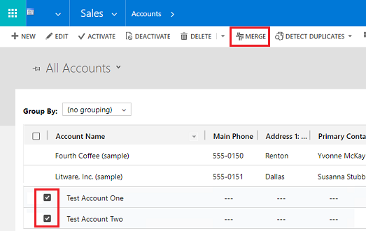
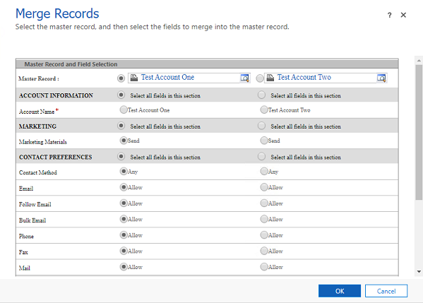
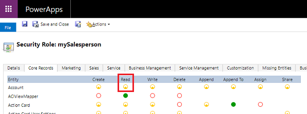
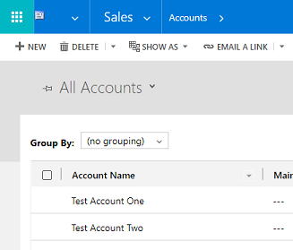
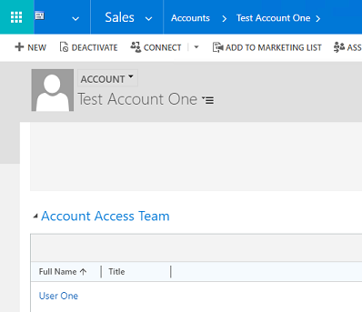
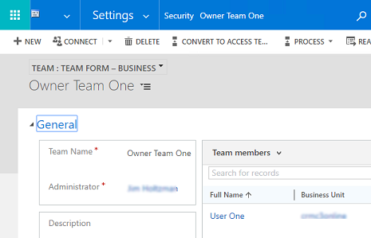

# Merge data

[!INCLUDE [cc-data-platform-banner](../includes/cc-data-platform-banner.md)]

You can merge two records to combine the data or to [remove duplicates](https://docs.microsoft.com/powerapps/user/merge-duplicate-records). After doing a merge, check out the [Security considerations](#security-considerations) section to verify the changes meet your security requirements. You can merge Account, Contact, and Lead entities.

Follow these steps to merge data.

1. Select the records to merge (for example account records), and then select **Merge**.

   > [!div class="mx-imgBorder"] 
   > 

2. Select the master record and the fields to merge into the master record, and then select **OK**.

   > [!div class="mx-imgBorder"] 
   > 

   > [!NOTE]
   > The master record will inherit all of the subordinate record's child records. The subordinate record will be deactivated.

For more information, see [Merge duplicate records for accounts, contacts, or leads](https://docs.microsoft.com/powerapps/user/merge-duplicate-records).

## Security considerations

Merging shared data may have unintended consequences. Check out the following scenarios and have a solid understanding of the security-related results for each. 

### Scenarios
- [Scenario #1: Merge records that are owned by users ](#scenario-1-merge-records-that-are-owned-by-users)
- [Scenario #2: Merge records that are shared to users](#scenario-2-merge-records-that-are-shared-to-users)
- [Scenario #3: Merge records that are shared to access team members](#scenario-3-merge-records-that-are-shared-to-access-team-members)
- [Scenario #4: Merge records that are owned by teams](#scenario-4-merge-records-that-are-owned-by-teams)

### Example settings used in the scenarios
The following example settings are used in the scenarios below:

- **Account entity**: used to demonstrate record merge.
- **User One**: a sample user.
- **User Two**: a sample user.
- **Security role privileges**: Both User One and User Two have Read privilege at the User level for the account entity.
  
  > [!div class="mx-imgBorder"] 
  > 

- **Test Account One**: master account to merge. User One is assigned to this account.
- **Test Account Two**: subordinate account which is merged into. User Two is assigned to this account.

### Scenario #1: Merge records that are owned by users

#### Scenario

- User One owns Test Account One
- User Two owns Test Account Two
- Test Account One (the master account) was merged with Test Account Two (the subordinate account)

#### Security-related results

After merging records:

**User One**
- Has access to:
  - The merged master Account record - Test Account One

**User Two**
- Has access to: 
  - The merged master Account record - Test Account One
  - The inactive account (read-only) - Test Account Two  
  > [!div class="mx-imgBorder"] 
  > 

### Scenario #2: Merge records that are shared to users

#### Scenario

- User One shared Test Account One with User Two
- User Two shared Test Account Two with User One
- Test Account One (the master account) was merged with Test Account Two (the subordinate account)

#### Security-related results

After merging records:

**User One**
- Has access to:
  - The merged master Account record - Test Account One
  - The inactive account (read-only) - Test Account Two  

**User Two**
- Has access to: 
  - The merged master Account record - Test Account One
  - The inactive account (read-only) - Test Account Two  

### Scenario #3: Merge records that are shared to access team members

#### Scenario

- User One is a member of auto-created access team Account Access Team
- User Two is a member of auto-created access team Account Access Team
- Test Account One (the master account) was merged with Test Account Two (the subordinate account)

For information about access teams, see [About access teams and team templates](manage-teams.md#about-access-teams-and-team-templates). 

#### Security-related results

After merging records:

**User One**
- Has access to:
  - The merged master Account record - Test Account One

**User Two**
- Has access to: 
  - The merged master Account record - Test Account One
  - The inactive account (read-only) - Test Account Two  
  > [!div class="mx-imgBorder"] 
  > 
- User Two is not added as a member of the Account Access Team (sub-grid) on Test Account One
  > [!div class="mx-imgBorder"] 
  > 

### Scenario #4: Merge records that are owned by teams

#### Scenario

- User One is a member of Owner Team One 
- User Two is a member of Owner Team Two 
- Test Account One (the master account) was merged with Test Account Two (the subordinate account)

For information about owner teams, see [About owner teams](manage-teams.md#about-owner-teams).

#### Security-related results

After merging records:

**User One**
- Has access to:
  - The merged master Account record - Test Account One

**User Two**
- Has access to: 
  - The merged master Account record - Test Account One
  - The inactive account (read-only) - Test Account Two  
    > [!div class="mx-imgBorder"] 
    > 
- User Two is not added to Owner Team One
  > [!div class="mx-imgBorder"] 
  > 

## Change merge behavior

You can use the OrgDBOrgSettings tool to change database settings that govern default option behavior. With the tool you can change the access settings for master or subordinate account records using the following settings:

- GrantFullAccessForMergeToMasterOwner	
- GrantSharedAccessForMergeToSubordinateOwner

For more information, see [Environment database settings](environment-database-settings.md).

