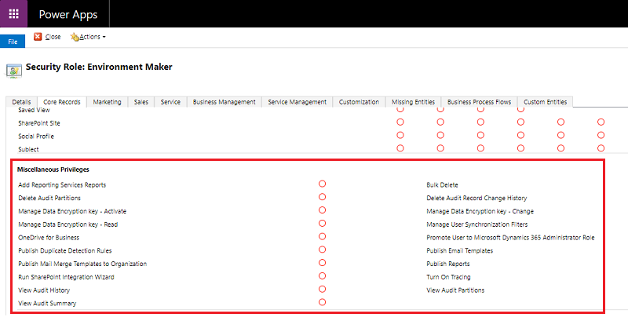

# Miscellaneous privileges

This topic provides a mapping of the security role user interface to the privilege names. Each section in this topic corresponds to a tab in the user interface (Power Platform admin center > **Environments** > [select an environment] > **Settings** > **Users + permissions** > **Security Roles** > select a role). A blank cell means that there is no privilege for that combination of entity and action.

> [!div class="mx-imgBorder"] 
> 

## Core Records tab

The following table lists the privileges shown in the security role editor miscellaneous privileges section on the core records tab.

<table>
<colgroup>
<col style="width: 33%" />
<col style="width: 33%" />
<col style="width: 33%" />
</colgroup>
<thead>
<tr class="header">
<th>
Miscellaneous Privileges
</th>
<th>
Privilege name
</th>
<th>
More information
</th>
</tr>
</thead>
<tbody>
<tr class="odd">
<td>
Add Reporting Services Reports
</td>
<td>
prvPublishRSReport
</td>
<td>
<a href="https://docs.microsoft.com/power-platform/admin/analytics-common-data-service#download-reports">Download reports</a>
</td>
</tr>
<tr class="even">
<td>
Bulk Delete
</td>
<td>
prvBulkDelete
</td>
<td>
<a href="https://docs.microsoft.com/power-platform/admin/delete-bulk-records">Bulk delete</a>
</td>
</tr>
<tr class="odd">
<td>
Delete Audit Partitions
</td>
<td>
prvDeleteAuditPartitions
</td>
<td>
<a href="https://docs.microsoft.com/power-platform/admin/recover-database-space-deleting-audit-logs">Recover database space by deleting audit logs</a>
</td>
</tr>
<tr>
<td>
Delete Audit Record Change History
</td>
<td>
prvDeleteRecordChangeHistory
</td>
<td>

</td>
</tr>
<tr class="even">
<td>
Manage Data Encryption key - Activate
</td>
<td>
prvRestoreSqlEncryptionKey
</td>
<td>
<a href="https://docs.microsoft.com/power-platform/admin/manage-encryption-key#activate-an-encryption-key-for-a-tenant">Activate an encryption key for a tenant</a>
</td>
</tr>
<tr class="odd">
<td>
Manage Data Encryption key - Change
</td>
<td>
prvChangeSqlEncryptionKey
</td>
<td>
<a href="https://docs.microsoft.com/power-platform/admin/manage-encryption-key#manage-encryption-for-an-environment">Manage encryption for an environment</a>
</td>
</tr>
<tr class="even">
<td>
Manage Data Encryption key - Read
</td>
<td>
prvReadSqlEncryptionKey
</td>
<td>
<a href="https://docs.microsoft.com/power-platform/admin/manage-encryption-key">Manage the encryption key</a>
</td>
</tr>
<tr class="odd">
<td>
Manage User Synchronization Filters
</td>
<td>
prvAdminFilter
</td>
<td>
<a href="https://docs.microsoft.com/power-platform/admin/control-field-synchronization-outlook">Control field synchronization with Outlook</a>
</td>
</tr>
<tr>
<td>
Promote User to Microsoft Dynamics 365 Administrator Role
</td>
<td>

</td>
<td>
<a href="https://docs.microsoft.com/power-platform/admin/database-security">Configure user security to resources in an environment</a>
</td>
</tr>
<tr class="even">
<td>
Publish Duplicate Detection Rules
</td>
<td>
prvPublishDuplicateRule
</td>
<td>
<a href="https://docs.microsoft.com/power-platform/admin/set-up-duplicate-detection-rules-keep-data-clean">Set up duplicate detection rules to keep your data clean</a>
</td>
</tr>
<tr class="odd">
<td>
Publish Email Templates
</td>
<td>
prvCreateOrgEmailTemplates
</td>
<td>
<a href="https://docs.microsoft.com/power-platform/admin/create-templates-email">Create templates for email</a>
</td>
</tr>
<tr class="even">
<td>
Publish Mail Merge Templates to Organization
</td>
<td>
prvPublishOrgMailMergeTemplate
</td>
<td>
<a href="https://docs.microsoft.com/power-platform/admin/work-mail-merge-templates">Work with mail merge templates</a>
</td>
</tr>
<tr class="odd">
<td>
Publish Reports
</td>
<td>
prvPublishOrgReport
</td>
<td>
<a href="https://docs.microsoft.com/power-platform/admin/analytics-common-data-service">Common Data Service analytics</a>
</td>
</tr>
<tr class="even">
<td>
Run SharePoint Integration Wizard
</td>
<td>
prvConfigureSharePoint
</td>
<td>
<a href="https://docs.microsoft.com/power-platform/admin/set-up-sharepoint-integration">Set up SharePoint integration</a>
</td>
</tr>
<tr>
<td>
Turn On Tracing
</td>
<td>

</td>
<td>
<a href="https://docs.microsoft.com/power-platform/admin/system-settings-dialog-box-customization-tab">Plug-in and custom workflow activity tracing</a>
</td>
</tr>
<tr class="odd">
<td>
View Audit History
</td>
<td>
prvReadRecordAuditHistory
</td>
<td>
<a href="https://docs.microsoft.com/power-platform/admin/common-data-service-gdpr-dsr-guide#audit-history">Audit history</a>
</td>
</tr>
<tr class="even">
<td>
View Audit Partitions
</td>
<td>
prvReadAuditPartitions
</td>
<td>
<a href="https://docs.microsoft.com/power-platform/admin/audit-data-user-activity">Audit data and user activity for security and compliance</a>
</td>
</tr>
<tr class="odd">
<td>
View Audit Summary
</td>
<td>
prvReadAuditSummary
</td>
<td>
<a href="https://docs.microsoft.com/power-platform/admin/logging-powerapps">Power Apps activity logging</a>
</td>
</tr>
</tbody>
</table>

## Marketing tab

The following table lists the privileges shown in the security role editor miscellaneous privileges section on the marketing tab.

<table>
<colgroup>
<col style="width: 33%" />
<col style="width: 33%" />
<col style="width: 33%" />
</colgroup>
<thead>
<tr class="header">
<th>
Miscellaneous Privileges
</th>
<th>
Privilege Name
</th>
<th>
More information
</th>
</tr>
</thead>
<tbody>
<tr class="odd">
<td>
Configure Internet Marketing module
</td>
<td>
prvConfigureInternetMarketing
</td>
<td>
<a href="https://docs.microsoft.com/dynamics365/marketing/create-deploy-marketing-pages">Create and deploy marketing pages</a>
</td>
</tr>
<tr class="even">
<td>
Create Quick Campaign
</td>
<td>
prvAllowQuickCampaign
</td>
<td>
<a href="https://docs.microsoft.com/dynamics365/sales-enterprise/create-quick-campaign-using-app-marketing-sales">Create a quick campaign using in-app marketing (Sales)</a>
</td>
</tr>
<tr class="odd">
<td>
Use internet marketing module
</td>
<td>
prvUseInternetMarketing
</td>
<td>
<a href="https://docs.microsoft.com/dynamics365/customerengagement/on-premises/developer/sample-distribute-a-quick-campaign">Create a quick campaign using in-app marketing (Sales)</a>
</td>
</tr>
</tbody>
</table>

## Sales tab

The following table lists the privileges shown in the security role editor miscellaneous privileges section on the sales tab.

<table>
<colgroup>
<col style="width: 33%" />
<col style="width: 33%" />
<col style="width: 33%" />
</colgroup>
<thead>
<tr class="header">
<th>
Miscellaneous Privileges
</th>
<th>
Privilege Name
</th>
<th>
More information
</th>
</tr>
</thead>
<tbody>
<tr class="odd">
<td>
Override Invoice Pricing
</td>
<td>
prvOverridePriceEngineInvoice
</td>
<td>
<a href="https://docs.microsoft.com/dynamics365/sales-enterprise/create-edit-invoice-sales">Create or edit invoices (Sales and Sales Hub)</a>
</td>
</tr>
<tr class="even">
<td>
Override Opportunity Pricing
</td>
<td>
prvOverridePriceEngineOpportunity
</td>
<td>
<a href="https://docs.microsoft.com/dynamics365/sales-enterprise/add-products-opportunity">Add products to an opportunity (Sales Hub)</a>
</td>
</tr>
<tr class="odd">
<td>
Override Order Pricing
</td>
<td>
prvOverridePriceEngineOrder
</td>
<td>
<a href="https://docs.microsoft.com/dynamics365/sales-enterprise/create-edit-order-sales">Create or edit orders (Sales and Sales Hub)</a>
</td>
</tr>
<tr class="even">
<td>
Override Quote Order Invoice Delete
</td>
<td>
prvQOIOverrideDelete
</td>
<td>
<a href="https://docs.microsoft.com/dynamics365/sales-enterprise/create-edit-quote-sales">Create or edit quotes (Sales and Sales Hub)</a>
</td>
</tr>
<tr class="odd">
<td>
Override Quote Pricing
</td>
<td>
prvOverridePriceEngineQuote
</td>
<td>
<a href="https://docs.microsoft.com/dynamics365/sales-enterprise/price-calculation-opportunity-quote-order-invoice-records">Price calculation for opportunity, quote, order, and invoice records</a>
</td>
</tr>
</tbody>
</table>

## Service tab

The following table lists the privileges shown in the security role editor miscellaneous privileges section on the service tab.

<table>
<colgroup>
<col style="width: 33%" />
<col style="width: 33%" />
<col style="width: 33%" />
</colgroup>
<thead>
<tr class="header">
<th>
Miscellaneous Privileges
</th>
<th>
Privilege Name
</th>
<th>
More information
</th>
</tr>
</thead>
<tbody>
<tr class="odd">
<td>
Approve Knowledge Articles
</td>
<td>
prvApproveKnowledgeArticle
</td>
<td>
<a href="https://docs.microsoft.com/dynamics365/customer-service/customer-service-hub-user-guide-knowledge-article">Create and manage knowledge articles</a>
</td>
</tr>
<tr class="even">
<td>
Publish Articles
</td>
<td>
prvPublishArticle
</td>
<td>
<a href="https://docs.microsoft.com/dynamics365/customer-service/customer-service-hub-user-guide-knowledge-article">Create and manage knowledge articles</a>
</td>
</tr>
<tr class="odd">
<td>
Publish Knowledge Articles
</td>
<td>
prvPublishKnowledgeArticle
</td>
<td>
<a href="https://docs.microsoft.com/dynamics365/customer-service/customer-service-hub-user-guide-knowledge-article">Create and manage knowledge articles</a>
</td>
</tr>
</tbody>
</table>

## Business Management tab

The following table lists the privileges shown in the security role editor miscellaneous privileges section on the business management tab.

<table>
<colgroup>
<col style="width: 33%" />
<col style="width: 33%" />
<col style="width: 33%" />
</colgroup>
<thead>
<tr class="header">
<th>
Miscellaneous Privileges
</th>
<th>
Privilege Name
</th>
<th>
More information
</th>
</tr>
</thead>
<tbody>
<tr class="odd">
<td>
Act on Behalf of Another User
</td>
<td>
prvActOnBehalfOfAnotherUser
</td>
<td>
<a href="https://docs.microsoft.com/powerapps/developer/common-data-service/impersonate-another-user">Impersonate another user</a>
</td>
</tr>
<tr class="even">
<td>
Approve Email Addresses for Users or Queues
</td>
<td>
prvApproveRejectEmailAddress
</td>
<td>
<a href="https://docs.microsoft.com/power-platform/admin/connect-exchange-online#approve-email">Approve email</a>
</td> 
</tr>
<tr class="odd">
<td>
Assign manager for a user
</td>
<td>
prvAssignManager
</td>
<td>
<a href="https://docs.microsoft.com/power-platform/admin/hierarchy-security#manager-hierarchy">Manager hierarchy</a>
</td>
</tr>
<tr class="even">
<td>
Assign position for a user
</td>
<td>
prvAssignPosition
</td>
<td>
<a href="https://docs.microsoft.com/power-platform/admin/hierarchy-security#position-hierarchy">Position hierarchy</a>
</td>
</tr>
<tr class="odd">
<td>
Assign Territory to User
</td>
<td>
prvAssignTerritory
</td>
<td>
<a href="https://docs.microsoft.com/power-platform/admin/add-remove-territory-members">Add or remove sales territory members</a>
</td>
</tr>
<tr class="even">
<td>
Bulk Edit
</td>
<td>
prvBulkEdit
</td>
<td>

</td>
</tr>
<tr class="odd">
<td>
Change Hierarchy Security Settings
</td>
<td>
prvWriteHierarchicalSecurityConfiguration
</td>
<td>
<a href="https://docs.microsoft.com/power-platform/admin/hierarchy-security">Hierarchy security to control access</a>
</td>
</tr>
<tr class="even">
<td>
Dynamics 365 Address Book
</td>
<td>
prvAddressBook
</td>
<td>
<a href="https://docs.microsoft.com/power-platform/admin/system-settings-dialog-box-outlook-tab">Set schedule for address book synchronization</a>
</td>
</tr>
<tr class="odd">
<td>
Enable or Disable a Business Unit
</td>
<td>
prvDisableBusinessUnit
</td>
<td>
<a href="https://docs.microsoft.com/power-platform/admin/create-edit-business-units">Create or edit business units</a>
</td>
</tr>
<tr class="even">
<td>
Enable or Disable User
</td>
<td>
prvDisableUser
</td>
<td>
<a href="https://docs.microsoft.com/power-platform/admin/create-users-assign-online-security-roles#enable-or-disable-user-accounts">Enable or disable user accounts</a>
</td>
</tr>
<tr class="odd">
<td>
Language Settings
</td>
<td>
prvLanguageSettings
</td>
<td>
<a href="https://docs.microsoft.com/power-platform/admin/enable-languages">Regional and language options for your environment</a>
</td>
</tr>
<tr class="even">
<td>
Merge
</td>
<td>
prvMerge
</td>
<td>
<a href="https://docs.microsoft.com/power-platform/admin/merge-data">Merge data</a>
</td>
</tr>
<tr class="odd">
<td>
Override Created on or Created by for Records during Data Import
</td>
<td>
prvOverrideCreatedOnCreatedBy
</td>
<td>
<a href="https://docs.microsoft.com/power-platform/admin/import-data-all-record-types">Import data (all record types) from multiple sources</a>
</td>
</tr>
<tr class="even">
<td>
Perform in sync rollups on goals
</td>
<td>
prvRollupGoal
</td>
<td>
<a href="https://docs.microsoft.com/dynamics365/sales-enterprise/create-edit-goal-sales">Create or edit goals (Sales and Sales Hub)</a>
</td>
</tr>
<tr class="odd">
<td>
Read License info
</td>
<td>
prvReadLicense
</td>
<td>
<a href="https://docs.microsoft.com/power-platform/admin/wp-license-management#what-users-are-licensed">What users are licensed</a>
</td>
</tr>
<tr class="even">
<td>
Reparent Business unit
</td>
<td>
prvReparentBusinessUnit
</td>
<td>
<a href="https://docs.microsoft.com/power-platform/admin/assign-business-unit-different-parent">Assign a business unit a different parent business</a>
</td>
</tr>
<tr class="odd">
<td>
Reparent team
</td>
<td>
prvReparentTeam
</td>
<td>
<a href="https://docs.microsoft.com/power-platform/admin/manage-teams">Manage teams</a>
</td>
</tr>
<tr class="even">
<td>
Reparent user
</td>
<td>
prvReparentUser
</td>
<td>
<a href="https://docs.microsoft.com/power-platform/admin/create-users-assign-online-security-roles">Create users and assign security roles</a>
</td>
</tr>
<tr class="odd">
<td>
Send Email as Another User
</td>
<td>
prvSendAsUser
</td>
<td>
<a href="https://docs.microsoft.com/power-platform/admin/use-outlook-category-track-appointments-emails#delegate-users">Delegate users</a>
</td> 
</tr>
<tr class="even">
<td>
Send Invitation
</td>
<td>
prvSendInviteForLive
</td>
<td>
<a href="https://docs.microsoft.com/power-platform/admin/invite-users-azure-active-directory-b2b-collaboration">Invite users with Azure Active Directory B2B collaboration</a>
</td>
</tr>
<tr class="even">
<td>
Web Mail Merge
</td>
<td>
prvWebMailMerge
</td>
<td>
<a href="https://docs.microsoft.com/power-platform/admin/work-mail-merge-templates">Work with mail merge templates</a>
</td>
</tr>
</tbody>
</table>

## Service Management tab

The following table lists the privileges shown in the security role editor miscellaneous privileges section on the service management tab.

<table>
<colgroup>
<col style="width: 33%" />
<col style="width: 33%" />
<col style="width: 33%" />
</colgroup>
<thead>
<tr class="header">
<th>
Miscellaneous Privileges
</th>
<th>
Privilege Name
</th>
<th>
More information
</th>
</tr>
</thead>
<tbody>
<tr class="odd">
<td>
Browse availability
</td>
<td>
prvBrowseAvailability
</td>
<td>

</td>
</tr>
<tr class="odd">
<td>
Create own calendar
</td>
<td>
prvCreateOwnCalendar
</td>
<td>
<a href="https://docs.microsoft.com/power-platform/admin/customize-marketing-calendars">Create and customize marketing calendars</a>
</td>
</tr>
<tr class="even">
<td>
Delete own calendar
</td>
<td>
prvDeleteOwnCalendar
</td>
<td>
<a href="https://docs.microsoft.com/power-platform/admin/customize-marketing-calendars">Create and customize marketing calendars</a>
</td>
</tr>
<tr class="odd">
<td>
Read own calendar
</td>
<td>
prvReadOwnCalendar
</td>
<td>
<a href="https://docs.microsoft.com/power-platform/admin/customize-marketing-calendars">Create and customize marketing calendars</a>
</td>
</tr>
<tr class="even">
<td>
Search Availability
</td>
<td>
prvSearchAvailability
</td>
<td>
 
</td>
<tr class="even">
<td>
Write own calendar
</td>
<td>
prvWriteOwnCalendar
</td>
<td>

</td>
</tr>
</tbody>
</table>

## Customization tab

The following table lists the privileges shown in the security role editor miscellaneous privileges section on the customization tab.

<table>
<colgroup>
<col style="width: 33%" />
<col style="width: 33%" />
<col style="width: 33%" />
</colgroup>
<thead>
<tr class="header">
<th>
Miscellaneous Privileges
</th>
<th>
Privilege Name
</th>
<th>
More information
</th>
</tr>
</thead>
<tbody>
<tr class="odd">
<td>
Activate Business Process Flows
</td>
<td>
prvActivateBusinessProcessFlow
</td>
<td>
<a href="https://docs.microsoft.com/power-automate/business-process-flows-overview">Model business process flows</a>
</td>
</tr>
<tr class="even">
<td>
Activate Business Rules
</td>
<td>
prvActivateBusinessRule
</td>
<td>
<a href="https://docs.microsoft.com/power-automate/business-process-flows-overview">Model business process flows</a>
</td>
</tr>
<tr class="odd">
<td>
Activate Real-time Processes
</td>
<td>
prvActivateSynchronousWorkflow
</td>
<td>
<a href="https://docs.microsoft.com/power-automate/business-process-flows-overview">Model business process flows</a>
</td>
</tr>
<tr class="even">
<td>
Configure Yammer
</td>
<td>
prvConfigureYammer
</td>
<td>
<a href="https://resources.techcommunity.microsoft.com/yammer/adoption/">Yammer resources</a>
</td>
</tr>
<tr class="odd">
<td>
Execute Workflow Job
</td>
<td>
prvWorkflowExecution
</td>
<td>
<a href="https://docs.microsoft.com/power-automate/configure-workflow-steps">Configure background workflow stages and steps</a>
</td>
</tr>
<tr class="even">
<td>
Export Customizations
</td>
<td>
prvExportCustomization
</td>
<td>
<a href="https://docs.microsoft.com/powerapps/maker/common-data-service/import-update-export-solutions">ExportSolution message privileges</a>
</td>
</tr>
<tr class="odd">
<td>
Import Customizations
</td>
<td>
prvImportCustomization
</td>
<td>
<a href="https://docs.microsoft.com/powerapps/maker/common-data-service/import-update-export-solutions">ImportSolution message privileges</a>
</td>
</tr>
<tr class="even">
<td>
ISV Extensions
</td>
<td>
prvISVExtensions
</td>
<td>
Not currently in use.
</td>
</tr>
<tr>
<td>
Learning Path Authoring
</td>
<td>

</td>
<td>
<a href="https://docs.microsoft.com/power-platform/admin/on-off-switch-for-learning-path-guided-help">On-off switch for Learning Path</a>
</td>  
</tr>
<tr class="even">
<td>
Publish Customizations
</td>
<td>
prvPublishCustomization
</td>
<td>
<a href="https://docs.microsoft.com/dynamics365/customerengagement/on-premises/developer/customize-dev/publish-customizations">PublishXml message privileges</a>

<a href="https://docs.microsoft.com/dynamics365/customerengagement/on-premises/developer/customize-dev/publish-customizations">PublishAllXml message privileges</a>
</td>
</tr>
<tr class="odd">
<td>
Retrieve Multiple Social Insights
</td>
<td>
prvRetrieveMultipleSocialInsights
</td>
<td>

</td>
</tr>
<tr>
<td>
Run Flows
</td>
<td>

</td>
<td>
<a href="https://docs.microsoft.com/power-automate/ui-flows/run-ui-flow">Run attended and unattended UI flows</a>
</td>  
</tr>
</tbody>
</table>

