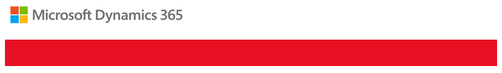
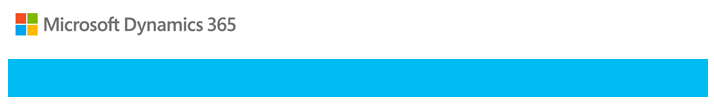
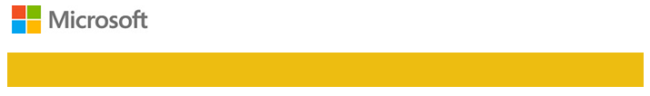

# Notifications for Business Application Group services

Microsoft regularly sends communications regarding service incidents, service changes, maintenance, releases, and customer action needed. These communications come primarily in the form of a post to the Microsoft 365 Service health dashboard and the Message center.  From time-to-time we will also use direct email communications to provide status, updates, or information about the service.  

## Message Center
The [Microsoft 365 Message Center](https://docs.microsoft.com/office365/admin/manage/message-center?view=o365-worldwide) will display any maintenance notifications, service changes, release information, or customer action requests.

## Service health dashboard
The [Service health dashboard](https://docs.microsoft.com/office365/enterprise/view-service-health) will show the latest status of updates and incidents regarding your service. To learn how to get to the Microsoft 365 Service health dashboard, see [Check your service health](check-online-service-health.md). 

## Email notifications
The notifications sent from the Business Application Group communications team will be for the following services and email addresses.  Please be sure to check your spam folder for these messages.

|Service | Notification Email | 
| ------------- | -------------| 
| Dynamics 365 apps   | msdynamics365@microsoft.com  | 
| Dynamics 365 Business Central | msdynamics365@microsoft.com |
| Dynamics 365 Marketing | msdynamics365@microsoft.com |
| Dynamics 365 Market Insights | marketinsights@microsoft.com|
| Dynamics 365 Finance & Operations    | msdyn365finops@microsoft.com| 
| Microsoft Power Automate  | mspowerautomate@microsoft.com| 
| Microsoft Power Apps | mspowerapps@microsoft.com| 
| Microsoft Power BI  | mspowerbi@microsoft.com| 

Email notifications are sent to Microsoft Dataverse users who have the System Administrator role in an impacted environment.  If you want to change who receives email communications, see [Manage email notifications](../admin/manage-email-notifications.md).

## Incident Communications
Major service incident emails can easily be identified by the red banner.

  
 
Microsoft will send you an email when normal system services have been restored. You can easily identify these emails by the green banner.

  
 
## Maintenance communications 
Planned maintenance includes updates and changes to the service to provide increased stability, reliability, and performance. Planned and unplanned maintenance emails can be identified by the light-orange banner.

## Communications for releases, package deployments, and awareness
Communications can be informational in nature, drive specific actions, or both. The target audience for these communications are System Administrators or individuals designated to run the service. You can easily identify these by the light-blue banner.

 
 
Power BI will display with the following yellow banner:
 
 
 
 Power Apps/Power Automate will display with the following purple banner:
 
 

## Action requested communications 
Action requested notifications are sent when we detect that a configuration or a setting for your environment is causing the service to perform below expectations. The notification will include details on the situation as well as guidance on how to return performance to normal.

## Post-purchase customer lifecycle communications
Once a customer has purchased customer engagement apps (Dynamics 365 Sales, Dynamics 365 Customer Service, Dynamics 365 Field Service, Dynamics 365 Marketing, and Dynamics 365 Project Service Automation), we send a series of email communications to administrators during the first year. These communications direct customers to a number of resources that will assist both administrators and users to successfully adopt and expand their use of customer engagement apps.

You can easily identify these communications by the dark-blue banner.

  
 

