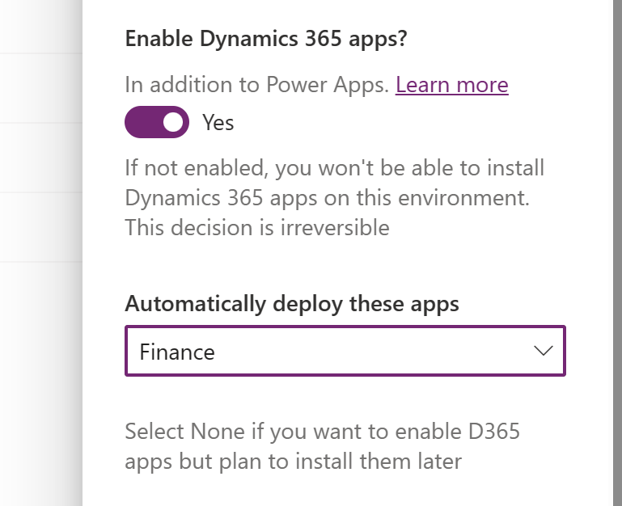
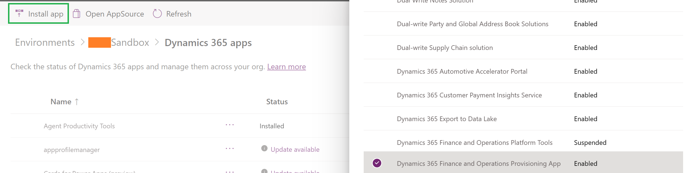
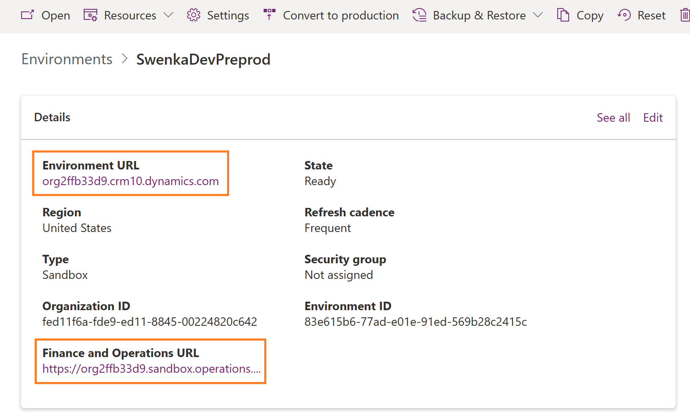

# One Dynamics, One Platform - Admin experiences overview

[!INCLUDE [cc-beta-prerelease-disclaimer](../includes/cc-beta-prerelease-disclaimer.md)]

As part of the One Dynamics, One Platform initiative, Microsoft is consolidating administrative functionalities from various other admin portals in to the Power Platform admin center.  Customers who have purchased Dynamics 365 Finance and Operations apps will now be able to administer their environments, policies, and licensing and capacity all from a single admin center.  

As part of this admin unification, what has historically been known as a whole environment for Finance and Operations apps will now be considered simply as an application.  This means that many Dynamics 365 applications can be installed and hosted on the same environment, all powered by Microsoft Dataverse, with a consistent and single set of lifecycle operations that an admin can perform across them all.

This article acts as an overview for Dynamics 365 Finance and Operations apps administrators who are new to Power Platform admin center.  Below you will find some core concepts to help understand the key differences between your prior admin center Lifecycle Services (LCS) and this new experience, as well as links to additional resources and articles that go in to more depth.

To learn more about One Dynamics, One Platform initiative, watch our TechTalk on the [Microsoft Dynamics 365 Community](https://www.youtube.com/@MSD365Community) YouTube channel.

> [!VIDEO https://www.youtube.com/embed/VPQSmtgzfjM]

## How Finance and Operations apps are referenced in the admin center

Most notably, you will not see any new environment types in Power Platform admin center, we have truly integrated the ERP applications in to the fabric of Power Platform.  Getting access to Finance and Operations apps you have two primary options:

1. **Create a new environment via template** - Whenever you create a new environment in Power Platform admin center you have the option to enable Dataverse and also enable Dynamics 365 apps.  This provides a drop down list of environment templates, which are just a bundling of applications pre-installed on top of a Dataverse database.  This list is dynamic so you will only see references to Finance, Supply Chain Management, Commerce, Project Operations and other Finance and Operations apps based on the license assigned to the admin creating the environment.

2. **Install the provisioning app on an existing environment** - You can also install Finance and Operations apps on to an existing Dataverse-based environment.  This can be done via the Dynamics 365 resource page and choosing the "Dynamics 365 Finance and Operations Provisioning App" from inside any given environment, as long as that environment was originally created with the "Enable Dynamics 365 apps" toggle turned on.  This toggle ensures that Dataverse was created with the full Dynamics underlying schema, of which all Dynamics 365 apps require including Finance and Operations apps.  

In either approach, you will notice that your environment will now have two runtime URLs available.  One for the CRM set of applications and one for the ERP set of applications: 

## Transitioning from an environment-slot purchasing model to a capacity-based model

When you purchase a license for any finance and operations app, such as Dynamics 365 Finance or Dynamics 365 Supply Chain Management, your tenant is entitled to 60 gigabytes (GB) of Operations database capacity and an additional 10 GB of Dataverse database capacity. In addition, for each user license that you purchased, you receive an incremental amount of both Operations and Dataverse database capacity, as shown in the following illustration from Power Portal admin center.

A license is required to create or install any finance and operations app in Power Platform admin center.  You must also have at least 1 GB available of both Operations and Dataverse database capacity to provision one more environment.  Beyond that, there are no strict limits on how many environments you can create unlike in LCS admin center were each Sandbox and Production environment slot was a pre-determined purchase.

## Development re-imagined

Administrators in LCS were accustomed to setting up an Azure subscription early in their ERP implementation project.  Once established, admins could deploy one or many developer virtual machines (VMs) hosted in Azure that were an all-in-one configuration with SQL Server, the Application Object Server, Visual Studio and the developer tools, the X++ source code and more.  While simple to deploy, these VMs represented additional cost above and beyond the purchase of licenses and also were becoming more and more limited in their ability to leverage the full platform and connection to Dataverse that Sandbox and Production environment types enjoyed.

As part of this initiative, customers no longer deploy all-in-one VMs.  Instead, you can download the Power Platform and X++ developer tools on to a machine of your choosing, where Visual Studio is installed.  From here you can build new solutions that span the entire platform set of capabilities, and then deploy those to a Sandbox that is provisioned through Power Platform admin center.  

## Terminology differences between Lifecycle Services and Power Platform admin center

When it comes to environment lifecycle operations, there are some terminology and technical differences between similar activities that admins perform in the two different admin centers. The table below is a quick reference for each operation type and explains any nuances between the two experiences.

| Lifecycle Operation | LCS Terminology | Power Platform terminology | Comments |
| ----------- | ----------- |----------- |----------- |
| Create | Deploy | Provision | |
| Copy | Database Refresh | Copy | In Power Platform, code is always copied along with the data giving a full copy of the source environment.  This differs from LCS that only copied data. |
|Backup | Database Export | Backup (Custom or System-defined)| In Power Platform, a backup is kept in the cloud and never downloaded as a SQL .bak or .bacpac file. |
| Restore | Point-in-time restore | Restore (Custom or System-defined)| |
| Reset | Not applicable | Reset| This operation is not yet implemented for environments where Finance and Operations Provisioning App is installed, but will be by General Availability. |
| Convert to Production | Not applicable | Convert to Production | This operation is not yet implemented for environments where Finance and Operations Provisioning App is installed, but will be by General Availability. |
| Delete | Deallocate / Delete | Delete | Restoring a deleted environment where Finance and Operations Provisioning App was installed is not yet implemented, but will be by General Availability. |

## Scenario tutorials

The following list of continually updated scenario tutorials provides a walkthrough for administrators in these new experiences.

* Provision a new environment with an ERP-based template
* Install Finance and Operations Provisioning app on an existing environment
* Add a developer user to an environment and connect to it with Visual Studio
* Setup a continuous integration and deployment (CI / CD) build and release pipeline
* Manage storage and capacity 
