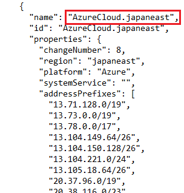

# Requirements/supported configurations  

[Model-driven Power Apps](/powerapps/maker/model-driven-apps/model-driven-app-overview) and customer engagement apps (such as [Dynamics 365 Sales](/dynamics365/sales-professional/help-hub), [Dynamics 365 Customer Service](/dynamics365/customer-service/help-hub), and [Dynamics 365 Marketing](/dynamics365/marketing/help-hub) and [Dynamics 365 Project Operations](/dynamics365/project-operations)), give you the following options to access data:  
  
- Web browser. No need to install anything to run customer engagement apps from a computer running a supported web browser.  

- [Dynamics 365 App for Outlook](/dynamics365/outlook-app/overview). An [!INCLUDE[pn_Outlook_short](../includes/pn-outlook-short.md)] app which, lets you manage your app data right within [!INCLUDE[pn_MS_Outlook_Full](../includes/pn-ms-outlook-full.md)].  

- [Power Apps mobile](/powerapps/mobile/run-powerapps-on-mobile). Use the Power Apps mobile app to run model-driven apps on your mobile device. 
  
- [Dynamics 365 for phones and Dynamics 365 for tablets](/dynamics365/mobile-app/overview). Use the Dynamics 365 for phones or Dynamics 365 for tablets app mobile app to run customer engagement apps (such as Dynamics 365 Sales, Dynamics 365 Customer Service, and Dynamics 365 Marketing), built on Microsoft Dataverse on your mobile device.
  
## Web browser requirements  
 You use a common web browser, such as [!INCLUDE[pn_Internet_Explorer](../includes/pn-internet-explorer.md)], [!INCLUDE[tn_Mozilla_Firefox](../includes/tn-mozilla-firefox.md)], [!INCLUDE[tn_Google_Chrome](../includes/tn-google-chrome.md)] or [!INCLUDE[tn_Apple_Safari](../includes/tn-apple-safari.md)] to view, add, or edit information stored in your organization’s  database. For more information about the supported web browsers and hardware requirements, see [Web application requirements for Microsoft Dynamics 365 apps](web-application-requirements.md).  

## Mobile device requirements  
 Work with model-driven Power Apps or customer engagement apps on your mobile device. For supported device and requirements, see:
 
 - [Power Apps mobile](/powerapps/mobile/run-powerapps-on-mobile#supported-devices)
 - [Dynamics 365 for phones and Dynamics 365 for tablets](/dynamics365/mobile-app/support-phones-tablets)

## Microsoft Office requirements  
 Customer engagement apps leverage the capabilities of on-premises versions of [!INCLUDE[pn_MS_Office](../includes/pn-ms-office.md)] or [!INCLUDE[pn_MS_Office_365](../includes/pn-ms-office-365.md)] and integrates with [!INCLUDE[pn_MS_Word_Full](../includes/pn-ms-word-full.md)] and [!INCLUDE[pn_MS_Excel_Full](../includes/pn-ms-excel-full.md)]. For more information about the supported versions of [!INCLUDE[pn_MS_Office](../includes/pn-ms-office.md)], see [Supported versions of Office](web-application-requirements.md#supported-versions-of-office).  
  
 [!INCLUDE[cc_Office365PlanRequirement](../includes/cc-office365planrequirement.md)]  

## IP addresses and URLs
If certain IP address ranges or individual IP addresses are blocked in the environment, users may not be able to reach Microsoft Dynamics 365 environments. Blocked IPs can also impact connecting Dynamics 365 apps to [Microsoft Exchange Server (on-premises)](connect-exchange-server-on-premises.md). See the following:

- [Azure IP Ranges and Service Tags – Public Cloud](https://www.microsoft.com/download/details.aspx?id=56519)
- [Azure IP Ranges and Service Tags – US Government Cloud](https://www.microsoft.com/download/details.aspx?id=57063)
- [Azure IP Ranges and Service Tags – China Cloud](https://www.microsoft.com/download/details.aspx?id=57062)
- [Azure IP Ranges and Service Tags – Germany Cloud](https://www.microsoft.com/download/details.aspx?id=57064)

> [!NOTE]
> You can search the Azure IP Ranges json file for the AzureCloud service tag for your region. For example, for Japan you'd search for "azurecloud.japaneast" and "azurecloud.japanwest" to find the list of IP addresses to allow.
>
> [!div class="mx-imgBorder"] 
> 

Dynamics 365 apps use several Microsoft URLs to help provide security, services, and features. Blocking any of the required URLs will cause apps in Dynamics 365 to operate incorrectly or not at all. See: [Troubleshooting: Unblock required URLs](troubleshooting-unblock-urls-required.md).
  
## Internet accessible URLs required

If you cannot access Microsoft Dynamics 365 apps, or specific URLs fail to load when you use Microsoft Dynamics 365, a proxy or firewall may be configured to prevent  Dynamics 365 URLs from accessing server resources.

Add the following URLs to the approved list to allow traffic to proceed to these URLs.

<table>
<thead>
  <tr>
    <th>URL</th>
    <th>Justification</th>
  </tr>
</thead>
<tbody>
  <tr>
    <td>http://login.microsoftonline-p.com </td>
    <td rowspan="6">Required for Microsoft Cloud Authentication. Includes business-to-consumer (B2C) and guest scenarios. </td>
  </tr>
  <tr>
    <td>https://login.live.com </td>
  </tr>
  <tr>
    <td>https://secure.aadcdn.microsoftonline-p.com    </td>
  </tr>
  <tr>
    <td>https://auth.gfx.ms  </td>
  </tr>
  <tr>
    <td>https://*.windows.net  </td>
  </tr>
  <tr>
    <td>http://*.passport.net </td>
  </tr>
  <tr>
    <td>http://*.crm#.dynamics.com </td>
    <td rowspan="5">Required for Dynamics 365 and Dataverse environments access. Includes integration and static Content Delivery Network (CDN) content endpoints.   Replace # in http://*.crm#.dynamics.com and https://*.crm#.dynamics.com with your region's number: <ul><li>Asia/Pacific: 5</li><li>Canada: 3 </li><li>Europe, Africa, and Middle East: 15 and 4</li><li>France: 12</li><li>Germany: 16</li><li>India: 8</li><li>Japan: 7</li><li>North America: no number</li><li>Oceania: 6</li><li>South Africa: 14</li><li>South America: 2</li><li>Switzerland: 17</li><li>UAE: 15</li><li>United Kingdom: 11</li><li>Dynamics 365 US Government: 9</li></ul></td>
  </tr>
  <tr>
    <td>https://*.crm#.dynamics.com </td>
  </tr>
  <tr>
    <td>https://home.dynamics.com </td>
  </tr>
  <tr>
    <td>https://www.crmdynint.com  </td>
  </tr>
  <tr>
    <td>https://*.azureedge.net  </td>
  </tr>
  <tr>
    <td>https://*.microsoftonline.com  </td>
    <td>Required for authentication and Microsoft 365 services such as the Microsoft 365 admin center.</td>
  </tr>
  <tr>
    <td>https://go.microsoft.com  </td>
    <td>Required for product documentation and context-sensitive help pages.   </td>
  </tr>
  <tr>
    <td>https://urs.microsoft.com   </td>
    <td>Required for Microsoft defender SmartScreen filtering.   </td>
  </tr>
  <tr>
    <td>http://crl.microsoft.com/pki/crl/products/microsoftrootcert.crl  </td>
    <td>Required for Certification Revocation List checks.    </td>
  </tr>
  <tr>
    <td>https://dynamics.microsoft.com  </td>
    <td>  </td>
  </tr>
</tbody>
</table>

## Ports
Dataverse exposes ports *18085* and *8085* to perform maintenance operations for customer databases.  The maintenance operations are executed to ensure that Microsoft Dynamics 365 environments are performing at optimal performance standards.  These maintenance operations include but are not limited to: 

- Database Update Operation
- App Update Operation

These maintenance operations are executed by the [Asynchronous Service](/powerapps/developer/data-platform/asynchronous-service).

Dataverse exposes ports *1433* and *5558* to expose the [Dataverse Tabular Data Stream](/openspecs/windows_protocols/ms-tds/893fcc7e-8a39-4b3c-815a-773b7b982c50). 

### See also  
 [Plan for Deployment and Administration](../admin/plan-for-deployment-and-administration.md)    
 [Work with requirements as a solution architect for Power Platform and Dynamics 365](/learn/modules/work-with-requirements/index)

[!INCLUDE[footer-include](../includes/footer-banner.md)]