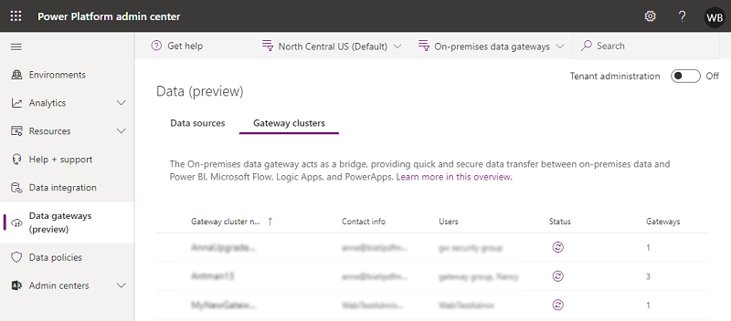

# Preview: Gateway cluster management

[!INCLUDE [cc-beta-prerelease-disclaimer](../includes/cc-beta-prerelease-disclaimer.md)]

In the **Data** page of the Power Platform admin center (https://admin.powerplatform.microsoft.com), you can view and manage gateway clusters.

> [!div class="mx-imgBorder"] 
> 

- **Gateway cluster name**: The name of the gateway cluster.
- **Contact info**: Admin contact information for the gateway cluster. 
- **Users**: The list of gateway users.
- **Status**: Select () to check the status of a gateway member.
- **Gateways**: The number of gateway members in the gateway cluster.

## Details

Select a gateway cluster and then select **Details** to see the following information on gateway members.

> [!div class="mx-imgBorder"] 
> 

> [!div class="mx-imgBorder"] 
> 

- **Gateway name**: The name of the gateway member.
- **Device name**: The physical device on which the gateway is installed.
- **Version**: The gateway software version installed on the machine.
- **Status**: Select () to check the status of a gateway member.
- **State**: Select to enable or disable a gateway member.

After selecting a gateway member, you can select **Remove** to remove it. This does not uninstall the gateway from the physical machine but removes all the metadata regarding the gateway.

## Gateway cluster settings

Use **Settings** to set on-premises data gateway settings such as the gateway cluster name, department, General settings and Power BI settings. 

> [!div class="mx-imgBorder"] 
> 

> [!div class="mx-imgBorder"] 
> 

For more information on **Allow user's cloud datasources to refresh through this gateway cluster**, see [Merge or append on-premises and cloud data sources](https://go.microsoft.com/fwlink/p/?linkid=2005525).

For more information on **Allow user's custom data connectors to refresh through this gateway cluster**, see [Use custom data connectors with the on-premises data gateway](/power-bi/service-gateway-custom-connectors).

For more information on **Distribute requests across all active gateways in this cluster**, see [Load balance across gateways in a cluster](/data-integration/gateway/service-gateway-high-availability-clusters#load-balance-across-gateways-in-a-cluster).

## Manage users

Select a gateway cluster and then select **Manage Users** to see the list of gateway users. Add or remove gateway admins in the **Manage Users** page.

For personal gateways, this would show the owner of the personal gateway and cannot be changed due to the security scope of personal gateways.

For on-premises data gateway in standard mode, users can be added in any of the following three categories. 
 
- **Admin**: 
  - **Power BI**: Administrators have full control of the gateway, including adding other admins, creating data sources, managing data source users, and deleting the gateway. 
  - **Power Apps and Power Automate**: Administrators have full control of the gateway, including adding other admins, creating connections, additionally sharing gateways in **Can use** and **Can use + share** permission levels and deleting the gateway.
  - **Others**: Administrators have full control of the gateway, including adding other admins and deleting the gateway.
- **Can use**: Users who can create connections on the gateway to use for apps and flows but cannot share the gateway. Use this permission for users who will run apps but not share them. Applies only to Power Apps and Power Automate. 
- **Can use + share**: Users who can create a connection on the gateway to use for apps and flows, and automatically share the gateway when sharing an app. Use this permission for users who need to share apps with other users or with the organization. Applies only to Power Apps and Power Automate. 

> [!NOTE]
> - **Can Use** and **Can use + share** apply only to Power Apps and Power Automate. 
> - While sharing gateways for **Can use** and **Can use + share** permission levels, you can restrict the data source type that the user can connect over the gateway. At least one data source type should be selected for the user to be successfully added.
> - **Can Use** and **Can use + share** do not apply to custom connectors in Power Apps and Power Automate.

> [!div class="mx-imgBorder"] 
> 

## Remove a gateway cluster

Select **Remove** to remove a gateway cluster. This operation is available for data gateways in standard mode as well as personal mode.

> [!div class="mx-imgBorder"] 
> 

For more information, see [Remove or delete an on-premises data gateway](/data-integration/gateway/service-gateway-manage#remove-or-delete-an-on-premises-data-gateway).

## Get Help
For faster troubleshooting and assistance, select **Get help** to open a Get Help panel. Include the session ID in a customer support ticket for any issues on the Data Gateways feature in the Power Platform admin center.

> [!div class="mx-imgBorder"] 
> 

## Manage gateways by region

Select the region drop-down to see the list of gateway regions. When you select one of the regions, you'll see a list of gateways installed in that region. You can manage users or view gateway members for these gateways. By default, you'll see gateways within your tenant's default region.

> [!div class="mx-imgBorder"] 
> 

## Filter by gateway type

Select the gateway type drop-down to filter by gateway type. By default, you'll see all data gateways running in standard mode. Use the filter to see data gateways in personal mode or all gateways. For more information, see [Types of gateways](/power-bi/service-gateway-onprem#types-of-gateways).

> [!div class="mx-imgBorder"] 
> 

## Search

Select **Search** to find gateway clusters and see their details. You can search for gateway cluster names and contact info, but not administrators.

> [!div class="mx-imgBorder"] 
> 

### See also
 [On-premises data gateway](/data-integration/gateway/service-gateway-onprem) 
 [Connecting to on-premises data sources with On-premises Data Gateway](/azure/analysis-services/analysis-services-gateway) 

