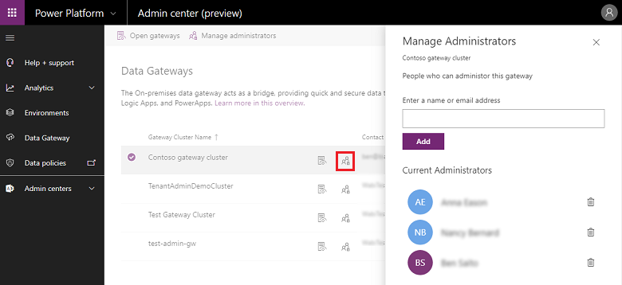

# On-premises data gateway management

[!INCLUDE [cc-beta-prerelease-disclaimer](../includes/cc-beta-prerelease-disclaimer.md)]

The On-premises data gateway acts as a bridge, providing quick and secure data transfer between on-premises data (data that is not in the cloud) and the Power BI, Microsoft Flow, Logic Apps, and PowerApps services.

You can use the Power Platform Admin center to get visibility into all on-premises data gateways in a tenant. To do so, sign in as a tenant admin and select the **Data Gateway** option.

> [!div class="mx-imgBorder"] 
> 

The Gateways page lists all on-premises data gateway clusters installed on the tenant. In addition, you can review the following information about these clusters:

- **Gateway Cluster Name**: The name of the gateway cluster.
- **Contact Info**: Admin contact information for the gateway cluster. 
- **Administrators**: The list of gateway administrators.
- **Gateways**: The number of gateway members in the gateway cluster.

## Display gateway members

Select the **Open in new window** icon () next to the gateway cluster name to see the gateway members, device name, and version in each gateway cluster.

> [!div class="mx-imgBorder"] 
> 

## Manage gateway admins

Select the **People** icon () next to the gateway cluster name to see the list of gateway admins. Add or remove gateway admins in the **Manage Administrators** page.

> [!div class="mx-imgBorder"] 
> 

## Search

Use **Search** to find gateway clusters and see their details. You can search for gateway cluster names and contact info, but not administrators.

> [!div class="mx-imgBorder"] 
> 

### See also
 [On-premises data gateway](https://docs.microsoft.com/power-bi/service-gateway-onprem) 
 [Connecting to on-premises data sources with On-premises Data Gateway](https://docs.microsoft.com/azure/analysis-services/analysis-services-gateway) 