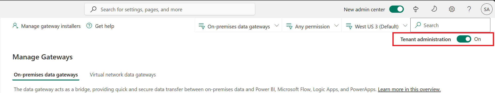
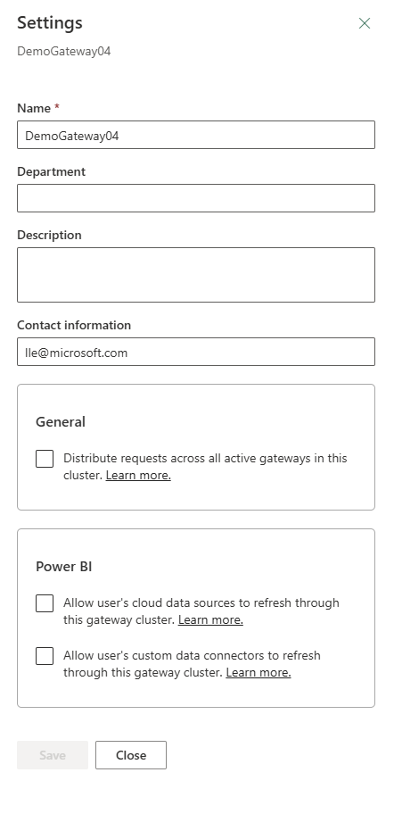
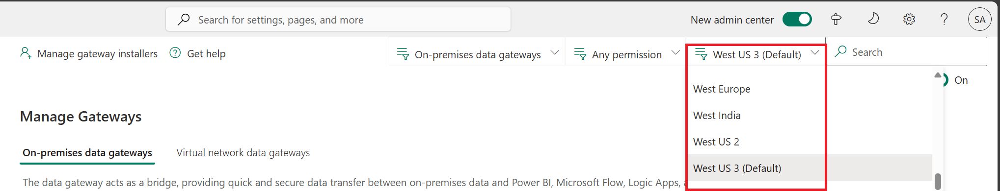

# Preview: On-premises data gateway management

[!INCLUDE [cc-beta-prerelease-disclaimer](../includes/cc-beta-prerelease-disclaimer.md)]

The On-premises data gateway acts as a bridge, providing quick and secure data transfer between on-premises data (data that is not in the cloud) and the Power BI, Power Automate, Logic Apps, and Power Apps services. More information: [What is an on-premises data gateway?](https://docs.microsoft.com/data-integration/gateway/service-gateway-onprem)

You can use the Power Platform admin center to get visibility into all on-Premises data gateways in a tenant. To do so, sign in as a Power Platform service admin and select the **Data Gateway** option.

Users who are part of the Azure AD Global administrator role (which includes Global admins), Power BI service administrators, and Gateway administrators will have access to Data Gateway management on the Power Platform admin center. There may however be differences in the features available and the operations which can be performed by each of these roles.

The Azure AD Global administrator role (which includes Global admins) and Power BI service administrators will be able to see all gateways in their organizations in addition to the gateways they manage. You can switch between these two views using this toggle in the upper-right corner of the page:

> [!div class="mx-imgBorder"] 
> 

## Tenant administration on

When tenant administration is on, the **Data** page lists all on-Premises data gateway clusters installed on the tenant. In addition, you can review the following information about these clusters:

- **Gateway cluster name**: The name of the gateway cluster.
- **Contact info**: Admin contact information for the gateway cluster. 
- **Users**: The list of gateway users.
- **Status**: Select **Check status** to see whether the gateway connection is online or offline.
- **Gateways**: The number of gateway members in the gateway cluster.

The gateway cluster list includes both On-premises data gateways and On-premises data gateways (personal mode).

> [!div class="mx-imgBorder"] 
> 

## Tenant administration off

Set tenant administration to off to see data source and gateway cluster details.

### Data sources tab

The on-premises data sources visible here include all on-prem data source definitions on gateways you are administrator of. The cloud data sources shown here are cloud connections in your published Power BI reports. In addition, you can review the following information about these data sources:​

> [!div class="mx-imgBorder"] 
> 

- **Data source name**: The name of the data source.
- **Data source type**: The type of the data source. For supported data sources, see [Power BI data sources](https://docs.microsoft.com/power-bi/connect-data/power-bi-data-sources).
- **Users**: Users who can use this data source in data sets and data flows.
- **Status**: Select () to check the status of a gateway member.
- **Gateway cluster name**: The gateway cluster on which this data source was created. If it is a cloud data source, this value will say “Cloud”.

### Gateway clusters tab

> [!div class="mx-imgBorder"] 
> 

- **Gateway cluster name**: The name of the gateway cluster.
- **Contact info**: Admin contact information for the gateway cluster. 
- **Users**: The list of gateway users.
- **Status**: Select () to check the status of a gateway member.
- **Gateways**: The number of gateway members in the gateway cluster.

## Details

Select a gateway cluster and then select **Details** to see the following information on gateway members.

> [!div class="mx-imgBorder"] 
> 

> [!div class="mx-imgBorder"] 
> 

- **Gateway name**: The name of the gateway member.
- **Device name**: The physical device on which the gateway is installed.
- **Version**: The gateway software version installed on the machine.
- **Status**: Select () to check the status of a gateway member.
- **State**: Select to enable or disable a gateway member.

After selecting a gateway member, you can select **Remove** to remove it. This does not uninstall the gateway from the physical machine but removes all the metadata regarding the gateway.

## Data source settings

Select a data source and then select Settings to see the following information. This view is currently read-only. ​

> [!div class="mx-imgBorder"] 
> 

Data source name:  Name of the data source​

Data source type: Type of the data source. More information regarding the list of  supported data sources.  ​

Connection Details: Connection Information. We plan to expand this in the future like you see in the “Managed gateways” page in Power BI​

Authentication method: The authentication method chosen for this connection.​

## Gateway cluster settings

Use **Settings** to set on-premises data gateway settings such as the gateway cluster name, department, General settings and Power BI settings. 

> [!div class="mx-imgBorder"] 
> 

> [!div class="mx-imgBorder"] 
> 

For more information on **Allow user's cloud datasources to refresh through this gateway cluster**, see [Merge or append on-premises and cloud data sources](https://go.microsoft.com/fwlink/p/?linkid=2005525).

For more information on **Allow user's custom data connectors to refresh through this gateway cluster**, see [Use custom data connectors with the on-premises data gateway](https://docs.microsoft.com/power-bi/service-gateway-custom-connectors).

For more information on **Distribute requests across all active gateways in this cluster**, see [Load balance across gateways in a cluster](https://docs.microsoft.com/data-integration/gateway/service-gateway-high-availability-clusters#load-balance-across-gateways-in-a-cluster).

## Status

Select a gateway cluster, then select **Details** > **Check status** () to check the status of a gateway cluster.

> [!div class="mx-imgBorder"] 
> 

## Manage users

Select the **People** icon () next to the gateway cluster name to see the list of gateway users. Add or remove gateway admins in the **Manage Users** page.

For personal gateways, this would show the owner of the personal gateway and cannot be changed due to the security scope of personal gateways.

For on-Premises data gateway in standard mode, users can be added in any of the following three categories. 
 
- **Admin**: 
  - **Power BI**: Administrators have full control of the gateway, including adding other admins, creating data sources, managing data source users, and deleting the gateway. 
  - **Power Apps and Power Automate**: Administrators have full control of the gateway, including adding other admins, creating connections, additionally sharing gateways in **Can use** and **Can use + share** permission levels and deleting the gateway.
  - **Others**: Administrators have full control of the gateway, including adding other admins and deleting the gateway.
- **Can use**: Users who can create connections on the gateway to use for apps and flows but cannot share the gateway. Use this permission for users who will run apps but not share them. Applies only to Power Apps and Power Automate. 
- **Can use + share**: Users who can create a connection on the gateway to use for apps and flows, and automatically share the gateway when sharing an app. Use this permission for users who need to share apps with other users or with the organization. Applies only to Power Apps and Power Automate. 

> [!NOTE]
> - **Can Use** and **Can use + share** apply only to Power Apps and Power Automate. 
> - While sharing gateways for **Can use** and **Can use + share** permission levels, you can restrict the data source type that the user can connect over the gateway. At least one data source type should be selected for the user to be successfully added.
> - **Can Use** and **Can use + share** do not apply to custom connectors in Power Apps and Power Automate.

> [!div class="mx-imgBorder"] 
> 

## Remove

Use **Remove** to remove a gateway cluster. This operation is available for data gateways in standard mode as well as personal mode.

> [!div class="mx-imgBorder"] 
> 

For more information, see [Remove or delete an on-premises data gateway](https://docs.microsoft.com/data-integration/gateway/service-gateway-manage#remove-or-delete-an-on-premises-data-gateway).

## Search

Use **Search** to find gateway clusters and see their details. You can search for gateway cluster names and contact info, but not administrators.

> [!div class="mx-imgBorder"] 
> 

## Manage gateways by region

Select the region drop-down to see the list of gateway regions. When you select one of the regions, you'll see a list of gateways installed in that region. You can manage users or view gateway members for these gateways. By default, you'll see gateways within your tenant's default region.

> [!div class="mx-imgBorder"] 
> 

## Filter by gateway type

Select the gateway type drop-down to filter by gateway type. By default, you'll see all data gateways running in standard mode. Use the filter to see data gateways in personal mode or all gateways. For more information, see [Types of gateways](https://docs.microsoft.com/power-bi/service-gateway-onprem#types-of-gateways).

> [!div class="mx-imgBorder"] 
> 

## Manage installers

As either an Azure AD Global administrator (which includes Global admins) or a Power BI service administrator, use Manage Gateway installers to manage who can install the On-premises data gateway in your enterprise. This operation isn't available for gateway admins.

> [!NOTE]
> This feature does not apply for On-premises data gateways (personal mode).

1. Go to the [Power Platform admin center](https://admin.powerplatform.microsoft.com).

2. Select **Data Gateways** from the left-side menu.

3. Select **Manage Gateway installers**.

   > [!div class="mx-imgBorder"] 
   > 

4. Enable **Restrict Users in your organization from installing gateways**. This option is off by default allowing anyone in your organization to install gateway.

   > [!div class="mx-imgBorder"] 
   > 

5. Add users who can install gateway, and then select **Add**.

   > [!div class="mx-imgBorder"] 
   > 

   > [!NOTE]
   > Currently, we do not support groups for Manage Installers; you can add individual users. 

6. To remove users who have permission to install gateway, select **Remove installer** (), and then select **Confirm**.

   > [!div class="mx-imgBorder"] 
   > 

   > [!NOTE]
   > This does not impact gateways which are already installed. This feature only allows or restricts users from installing gateways going forward.

If a person who doesn't have access to install gateways tries to install one, they will get the following error once they provide their credentials during the gateway registration.

> [!div class="mx-imgBorder"] 
> 

## Get Help
For faster troubleshooting and assistance, select **Get help** to open a Get Help panel. Include the session ID in a customer support ticket for any issues on the Data Gateways feature in the Power Platform admin center.

> [!div class="mx-imgBorder"] 
> 

### See also
 [On-premises data gateway](https://docs.microsoft.com/data-integration/gateway/service-gateway-onprem) 
 [Connecting to on-premises data sources with On-premises Data Gateway](https://docs.microsoft.com/azure/analysis-services/analysis-services-gateway) 
