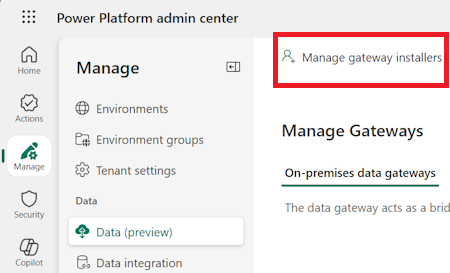

# On-premises data gateway management

[!INCLUDE [cc-beta-prerelease-disclaimer](../includes/cc-beta-prerelease-disclaimer.md)]

The On-premises data gateway acts as a bridge, providing quick and secure data transfer between on-premises data (data that is not in the cloud) and the Power BI, Microsoft Flow, Logic Apps, and PowerApps services.

You can use the Power Platform Admin center to get visibility into all on-premises data gateways in a tenant. To do so, sign in as a tenant admin and select the **Data Gateway** option.

Users who are part of the Azure AD Global administrator role (which includes Office 365 Global admins), Power BI service administrators, and Gateway administrators will have access to Data Gateway management on the Power Platform Admin center. There may however be differences in the features available and the operations which can be performed by each of these roles.

The Azure AD Global administrator role (which includes Office 365 Global admins) and Power BI service administrators will be able to see all gateways in their organizations in addition to the gateways they manage. You can switch between these two views using this toggle in the upper-right corner of the page:

> [!div class="mx-imgBorder"] 
> 

The Gateways page lists all on-premises data gateway clusters installed on the tenant. In addition, you can review the following information about these clusters:

- **Gateway Cluster Name**: The name of the gateway cluster.
- **Contact Info**: Admin contact information for the gateway cluster. 
- **Administrators**: The list of gateway administrators.
- **Gateways**: The number of gateway members in the gateway cluster.

The gateway cluster list includes both On-premises data gateways and On-premises data gateways (personal mode).

> [!div class="mx-imgBorder"] 
> 

> [!NOTE]
> On-premises data gateways in non-default environments/regions are currently not included. 

## Display gateway members

Select the **Open in new window** icon () next to the gateway cluster name to see the gateway members, device name, and version in each gateway cluster.

> [!div class="mx-imgBorder"] 
> 

## Manage users

Select the **People** icon () next to the gateway cluster name to see the list of gateway users. Add or remove gateway admins in the **Manage Users** page.

For personal gateways, this would show the owner of the personal gateway and cannot be changed due to the security scope of personal gateways.

For On-premises data gateway in standard mode, users can be added in any of the following three categories. 
 
- **Admin**: 
  - **Power BI**: Administrators have full control of the gateway, including adding other admins, creating data sources, managing data source users, and deleting the gateway. 
  - **PowerApps and Flow**: Administrators have full control of the gateway, including adding other admins, creating connections, additionally sharing gateways in **Can use** and **Can use + share** permission levels and deleting the gateway.
  - **Others**: Administrators have full control of the gateway, including adding other admins and deleting the gateway.
- **Can use**: Users who can create connections on the gateway to use for apps and flows but cannot share the gateway. Use this permission for users who will run apps but not share them. Applies only to PowerApps and Microsoft Flow. 
- **Can use + share**: Users who can create a connection on the gateway to use for apps and flows, and automatically share the gateway when sharing an app. Use this permission for users who need to share apps with other users or with the organization. Applies only to PowerApps and Microsoft Flow. 

> [!NOTE]
> - **Can Use** and **Can use + share** apply only to PowerApps and Microsoft Flow. 
> - While sharing gateways for **Can use** and **Can use + share** permission levels, you can restrict the data source type that the user can connect over the gateway. At least one data source type should be selected for the user to be successfully added.

> [!div class="mx-imgBorder"] 
> 

## Search

Use **Search** to find gateway clusters and see their details. You can search for gateway cluster names and contact info, but not administrators.

> [!div class="mx-imgBorder"] 
> 

## Manage installers

As either an Azure AD Global administrator (which includes Office 365 Global admins) or a Power BI service administrator, use Manage Gateway installers to manage who can install the On-premises data gateway in your enterprise. This operation isn’t available for gateway admins.

> [!NOTE]
> This feature does not apply for On-premises data gateways (personal mode).

1. Go to the [Power Platform Admin center](https://admin.powerplatform.microsoft.com).

2. Select **Data Gateways** from the left-side menu.

3. Select **Manage Gateway installers**.

   > [!div class="mx-imgBorder"] 
   > 

4. Enable **Restrict Users in your organization from installing gateways**. This option is off by default allowing anyone in your organization to install gateway.

   > [!div class="mx-imgBorder"] 
   > 

5. Add users who can install gateway, and then select **Add**.

   > [!div class="mx-imgBorder"] 
   > 

   > [!NOTE]
   > Currently, we do not support groups for Manage Installers; you can add individual users. 

6. To remove users who have permission to install gateway, select **Remove installer** (), and then select **Confirm**.

   > [!div class="mx-imgBorder"] 
   > 

   > [!NOTE]
   > This does not impact gateways which are already installed. This feature only allows or restricts users from installing gateways going forward.

If a person who doesn’t have access to install gateways tries to install one, they will get the following error once they provide their credentials during the gateway registration.

> [!div class="mx-imgBorder"] 
> 

## Get Help
For faster troubleshooting and assistance, select **Get help** to open a Get Help panel. Include the session ID in a customer support ticket for any issues on the Data Gateways feature in the Power Platform Admin center.

> [!div class="mx-imgBorder"] 
> 

### See also
 [On-premises data gateway](https://docs.microsoft.com/power-bi/service-gateway-onprem) 
 [Connecting to on-premises data sources with On-premises Data Gateway](https://docs.microsoft.com/azure/analysis-services/analysis-services-gateway) 