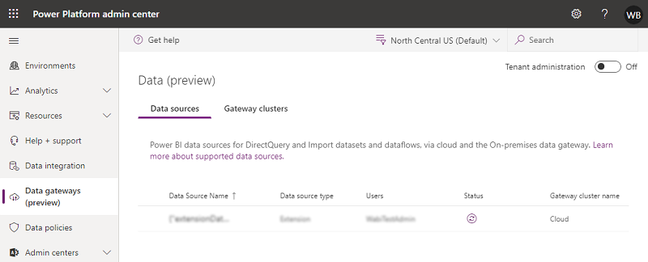
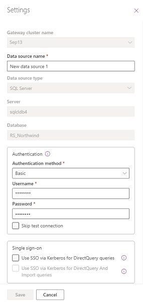
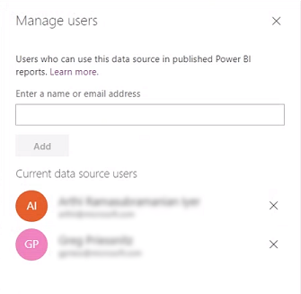
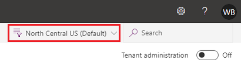
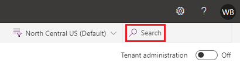

# Preview: Data source management

[!INCLUDE [cc-beta-prerelease-disclaimer](../includes/cc-beta-prerelease-disclaimer.md)]

On the **Data** page of the Power Platform admin center (https://admin.powerplatform.microsoft.com), you can view and manage Power BI cloud and on-premises data sources and gateway clusters. The on-premises data sources on this page include all on-premises data source definitions for gateways you administer. The cloud data sources on this page are cloud connections in your published Power BI reports.

This article describes managing data sources. For information on managing gateway clusters, see [Preview: On-premises data gateway management](onpremises-data-gateway-management.md).

> [!NOTE]
> The data sources tab will not be available for tenant or service administrators when **Tenant administration** is turned on.

> [!div class="mx-imgBorder"] 
> 

- **Data Source Name**: The name of the data source.
- **Data source type**: The type of the data source. For supported data sources, see [Power BI data sources](/power-bi/connect-data/power-bi-data-sources).
- **Users**: Users who can use this data source in data sets and data flows.
- **Status**: Select () to check the status of a gateway member.
- **Gateway cluster name**: The gateway cluster on which this data source was created. If it is a cloud data source, this value will be “Cloud”.

## Data source settings

Select a data source and then select **Settings** from the top menu bar to see the data source properties. You can view and update applicable data source properties.  

> [!div class="mx-imgBorder"] 
> 

## Add new data source

Select **+New** from the top menu bar to create a new gateway data source. This can either be an on-premises or a VNet data source.   

Select a gateway cluster, data source name, a data source type, and other data source properties to create the data source. For more information on data source properties, see [Add or remove a gateway data source](/power-bi/connect-data/service-gateway-data-sources).

:::image type="content" source="media/data-gateways-new-data-source.png" alt-text="New data source.":::

## Remove a data source

Select a data source and then select **Remove** to remove the data source. 

> [!div class="mx-imgBorder"] 
> 

## Manage users

Select a data source and then select **Manage users** to see the list of current data source users. These users can use this data source in published reports and data flows. 

> [!div class="mx-imgBorder"] 
> 

## Get help
For faster troubleshooting and assistance, select **Get help** to open a Get help panel. Include the session ID in a customer support ticket for any issues on the Data Gateways feature in the Power Platform admin center.

> [!div class="mx-imgBorder"] 
> 

## Region

> [!div class="mx-imgBorder"] 
> 

Currently, data sources are available only for the default Power BI region. For other regions, you won't see any data sources.

## Search

Select **Search** to find data sources and see their details. You currently can search on data source names, data source types, and gateway cluster names, but not users and status.

> [!div class="mx-imgBorder"] 
> 

## Data source status

Select a data source, and then select **Check status** () to see the status of a data source.

### See also
 [On-premises data gateway](/data-integration/gateway/service-gateway-onprem) 
 [Connecting to on-premises data sources with On-premises Data Gateway](/azure/analysis-services/analysis-services-gateway) 

[!INCLUDE[footer-include](../includes/footer-banner.md)]