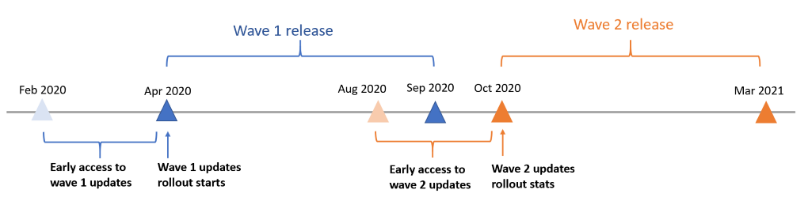
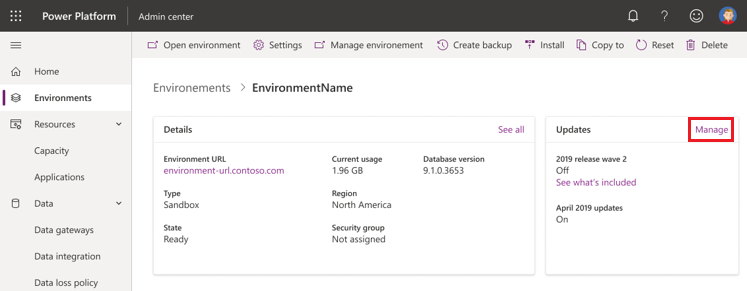
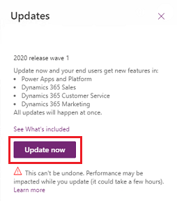
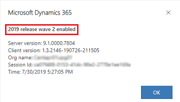
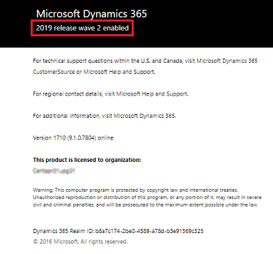

# Opt in to early access updates 

Power Platform and customer engagement apps (Dynamics 365 Sales, Dynamics 365 Customer Service, Dynamics 365 Field Service, Dynamics 365 Marketing, and Dynamics 365 Project Service Automation) deliver two [major releases](policies-communications.md#major-release-events) per year (April and October) that offer new capabilities and functionality.

Because the major releases include features that affect the user experience, you can opt in for early access to self-update to the new release, and start testing and validating the new features before they're automatically enabled for your users.

> [!TIP]
> Check out the early access features for [Power Platform](https://aka.ms/PowerPlatformEAFeatures) and [Dynamics 365](https://aka.ms/Dynamics365EAFeatures) to know the features that will roll out to the users automatically when you opt in for an update.

## Early access availability  
For each of the major releases, you can opt in for early access updates approximately two months before the major release is automatically enabled in your region.

For example, for a wave 1 major release that's planned to be automatically enabled starting in the first week of April, you'll be able to opt in for early access updates in early February. Similarly, for a wave 2 release that's planned to be automatically enabled starting in the first week of October, you'll be able to opt in for early access updates in early August.

The following is an example of an early update availability timeline.

> [!NOTE]
> Once a release wave is generally available, the updates status in your environments will be set to **On** to automatically receive all planned features and updates throughout the release.  
>
> To learn more, see [release schedule and early access](https://docs.microsoft.com/dynamics365/get-started/release-schedule).

## Environments available for early access updates 
The early access updates are available for all types of environments, including trial, sandbox, and production. However, the best practice is to enable the updates in **trial** or **sandbox** environments before production environments.
 
[Tenant to tenant migration](move-environment-tenant.md) is not supported for early access updates.  

> [!IMPORTANT]
> Although you can enable early access updates in a production environment, we highly recommend that you create a copy of your production environment as a sandbox environment to try out the new features first. The updates can't be reverted after they've been enabled; therefore, if you test and validate the updates in a sandbox environment before enabling them in a production environment, you can determine the impact they'll have on users in your organization.
>
> Be sure to:
> - Learn about the Dynamics 365 [release plan](https://aka.ms/Dynamics365ReleasePlan) and Power Platform [release plan](https://aka.ms/PowerPlatformReleasePlan), and the new features available for early access. 
> - Review [Prepare for a release wave](#prepare-for-a-release-wave). 
> - Validate and test the updates in a sandbox environment before rolling out to production. 

## How to enable early access updates 

1. Sign in to the [Power Platform admin center](https://admin.powerplatform.microsoft.com/). 

2. Select the environment to update. 

3. Under **Updates**, you'll see that the new release wave is available. Select **Manage**. 

   > [!div class="mx-imgBorder"] 
   > 
   >  An example screenshot. May not be current wave. 

4. Select **Update now**, and then proceed through the confirmation dialog boxes to enable the new features and capabilities of the release wave.  
 
   > [!div class="mx-imgBorder"] 
   > 
   >  An example screenshot. May not be current wave. 

5. After the update is complete, all early access features will be enabled for your model-driven apps in your environment.  

> [!NOTE]
> - All available updates to your environment will be initiated at once. 
> - After they're enabled, the updates can't be reverted. Be sure to update your sandbox or trial environment before updating the production environment.  
> - Only the apps that you currently have licenses for will be updated; no new apps will be installed. 
> - It might take a few hours to complete the updates. All applications in the environment will still be available during the update, though you might experience slightly reduced performance.  

## Additional requirements to enable early access updates  
Some apps require additional steps to enable early access features. If you have any of the following apps, after enabling the early access updates on the Power Platform admin center, you'll need to take the following manual steps.

|Early access apps  |Description of manual steps  |
|---------|---------|
|Dynamics 365 Marketing     | Run the Marketing setup wizard to update your environment. This will install both the new release for production updates and the early access features when you run it on an environment where early access is enabled. For instructions, see [Rerun the Dynamics 365 Marketing setup wizard](https://docs.microsoft.com/dynamics365/customer-engagement/marketing/re-run-setup).          |
|Dynamics 365 Field Service     | If you have Dynamics 365 Field Service version 8.8.6.0 or newer, you'll automatically receive the early access updates. If you're running on an older version of the Field Service app, you'll need to perform an upgrade. See [Upgrade Dynamics 365 Field Service](https://docs.microsoft.com/dynamics365/field-service/upgrade-field-service).        |
|Dynamics 365 Project Service Automation     | If you have Dynamics 365 Project Service Automation version 3.10.2.0 or newer, you'll automatically receive the early access updates. If you're running on an older version of the Project Service app, you'll need to perform an upgrade. See [Upgrade home page](https://docs.microsoft.com/dynamics365/project-service/upgrade-psa-home-page).        |
| Dynamics 365 Resource Scheduling Optimization | If you have Dynamics 365 Resource Scheduling Optimization, you will need to update or deploy Resource Scheduling Optimization in the Power Platform admin center. For instructions, see [Manage Dynamics 365 apps](manage-apps.md), [Update RSO](https://docs.microsoft.com/dynamics365/field-service/upgrade-field-service#resource-scheduling-optimization), and [Deploy RSO](https://docs.microsoft.com/dynamics365/field-service/rso-deployment). |

> [!IMPORTANT]
> Be sure to enable the early access updates in the Power Platform admin center first. If you run the Dynamics 365 Marketing setup wizard to update your Marketing app to a new release wave before activating the early access updates in the Power Platform admin center, you must [run the Dynamics 365 Marketing setup wizard again](https://docs.microsoft.com/dynamics365/customer-engagement/marketing/re-run-setup) after opting in to install and enable the early access features. 

## Update status and Retry 

To check the update status, sign in to [Power Platform admin center](https://admin.powerplatform.microsoft.com/) and select the environment. From **Updates**, you'll see the update process of each of the applications. 

### Retry 
If an application update failed during the opt-in update, you can use the **Retry** button to restart the update for the failed application.
 
The retry will only restart the update for the failed application. If multiple applications failed during the update, you'll need to retry for each of the failed updates individually.  
The updates might take a few hours. If multiple retry attempts fail after 24 hours, contact [Support](https://dynamics.microsoft.com/support/) for assistance. 

> [!NOTE]
> The retry experience is only available for the early access opt-in updates. After a release wave is generally available, the updates of the release wave will be automatically enabled for all environments; thus, no manual action is required.   

### Confirm update complete  
To verify that a release wave is enabled, open the environment, go to **Settings** () > **About** to see the release wave that's enabled.

|In Unified Interface  |In the web client interface  | 
|---------|-------|
|  An example screenshot. May not be current wave.        |    An example screenshot. May not be current wave.         |

> [!NOTE]
> You need to select **About** from a Dynamics 365 apps page that's displayed in the [Unified Interface](about-unified-interface.md), such as Sales Hub or Customer Service Hub pages. 
>
> The server version won't be updated to the next version after a release wave is enabled. 

## Features available in the early access updates  
Each release wave includes features and functionality that are enabled for different types of users. They're categorized as the following three types of features:

- **Users, automatically**: These features include changes to the user experience for users and are enabled automatically.
- **Admins, makers, or analysts, automatically**: These features are meant to be used by administrators, makers, or business analysts and are enabled automatically. 
- **Users by admins, makers, or analysts**: These features must be enabled or configured by the administrators, makers, or business analysts to be available for their users.

By opting in for early access updates, you'll get features that are mandatory changes that are automatically enabled for users.
For more details, check the **Enabled for** column in [Dynamics 365](https://aka.ms/Dynamics365ReleasePlan) and [Power Platform](https://aka.ms/PowerPlatformReleasePlan) release plans.

## Prepare for a release wave  
The following checklist provides the general guidelines to help you prepare for a release wave. 

1. Review the [release plans](https://docs.microsoft.com/dynamics365/release-plans/) as soon as the early access updates are available. This will help you learn about the early access capability and features that will be automatically enabled for the end users.

2. Create a sandbox environment from the production environment. After a new release wave is enabled for an environment, it can't be reverted. Thus, we strongly recommend enabling a new release wave in a sandbox environment that's a replica or copy of the existing production environment. This will allow you to test and validate the new features in the sandbox environment without affecting the current production environment.

   > [!NOTE]
   > If you don't have a sandbox copy of your production environment, you can [create a copy](copy-environment.md) in the Power Platform admin center. 

3. Opt in to the early access updates from the Power Platform admin center to enable the new release wave in the sandbox environment. Check [Additional requirements to enable early access updates](#additional-requirements-to-enable-early-access-updates) if your apps require manual steps.   

4. Validate that key scenarios work as expected in the sandbox environment after the update is completed. 
   - Update the customizations in your applications, if any, to leverage or respond to the new capabilities as needed. 
   - You might also need to update internal readiness materials (training and communications) for your organization based on new features or user experiences.
   - If you find any issues during the validation&mdash;such as regressions, or functional or performance issues&mdash;contact [Support](https://dynamics.microsoft.com/support/) or get help from [Dynamics 365 forum](https://community.dynamics.com/f). 

5. Enable the early access updates in your production environment. We recommend enabling the updates in your production environment during business downtime.

## Early access updates FAQ 

### Will an environment that previously opted in for the early access updates automatically get the early access update of the new releases?
An environment opted in for the previous early access will not be automatically opted in for the next early access release.  Each early access release will need to be opted in explicitly. When a release becomes generally available, all environments will be automatically updated to the latest release throughout the release wave. 

### After updating to a new release wave, can I export solutions? 
Yes, you can export solutions to other environments that have also been updated to the same release wave. 

### Will the version number be updated with each release wave? 
No, the version number is not necessarily going to change with a release wave.

### Will Microsoft provide a free sandbox environment at no charge for testing updates? 
No. You're responsible for creating a sandbox environment from a copy of the production environment for testing and validation, at your own cost.

### When will the updates be available for testing in the sandbox environment? 
See [Early access availability](#early-access-availability).

### How do I report issues with updates? 
Create a [support ticket](https://dynamics.microsoft.com/support/). 

### Can I skip or postpone an update? 
No. To ensure you get the best quality of the new features and capabilities, all customers are required to update to the latest release as scheduled. 

### What happens to the environments after a release wave becomes generally available? 
If you've enabled the early access updates in your environments, you'll continue to get updates throughout the release wave. 

If you didn't opt in for the early access updates in your environments, after a release wave is generally available, all environments will be automatically turned on to receive mandatory updates of the release wave.  For regional deployment, see [General availability deployment](https://docs.microsoft.com/power-platform/admin/general-availability-deployment)
 
Throughout a release wave, your environments will be updated during one of the [maintenance windows](policies-communications.md#maintenance-timeline) over a weekend based on your environments' region. The specific dates when the updates will occur will be published to the [Message Center](https://docs.microsoft.com/office365/admin/manage/message-center?view=o365-worldwide). Each notification will include the dates, the maintenance window, and the Release Plan reference for the list of optimizations, fixes, and enhancements. Each environment should see the new features and build numbers by Monday morning, local time.

See [Policies and communications](policies-communications.md#scheduled-system-updates). 

<!--
#### Deployment schedule

> [!IMPORTANT]
> As announced in the [blog post](https://aka.ms/covid19Blog), Microsoft is making some changes to the update schedules in April in response to COVID-19. The 2020 release wave 1, April updates will be generally available as mentioned in the [Dynamics 365](https://aka.ms/Dynamics365ReleasePlan) and [Power Platform](https://aka.ms/PowerPlatformReleasePlan) release plans. However, we are making some changes to the release schedule as explained later in [this article](https://docs.microsoft.com/dynamics365/get-started/release-schedule). Microsoft will continue to release critical updates for Dynamics 365 applications and Power Platform. Microsoft is also extending the deprecation timelines for some capabilities to provide customers and partners additional time to make the transition. Microsoft is committed to providing support to our customers and partners during this period.

The following is the updated schedule for when the 2020 release wave 1 features will be enabled by regions. 

|Regions  |Automatic update window  |
|---------|---------|
|South America Canada India France Emirates South Africa Germany  |  Friday, May 1st – Sunday, May 3rd     |
|Japan Asia Pacific Great Britain Australia   | Friday, May 8th – Sunday, May 10th        |
|Europe     | Friday, May 15th – Sunday, May 17th         |
|North America     |  Friday, May 22nd – Sunday, May 24th       |
|China | Friday, May 29th – Sunday, May 31st   |
|GCC GCC High DOD  |Friday, May 29th – Sunday, May 31st  See [Dynamics 365 US Government](microsoft-dynamics-365-government.md).          |

During the general availability deployment, your environments will be updated with the latest features and functionality automatically applied to Dynamics 365 applications and Power Platform. It will not require any action from you.  
-->

### See also
[Dynamics 365 release schedule and early access ](https://docs.microsoft.com/dynamics365/get-started/release-schedule) 
[Dynamics 365 and Power Platform Release Plans ](https://docs.microsoft.com/dynamics365/release-plans/) 
[Policies and communications](https://docs.microsoft.com/power-platform/admin/policies-communications)

