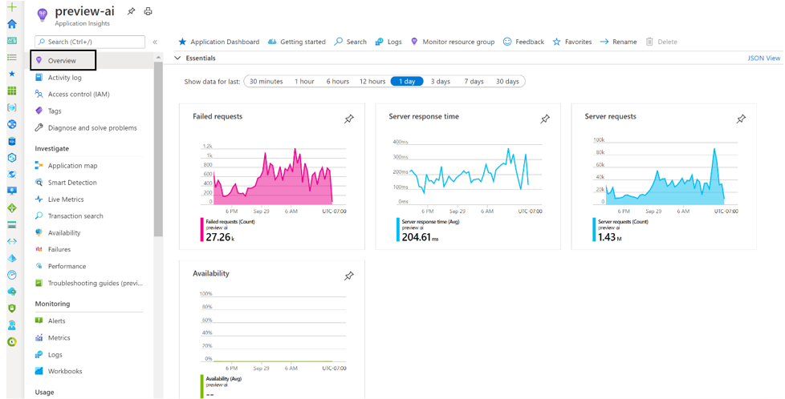
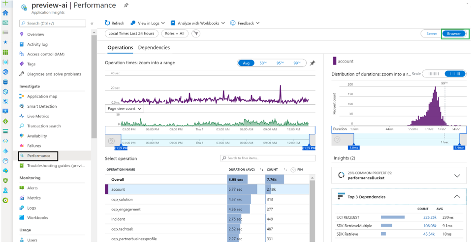
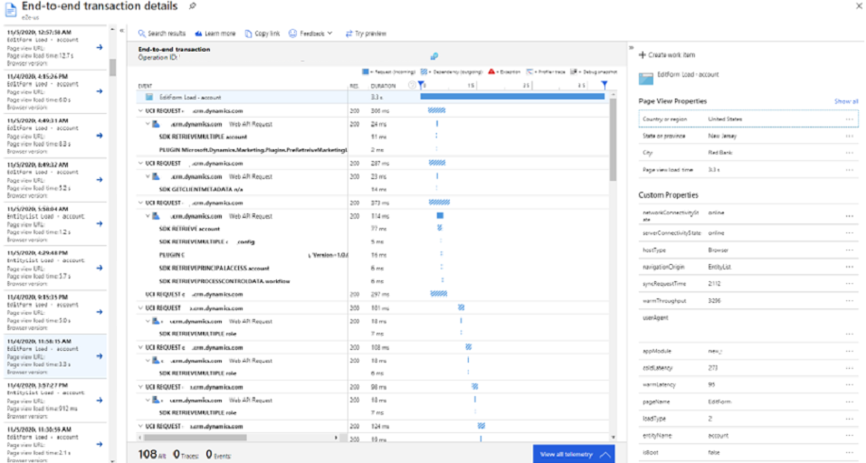
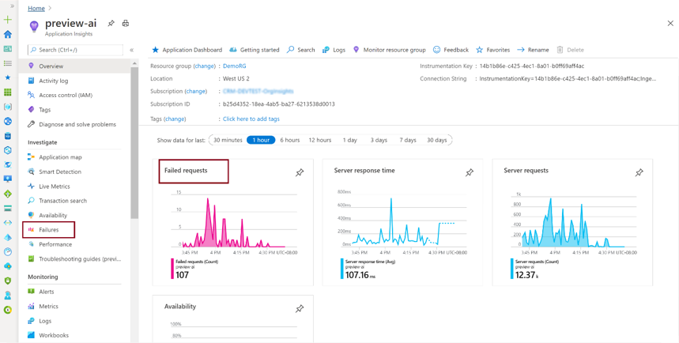
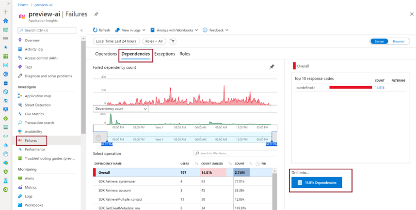
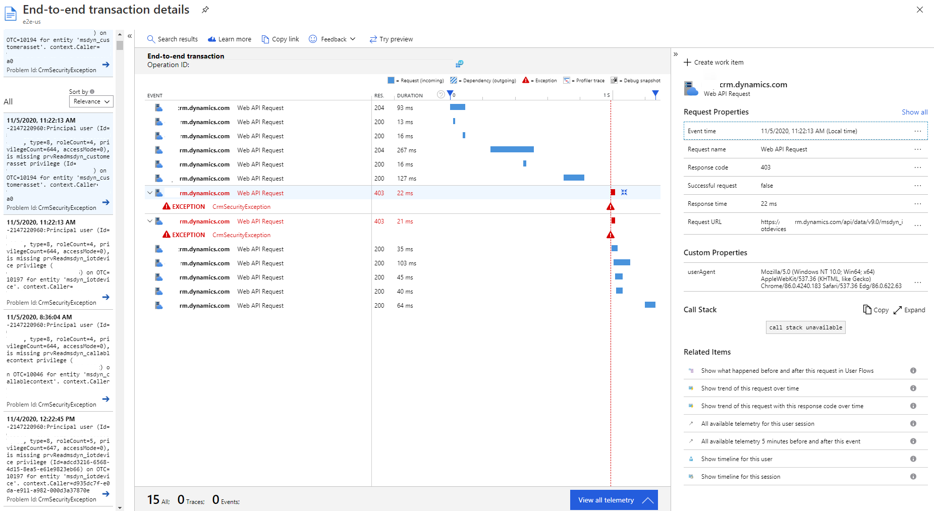
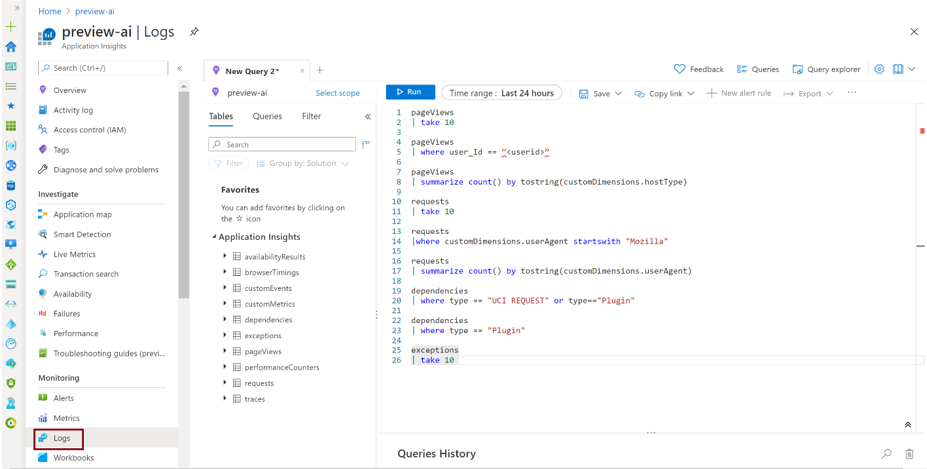

# Preview: Overview of integration with Application Insights

[!INCLUDE [cc-beta-prerelease-disclaimer](../includes/cc-beta-prerelease-disclaimer.md)]

Application Insights, a feature of Azure Monitor, is widely used within the enterprise landscape for monitoring and diagnostics. Data that has already been collected from a specific tenant or environment is pushed to your own Application Insights environment. The data is stored in Azure Monitor logs by Application Insights, and visualized in [Performance](/azure/azure-monitor/learn/tutorial-performance) and [Failures](/azure/azure-monitor/learn/tutorial-runtime-exceptions) panels under **Investigate** on the left pane. The data is exported to your Application Insights environment in the standard schema defined by Application Insights. The support, developer, and admin personas can use this feature to triage and resolve issues.

## What telemetry and which tables are being populated in Application Insights?

|Telemetry type  |Application Insights table name  |
|---------|---------|
|Unified Interface page loads      | pageView        |
|Unified Interface outbound network requests     | Dependency        |
|Dataverse API incoming calls     | Request        |
|Plug-in executions     | Dependency        |
|SDK executions (*Retrieve*, *RetrieveMultiple*, *FetchXML* transformation, and so on)     | Dependency        |
|Exceptions during the execution of plug-in and SDK calls     | Exceptions       |

Application Insights has a wide range of features to help you use this data:

- [Create a dashboard](/azure/azure-monitor/learn/tutorial-logs-dashboards) for an overview of the health of your org.
- Perform proactive monitoring by using [Smart Detection](/azure/azure-monitor/app/proactive-diagnostics).
- [Set up alerts](/azure/azure-monitor/learn/tutorial-alert) for important scenarios based on your org.
- Visualize and track common [navigation patterns](/azure/azure-monitor/app/usage-flows) from a usage perspective. This will help you understand, for example, whether a user always selects a specific tab first before navigating back to the main tab and closing the form. If so, this might indicate that a field should be positioned on the first tab, instead of another tab, to save the user time every time they open this record.
- Create custom queries to troubleshoot performance and errors by using the [**Logs**](/azure/azure-monitor/log-query/log-query-overview) panel under **Monitoring** on the left pane.

Example: List the top 10 records for form loads in the **pageView** table:

```kusto
pageView
| take 100
```

## Overview panel in Application Insights

Application Insights provides different views. The **Overview** panel shows a summary of the key diagnostic metrics of your app and is a gateway to the other features of the portal. You can drill into metrics for more details. See the following sample.

> [!div class="mx-imgBorder"] 
> 

## Performance panel in Application Insights

To open the **Performance** panel, either select the **Server Response Time** graph in the **Overview** panel or select **Performance** under **Investigate** on the left pane. Application Insights allows you to choose **Server** and **Browser** data views. By identifying those operations with the longest duration, you can diagnose potential problems.

The **Performance** panel shows the count and average duration of each operation for the application. You can use this information to identify those operations that most affect users.

The **Server** view shows the most frequently called APIs and what the latency looks like.

> [!div class="mx-imgBorder"] 
> 

Operations with a higher number of calls and higher duration are potential items for investigation. In the above example, `POST /XRMServices/2011/Organization.svc/web` has a high number of calls and a high duration. Similarly, `GET /api/data/v9.0/accounts` has a relatively high duration.

Selecting one of the operations will also show you details about the top three dependencies and time taken. You can see more details by selecting the **Dependencies** tab.

If you switch to the **Browser** view, you'll see data about which pages are being viewed most frequently in the environment and the latency for each of them. You'll see metrics including session counts and the dependencies associated with different operations. For example, selecting the **Accounts** operation shows requests made to the account entity.

> [!div class="mx-imgBorder"] 
> 

You can drill into a specific sample to see where time is spent on the particular operation.

> [!div class="mx-imgBorder"] 
> 

More information: [Find and diagnose performance issues with Azure Application Insights](/azure/azure-monitor/learn/tutorial-performance)

## Failures panel in Application Insights

To open the **Failures** panel, either select **Failures** under **Investigate** on the left pane or select the **Failed requests** graph.

> [!div class="mx-imgBorder"] 
> 

The exceptions table in Application Insights powers the **Failures** panel. It shows the count of failed requests and the number of users affected for each operation for the application. You can see error details for the operations and dependencies, for both server and browser. Failures related to create/read/update/delete (CRUD)&ndash;specific HTTP methods (GET, POST, PUT, and DELETE) used in the API operations are available here. This can be used to identify those failures that most affect users. For example, in the following sample you can see that the `GET/api/data/v9.0/GetClientMetaData` operation has a high number of failures and users. Selecting this operation shows more information about it in the right panel.  

> [!div class="mx-imgBorder"] 
> 

You can also see the failures related to the dependencies, including a summary view of the common response codes mapped to failures.

> [!div class="mx-imgBorder"] 
> 

You can drill into the details of the step where the bottleneck occurred.

> [!div class="mx-imgBorder"] 
> 

More information: [Find and diagnose run-time exceptions with Azure Application Insights](/azure/azure-monitor/learn/tutorial-runtime-exceptions)

## Querying data in Application Insights 

In Application Insights, go to the **Logs** panel under **Monitoring** on the left pane.

> [!div class="mx-imgBorder"] 
> 

## Common fields

All the [tables](#what-telemetry-and-which-tables-are-being-populated-in-application-insights) populated in Application Insights have these common fields:

- **cloud_RoleInstance**: For events emitted as a part of this effort, this field will be set to **CDS Data Export** to ensure that they can be distinguished from other events in the same Application Insights environment.
- **operation_Id**: This links together all the operations in a single interaction&mdash;which is one way to get all related events to a failing event.<br/>
  ```kusto
  pageView
  | where operation_Id == "[insert id here]"
  ```
- **session_Id** : This uniquely identifies all activities in a single user session. The session value is reset when a user opens a new tab, selects F5/refresh, or closes and reopens the mobile app.
- **user_Id, user_AuthenticatedId**: These are both currently set to the Azure Active Directory ID of the user. 
- **client_IP**: This field is always populated to 0.0.0.0 by Application Insights for General Data Protection Regulation (GDPR) compliance. The IP address provided is used to populate the **client_City**, **client_StateOrProvince**, and **client_CountryOrRegion** fields.
- **client_Type**: The value here is **Browser** if the logs are coming from Unified Interface and **Server** if the logs are coming from Dataverse. Note that the userAgent can be found in the **requests** table under **customDimensions**, when available.

Because the Application Insights schema is fixed, and this feature pushed data into Application Insights as an export process, the **customDimensions** fields in Application Insights are used to add properties.
