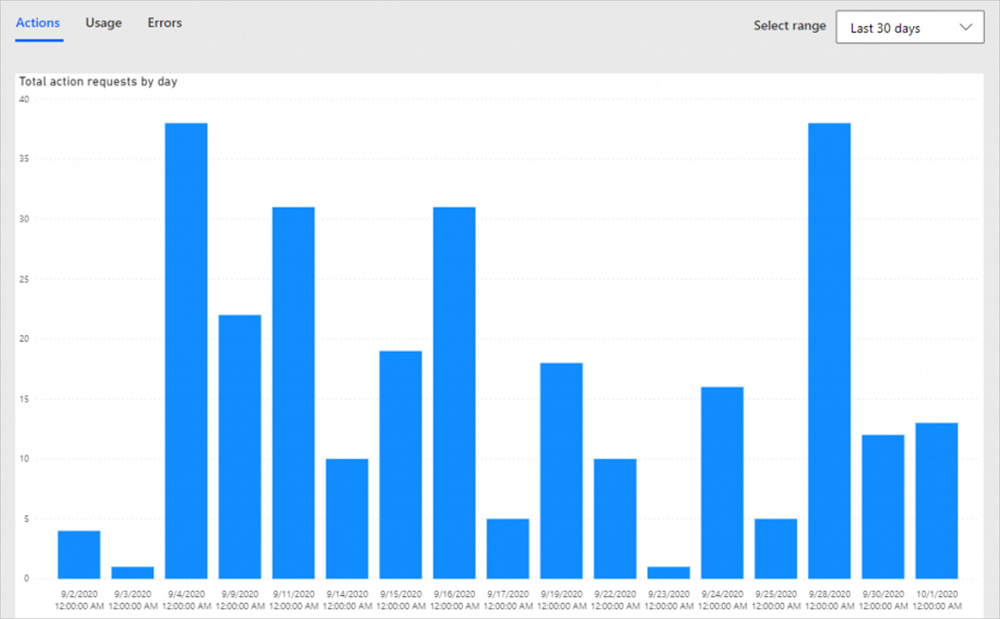

# Power Automate licensing FAQ

[!INCLUDE[new-PPAC-banner](~/includes/new-PPAC-banner.md)]

Here are some frequently asked questions about Power Automate standalone licenses.

## How do Power Automate license plans work for flow runs?

If a flow is set to the Power Automate process plan, then it can access premium connectors, has the highest limits, and always uses the process plan request limits, regardless of who runs the flow.

If the flow is set to the Power Automate Premium user plan, then it gets the plan of its primary owner if the flow is an automated or scheduled flow. If the flow is an instant/button flow, it uses the license of the user running the flow. If a user has multiple plans, such as a Microsoft 365 plan and a Dynamics 365 plan, the flow uses the request limits from both plans.

The user license plan for Power Automate is the Power Automate Premium plan, but users have a range of other license plan options. Users with the free plan or one of the Microsoft 365 license plans can only access standard connectors, but most of the other license plans and trials provide access to premium connectors.

Learn more about license plans that include Power Automate capabilities in [Types of Power Automate licenses](/power-platform/admin/power-automate-licensing/types) and the [Power Platform Licensing Guide](https://go.microsoft.com/fwlink/p/?linkid=2085130). Learn more about the limits and performance profile of license plans in [Limits of automated, scheduled, and instant flows](/power-automate/limits-and-config).

### Which Power Automate licenses do I need?

Microsoft recommends that most organizations buy the Power Automate Premium license for every user in their organization. Purchase the Power Automate Process license for every business process or machines that run unattended automation. The Power Automate Hosted Process is a superset of the Power Automate Process license, providing the same functionality but with the addition of a Microsoft hosted machine capacity that can be used for hosted machine or hosted machine group, enabling RPA with zero infrastructure.

The Premium user plan is intended for a human user to support the broad adoption of an automation culture in an organization. It's required for RPA developers to build and manage desktop flows on the Power Automate portal.

The Process license is intended for core enterprise process automations that are typically automated back-end activities (not run manually by a person). For example, every organization needs processes for invoice processing or HR onboarding that are mandatory to the normal operation of the business. These processes can vary in size and complexity, ranging from small-scale initiatives to large-scale endeavors spanning multiple flows interconnected by shared data sources. For example, an invoice processing process has multiple flows handling an invoice from creation through approvals to payment. All the flows are part of one business process as they're all handling an invoice through multiple steps to closure.

By obtaining a Process license, organizations ensure that all the flows within the business process are appropriately licensed. This enables the deployment and management of interconnected flows as a cohesive unit, facilitating application lifecycle management (ALM) and optimized performance.

You need a Process license if your flow meets **one of the following criteria**:

- Your flows use unattended RPA (robotic process automation) to run desktop flows on machines without user interaction.
- Your flows are running under Application user (flow owner is a Service Principal). Organizations with multiple environments (Dev/Test/Prod) use DevOps pipelines to export and deploy flows into other environments for healthy ALM (application lifecycle management). They run their flows using service principal to avoid giving access to users in production environments.
- Your flows process large data or need to run frequently, thereby needing a high volume of Power Platform requests.
- Your premium flow is invoked by multiple users. In this case, either everyone needs a Premium license, or the flow needs a Process license. If a flow has a Process license, it doesn't require any user to have a license. It provides an organization with the flexibility to pay for licenses based on the number of flows. Larger organizations or solutions that affect many people can benefit from the fixed monthly cost.
- Your flow uses premium connectors, and your organization has many guest users using the flow, but you don't know if the guest users' home tenant provides them with Premium licenses.

> [!NOTE]
> The Power Automate Process and Hosted Process licenses only license the flows and/or machines and not the user. The Premium user plan is required for RPA developers to build and manage desktop flows on the Power Automate portal. Learn more about the Premium RPA features that come with the Premium user plan in [Premium RPA features](/power-automate/desktop-flows/premium-features).

### How many Power Automate Process licenses do I need?

- Your process has unattended RPA (robotic process automation): how many machine sessions do you need?

  Purchase one Process license for each machine. You can add more Process licenses if you need concurrent execution on the machine. All desktop flows (RPA) running on the machine and cloud flows (DPA) that are part of the business process are covered by the Process license.

- Your process only needs DPA (digital process automation): how many core business processes do you want to automate?  

  Purchase one process for every core business process. Some examples of core business processes are invoice processing or human resources (HR) onboarding. All cloud flows related to the same business process are included in the license.

### How many Process licenses do I need if I have multiple cloud flows, each of them invoking its own RPA flows in unattended mode on a machine?

With one Process license, you can run multiple cloud flows by queueing them. For example, if you have four independent cloud flows, and each one of them invokes its own desktop flow running on the same machine, you can run the first one at 09:00 AM, the second one at 11:00 AM, and so on, in the same virtual machine.

In the following screenshot, all cloud flows are covered by one Process license, as they have a desktop flow running on the same machine. Any child flows, associated flows of these cloud flows are also covered by the Process license on the machine.

:::image type="content" source="../media/faqs/many-flows-one-machine.png" alt-text="All cloud flows are covered by one Process license, as they have a desktop flow running on the same machine.":::

### My DPA process has multiple cloud flows. Will I need multiple Process licenses?

Core business processes can vary in size and complexity, ranging from small-scale initiatives to large-scale endeavors spanning multiple flows interconnected by shared data sources. For example, the invoice processing process has multiple flows handling an invoice from creation through approvals to payment. All the flows are part of one business process as they're all handling an invoice through multiple steps to closure. You only need one Process license for a core business process. This encourages microservices architecture best practices where flows can be small with fine-grained functionality resulting in better maintainability.

Identify the flow that starts the process and assign a Process license to that flow. Child flows of the flow with Process license are covered by the Process license. These flows can be in the same solution or in a different solution.

Non-parent/child flows can manually be associated to the flow with a Process license. These flows must be in the same solution and use the same data sources.

The flows organized as child flows and associated flows are all treated as one process with one Process license assigned to the main flow and share Power Platform Request limits of the Process license.

### My solution has multiple processes. Do I need multiple Process licenses?

Yes. A solution can have multiple processes with a Process license assigned to each of them.

### Who needs to purchase a Premium license?

Users who need to create general-purpose automations (with the premium connectors entitlement), to have full flexibility (with the custom connectors entitlement) or to interact with applications simulating a human behavior such as keyboard or mouse keys and movement (with the Robotic Process Automation attended entitlement) should consider a Power Automate Premium license.

More precisely:
- You need a Premium license for each RPA developer who builds and manages desktop flows on the Power Automate portal. Learn more in [Premium RPA features](/power-automate/desktop-flows/premium-features).
- The Power Automate process plan has the highest priority among all licenses. This means if a Process license is assigned to a flow, the flow always uses this license and doesn't need an owner or running user to have a Premium license.
- Automated and scheduled flows always run in the context of the flow owner regardless of who starts the flow or what accounts are used for connections inside of the flow. Instant flows (button, hybrid triggers) run in the context of the user who invokes them, regardless of the connections used in the flow. If an automated or scheduled flow uses a premium connector, only the owner needs to have a Premium license.
- If an instant flow has premium connectors, every user who runs the flow needs a Power Automate Premium license. In such cases, instead of licensing every user, you can license the flow with a Process license.
- If the flow doesn't use a premium connector, you don't need a Premium license. You can use a Microsoft 365 license.

To find out what type (automated/manual/scheduled) of flow you have, select a flow to see its 'type' in the details.

:::image type="content" source="../media/power-automate-licensing/flow-types.png" alt-text="Screenshot of types of flows.":::

- If the flow is in context of Power Apps or Dynamics 365 apps, and is an automated flow, the flow must be associated to the app created using Power Apps or a Dynamics 365 app and the owner needs Power Apps Premium license, or a Dynamics 365 license.
- If the flow is in context of a Power Apps or Dynamics 365 app, and is an instant flow, every user running the flow needs a Power Apps Premium license, or a Dynamics 365 license.
- If a parent flow calls a child flow, the child flow leverages the context from the parent flow. For example, if the following criteria are met, it uses the parent flow owner's license:
    - If the parent flow is an automated flow, and
    - The child flow uses premium connectors, and
    - The child flow doesn't have a Process license. If the child flow has a Process license, it uses the Process license and not the parent flow's license.

During the [transition period](/power-platform/admin/api-request-limits-allocations#power-automate-transition-period), the parent flow license isn't inherited by the child flow. The child flow uses the owner's license. However, after the transition period ends, only the parent flow license (owner's license/parent flow's Process license) will be used, unless the child flow has a Process license.

### We have three environments (development, test, and production) to align with best practices and we need flows in several environments. Do we need to buy a Process license for every environment?

Each flow exists in a specific environment. This means if a flow is imported into a different environment, each instance is a separate flow and needs a separate license. The flow with the Process license and it's child flows, and all the flows that are associated are treated as one process and one Process license covers the usage of all of them in one environment.

### We have three environments (development, test, and production) to align with best practices and we need flows in several environments. Do we need to buy a Premium license for every environment?

The Power Automate Premium license is a user level license. All user level licenses (Power Automate Premium, Microsoft 365, Dynamics 365) are tenant level licenses. The user can use the flow in all environments without having to buy a separate license.

### Can a Power Automate Hosted Process license be used as a Power Automate Process license?

Yes, you can use the Power Automate Hosted Process capacity in two ways:
- Hosted machines and hosted machine groups. 
- As a Process license that can be used for unattended robotic process automation (unattended RPA) on your on-premises machine, or flows that are part of a business process.

### Can Microsoft 365 customers create solution-aware flows and child flows?

Yes. Microsoft 365 customers can create solution-aware flows if the environment in which they create the solution-aware flow has a Dataverse database attached to it. The default environment gets a Dataverse database by default. The admin must attach a Dataverse instance to non-default environments. Admins need at least a 1 GB tenant level Dataverse database capacity available to create a new environment.

The first subscription of Power Apps, Power Automate, Microsoft Copilot Studio, Dynamics 365 Sales, Customer Service, and Field Service adds a one-time default capacity limit of 10 GB for the tenant. When you add subscriptions to the tenant, additional Dataverse capacity may accrue to the tenant. For example, if a new customer purchases a Power Automate Premium plan, the tenant receives 10 GB of default Dataverse database capacity. And if the tenant buys 10 Power Automate Premium licenses, the tenant gets 10.5 GB (10 GB plus 10 times 50 MB).

### I use multiple user connections in my premium flow. Which user needs a Premium license to run the flow?

Connections are independent from license checks. You can have multiple user connections in a flow, but the flow always runs in the context of primary owner/run-only user/Process license. 

### The owner of a flow left the organization. How can we ensure it works without interruptions?

If the flow is a solution-aware flow, you can [change the owner](/power-automate/change-cloud-flow-owner) in Power Automate, or use [Power Automate Web API](/power-automate/web-api#update-a-cloud-flow) to ensure the flow works without interruptions. If the flow is a non-solution-aware flow, any co-owners can add it to a solution and then change the owner. If not, assign a Power Automate Process license to the flow to ensure it continues to run. Alternatively, any co-owners of the flow can export and import the flow. When imported, the flow will be a new flow, and the co-owner now becomes the owner of the flow. The flow uses the license of the new owner.

The flow will be downgraded to lower performance and all flow owners will be notified and the flow will be turned off in 14 days if no action is taken.

### The owner of the flow no longer has a Premium license, but the flow is a premium flow. What happens?

The flow will be downgraded to lower performance and all flow owners will be notified and the flow will be turned off in 14 days if no action is taken.

### Do guest users (not from your tenant) need a license to use Power Automate?

Yes. The guest user must have a Power Automate license assigned through one of the following tenants:

- The tenant that hosts the flow. You can assign them admin trials for temporary access or standalone licenses.

- The home tenant of the guest user.

For example, if a guest user has a Power Automate Premium  license assigned in the home tenant, they can use premium features in the guest tenant that hosts the flow.

Power Automate—included with Office, Power Automate Premium, Power Apps Premium, and Dynamics 365 user plans—will have the following characteristics:

- In the Azure public cloud, these plans are recognized across tenants in guest scenarios because they aren't bound to a specific environment.

- In Azure national or sovereign clouds, these plans are recognized across tenants in guest scenarios. More information: [National clouds](/azure/active-directory/develop/authentication-national-cloud), [Azure geographies](https://azure.microsoft.com/global-infrastructure/geographies/#geographies)

- Licenses aren't recognized across tenants in different Azure clouds.

### What Power Automate capabilities are included in Windows licenses?

Windows 11 users can try desktop flows in attended RPA for personal productivity in the default environment. They can't share the desktop flows or create desktop flows in a different environment other than the default environment. Windows users don't have access to cloud flows. To get full cloud flows and RPA features, purchase the Power Automate Premium plan.

Windows 11 users can search for "Power Automate" in the Windows search bar. The Power Automate app for the desktop downloads automatically and then launches the first time you select its icon.

### Can Windows 10 and Windows Server 2016 users use Power Automate for desktop?

Yes, they can use Power Automate for the desktop (they have usage rights for it) but they'll have to download it from the download center.

## Legacy license questions

Starting August 1, 2023, Power Automate per flow ($100 per flow/month, with a minimum purchase of 5 licenses) and the Power Automate unattended RPA add-on ($150 per bot/month and required licensing prerequisites) will be removed from the pricing page. They'll be removed from the price list on February 1, 2024. Power Automate process, an all-encompassing license that is easier to manage, licenses a single "automation" bot that can be used for unattended robotic process automation (unattended RPA), or cloud flows using digital process automation (DPA) and can be accessed by unlimited users in the organization. Power Automate Process is priced at $150 per bot/month.

### How is Process license different from per flow license

For unattended RPA, previously customers needed to buy a per flow license for the cloud flow and an unattended RPA add-on. Now they can purchase a Process license for every RPA session on a machine. All the cloud flows invoking desktop flows on the machine are included as part of the Process license.

For cloud flows, one per flow license entitles the flow with the license and its child flows. One Process license entitles the flow with the license, its child flows, and any flows that are associated. Per flow had a minimum of five packs to be purchased to get started. There's no minimum purchase quantity requirement for Process license.

### How is Power Automate Premium license different from Power Automate per user with attended RPA license?

Power Automate Premium offer includes all the benefits of Power Automate per user with attended RPA offered at $40 per user/month, plus the process Mining visualize and analyze processes capabilities and is offered at $15 per user/month.

## Power Platform requests questions

Here are some of the frequently asked questions about PPR limits and their answers.

### What counts as Power Platform request?

Based on license, there are limits to the number of actions a cloud flow can run in day. These limits are different from connector throttling limits. You can see the number of actions your flow runs by selecting **Analytics** from the cloud flow details page and looking at the **Actions** tab.

Even when the flow uses few Power Platform requests, you can still reach your limits if the flow runs more frequently than you expect. For example, you might create a cloud flow that sends you a push notification whenever your manager sends you an email. That flow must run every time you get an email (from anyone) because the flow must check whether the email came from your manager. The limit applies to all runs across all your flows in a 24 hour period. Here are some insights to estimate the request usage of a flow:

1. A simple flow with one trigger and one action results in two "actions" each time the flow runs, consuming two requests.
1. Every trigger/action in the flow generates Power Platform requests. All kinds of actions like connector actions, HTTP actions, built-in actions (from initializing variables, creating scopes to a simple compose action) generate Power Platform requests. For example, a flow that connects to SharePoint or Exchange, Twitter, Dataverse; all those actions are counted towards Power Platform request limits.
1. Both succeeded and failed actions count towards these limits. Skipped actions aren't counted towards these limits.
1. Each action generates one request. If the action is in an apply to each loop, it generates more Power Platform requests as the loop executes.
1. An action can have multiple expressions but it's counted as one API request.
1. Retries and extra requests from pagination count as action executions as well.

Consider the following cloud flow where every email attachment is saved into OneDrive. The trigger consumes one Power Platform request, Apply to each consumes one request, and the actions within Apply to each consume multiple requests based on the number of times the loop runs. If there are four attachments, this section consumes eight Power Platform requests (4 x 2 actions). In total, this flow consumes 10 Power Platform requests.

:::image type="content" source="../media/faqs/many-flows-one-machine.png" alt-text="Screenshot of a sample flow where every email attachment is saved into OneDrive.":::

### Whose Power Platform request limits are used by the cloud flow?

- If a cloud flow has a Process / Per-flow license, the flow uses the Process / Per-flow license limit and not the creator/owner/invoking user's limit.

- [Automated and scheduled cloud flows](/power-automate/flow-types#cloud-flows) always use the flow creator/owner's Power Platform request limits regardless of who invoked the flow or what accounts are used for connections inside of the flow. For a solution flow, you can change the owner of the flow using [Web API](/power-automate/web-api#update-a-cloud-flow). After you change the owner, the new owner's API request limit are used. For a non-solution flow, the flow always uses the original creator's limit which can't be changed. If the original creator leaves the company, any co-owners of the flow can export and import the flow as a different owner. After you import the flow, it becomes a new flow and starts using limit from the new owner. Alternatively, you can assign a Process / Per-flow license to the flow.

- [Instant cloud flows (button, Power Apps, hybrid triggers)](/power-automate/flow-types#cloud-flows) use the invoking user's limit. 

- If the flow owner is a service principal, the flow uses the [non-licensed user limit](../api-request-limits-allocations.md).

- If you share an automated/scheduled flow with another user and then that user triggers the same flow, it uses the limit of the original owner and not the new user's limit. But if the user then leverages the flow to make their own new flow, then that new user becomes the owner of the new flow and that flow uses the new user's limit.

- If a parent flow calls a child flow, the child flow uses the parent flow's limit. For example, if the parent flow is an automated flow, the child flow uses the parent flow creator/owner's limit.

- If the parent flow is a manual flow, the child flow uses the limit of the parent flow's invoking user.

- If the child flow has a Process / Per-flow license, it uses the Process / Per-flow limit and not the parent flow's limit.

- If a flow has a Process license, the flow, all child flows (excluding those that have their own Process license) of the flow and any associated flows of the flow share the Process license limit.

### As a maker, what tools do I have to analyze my usage?

If you're experiencing delays or slowdowns when your flow runs, it's likely that you exceeded the PPR limits for the day. For flows that are consistently delayed due to overages, users also receive a notification that informs them about these overages, along with tips and tricks on how to prevent delayed runs of their flows.

Here's an example of an email that was sent for a flow that was consistently exceeding action limits:

:::image type="content" source="../media/power-automate-licensing/email-overage-example.png" alt-text="Screenshot of an overage email example.":::

Additionally, you can see the action usage for a given flow by selecting the  **Analytics**  action from the flow properties page, and this works across all types of actions. This helps you to understand how many actions are running each day. It can help you understand usage patterns to optimize for capacity:



:::image type="content" source="../media/power-automate-licensing/analytics-chart.png" alt-text="Screenshot of the analytics chart sample.":::

### As an admin, what tools do I have to analyze my environment's usage?

The Power Platform admin center contains [reports on Power Automate requests](../api-request-limits-allocations.md#view-detailed-power-platform-request-usage-information-in-the-power-platform-admin-center-preview). These reports help you quickly view adoption and user metrics for your organization. They are currently in public preview. Two reports are available:
- [User report](../api-request-limits-allocations.md#licensed-user-report) – This report displays the Power Platform request usage by every user in the environment, compared to their assigned limit.
- [Per flow report](../api-request-limits-allocations.md#per-flow-report) - This report displays the Power Platform request usage by every flow in the environment that has a Per-flow license.
- [Non-licensed user report](../api-request-limits-allocations.md#non-licensed-user-report) - This report displays the Power Platform request usage for non-licensed users and the total entitlement for non-licensed users for that tenant. In future, Power Platform requests usage of flows running under service principal will be displayed in this report. 

After the reports are generally available, users will have time to react and purchase higher PPR licenses before enforcement begins.

### What happens when my flow runs too many actions?

When you have a cloud flow that runs too many actions, it impacts the performance of your flow. You see a banner on the flow if your flow is being throttled.

In the most common case, exceeding limits results in delayed runs of subsequent actions, and this will slow down the overall run time of your flow. These delays are proportional to the degree of overages caused by a flow.

Occasional overages are okay. For instance, if you exceed your daily limits by 500 actions it's not going to affect the performance of your flow, however exceeding your limit by 50,000 actions will have a significant performance impact on your flow potentially for multiple days.

### What can I do if my flow is above limits?

Users aren't blocked from using an app or flow for occasional and reasonable overages.

Here are some things you can do if you exceeded the limits of your license:

- Revisit your design and check for any places that can help reduce the number of actions being called. Check out [Best Practices section to create flows to use less actions](https://support.microsoft.com/topic/troubleshooting-slow-running-flows-2a51dcd6-0b21-33da-5ce8-1e908b1540ef).

- If the flow is already optimized, but it uses many actions because of the nature of the business, consider buying a higher PPR license. The Process license provides the best performance quota available (250k actions/24 hours).

- Turn on [Pay-as-you-go](#power-platform-requests-pay-as-you-go) for the environment to ensure none of the flows in the environment are throttled.

- Purchase the **Power Apps and Power Automate capacity add-on** for your organization. During the [transition period](/power-platform/admin/api-request-limits-allocations#power-automate-transition-period), because enforcement is less strict, there's no facility to assign the **Power Apps and Power Automate capacity add-on** to a user or flow. However, Microsoft recommends that you purchase these add-ons now to remain within your license terms. Create a support ticket with the flow details and add on details to get temporary relief (30 days) from throttling. This temporary relief isn't available for flows that already have a Process or Per-flow license assigned to them.

If a flow is consistently above the transition period limits for 14 consecutive days, Power Automate suspends the flow and sends a notification to the owner. You can purchase a higher PPR license, and then turn it on anytime. You can edit and save the flow to reset the 14 day counter while you purchase the license.  

### What are connector limits and are they different from Power Platform request limits?

The connectors have separate limits as a service protection mechanism. For example, the SharePoint connector limits the number of actions at 600 per minute. A single SharePoint connection that's used across multiple flows can still only execute 600 operations per minute. Most connector pages have a [throttling section](/connectors/sharepointonline/#limits) that documents these limits. This limit is different from the PPR limit. For example, an Office user can run 6,000 actions per day across all their flows but can still get throttled by the connector if they used more than 600 SharePoint actions in a minute despite not reaching the 6,000 actions limit.

When a flow was throttled because it exceeded the connector limits, you might see an HTTP 429 (too many requests) error in your flow with error text like "Rate limit is exceeded. Try again in 27 seconds."

### I'm using CoE Starter Kit. Will the usage count towards my request limits?

Yes. Cloud flows included in the [CoE Starter Kit](../../guidance/coe/starter-kit.md) also use limits from the owner. Microsoft recommends that you buy more capacity and contact support to get temporary relief from throttling.

### Can I use service principal in flows, and does it count against my request limits?

Yes, flows whose owner is a service principal consumes a separate quota called [non-interactive limits](../api-request-limits-allocations.md#non-licensed-user-request-limits). These limits are only applicable if the owner of the flow is a service principal. These limits aren't applicable if the flow just uses a service principal in one of the actions. Manual flows (button flows that are shared with run only users / Power Apps invoked flows) use run only user's request limits even when the owner of the flow is a service principal. The run only users must have a Power Automate Premium license if the flow uses premium connectors. During the transition period, manual flows can use up to 100,000 requests/flow/24 hours.

Limits for automated/scheduled flows:

 - Service principal flows running [in context of Dynamics 365 applications](faqs.md#what-power-automate-capabilities-are-included-in-dynamics-365-licenses)) listed in the [table](../api-request-limits-allocations.md#non-licensed-user-request-limits) get 500,000 base requests  + 5,000 requests accrued per user license up to 10,000,000 maximum pooled at the tenant level. If a tenant has 1000 Dynamics 365 licenses, that tenant has a pool of 5,500,000 requests available for all Power platform resources like Service principal flows and Dataverse requests, per 24 hours. If a tenant has 2500 Dynamics 365 licenses, that tenant has a pool of 10,000,000 requests available for all Power platform resources like Service principal flows and Dataverse requests, per 24 hours.

- Premium service principal flows that are outside Dynamics 365 app context will each need a Process / Per-flow license. These flows get 250,000 requests per flow per 24 hours.

- Standard service principal flows get 25,000 base requests with no per-license accrual for the tenant per 24 hours. 

If you need more requests, turn on [Pay-as-you-go](#power-platform-requests-pay-as-you-go) for the environment or buy more [power platform requests capacity](add-ons.md#power-automate-capacity-add-ons).

Learn more in [Associate flows to apps](/power-automate/associate-flow-to-app).

### Will desktop flows usage count consume my Power Platform request limits?

Only the desktop flow actions that are invoked from cloud flows count against the limit. Actions in the desktop flow aren't counted towards request limits.

### What happens to my Power Platform requests if I have multiple plans?

Since limits aren't strictly enforced during the transition period, [stacking of user licenses isn't supported](../api-request-limits-allocations.md). If a user has multiple plans, such as a Microsoft 365 plan and a Dynamics 365 plan, the flow uses the higher plan (Dynamics 365 plan, in this example).

After the transition period ends, if a user has multiple plans assigned from different product lines, the total number of requests allowed would be the sum of the requests allocated to each license type. For example, if a user has both a Dynamics 365 Customer Service Enterprise license and a Power Apps per user license, then that user has a total of 40,000 + 40,000 = 80,000 requests available per 24 hour period.

If a user has multiple licenses allocated within the same product line, for example if a user has a Dynamics 365 Customer Service Enterprise license as the base license and a Dynamics 365 Sales Enterprise license attached, the total number of requests would be the amount that the base license provides.

### What are performance profiles and how do I know which performance profile my cloud flow uses?

Based on the license of the owner, a flow gets a performance profile, which in turn decides the Power Platform request limits of the flow. If there are multiple licenses assigned to the owner, Power Automate picks the highest plan from the list:

| **Performance profile** | **License** | Limits during transition period | Limits after transition period |
| --- | --- | --- | --- |
| Low |- Power Automate Free<br>- Microsoft 365 licenses<br>- Power Apps Plan 1 (legacy)<br>-  Power Apps Per App licenses<br>- Power Automate Plan 1 (legacy)<br>- All trial licenses<br>- Dynamics 365 Team Member license| 10,000 | 6000 |
| Medium |- Power Apps triggered flows<br>-  Power Apps Plan 2 (legacy)<br>- Power Apps Premium license<br>- Power Automate Plan 2 (legacy)<br>-  Power Automate per user (legacy)<br>-  Power Automate Premium license<br>- Dynamics 365 Enterprise licenses<br>-  Dynamics 365 Professional licenses|100,000 | 40,000 |
| High | - Power Automate Process license<br>- Power Automate Hosted Process license<br>- Power Automate per-flow plan (legacy) |500,000 | 250,000 |
| Unlimited |- Pay-as-you-go environment|15,000,000 | 15,000,000|

### In an organization, eight users have Office 365 licenses and their daily Power Platform requests would be 6,000 requests per user, in each 24 hour period. Does that mean that it will be pooled to the tenant level with a limit of 48,000 requests in each 24 hour period (8X6000) and all users can consume from this pool?

No, Power Platform requests aren't pooled at the environment nor tenant level. This ensures that a heavy user doesn't consume all the Power Platform requests of the tenant and affect everyone else. Since the license is per user, the limit is per user too. So, all Office customers get 6,000 requests each, whether they use them or not.

### Best practices around PPR

#### Best practices for design

Use the fewest number of actions possible to achieve your automation:

- If you have 'Do until' or 'Apply to each' loops in your flow, see if you can reduce the number of loop iterations, possibly by retrieving fewer items to iterate through.

- Many connectors have 'Filter query' and 'Top count' parameters that you can use to reduce the number of items and the amount of data retrieved by using OData.

- If you have a scheduled flow that runs frequently, consider reducing the frequency. Many flows that run once per minute or once per hour could be revised to occur less often. Use trigger conditions to minimize the run frequency.

- If your flow is interacting with files, be conscious of the file size and try to reduce it if possible.

- If you need to reuse a single property returned by an action with large output size multiple times, consider using 'Initialize Variable' to store that property, and use the variable in later actions. Even if only one property is used from an output of an earlier action, all outputs of that action that will be passed into the later action as inputs.

#### Best practices to scale your flow

- If your flow runs thousands of actions daily, you should consider purchasing a Process license to get better throughput and higher quotas. The Process license provides the best performance quota available (250k actions per day). Contact your tenant administrator to purchase the license and assign it to the flow. Once the license is purchased and assigned, the author of the flow should save it again. Alternatively, cloud flows are updated in the background once per week to reflect current plans.

- Consider splitting the workload across multiple flows to achieve high scale.

### Power Platform requests pay-as-you-go

We revised the Power Platform request limits for all licenses in late 2021. The new limits are designed to be sufficient for most customer scenarios. Learn more about Power Platform request limits in [Requests limits and allocations](../api-request-limits-allocations.md).

For customers with extremely high scale scenarios who need to exceed these limits you can link those environments to Azure subscription. By linking the environment, users and flows in the environment can consume more than their limits without being throttled and only pay for the Power Platform requests used above those limits. Flows can still be licensed with a base license (either Power Automate Premium, Power Automate Process, Office 365, Power Apps, or Dynamics). For example, if you have Power Automate Premium license, you have a limit of 40,000 Power Platform requests/per user/day. If the user used 45,000 requests a day, the extra 5,000 requests are multiplied by a $/request rate and billed to the Azure subscription. The total amount is summed and billed based on the customer’s Azure billing cycle. Multiple [meters](../pay-as-you-go-meters.md) are turned on when you turn on pay-as-you-go on the environment. Learn more in [How to set up Pay-as-you-go](../pay-as-you-go-set-up.md).

Schema on how overage PPR requests are billed in a pay-as-you-go environment:


### General FAQs about request limits

You can consult this [requests limits frequently asked questions](../api-request-limits-allocations.md#frequently-asked-questions) for more information about requests limits.

## Office 365 license questions

Here are some frequently asked questions about using Power Automate with an Office 365 license.

### What Power Automate capabilities are included in Office 365 licenses?

Limited Power Automate use rights are included with select Office 365 licenses to allow users to customize and extend Office 365 for personal productivity scenarios. For enterprise scenarios, Office recommends the [Premium license](types.md#user-licenses).

Office 365 licenses include the following Power Automate capabilities:
  
- Create and execute automated, scheduled, and button flows.
- Access to standard connectors.
- 6,000 [Power Platform requests/day](/power-platform/admin/api-request-limits-allocations#request-limits-in-power-automate). 10,000 requests/day during [transition period](/power-platform/admin/api-request-limits-allocations#power-automate-transition-period).
  
The following Power Automate capabilities aren't included:
  
- Access to premium connectors (except in Dataverse for Teams environments). Learn more about [Dataverse for Teams capabilities](../pricing-billing-skus.md#dataverse-capabilities-with-microsoft-365-licenses).
- Business process flows
- Custom connectors
- On-premises gateways
- Robotic Process Automation
- AI Builder capacity
  
The following Office 365 licenses include Power Automate capabilities:
  
- Office 365 E1
- Office 365 E3
- Office 365 E5
- Office 365 F3
- Office 365 Business Basic
- Office 365 Business Standard
- Office 365 Business Premium
- Office 365 F1
- Office 365 F3
- Office 365 E3
- Office 365 E5
- Windows 10 Pro
- Windows Enterprise E3
- Windows Enterprise E5
- Office 365 A1 for Faculty
- Office 365 A1 for Students
- Office 365 A1 Plus for Faculty
- Office 365 A1 Plus for Students
- Office 365 A3 for Faculty
- Office 365 A3 for Students
- Office 365 A3 for Student Use Benefit
- Office 365 A5 for Faculty
- Office 365 A5 for Students
- Office 365 A5 for Student Use Benefit

## Dynamics 365 license questions

The following questions are related to Dynamics 365 licensing and Power Automate use rights.

### What Power Automate capabilities are included in Dynamics 365 licenses?

Dynamics 365 licenses include the following Power Automate capabilities:

- Create and execute automated, scheduled, or button flows.
- Access to standard connectors.
- Access to premium connectors within app context.
- Business process flows within app context.
- Custom connectors within app context.
- On-premises gateways within app context.
- [Power Platform request](/power-platform/admin/api-request-limits-allocations#request-limits-in-power-automate) limits: Dynamics 365 Team member gets 6,000 requests/day (25,000 requests/day during the [transition period](/power-platform/admin/api-request-limits-allocations#power-automate-transition-period)), Dynamics 365 professional gets 40,000 requests/day (100,000 requests/day during the [transition period](/power-platform/admin/api-request-limits-allocations#power-automate-transition-period)), and Dynamics 365 Enterprise gets 40,000 requests/day (100,000 requests/day during the [transition period](/power-platform/admin/api-request-limits-allocations#power-automate-transition-period)).

The following Power Automate capabilities aren't included in Dynamics 365 licenses:

- Robotic Process Automation
- AI Builder capacity

When you use a Dynamics 365 license with Power Automate, your flows must run within the context of the Dynamics 365 application. This refers to using the same data sources for triggers or actions as the Dynamics 365 application. If your flow consumes standalone Power Automate actions that aren't related to the Dynamics 365 applications, you need to purchase standalone Power Automate licenses.

#### Example of Dynamics 365 license using Power Automate within a Dynamics 365 application context

Your organization has connected Azure DevOps with Dynamics 365 CRM to escalate support cases and create work items to get problems resolved faster. As part of the Dynamics 365 license, Power Automate rights are included for flows in the following scenarios:

- Read from or write to Azure DevOps.
- Use a built-in Dataverse trigger or action.

#### Example of Dynamics 365 license using Power Automate outside a Dynamics 365 application context

The same user ([in the previous Dynamics 365 example](#example-of-dynamics-365-license-using-power-automate-within-a-dynamics-365-application-context)) now also wants to use a flow that updates an Oracle database. This flow has the following properties:

- It's completely unrelated to the Dynamics 365 app.
- It doesn't interact in any way with the Dynamics 365 app (or its data sources).

In this scenario, the user requires a standalone Power Automate license.

The following Dynamics 365 licenses include Power Automate capabilities:

- Dynamics 365 Sales Enterprise
- Dynamics 365 Sales Professional
- Dynamics 365 Customer Service Enterprise
- Dynamics 365 Customer Service Professional
- Dynamics 365 Field Service
- Dynamics 365 Project Operations
- Dynamics 365 Team Members
- Dynamics 365 Finance
- Dynamics 365 Supply Chain Management
- Dynamics 365 Commerce
- Dynamics 365 Human Resources
- Dynamics 365 Operations – Activity
- Dynamics 365 Business Central
- Dynamics 365 Business Central Team Members

## Power Apps license questions

The following questions are related to Power Apps licensing and Power Automate use rights.

### What Power Automate capabilities are included in Power Apps licenses?

A limited set of Power Automate capabilities are included as part of a Power Apps license. Power Apps licenses include the following Power Automate capabilities:

- Create and execute automated, scheduled, button flows.
- Access to standard connectors.
- Access to premium connectors within app context.
- Business process flows within app context.
- Custom connectors within app context.
- On-premises gateways within app context.
- Power Platform request limits: Power Apps Premium gets 40,000 requests/day (100,000 requests/day during the [transition period](/power-platform/admin/api-request-limits-allocations#power-automate-transition-period)) and Power Apps per app gets 6,000 requests/day (10,000 requests/day during the [transition period](/power-platform/admin/api-request-limits-allocations#power-automate-transition-period)).
- Power Apps Premium gets 250 MB Dataverse database capacity and 2 GB Dataverse file capacity. Power Apps per app gets 50 MB Dataverse database capacity and 400 MB Dataverse file capacity. Flows invoked by the app created using Power Apps that handle complex objects will consume this storage limit. For example, if a flow parses a 100-page document and makes updates to it, the storage it needs to retain the document in run history for future troubleshooting will consume this limit.

The following Power Automate capabilities aren't included in Power Apps licenses:

- Robotic Process Automation
- AI Builder capacity

#### Example of Power Automate use within an app created using Power Apps context

A user with a standalone Power Apps license runs an app that uses a SQL database as the data source. The app created using Power Apps also includes flows that do the following:

- Read from or write to a SQL database.
- Use a built-in Power Apps trigger or action—for example, to send a push notification to the app created using Power Apps.

#### Example of Power Automate use outside of an app created using Power Apps context

The same user ([in the example above](#example-of-power-automate-use-within-an-app-created-using-power-apps-context)) now also wants to use a flow that updates an Oracle database and also has the following properties: 

- It's completely unrelated to the app created using Power Apps.

- It doesn't interact in any way with the app created using Power Apps (or its data sources).

In this example, the flow created using Power Automate is being used outside the context of Power Apps so the user needs a standalone Power Automate license.

#### Second example of Power Automate use outside of an app created using Power Apps context

An environment has multiple apps. There are flows for data management that don't directly support the app but ensure the data quality. The user needs a standalone Power Automate license.

## AI Builder license questions

Find global AI Builder licensing information in the following articles:
- [AI Builder licensing summary](https://go.microsoft.com/fwlink/?linkid=2101001)
- [AI Builder licensing FAQ](https://go.microsoft.com/fwlink/?linkid=2246312).

### How are licensed AI Builder actions within a Power Automate flow?

In order to add and run AI Builder actions within a flow, you need specific AI Builder licensing: AI Builder actions consume AI Builder credits, which can be obtained within Power Automate Premium licenses, within other Power Platform Premium licenses, or, mainly, within AI Builder capacity add-on. 

Credits must be [available in flow's environment](https://go.microsoft.com/fwlink/?linkid=2238930).

You can also use [AI Builder trial](https://go.microsoft.com/fwlink/?linkid=2246833).

### How many credits are included in Power Automate Premium licenses?

Learn more about seeded credits in [Get entitlement to AI Builder credits](https://go.microsoft.com/fwlink/?linkid=2239020).

## Enforcement

### Why is my flow turned off?

Learn more in [When premium flows are turned off due to license issues](when-flows-are-turned-off.md).

This link also provides information about the types of enforcements, and how to identify flows that need Premium licenses to avoid interruptions due to enforcement.

### I have many environments. How can I get the flows that need my attention across tenant?

If the number of environments in the tenant is less than 500, use the following script to get all the flows that need licenses across the tenant:

```powershell
$environments = Get-AdminPowerAppEnvironment

$allFlows = @()
foreach ($env in $environments) {
    Write-Host "Getting flows at risk of suspension for environment $($env.DisplayName)..."
    $flows = Get-AdminFlowAtRiskOfSuspension -EnvironmentName $env.EnvironmentName
    Write-Host "Found $($flows.Count) flows at risk of suspension."
    $allFlows += $flows
}
```

#### Write all flows to a CSV file

$allFlows | Export-Csv -Path "flows.csv" -NoTypeInformation

Write-Host "All flows at risk of suspension written to flows.csv"

If there are more than 500 environments in the tenant, raise a support ticket so our support team can run the report for you. 

### I assigned a license but I still see the flow in flows that need my attention in PowerShell. Why?
Once a license is assigned/flow is associated to an app, edit and save the flow. It can take up to 24 hours for the PowerShell to refresh and remove the flow from the PowerShell response.

### I assigned a license but I still see the banners that my flows need attention in Power Automate portal. Why?
Once a license is assigned/flow is associated to an app, it may take up to seven (7) days for the premium license to appear in the Power Automate portal. To refresh the latest license status, edit and save a flow.

### How can I easily determine if my flow is in context of a Power Apps/Dynamics 365 app?

Is the flow created to support the Power Apps/Dynamics 365 app? Can the flow be deleted if the corresponding apps are deleted? Is the flow talking to the same data sources as the app? If so, the flow is in context.

### How can I associate in-context flows to Power Apps/Dynamics 365 apps? 

Flows created to support apps built with Power Apps/Dynamics 365  must run within the context of the app. This means the flow must use the same data sources for triggers or actions as the app. If automated or scheduled cloud flows are created to support the app and are in context of an app, link the flow to the apps using a [PowerShell script](/power-platform/admin/powerapps-powershell#associate-in-context-flows-to-an-app). Once the flow is linked, a dependency is established between the app and the flow and they can be managed together. If the linked app is deleted or unused, the flow will be turned off.

Makers can also associate their flows to apps from the Power Automate portal. Learn more in [Associate flows to apps](/power-automate/associate-flow-to-app).

### Power Automate capabilities included with per app plans

A Power Apps per app plan gives users the ability to run Power Automate flows that use premium features. The flows either need to be triggered by Power Apps or associated to an app through PowerShell or the Power Automate portal.

Learn more in [Associate in context flows to an app](/power-platform/admin/powerapps-powershell#associate-in-context-flows-to-an-app).

## Multiplexing

Multiplexing refers to the use of hardware or software that a customer uses to pool connections, reroute information, or reduce the number of users that directly access or use the Power Apps, Power Automate, and Microsoft Copilot Studio. 

### Is it recommended to use multiplexing to reduce the number of licenses?

Using multiplexing as a mechanism to reduce the number of licenses to be purchased is a license violation. Learn more at the multiplexing guidance from [Client Access License (CAL) Requirements](https://download.microsoft.com/download/3/D/4/3D42BDC2-6725-4B29-B75A-A5B04179958B/Licensing_Brief_PLT_Multiplexing.pdf).

Here are a few examples of what multiplexing is or isn't:

1. If the premium flow is only moving data from Dataverse into a shared location or sending an email to colleagues, it doesn't fall under multiplexing because the users consume the data, rather than trigger the flow.

1. If a premium flow triggers when a new item is added to a SharePoint list, saves the details in Dataverse, and then sends an email to the owner of the flow, multiple people can upload items into the list but the email is only sent to the owner. In this case, only the owner needs a license because they're the only person who gets value from the flow.

1. If the flow mentioned in number two sends an email to the user who uploads the item, both the owner and the user need a Premium license. In this case, the user  indirectly triggers the flow (by uploading an item into SharePoint) and gets value from the flow in the form of an email. Failure to license all the users falls under multiplexing.  

### I have multiple flows running under a shared service account. What licenses do I need?

- **Service account**: Microsoft Entra user account used as a service account. Service accounts are a special type of account that's intended to represent a nonhuman entity, such as an application, API, or other service. User accounts, used as a service account by sharing credentials with other users, pose a security risk and it's difficult to track who made changes to a flow if multiple people have access to the service account. Managing their passwords is also a challenge.  When creating service accounts, provide only the permissions that are required for the task. Evaluate existing service accounts to see if you can reduce privileges. Limit the number of people who have access to the service account to minimize security risks. You can also create different accounts for different scenarios to minimize the exposure. Service accounts aren't recommended as a best practice. In some scenarios, service accounts are used to remove the dependency from the flow to the original owner. In such cases, use Service principal to resolve security threats.

- **Service principal**: Microsoft Entra service principal functions as the identity of the application instance. Service principals define who can access the application and what resources the application can access. A service principal is created in each tenant where the application is used and references the globally unique application object.

- **Non-interactive users**: Dataverse supports non-interactive users for activities like background processes that migrate data between databases. These don't require a user to interact with the service. There's a maximum limit of seven (7) non-interactive users per tenant. Non-interactive users aren't yet supported by Power Automate.

- **Human users**: These are the human synchronized users from Microsoft Entra ID.

This guidance is specific to flows that run under a service account as the owner of the flow.

If you want to run your flow under a service account, here's how to avoid multiplexing:

- If the flow only uses standard connectors and no premium features, all the users who have the credentials of the service account can have a Microsoft/Office 365 license, Power Automate Free, or any Power Automate Premium license.

- If the flow uses premium features (premium connectors, Robotic Process Automation, custom connectors, on-premises gateway, business process flows):
  - The service account is used by a limited set of users. In this case, licensing all the users and the service account is enough. 
  - The service account is used by many users. In this case, it's recommended to assign a Process license to the flow to ensure any new users adding to the account are automatically compliant.

- If the flow is a manually or app-triggered flow/Dataverse ‘Run as user’ flow, all users who run the flow will need a Premium license or the flow needs a process license. Check out this FAQ on [who needs to purchase a Premium license](faqs.md#who-needs-to-purchase-a-premium-license).

- Premium flow is in context (the flow shares the data sources of the app) of an app created using Power Apps/Dynamics 365 app: 
  - All the users who have the credentials for the service account and the service account need a Power Apps/Dynamics 365 license. 
  - If they don’t have a Power Apps/Dynamics 365 license, all the users and the service account need Power Automate user licenses.
  - Alternatively, the flow can be licensed with a Process license and none of the users/service account needs a license.

- Multiple users sharing credentials of a service account and using premium flows with one Power Automate Premium license assigned to the service account is considered multiplexing and the flow isn't compliant.

> [!NOTE]
> The guidance is specific to service accounts used as flow owners or run-only users. Flows using service accounts as connections or co-owners aren't impacted by this guidance. We recommend running the flows with service principal as the owner instead of service account to avoid security risks.
>
> This is guidance only and not hard enforcement. Admins are responsible for licensing all the flows correctly to stay compliant.

### There's a premium flow that sends approval requests to a set of users and then waits for the users to approve or reject the request before it continues running.  Do the approvers need a Premium license?

Users who respond to approval requests don't need a Premium license.

### Automated flow - User builds a flow that triggers when an item is added to a list created using Microsoft Lists and updates a SQL database (Premium). Multiple people can add items to the list created using Microsoft Lists. Do users need a Premium license?

The flow runs in the context of the owner's license for automated or scheduled flows and the invoking user's license for instant, Power Apps, or Dataverse-triggered flows. So, the person who added the item to the list created using Microsoft Lists doesn't need a Premium license.

### We have an instant flow with run-only users and it uses premium connectors. The maker shares that flow with their team and allows them to run that flow. Does everyone need a Premium license?

Everyone who invokes the flow needs a Premium license because it's an instant flow.

### I have a child flow that has premium connectors and it's invoked by multiple parent flows that don't have premium connectors. Do all parent flows need to be licensed, or is licensing the child flow enough?

You can either license the parent flow or license the child flow with a Process license. However, if the parent flow also has a premium connector, the parent flow owner must have a Premium license or the parent flow must have the Process license.

### My flow uses connections from multiple users. Do I need to license all of them?

Who needs a license is independent from whose connections are used in the flow. Automated or scheduled flows always run under the owner's license and manual flows or  apps always run under the user who triggers the flow.

[!INCLUDE[footer-include](../../includes/footer-banner.md)]
