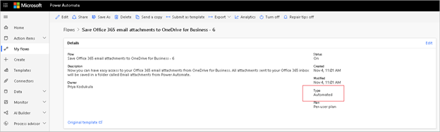

# Frequently asked questions about Power Automate licensing

1. What Power Automate capabilities are included in Office licenses

Limited Power Automate use rights are included with select Microsoft 365 licenses to allow users to customize and extend Microsoft 365 for personal productivity scenarios. For enterprise scenarios, we recommend buying [standalone licenses](./types.md#standalone-plans).

Microsoft 365 licenses include the following Power Automate capabilities:

1. Create and execute Automated/Scheduled/Button flows
2. Access to [standard connectors](./types.md#standard-connectors)
3. 2K Power [platform requests/day](./types.md#power-platform-requests) (10K requests/day during [transition period](./types.md#transition-period))

The following Power Automate capabilities are not included.

1. Access to [premium connectors](./types.md#premium-connectors) is not included except in Dataverse for Teams environments. Learn more about Dataverse for Teams capabilities [here](/power-platform/admin/pricing-billing-skus#dataverse-capabilities-with-microsoft-365-licenses)
2. [Business Process Flows](./types.md#business-process-flow)
3. [Custom connectors](./types.md#custom-connectors)
4. [On premises gateways](./types.md#on-premises-gateway)
5. [Robotic process automation](./types.md#robotic-process-automation)
6. [AI builder capacity](./types.md#ai-builder-credits)

The following Office licenses include Power Automate capabilities.

- Microsoft 365 E1
- Microsoft 365 E3
- Microsoft 365 E5
- Microsoft 365 F3
- Microsoft 365 Business Basic
- Microsoft 365 Business Standard
- Microsoft 365 Business Premium
- Microsoft 365 F1
- Microsoft 365 F3,
- Microsoft 365 E3,
- Microsoft 365 E5
- Windows 10 Pro
- Windows Enterprise E3
- Windows Enterprise E5
- Microsoft 365 A1 for Faculty
- Microsoft 365 A1 for Students
- Microsoft 365 A1 Plus for Faculty
- Microsoft 365 A1 Plus for Students
- Microsoft 365 A3 for Faculty
- Microsoft 365 A3 for Students,
- Microsoft 365 A3 for Student Use Benefit
- Microsoft 365 A5 for Faculty
- Microsoft 365 A5 for Students
- Microsoft 365 A5 for Student Use Benefit

### What Power Automate capabilities are included in Dynamics licenses

Dynamics licenses will include following Power Automate capabilities.

1. Create and execute Automated/Scheduled/Button flows
2. Access to [standard connectors](./types.md#standard-connectors)
3. Access to [premium connectors](./types.md#premium-connectors) within app context
4. [Business Process Flows](./types.md#business-process-flow)[within app context](#inappcontext)
5. [Custom connectors](./types.md#custom-connectors)[within app context](#inappcontext)
6. [On premises gateways](./types.md#on-premises-gateway)[within app context](#inappcontext)
7. [Power platform request](./types.md#power-platform-requests) limits: Dynamics Team member gets 5K requests/day (25K requests/day during [transition period](./types.md#transition-period)), Dynamics professional gets 10K requests/day (100K requests/day during [transition period](./types.md#transition-period)) and Dynamics Enterprise gets 20K requests/day (100K requests/day during [transition period](./types.md#transition-period)).

The following Power Automate capabilities are not included.

1. [Robotic process automation](./types.md#robotic-process-automation)
2. [AI builder capacity](./types.md#ai-builder-credits)

However, flows will need to run within the context of the Dynamics application, which refers to using the same data sources for triggers or actions as the Dynamics application. Consuming standalone Power Automate flows unrelated to the Dynamics application(s) will require purchase of a standalone Power Automate license.

Example of Power Automate use within Dynamics application context.

Your company connected Azure DevOps with Dynamics CRM to escalate support cases and create work items to get problems resolved faster.As part of Dynamics license, Power Automate rights are included for flows that:

• Read from OR write to Azure DevOps

• Use a built-in Dataverse trigger and/or action

Example of Power Automate use outside of Dynamics application context:

The same user (in the example above) now also wants to use a flow that updates an Oracle database, and:

• Is completely unrelated to the Dynamics app

• Does not interact in any way with the Dynamics app (or its data sources) This user will then require a standalone Power Automate license.

The following Dynamics licenses include Power Automate capabilities.

Dynamics 365 Sales Enterprise, Dynamics 365 Sales Professional, Dynamics 365 Customer Service Enterprise, Dynamics 365 Customer Service Professional, Dynamics 365 Field Service, Dynamics 365 Project Operations, Dynamics 365 Team Members, Dynamics 365 Finance, Dynamics 365 Supply Chain Management, Dynamics 365 Commerce, Dynamics 365 Human Resources, Dynamics 365 Operations – Activity, Dynamics 365 Business Central, Dynamics 365 Business Central Team Members

### What Power Automate capabilities are included in Power Apps licenses?

Power Apps licenses will include following Power Automate capabilities.

1. Create and execute Automated/Scheduled/Button flows
2. Access to [standard connectors](./types.md#standard-connectors)
3. Access to [premium connectors](./types.md#premium-connectors) within app context
4. [Business Process Flows](./types.md#business-process-flow) within app context
5. [Custom connectors](./types.md#custom-connectors) within app context
6. [On premises gateways](./types.md#on-premises-gateway) within app context
7. Power platform request limits: Power Apps per user gets 5K requests/day (25K requests/day during [transition period](./types.md#transition-period)) and Power Apps per App gets 1K requests/day (10K requests/day during [transition period](./types.md#transition-period)).
8. Power Apps per user gets 250MB Dataverse database capacity and 2GB Dataverse file capacity. Power Apps per App gets 50MB Dataverse database capacity and 400MB Dataverse file capacity. Flows invoked by Power Apps that handle complex objects will consume this storage limit. For example, a flow parses a 100-page document and make updates to it. The storage needed to retain the document in run history for future troubleshooting will be consumed from this limit.

The following Power Automate capabilities are not included.

1. [Robotic process automation](./types.md#robotic-process-automation)
2. [AI builder capacity](./types.md#ai-builder-credits)

However, flows will need to run within the context of the Power Apps application, which refers to using the same data sources for triggers or actions as the Power Apps application. Consuming standalone Power Automate flows unrelated to the Power Apps application(s) will require purchase of a standalone Power Automate license.

Example of Power Automate use within Power Apps application context:

User with a standalone Power Apps license runs an app that uses SQL DB as the data source and includes flows that:

• Read from OR write to SQL DB

• Use a built-in Power Apps trigger and/or action – e.g., Send a push notification to the app

Example of Power Automate use outside of Power Apps application context:

The same user (in the example above) now also wants to use a flow that updates an Oracle database, and:

• Is completely unrelated to the Power Apps app

• Does not interact in any way with the Power Apps app (or its data sources) This user will then require a standalone Power Automate license.

1. Who needs to purchase a premium license?

Per flow has the highest priority among all licenses. If a flow has per flow license, the owner's/user's license is ignored. If the flow doesn't have a per flow license, the manner of how a Flow is TRIGGERED makes the decision.

  1. Automated and scheduled flows always run in the context of the flow owner regardless of who started the process or what accounts are used for connections inside of the process. Instant flows (button, power apps, hybrid triggers) run in the context of invoking user irrespective of connections used in the flow.
  2. If an automated/scheduled flow uses a premium connector, only the owner needs to have a premium license. If that user shared their flow with another user and that user triggered the same flow, it would still run in the context of original owner so other users do not need a premium license. But if the user then leveraged it to make their own new flow, then that new user will become the owner of the second flow and would require a license to run it.
  3. If an instant flow has premium connector, every user that is invoking the flow will need a Power Automate premium license/Power App premium license/Dynamics license. In such cases, instead of licensing every user, it is easier to license the flow with a per flow license. One exception for this rule is http trigger which runs in the context of owner despite being an instant flow.
  4. If a parent flow calls a child flow, child flow will draw context from parent flow. For example, if the parent flow is an automated flow, and the child flow uses premium connector and the child flow doesn't have per flow license, it will use the parent flow owner's license. If the child flow has a per flow license, flow will use the per flow license and not the parent flow's license. During [transition period](./types.md#transition-period), there is a slight difference in this behavior. Child flow owner's license will be used unless the child flow has a per flow license but once the transition period ends, child flow owner's license will be ignored and only parent flow owner's license will be used unless child flow has a per flow license.

A common question is, "If a Flow is triggered when a SharePoint List item is updated and many users interact with that list, will there be a cost for all the users?" The answer is if the flow does not use a premium connector such as calling Dataverse in the full production environment (not the team's environment), having an Office license is enough. If the flow uses premium connectors, since the trigger is automated trigger, only the owner needs premium license.

To know the flow type (automated/manual/scheduled), select a flow to see 'Type' in the details.

### How do Power Automate license plans work?

Each user and flow have a license plan. If the flow is set to the per-flow plan, then it has the highest entitlements. If a flow has per flow license, owner's/invoking user's license is ignored. If the flow is set to the per-user plan, then it will get the plan of its primary owner. If a user has multiple plans, such as a Microsoft 365 plan and a Dynamics 365 plan, the flow will use the entitlements from both the plans. The standard user license plan for Power Automate is the Power Automate per-user plan, but there is a range of another license plans a user could be utilizing. Users running the free or Microsoft 365 license plans will only be able to access standard connectors, but most of the other license plans provide access to premium connectors. For details about license plans that include Power Automate capabilities, see the Power Platform [Licensing Guide](https://go.microsoft.com/fwlink/?linkid=2085130). For details about the limits and performance profile of license plans, see the [Power Automate Limits](/power-automate/limits-and-config).

### When should I choose Power Automate "per flow" versus "per user"?

The per user plan is intended to support the broad adoption of an automation culture in an organization.

The per flow plan provides an organization with the flexibility to license by the number of flows, instead of licensing each user accessing the flows individually with the per user plan. Larger organizations or solutions that affect many will benefit from the fixed monthly cost versus a comparable per use cost in a pure Azure function. For example, your flow uses premium connectors and your organization has many guest users. You want them to use the flow but you don't know if their home tenant provides them with premium licenses always. In that case, it is best to get a per flow license for the flow. If a flow has per flow license, owner's/invoking user's license is ignored.

1. We have 3 environments (dev, test, prod) to align with best practices and need Flows and in several environments. Do we need to buy Per flow license for every environment?

Flow is tied to an environment. So, if the same flow is imported in a different environment, it is treated as a separate flow and needs a separate per flow license.

1. We have 3 environments (dev, test, prod) to align with best practices and need Flows and in several environments. Do we need to buy Per user license for every environment?

Per user is a user level license. All user level licenses (Per user, Office, Dynamics) are tenant level licenses. The user can use the flow in all environments without having to buy a separate license.

1. When 5 flows are purchased as part of per flow pack, do I have to assign them all to same environment?

These licenses can be assigned to different environments.

1. Can Office customers create solution flows and child flows?

Yes. Office customers can create solution flows if the environment has a Dataverse environment attached to it. Default environments gets a Dataverse instance by default. Non default environments need the admin to attach a Dataverse instance. Admins need at least 1GB tenant level Dataverse database capacity available to be able to create a new environment.

The first subscription of Power Apps OR Power Automate OR Power Virtual Agents OR Dynamics 365 Sales, Customer Service, and Field Service provides adds a one-time default capacity entitlement of 10GB for the tenant. When additional subscriptions are added to the tenant, additional Dataverse capacity may accrue to the tenant. For example, if a new customer purchases "Power Automate per user plan", the tenant will receive 10GB of default Dataverse Database capacity. And if the tenant buys 10 Power Automate per user licenses, the tenant gets 10.5GB (10GB+10\*50MB)

1. I use multiple user connections in my premium flow. Which user needs a premium license to run the flow?

Connections are independent from license checks. You can have multiple user connections in a flow, but the flow always checks licenses of primary owner/run only user. Co-owner's license is not considered.

1. The owner of a flow left the company, and the flow doesn't have co-owners. How can we ensure it works without interruptions?

If the flow is a solution flow, you can change the owner using Power Automate Web API(Instructions [here](/power-automate/web-api#update-a-cloud-flow)) to ensure the flow works without interruptions. If the flow is a non-solution flow, you cannot change the owner, but any co-owners of the flow can export and import by a different owner. Check out the [video tutorial](https://www.youtube.com/watch?v=K7_xWJvEPUc).

1. The owner of the flow no longer has a premium license, but the flow is a premium flow. What happens?

The flow will be downgraded to lower performance and all flow owners will be notified and the flow will be turned off in 30 days if no action was taken.

### Can I assign licenses to guest users?

Yes. If you want to give access to external users (not from your tenant), you can assign them admin trials for temporary access or standalone licenses.

### What Power Automate capabilities are included in Windows license?

Windows 11 users can try desktop flows in attended RPA for personal productivity in default environment. They can't share the desktop flows or create desktop flows in a different environment other than default environment. Windows users do not have access to cloud flows. To get full cloud flows and RPA features, purchase Power Automate per user with Attended RPA plan.

Windows 11 users can just search for "Power Automate" and the first invocation of that icon will download it from the Microsoft Store automatically and launch it.

### Can Windows 10, Windows server 2016 users use PAD?

Yes, they can use PAD (ie. they have usage rights for it) but they'll have to download it from the Download Center.

## Multiplexing guidance

### What is multiplexing, and is it recommended to use multiplexing to reduce the number of licenses?

Multiplexing refers to the use of hardware or software that a customer uses to pool connections, reroute information, or reduce the number of users that directly access or use the Power Apps, Power Automate, and Power Virtual Agents service. Using multiplexing as a mechanism to reduce the number of licenses to be purchased is a license violation. For more details, please refer multiplexing guidance from [Client Access License (CAL) Requirements](http://download.microsoft.com/download/8/7/3/8733d036-92b0-4cb8-8912-3b6ab966b8b2/multiplexing.pdf)

### I have a Power App invoked by multiple users and the app in turn calls a flow with premium features. Can I buy a Per flow plan for the flow and enable all users to get premium value?

You can either license all users with premium license or license the flow with a per flow license.

### I have a flow that is used by my team but runs on a per user license. Is that okay?

It is okay, since you have a per user license, all your flows will be drawing capacity from your API limits(5K). If more and more users start using the flow and you reach limits, all your flows will slow down. If a flow is throttled for 14 consecutive days, it will be turned off.

### **Approvals/Send email with options** - Maker has a premium flow that sends an approval to a set of users and waits for the users to Approve/Reject, and continue execution based on the user's response. Today, flow only looks for owner's license and doesn't look for approver's license. Do the approvers need a premium license?

Approval is a standard connector. Users responding to approvals in a flow are not considered invoking users. Their Office license is enough and they do not need a premium license.

### **Automated flow** - User builds a flow that triggers when an item is added to a SharePoint list and updates a SQL db(Premium). Multiple people can add items to the SharePoint list.

Flow runs in the context of owner's license for Automated/Scheduled flows and invoking user's license for Instant/Power Apps/Dataverse triggered flows. So, the person who added the item to SharePoint list do not need a premium license.

### **Instant flow with run only users** - Maker has an Instant flow with premium connectors. Maker shares that flow with his team and allows them to run that flow.

Everyone who invokes the flow need a premium license because it is an instant flow.

### **Child flows** – A child flow has premium connectors and is invoked by multiple parent flows who do not have premium connectors. Do all parent flows need to be licensed, or is licensing the child flow enough?

You can either license the parent flow or license the child flow with a per flow license.

However, if the parent flow also has a premium connector, the parent flow/owner will need premium license.

### **Automated flow with data verse trigger** – Dataverse triggers allows flows to use invoker user's connection. Since it is an automated flow, flow only looks for creator/owner's license

### **My flow is shared with multiple users who view and edit the flows**. Do Co-owners need premium license to edit the flows?

Co-owners do not need a premium license as the flow only runs in the context of creator or owner/run only user.

### A premium flow consolidates Azure dev ops items, generates a report, and sends an email to the entire organization. The users of the organization get value from the flow but do not interact with the flow directly.

As the users are not invoking the flow, they do not need any license(neither premium nor seeded).

[!INCLUDE[footer-include](../../includes/footer-banner.md)]