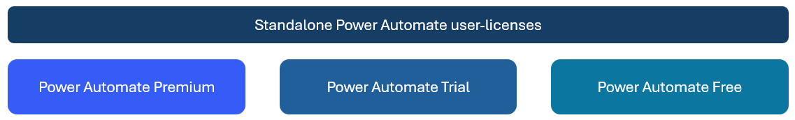
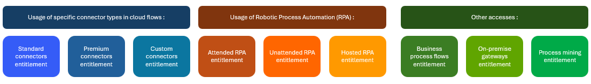

# Types of Power Automate licenses

Rights to use [Power Automate capabilities](#license-entitlements) (standard connectors, premium connectors, attended RPA, etc.) are obtained via licenses. Those licenses are available either as :
- standalone licenses tied to the Power Automate product (divided in 2 categories : user-licenses and capacity-licenses).
- seeded licenses (user-licenses only) inherited by licenses tied to other Microsoft products, they offer limited capabilities on Power Automate.

> [!NOTE]
>
> - A user-license is user-centric : it is assigned to a user and it entitles this user to access [specific capabilities](#license-entitlements)
> - A capacity-license is object-centric : it is consumed by a Power Automate object (cloud flow, machine, hosted machine, hosted machine group) and it provides this object specific autonomous entitlements (regardless of the user-licenses owned by makers interacting with the object)
> - As alternative to licenses, an organization can enable its environments to use the [Pay-as-you-go model](/power-platform/admin/pay-as-you-go-overview) and get started building flows without any license requirement or upfront costs. 

## Standalone licenses

You can purchase the standalone licenses on [Power Automate Pricing](https://flow.microsoft.com/pricing/) page.

### Standalone user-licenses

Users who need to create general-purpose automations (with the [premium connectors entitlement](#premium-connectors)), to have full flexibility (with the [custom connectors entitlement](#custom-connectors)) or to interact with applications mimicking mouse movement of a human user (with the [Robotic Process Automation attended entitlement](#robotic-process-automation)) should consider a Power Automate Premium license.

Here-after the list of standalone Power Automate user-licenses:

|License name ____________________________|License type ___________________|Entitlements ____________________________________________________________________________________________|
-------|------|------
Power Automate Premium|User license|This license allows users to create and run unlimited cloud flows (within [PPR limits](#power-platform-requests)) for API-based automation (with standard, premium and custom connectors) and to automate their legacy applications mimicking mouse movement of a human user (with desktop flows through [Robotic process automation (RPA)](#robotic-process-automation)). More precisely on the RPA side, this license includes the ability for users to register their workstation, to create unlimited desktop flows and to execute their desktop flows in attended mode on their registered machine.   Additionally, this license also includes full access to [process mining](#process-mining) functionalities and provisioning of [AI Builder credits](#ai-builder-credits) which support AI consuming scenarios like forms processing, object detection, prediction, text classification, and recognition.
Power Automate Free|User license (free)|This license provides basic access to Power Automate allowing users to create and run unlimited cloud flows (within [PPR limits](#power-platform-requests)) restricted to standard connectors only.
Power Automate Trial|User license  (90 days trial) &nbsp; &nbsp; &nbsp; &nbsp; &nbsp;|This self-assisted trial license provides a user with the same capabilities as a Power Automate Premium license (except for AI builder credits) and with the additional capability to execute their desktop flows in unattended mode on their registered machine (without unattended bot requirement).
Power Automate Per-user plan &nbsp; &nbsp; &nbsp; &nbsp; &nbsp;|User license (legacy)|This license has been replaced by the Power Automate Premium license (providing more entitlements for the same price). It is no longer available for purchase from the pricing page but organizations can still purchase it via deal desk.
P1 and P2 plans|User license (legacy)|These grandfathered licenses are no longer available for purchase nor via auto-renewal after December 31, 2020.

> [!IMPORTANT]
> __To organizations with active Power Automate P1 and P2 plans__ :
> 
> Organizations with these licenses with renewals that are due on or after January 1, 2021 need to transition to the Power Automate Premium user-license or to the Power Apps Premium user-license to continue using the Microsoft Power Platform services. Organizations with active contracts that started before January 1, 2021 with grandfathered licenses will continue to be supported until the contract end date. Starting October 1, 2024, these plans will no longer be usable. Contact your Microsoft account representative for more information or purchase the replacing licenses.

### Standalone capacity-licenses

As an alternative to user-licenses, organizations can upgrade their automation scenarios with capacity licenses which are consumed by Power Automate objects (cloud flows, machines, hosted machines, hosted machine groups) and entitles these objects to be licensed autonomously (regardless of user-license owned by makers interacting with those objects). 

|License name __________________________|License type _______________|Consumer object ___________________________|Entitlements ___________________________________________________________________|
------|------|------|------
Power Automate Process|Capacity|- Cloud flow  - Standard machine|Allocated to a cloud flow, a Power Automate Process license entitles it to use standard, premium and custom connectors while being accessed by unlimited users (regardless of their user-license) within the organization. Each Process license allocated to a cloud flow entitles it to 250k daily [Power Platform Request](#power-platform-requests) (stackable limit).   Allocated to a machine, it becomes an unattended bot : each unattended bot on a machine entitles the machine to carry one unattended desktop flow run at a time.
Power Automate Hosted Process|Capacity|- Cloud flow  - Standard machine  - Hosted machine  - Hosted machine group|The Power Automate Hosted Process is a superset of the Power Automate process : allocated to a cloud flow or to a machine it provides it the same entitlements (as the Process license) but it can also serve the alternative scenario of supporting a Microsoft hosted machine bot that can be used for a hosted machine or a hosted machine group, enabling RPA with zero infrastructure.
Power Automate Per-flow plan|Capacity (legacy)|- Cloud flow|This license has been replaced by the Power Automate Process license. It is no longer available for purchase from pricing page but customers can still purchase it via deal desk.

> [!IMPORTANT]
> Capacity licenses can't replace all user licenses within an environment as some essential capabilities are only available to licensed users :
> - Allocation of a Process license on a machine (to enable unattended mode) still requires the machine to have been registered by a Power Automate Premium user.
> - Multiple monitoring pages in the Power Automate portal are displayed only to Power Automate Premium users (workqueue page, machine list page, desktop flow list page, etc.).

## Compare standalone Power Automate licenses

Here-bellow a table detailing each license [entitlement](#license-entitlements):

||Premium license ____________________________|Process license ____________________________|Hosted Process license ____________________________|
|----------|-------|---------------------|--------------|
|__Applied to__|User|- Cloud flow  - Machine|- Cloud flow  - Machine  - Hosted machine  - Hosted machine group|
|__Daily PPR limit  1__|40k per user|250k per Process license 2|250k per Hosted Process license 2|
|__Standard connectors__|Included|Included|Included|
|__Premium connectors__|Included|Included|Included|
|__Custom connectors__|Included|Included|Included|
|__Attended RPA__|Included|Not included|Not included|
|__Unattended RPA__|Not included|One unattended bot included|One unattended bot included 3|
|__Hosted RPA__|Not included|Not included|One hosted bot included 3|
|__Business process flows__|Included|Included|Included|
|__On-premises gateways__|Included|Included|Included|
|__Process mining__|Included|Not included|Not included|
|__Process mining data storage__|50 MB per license 4|Not included|Not included|
|__AI Builder credits__|5000|5000|5000|
|__Dataverse database storage__|250 MB per license|50 MB per license|Not included|
|__Dataverse file storage__|2 GB per license|200 MB per license|Not included|

_1 : The Power Platform Requests are subjected to higher limits during the transition period ([see details](#power-platform-requests))._  
_2 : When multiple units of Process / Hosted Process licenses are allocated the a cloud flow, their PPR limits are stacked._  
_3 : The Hosted Process license provides an unattended bot when allocated to a standard machine __OR__ a hosted bot when used by a hosted machine (which can be a standalone hosted machine or be part of a hosted machine group)._ 
_4 : Up to 100 GB per tenant._

## License entitlements

Licenses have entitlements and each entitlement gives access to a specific Power Automate capability. Here-bellow the list of entitlements that licenses can provide:

### Entitlements to usage of connector types in cloud flows

A [connector](/connectors/overview) represents the underlying service (such as OneDrive, SharePoint, Salesforce, etc.) with which a cloud flow can interact. It provides a way for a user to connect its cloud flow to a third-party account (such as a Salesforce account) and leverage a set of prebuilt actions and triggers.

|Entitlement to ____________________________|Entitlement description ________________________________________________________________________________________________________________|
|----------|-------|
|Standard connectors|The [standard connectors](/connectors/connector-reference/connector-reference-standard-connectors) entitlement is needed to add a standard connector to a cloud flow and trigger it. It is included in all [seeded plans](#seeded-plans) and all [standalone plans](#standalone-plans). We're continuously adding more standard connectors.|
|Premium connectors|The [premium connectors](/connectors/connector-reference/connector-reference-standard-connectors) entitlement is needed to add a premium connector to a cloud flow and trigger it. It is included in the Power Automate Premium user-license, the Power Automate Process capacity-license and the Power Automate Hosted Process capacity-license. It can also be included in some [seeded plans](#seeded-plans) when the cloud flow is in context of an app (details in [Compare Power Automate plans](#compare-power-automate-plans)).|
|Custom connectors|The [custom connectors](/connectors/custom-connectors) entitlement is needed to create a connector with its own triggers and actions when an app / a service does't have a prebuilt connector. It is included in the Power Automate Premium user-license, the Power Automate Process capacity-license and the Power Automate Hosted Process capacity-license. It can also be included in some [seeded plans](#seeded-plans) when the cloud flow is in context of an app (details in [Compare Power Automate plans](#compare-power-automate-plans)).|

### Entitlements to usage of Robotic process automation (RPA)

[Robotic process automation (RPA)](/power-automate/desktop-flows/introduction) is needed to interact with applications which are lacking a prebuilt connector and which don't have APIs that could be leverage to build a custom connector. With RPA, you automate applications by teaching Power Automate for Desktop to mimic the mouse movements and keyboard entries of a human user, as if a robot was using the computer.

|Entitlement to ____________________________|Entitlement description ________________________________________________________________________________________________________________|
|----------|-------|
|Attended RPA|The attended RPA entitlement is needed to register a machine, access RPA management portal pages, add premium RPA actions to a desktop flow and trigger a desktop flow in attended mode (attended mode refers to a desktop flow execution with human supervision). This entitlement is also needed to create any desktop flow in non-default environments. It is included in the Power Automate Premium user-license.|
|Unattended RPA|The unattended RPA entitlement is needed to trigger a desktop flow in unattended mode on a standard machine (unattended mode refers to a desktop flow execution without human supervision). It is included in the Power Automate Process capacity-license and the Power Automate Hosted Process capacity-license.|
|Hosted RPA|The hosted RPA entitlement is needed to create an hosted machine or an hosted machine group. It is included in the Power Automate Hosted Process capacity-license.|

### Entitlements to other Power Automate capabilities

|Entitlement to ____________________________|Entitlement description ________________________________________________________________________________________________________________|
|----------|-------|
|Business process flows|The [business process flows](/power-automate/business-process-flows-overview) entitlement is needed to create a business process flow. Business process flows provide a guide for people to get work done they offer a streamlined user experience that leads people through the processes their organization has defined. It is included in the Power Automate Premium user-license, the Power Automate Process capacity-license and the Power Automate Hosted Process capacity-license. It can also be included in some [seeded plans](#seeded-plans) when the cloud flow is in context of an app (details in [Compare Power Automate plans](#compare-power-automate-plans)).|
|On premises gateway|The [on-premises data gateway](/power-automate/gateway-reference) entitlement is needed to create and use an on-premise data gateway. It acts as a bridge to provide quick and secure data transfer between on-premises data and several Microsoft cloud services. With gateways, organizations can keep databases and other data sources on-premises and securely use that on-premises data in cloud services. It is included in the Power Automate Premium user-license, the Power Automate Process capacity-license and the Power Automate Hosted Process capacity-license. It can also be included in some [seeded plans](#seeded-plans) when the cloud flow is in context of an app (details in [Compare Power Automate plans](#compare-power-automate-plans)).|
|Process mining|The process mining entitlement is needed to use the process mining and task mining capabilities of Power Automate. It is included in the Power Automate Premium user-license.|

### Additional entitlements : credits and storage

|Entitlement to ____________________________|Entitlement description ________________________________________________________________________________________________________________|
|----------|-------|
|AI Builder credits|With [AI builder](/power-automate/use-ai-builder), you to add intelligence to your automated processes, predict outcomes, and help improve business performance. AI Builder capacity is expressed in the form of "service credits". Service credits serve as the single (common) currency across all the scenarios that AI Builder supports. Available service credits are deducted when AI Builder services are used. For instance, you could use these credits to extract data from a few documents with _form processing_ or perform hundreds of basic OCR extractions with _text recognition_ Different scenarios (for example, forms processing, prediction, etc.) consume service credits at different rates. Each Power Automate Premium license grants you 5,000 credits, allowing you to assess the capabilities in AI Builder. Learn more about [AI builder licensing](/power-platform/admin/powerapps-flow-licensing-faq)..|
|Dataverse database and file storage|Data volume continues to grow exponentially as businesses advance their digital transformation journey and bring data together across their organizations. Modern business applications need to support new business scenarios, manage new data types, and help organizations with the increasing complexity of compliance mandates. To support the growing needs of today's organizations, data storage solutions need to evolve continuously and provide the right solution to support expanding business needs. Microsoft Dataverse capacity storage is optimized for relational data (database), attachments (file), and audit logs (log). Power Automate standalone license customers receive a tenant-wide default entitlement for each of these three storage types. You can buy more storage in 1-GB increments. Learn more about [Dataverse capacity storage](../capacity-storage.md).|
|Process mining data storage||

## Seeded licenses

Users gain limited rights to use Power Automate if they have inherited seeded plans from licenses tied to other Microsoft products:
- Microsoft 365 (formerly Office 365) / Dynamics 365 Enterprise / Dynamics 365 Professional / Dynamics 365 Team Member
- Power Apps Per-app plan / Power Apps Premium / Power Apps Plan 1 or Plan 2 (legacy)
- Windows licenses

Those plans entitles the user to create and run cloud flows with standard connectors. They can also entitle them to create and run a cloud flow with premium and custom connectors if the cloud flow is in-context and associated to the application from which the seeded plan is inherited. 

> [!NOTE]
> - Example 1: if a cloud flow uses [premium connectors](#premium-connectors), is owned by a user with a Power Apps Premium license, associated to a Power App and triggered by the app, any user can run the flow if they have a Power Apps license.
> - Example 2: a cloud flow created within a Dynamics 365/App using a Power Apps can connect to the following :
>   - To any data source within the use rights of the Dynamics 365/App created using Power Apps.
>   - Directly with the Dynamics 365/App created using Power Apps (via built-in triggers/actions).

If the cloud flow is isolated and has nothing to do with the application, then a standalone Power Automate Premium must be purchased. You can find more details can be found in [Microsoft Power Apps and Power Automate Licensing Guide](https://go.microsoft.com/fwlink/?linkid=2085130).

### Compare seeded licenses

Here-bellow a table detailing each seeded license [entitlement](#license-entitlements):

||Power Apps Premium _______________|Office  365 _______________|Dynamics 365 professional 1 _______________|Dynamics 365 Enterprise applications 2 ___________________________|Dynamics 365 Team member _______________|Windows licenses _______________|
|----------|-------|---------------------|--------------|--------------|--------------|--------------|
|__Applied to__|User|User|User|User|User|Machine|
|__Daily PPR limit__|40k per user|6k per user|40k per user|40k per user|6k per user|Not included|
|__Standard connectors__|Included|Included|Included|Included|Included|Not included|
|__Premium connectors__|Included with limitations 4|Not included|Included with limitations 5|Included with limitations 5|Included with limitations 5|Not included|
|__Custom connectors__|Included with limitations 4|Not included|Included with limitations 5|Included with limitations 5|Included with limitations 3,5|Not included|
|__Attended RPA__|Not included|Not included|Not included|Not included|Not included|Included with limitations6|
|__Unattended RPA__|Not included|Not included|Not included|Not included|Not included|Not included|
|__Hosted RPA__|Not included|Not included|Not included|Not included|Not included|Not included|
|__Business process flows__|Included with limitations 4|Not included|Included with limitations 5|Included with limitations 5|Included with limitations 5|Not included|
|__On-premises gateways__|Included with limitations 4|Not included|Included with limitations 5|Included with limitations 5|Included with limitations 5|Not included|
|__Process mining__|Not included|Not included|Not included|Not included|Not included|Not included|
|__Process mining data storage__|Not included|Not included|Not included|Not included|Not included|Not included|
|__AI Builder credits__|500|Not included|Not included|Not included|Not included|Not included|
|__Dataverse database storage__|250 MB per license|Not included|Not included|Not included|Not included|Not included|
|__Dataverse file storage__|2 GB per license|Not included|Not included|Not included|Not included|Not included|

_1 : Dynamics 365 Sales Professional and Dynamics 365 Customer Service Professional_  
_2 : Dynamics 365 Sales Enterprise, Dynamics 365 Customer Service Enterprise, Dynamics 365 Field Service, Dynamics 365 Project Service Automation, Dynamics 365 Retail, Dynamics 365 Talent, and Dynamics 365 Customer Engagement plan_  
_3 : In Dataverse for Teams environments (included in [specific Office licenses)](../powerapps-flow-licensing-faq.md#which-microsoft-365-subscriptions-include-dataverse-for-teams-and-microsoft-copilot-studio-capabilities-with-teams) users can use custom connectors built on Azure and Dataverse_  
_4 : Only included if cloud flow is in-context & associated to a Power App_  
_5 : Only included if cloud flow is in-context & associated to a Dynamic 365 app_  
_6 : Only includes local execution of desktop flow (no orchestration)_  

## Power Platform requests

To help ensure service levels, availability and quality, there are limits to the number of Power Platform requests users can make across all Power Platform products. Service limits are set against normal usage patterns in both five minute and per 24 hour intervals. Most customers don't exceed these limits.

- The 24 hour limit is based on the per user or per flow license. If a user has a Power Automate per user plan, they can make 40,000 Power Platform requests across all of their flows in a tenant within a 24 hour period. This includes requests the platform makes to third party connectors too. The 24 hours is a sliding window, meaning that anytime a flow runs, the system looks at the requests in the past 24 hours to determine if the user is at their limit. If a flow has the per flow plan, the flow can make 250,000 Power Platform requests across all users of the flow in a 24 hour period. If a flow has the process plan, the flow, its child flows, and its in-context flows can make 250,000 Power Platform requests together in a 24 hour period. To prevent a usage-heavy flow or user from impacting other users, this capacity is tracked based on consumption at an individual user or flow level and it can't be pooled at any other level like environment or tenant levels. For example, two users in a tenant may have per user licenses and each user gets 40,000 requests per 24 hour period. If the first person uses more than 40,000 requests 24 hour period, their flows will slow down and won't impact the second user who only used 20,000 requests and still has 20,000 requests remaining. Currently all customers are in [a transition period](/power-platform/admin/power-automate-licensing/types#transition-period) so the transition period limits apply. After the transition period ends, the actual limits are applicable. Plan your flows based on actual limits. 

- The five minute limit is 100,000 requests and it's independent of a user's license. For example, flows with a per flow license can make 250,000 requests in 24 hours but they can't make more than 100,000 requests within five minutes.

|License|Power platform actual limits per 24 hours|Power platform transition period limits per 24 hours|
|--------|--------|----------|
Power Automate Premium|40K/user | 200K/flow|
Power Automate process plan|250K/process | 500K/process|
Power Automate hosted process plan|250K/process | 500K/process|
Office 365|6K/user| 10K/flow|
Power Apps Premium|40K/user | 200K/flow|
Dynamics 365 professional|40K/user | 200K/flow|
Dynamics 365 Enterprise applications |40K/user | 200K/flow|
Dynamics 365 Team member|6K/user | 10K/flow|

> [!NOTE]
> The Power Automate process plan license can be stacked to increase the Power Platform requests limit only when allocated to a cloud flow.

## Transition period

All customers are in a transition period. That means that enforcement isn't strict and limits are higher. The transition period ends after [Power Platform admin center reports](/power-platform/admin/api-request-limits-allocations#view-detailed-power-platform-request-usage-information-in-the-power-platform-admin-center-preview) are generally available. Organizations have six months to analyze their usage and purchase licenses that are appropriate before strict enforcement on license limits begins.

Here are a few things of which to be aware during the transition period.

1. The transition period doesn't mean that there are no daily limits. It means that the currently enforced limits are more generous than the stated limits to prevent potential unintended impact on your apps or flows. See [Requests limits and allocations](../api-request-limits-allocations.md) to understand both plan limits and transition period limits. 

1. These transition period limits are applied at the flow level during the transition period. Additionally, a separate per user level limit of 1,000,000 actions is applied during the transition period to ensure users don't go above 1M actions across all their flow runs in a day. After the transition period ends, the actual limits will be applied at user level for per user plans and flow level for per flow plans.

1. During the transition period, manual flows don't use the flow owners/flow invokers limits. Every manual flow has a performance profile of Medium (100,000 requests/flow/24 hours). After the transition period, manual flows will use the request limits of invoking user.

1. Since the limits are more generous during the transition period, [stacking of user licenses isn't supported](../api-request-limits-allocations.md). If a user has multiple plans, such as a Microsoft 365 plan and a Dynamics 365 plan, the flow uses the higher plan (Dynamics 365 plan).

1. Power Platform requests capacity add-on packs aren't assignable to users or flows during the transition period. However, Microsoft recommends that you purchase these add-ons to remain within your license terms and to be prepared for when the transition period ends. If your flows are currently being throttled, purchase add-ons and create a support ticket with the flow details and add-on details so that the support team can provide exceptions for your throttled flows.

1. Seeded license users can only use flows within the context of the app. See [the seeded plans](#seeded-plans) section to learn more. The enforcement on license limits is less strict during transition period and Microsoft recommends that you remain within your license terms to avoid any disruptions when the transition period ends.

## Power Platform requests FAQs

Here are some of the frequently asked questions about limits, and their answers.

#### What counts as Power Platform request?

Based on license plan, there are limits to the number of actions a cloud flow can run in day. These limits are different from connector throttling limits. You can see the number of actions your flow runs by selecting **Analytics** from the flow details page and looking at the **Actions** tab.

Even when the flow uses fewer Power Platform requests, you can still reach your limits if the flow runs more frequently than you expect. For example, you might create a cloud flow that sends you a push notification whenever your manager sends you an email. That flow must run every time you get an email (from anyone) because the flow must check whether the email came from your manager. The limit applies to all runs across all your flows in a 24 hour period. Here are some guidelines to estimate the request usage of a flow.

- One or more actions run as part of a flow run. A simple flow with one trigger and one action results in two "actions" each time the flow runs, consuming two requests.

- Every trigger/action in the flow generates Power Platform requests. All kinds of actions like connector actions, HTTP actions, built-in actions (from initializing variables, creating scopes to a simple compose action) generate Power Platform requests. For example, a flow that connects SharePoint, Exchange, Twitter, and Dataverse, all those actions are counted towards Power Platform request limits.

- Both succeeded and failed actions count towards these limits. Skipped actions aren't counted towards these limits.

- Each action generates one request. If the action is in an apply to each loop, it generates more Power Platform requests as the loop executes.

- An action can have multiple expressions but it's counted as one API request.

- Retries and extra requests from pagination count as action executions as well.

Consider the following flow where every email attachment is saved to OneDrive. The trigger consumes one Power Platform request, Apply to each consumes one request, and the actions within Apply to each consume multiple requests based on the number of times the loop runs. If there are four attachments, this section consumes eight Power Platform requests (4 x 2 actions). In total, this flow consumes 10 Power Platform requests.

:::image type="content" source="../media/power-automate-licensing/sample-flow.png" alt-text="Screenshot of a sample flow.":::

#### Whose Power Platform request limits are used by the flow?

- If a flow has per flow license, the flow uses the per flow limits and not the creator/owner/invoking user's limits.

- [Automated and scheduled flows](/power-automate/flow-types#cloud-flows) always use the flow creator/owner's Power Platform request limits regardless of who started the process or what accounts are used for connections inside of the process. For a solution flow, you can change the owner of the flow using [Web API](/power-automate/web-api#update-a-cloud-flow). After you change the owner, the new owner's API request limits are used. For a non-solution flow, the flow always uses the original creator's limits which can't be changed. If the original creator leaves the company, any co-owners of the flow can export and import the flow as a different owner. After you import the flow, it becomes a new flow and starts using limits from the new owner. Alternatively, you can assign a per flow license to the flow.

- [Instant flows (button, power apps, hybrid triggers)](/power-automate/flow-types#cloud-flows) use the invoking user's limits. 

- If the flow owner is a service principal, the flow uses [non licensed user limits](../api-request-limits-allocations.md).

- If you share an automated/scheduled flow with another user and then that user triggers the same flow, it uses the limits of the original owner and not the new user's limits. But if the user then leverages the flow to make their own new flow, then that new user becomes the owner of the new flow and that flow uses the new user's limits.

- If a parent flow calls a child flow, the child flow uses the parent flow's limits. For example, if the parent flow is an automated flow, the child flow uses the parent flow creator/owner's limits.

- If the parent flow is a manual flow, the child flow uses the limits of the parent flow's invoking user.

- If the child flow has a per flow license or a per process license, it uses the per flow or per process limits and not the parent flow's limits.

- If a parent flow has a per flow license, the parent flow and all child flows use the per flow license limits.

- If a flow has a process license, the flow, all child flows (excluding those that have their own per flow or per process license) of the flow and any associated flows of the flow share the process license limits.

#### As a maker, what tools do I have to analyze my usage?

If you're experiencing delays or slowdowns when your flow runs, it's likely that you exceeded the Power Automate limits for the day. For flows that are consistently delayed due to overages, users also receive a notification that informs them about these overages, along with tips and tricks on how to prevent delayed runs of their flows.

Here's an example of an email that was sent for a flow that was consistently exceeding action limits.

The Power Platform admin center contains [reports on Power Automate requests](../api-request-limits-allocations.md#view-detailed-power-platform-request-usage-information-in-the-power-platform-admin-center-preview). This reporting helps you to quickly view adoption and user metrics for your organization.

Additionally, you can see the action usage for a given flow by selecting the  **Analytics**  action from the flow properties page, and this works across all types of actions. This helps you to understand how many actions are running each day. It can help you understand usage patterns to optimize for capacity.

#### As an admin, what tools do I have to analyze my environment's usage?

The Power Platform admin center contains[reports on Power Automate requests](../api-request-limits-allocations.md#view-detailed-power-platform-request-usage-information-in-the-power-platform-admin-center-preview). These reports are currently in public preview. Admins have two reports available in the Power Platform admin center.
- [User report](../api-request-limits-allocations.md#licensed-user-report) – This report displays the Power Platform request usage by every user in the environment, compared to their assigned limits.
- [Per flow report](../api-request-limits-allocations.md#per-flow-report) - This report displays the Power Platform request usage by every flow in the environment that has a per flow license.

- [Non-licensed user report](../api-request-limits-allocations.md#non-licensed-user-report) - This report displays the Power Platform request usage for non-licensed users and the total entitlement for non-licensed users for that tenant. In future, power platform requests usage of flows running under service principal will be displayed in this report. 

After the reports are generally available, users will have time to react and purchase higher licenses before enforcement begins.

#### What happens when my flow runs too many actions?

When you have a flow that runs many actions, it impacts the performance of your flow. You see a banner on the flow if your flow is being throttled.

In the most common case, exceeding limits results in delayed runs of subsequent actions, and this will slow down the overall run time of your flow. These delays are proportional to the degree of overages caused by a flow.

Occasional overages are okay. For instance, if you exceed your daily limits by 500 actions it's not going to affect the performance of your flow, however exceeding your limit by 50,000 actions will have a significant performance impact on your flow potentially for multiple days.

#### What can I do if my flow is above limits?

Users aren't blocked from using an app or flow for occasional and reasonable overages.

Here are some things you can do if you exceeded the limits of your license.

- Revisit your design and check for any places that can help reduce the number of actions being called. Check out [Best Practices section to create flows to use less actions](https://support.microsoft.com/topic/troubleshooting-slow-running-flows-2a51dcd6-0b21-33da-5ce8-1e908b1540ef).

- If the flow is already optimized, but it uses many actions because of the nature of the business, consider buying a higher license. The per flow plan provides the best performance quota available (250K actions/24 hours/flow).

- Turn on [Pay-as-you-go](#power-platform-requests-pay-as-you-go) for the environment to ensure none of the flows in the environment are throttled. Microsoft recommends this approach during the transition period.

- Purchase the **Power Apps and Power Automate capacity add-on** for your organization. During the [transition period](#transition-period), because enforcement is less strict, there's no facility to assign the **Power Apps and Power Automate capacity add-on** to a user or flow. However, Microsoft recommends that you purchase these add-ons now to remain within your license terms. Create a support ticket with the flow details and add on details to get temporary relief (30 days) from throttling. This temporary relief isn't available for flows that already have a per flow license assigned to them.

If a flow is consistently above the transition period limits for 14 consecutive days, Power Automate turns off the flow and sends a notification to the owner. You can purchase a higher license, and then turn it on anytime. You can edit and save the flow to reset the 14 day counter while you purchase the license.  

#### What are connector limits and are they different from Power Platform request limits?

The connectors have separate limits as a service protection mechanism. For example, the SharePoint connector limits the number of actions at 600 per minute. A single SharePoint connection that's used across multiple flows can still only execute 600 operations per minute. Most connector pages have a [throttling section](/connectors/sharepointonline/#limits) that documents these limits. This limit is different from the request limits. For example, an Office user can run 6,000 actions per day across all their flows but can still get throttled by the connector if they used more than 600 SharePoint actions in a minute despite not reaching the 6,000 actions limit.

When a flow was throttled because it exceeded the connector limits, you might see an HTTP 429 (too many requests) error in your flow with error text like "Rate limit is exceeded. Try again in 27 seconds."

#### I'm using CoE Starter Kit. Will the usage count towards my request limits?

Yes. Flows included in the [CoE Starter Kit](../../guidance/coe/starter-kit.md) also use limits from the owner. Microsoft recommends that you turn on Pay-as-you go for the environment or buy more capacity and contact support to get temporary relief from throttling.

#### Can I use service principal in flows, and does it count against my request limits?

Yes, flows whose owner is a service principal consumes a separate quota called [non-interactive limits](../api-request-limits-allocations.md#non-licensed-user-request-limits). These limits are only applicable if the owner of the flow is a service principal. These limits aren't applicable if the flow just uses a service principal in one of the actions. Manual flows(button flows that are shared with run only users/Power Apps invoked flows) use run only user's request limits even when the owner of the flow is a service principal. The run only users must have a premium Power Automate license if the flow uses premium connectors. During the transition period, manual flows can use up to 100,000 requests/flow/24 hours.

Limits for automated/scheduled flows:

 - Service principal flows running [in context of Dynamics 365 applications](faqs.md#what-power-automate-capabilities-are-included-in-dynamics-365-licenses)) listed in the [table](../api-request-limits-allocations.md#non-licensed-user-request-limits) get 500,000 base requests  + 5,000 requests accrued per USL up to 10,000,000 maximum pooled at the tenant level. If a tenant has 1000 Dynamics 365 licenses, that tenant has a pool of 5,500,000 requests available for all Power platform resources like Service principal flows and Dataverse requests, per 24 hours. If a tenant has 2500 Dynamics 365 licenses, that tenant has a pool of 10,000,000 requests available for all Power platform resources like Service principal flows and Dataverse requests, per 24 hours.

- Premium service principal flows that are outside Dynamics 365 app context will each need a per flow license. These flows get 250,000 requests per flow per 24 hours.

- Standard service principal flows get 25,000 base requests with no per-license accrual for the tenant per 24 hours. 

If you need more requests, turn on [Pay-as-you-go](#power-platform-requests-pay-as-you-go) for the environment or buy more [power platform requests capacity](add-ons.md#power-automate-capacity-add-ons).

To learn more, go to [Associate flows to apps](/power-automate/associate-flow-to-app).

#### Will desktop flows usage count consume my Power Platform request limits?

Only the desktop flow actions that are invoked from cloud flows count against the limit. Actions in the desktop flow aren't counted towards request limits.

#### What happens to my Power Platform requests if I have multiple plans?

Since limits aren't strictly enforced during the transition period, [stacking of user licenses isn't supported](../api-request-limits-allocations.md). If a user has multiple plans, such as a Microsoft 365 plan and a Dynamics 365 plan, the flow uses the higher plan (Dynamics 365 plan, in this example).

After the transition period ends, if a user has multiple plans assigned from different product lines, the total number of requests allowed would be the sum of the requests allocated to each license type. For example, if a user has both a Dynamics 365 Customer Service Enterprise license and a Power Apps per user license, then that user has a total of 40000 + 40000 = 80000 requests available per 24 hour period.

If a user has multiple licenses allocated within the same product line, for example if a user has a Dynamics 365 Customer Service Enterprise license as the base license and a Dynamics 365 Sales Enterprise license attached, the total number of requests would be the amount that the base license provides.

#### What are performance profiles and how do I know which performance profile my flow uses?

| **Performance profile** | **Plans** |
| --- | --- |
| Low | Free Microsoft 365 plans Power Apps Plan 1, Power Apps Per App plans Power Automate Plan 1 All license trials Dynamics 365 Team Member |
| Medium |Power Apps triggered flows, Power Apps Plan 2, Power Apps per user plan Power Automate Plan 2, Power Automate per user, Power Automate Premium plans Dynamics 365 Enterprise plans, Dynamics 365 Professional plans,  Power Apps Plan 2, Power Apps per user plan|
| High | Power Automate per flow plan, Power Automate process plan, Power Automate hosted process plan|
| Unlimited |Pay-as-you-go plan |

Based on the license of the owner, a flow gets a performance profile, which in turn decides the Power Platform request limits of the flow. If there are multiple licenses assigned to the owner, Power Automate picks the highest plan from the list.

| Performance profile | Limits during [transition period](#transition-period) | Limits after [transition period](#transition-period) |
| --- | --- | --- |
| Low | 10,000 | 6000 |
| Medium | 100,000 | 40,000 |
| High | 500,000 | 250,000 |
| Unlimited | 15,000,000 | 15,000,000|

#### In an organization, eight users have Office 365 licenses and their daily Power Platform requests would be 6,000 requests per user, in each 24 hour period. Does that mean that it will be pooled to the tenant level with a limit of 48,000 requests in each 24 hour period (8X6000) and all users can consume from this pool?

No, Power Platform requests aren't pooled at the environment nor tenant level. This ensures that a heavy user doesn't consume all the Power Platform requests of the tenant and affect everyone else. Since the license is per user, the limit is per user too. So, all Office customers get 6,000 requests each, whether they use them or not.

### Best practices

#### Best practices for design

Use the fewest number of actions possible to achieve your automation.

- If you have 'Do until' or 'Apply to each' loops in your flow, see if you can reduce the number of loop iterations, possibly by retrieving fewer items to iterate through.

- Many connectors have 'Filter query' and 'Top count' parameters that you can use to reduce the number of items and the amount of data retrieved by using OData.

- If you have a scheduled flow that runs frequently, consider reducing the frequency. Many flows that run once per minute or once per hour could be revised to occur less often. Use trigger conditions to minimize the run frequency.

- If your flow is interacting with files, be conscious of the file size and try to reduce it if possible.

- If you need to reuse a single property returned by an action with large output size multiple times, consider using 'Initialize Variable' to store that property, and use the variable in later actions. Even if only one property is used from an output of an earlier action, all outputs of that action that will be passed into the later action as inputs.

#### Best practices to scale your flow

- If your flow runs thousands of actions daily, you should consider purchasing a Per Flow license to get better throughput and higher quotas. Per Flow plan provides the best performance quota available (250 K actions/day). Contact your tenant administrator to purchase the license and assign it to the flow. Once the license is purchased and assigned, the author of the flow should save it again. Alternatively, flows are updated in the background once per week to reflect current plans.

- Consider splitting the workload across multiple flows to achieve high scale.

## Power Platform requests pay-as-you-go

We revised the Power Platform request limits for all licenses in late 2021. The new limits are designed to be sufficient for most customer scenarios. For more information on Power Platform request limits, go to [Requests limits and allocations](../api-request-limits-allocations.md).

For customers with extremely high scale scenarios who need to exceed these limits you can link those environments to Azure subscription. By linking the environment, users and flows in the environment can consume more than their limits without being throttled and only pay for the Power Platform requests used above those limits. Flows still need to be licensed with a base license (either Power Automate per user, Power Automate per flow, Office 365, Power Apps, or Dynamics). For example, if you have Power Automate per user license, you have a limit of 40,000 Power Platform requests/per user/day. If the user used 45,000 requests a day, the extra 5,000 requests are multiplied by a $/request rate and billed to the Azure subscription. The total amount is summed and billed based on the customer’s Azure billing cycle. Multiple [meters](../pay-as-you-go-meters.md) are turned on when you turn on pay-as-you-go at the environment. Go to [How to set up Pay-as-you-go](../pay-as-you-go-set-up.md).

> [!NOTE]
> If you link an environment to an Azure subscription, this meter won't be reported or billed. Reporting and billing will be turned on by the end of calendar year 2021.

### FAQs about request limits

You can consult this [requests limits frequently asked questions](../api-request-limits-allocations.md#frequently-asked-questions) for more information about requests limits.

## Free plan

If you sign in with work or school email address, you get all [Power Automate capabilities included in Office 365](#power-platform-requests-faqs). If you have a non-business user account (such as an account that ends with @outlook.com or @gmail.com), you can still use Power Automate with the free plan. Go to [Power Automate](https://flow.microsoft.com/) and then select **Try free**.

> [!NOTE]
> You can't share flows when you use the free plan.

To know which users have the free plan, admins can go to the [Microsoft 365 admin portal](https://admin.microsoft.com/), sign in, select **Billing** > **Licenses** to see how many free licenses are assigned vs available.

Select **Assigned licenses** to see which users have free license.

## Power Apps Developer plan

There's a [free Power Apps Developer plan to learn about Power Platform](https://powerapps.microsoft.com/communityplan/). You aren't allowed to use it in production but can try out things and have access to all premium connectors. You can use this free developer plan also in a free [Microsoft 365 developer tenant](https://developer.microsoft.com/microsoft-365/dev-program). Business process flows and RPA flows can't be created in an environment with the Power Apps Developer plan.

## Trials

Power Automate trials are available for 90 days. There are two types of trials available for Power Automate.

### Admin managed trial

Global admins use the Microsoft 365 admin center to start these trials and assign them to users. These trials are for 30 days. Global admins can add a trial (subscription-based) environment to their tenant, or new organizations can sign up for a new tenant and become the global admin. For new organizations, an admin-managed subscription is created with a specific number of licenses (usually 25); admins control which other users get licenses assigned to them. An admin-managed subscription has an end date that can be extended once (another 30 days). Admins can get Power Automate Premium, Power Automate process, or the Power Automate Hosted Process trial.

Follow these steps to get started.

1. Sign in to [the Microsoft 365 admin center](https://admin.microsoft.com/).

1. Under the **Billing** section, select **Purchase services**.

1. Search for **Power Automate**, and then select a plan.

   

1. Select the details of a plan, and then select **Start free trial**.

   

1. You see a confirmation similar to this one.

   

After the free trial starts, go to **Billing** > **Licenses** to see the 25 new licenses available for you to assign to users.

> [!NOTE]
> Trials are different from free licenses. Once you start a trial, the SKU name might not say Trial.

### User trial

User trials are started by user from within Power Automate. For example, when user tries to create a desktop flow without a Power Automate Premium plan, the user is prompted to start a trial that includes usage of premium connectors, attended RPA, and unattended RPA. This trial lasts for 90 days.

### FAQ

Here are some of the frequently asked questions about trials.

#### How can I create an admin trial, check expiry and extend trials?

Check this document for instructions:

Follow these instructions to [create an admin trial, check expiry, and extend trials](../trial-environments.md#create-a-trial-subscription-based-environment-in-the-power-platform-admin-center).

#### How can admins allow or block trial licenses?

Admins can use PowerShell cmdlets to enable or disable trials. Once disabled, all existing plans of the specified type are removed from all users in the tenant. These aren't recoverable. Additionally, it blocks all further assignment of plans of that type. Admins can enable trials at any time.

[Learn how to create a trial (subscription-based) environment in the Power Platform admin center](../trial-environments.md#create-a-trial-subscription-based-environment-in-the-power-platform-admin-center).

#### How can I convert a trial environment to a production environment?

You can convert either type of trial environments to a production environment by switching it to consume from paid capacity, keeping it from being disabled and deleted. After it becomes a production environment, it follows the paid license lifecycle.

#### Do trials work in GCC and government clouds?

No, trials don't work in government clouds (GCC), and they can only purchase plans with volume discounting.

#### Can I see all trials using a PowerShell cmdlet?

Viral trials can't be blocked by PowerShell cmdlet.
