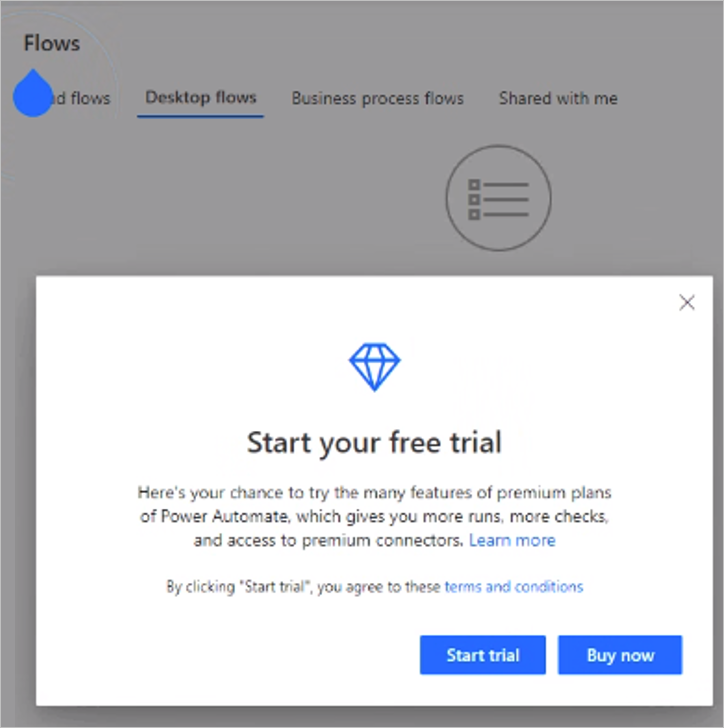
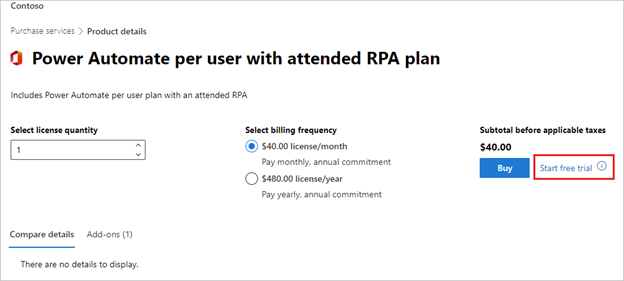

# Types of Power Automate licenses

Entitlements to use [Power Automate capabilities](#license-entitlements) (standard connectors, premium connectors, attended RPA, etc.) are obtained via licenses and add-ons. This article focusses on licenses (for details on add-ons, visit the [types of Power Automate add-ons](add-ons.md) page). 

The Power Automate licenses are categorized as follows:

|License type __________________|License scope __________________________________________________________|Description _______________________________________________________________|
|-------|------|------|
|User license| User-centric: a user license is assigned to a user.|It entitles the user to access [specific capabilities](#license-entitlements).|
|Capacity license| Object-centric: a capacity license is allocated to a Power Automate object (cloud flow, machine, hosted machine, hosted machine group).|It provides the object specific autonomous entitlements (regardless of the user licenses owned by makers interacting with the object).|

You can purchase those licenses on [Power Automate Pricing](https://flow.microsoft.com/pricing/) page or from your [Microsoft 365 Admin Center](https://admin.microsoft.com/) (only if you are a Power Platform admin). [Learn more](buy-licenses.md)

> [!NOTE]
> 
> As alternative to licenses, an organization can enable its environments to use the [Pay-as-you-go model](/power-platform/admin/pay-as-you-go-overview) and get started building flows without any license requirement or upfront costs. 

 

## User licenses

Users who need to create general-purpose automations (with the premium connectors entitlement), to have full flexibility (with the custom connectors entitlement) or to interact with applications mimicking mouse movement of a human user (with the Robotic Process Automation attended entitlement) should consider a Power Automate Premium license.

Here-after the list of available Power Automate user licenses: 

|License name ____________________________|License type ___________________|Entitlements ____________________________________________________________________________________________|
-------|------|------|
Power Automate Premium|User license|This license allows users to create, run and shared unlimited cloud flows (within [PPR limits](#power-platform-requests)) for API-based automation (with standard, premium and custom connectors) and to automate their legacy applications mimicking mouse movement of a human user (with desktop flows through Robotic process automation (RPA)). More precisely regarding the [premium RPA entitlements](/power-automate/desktop-flows/premium-features), this license includes the ability for users to register their workstation, to create unlimited desktop flows, and to execute their desktop flows in attended mode on their registered machine.   Additionally, this license also includes full access to process mining functionalities and the provisioning of AI Builder credits, which support AI consuming scenarios like form processing, object detection, text classification, etc.|
[Power Automate Free](#power-automate-free-license)|User license (free)|This license provides basic access to Power Automate allowing users to create and run (but not share) unlimited cloud flows (within [PPR limits](#power-platform-requests)) restricted to standard connectors only.|
[Power Automate Trial](#power-automate-trial-license)|User license  (90 days trial)|This self-assisted trial license provides a user with the same capabilities as a Power Automate Premium license (except for AI builder credits and storage capacities) and with the extra capability to execute their desktop flows in unattended mode on their registered machine (without unattended bot requirement).|
Power Automate Per-user plan|User license (legacy)|The Power Automate Premium license has replaced this license (it provides more entitlements for the same price). It's no longer available for purchase from the pricing page but organizations can still purchase it via deal desk.|
P1 and P2 plans|User license (legacy)|These grandfathered licenses are no longer available for purchase nor via autorenewal after December 31, 2020.|

> [!IMPORTANT]
> __To organizations with active Power Automate P1 and P2 plans__:
> 
> Organizations with these licenses with renewals that are due on or after January 1, 2021 need to transition to the Power Automate Premium user license or to the Power Apps Premium user license to continue using the Microsoft Power Platform services. Organizations with active contracts that started before January 1, 2021 with grandfathered licenses will continue to be supported until the contract end date. Starting __October 1, 2024__, these plans will no longer be usable. Contact your Microsoft account representative for more information or purchase the replacing licenses.

 

##  Capacity licenses

In addition to user licenses, organizations can upgrade their automation scenarios with capacity licenses, which are allocated to Power Automate objects (cloud flows, machines, hosted machines, hosted machine groups) and entitles these objects to be licensed autonomously (regardless of user license owned by makers interacting with those objects). 

|License name __________________________|License type _______________|Allocated object ___________________________|Entitlements ___________________________________________________________________|
------|------|------|------
[Power Automate Process](#power-automate-process-license)|Capacity|- Cloud flow  - Standard machine|Allocated to a cloud flow, a Power Automate Process license entitles it to use standard, premium, and custom connectors while being accessed by unlimited users (regardless of their user license) within the organization. Each Process license allocated to a cloud flow entitles it to 250k daily [Power Platform Request](#power-platform-requests) (stackable limit).   Allocated to a machine, it becomes an unattended bot. Each unattended bot on a machine entitles the machine to carry one unattended desktop flow run at a time1. 
[Power Automate Hosted Process](#power-automate-hosted-process-license)|Capacity|- Hosted machine  - Hosted machine group2 - Cloud flow - Machine|The Power Automate Hosted Process is a superset of the Power Automate Process. It can provide the same entitlements as the Process license (allocated to a cloud flow or to a machine) but it's also able to support an extra scenario: the provisioning of Microsoft hosted machine (standalone or within a hosted machine group), enabling [RPA with zero infrastructure](/power-automate/desktop-flows/hosted-rpa-overview).
Power Automate Per-flow plan|Capacity (legacy)|- Cloud flow|The Power Automate Process license has replaced this license. It's no longer available for purchase from the pricing page but customers can still purchase it via deal desk.

_1. When an unattended run is triggered through an unattended bot, Power Automate securely signs into the machine on user's behalf, executes the desktop flow actions on the target applications, and then signs out of the device._  
_2. The Hosted Process license is not statically allocated to a hosted machine group : it is dynamically allocated and deallocated (load balancing) from a hosted machine group depending on workload to support each of its active hosted machines_  

##### Can my organization only purchase and use capacity licenses within an environment?
Capacity licenses usually can't replace all user licenses within an environment as some essential capabilities are only available to licensed users:
- Allocation of a Process license to a machine (required by the unattended mode) still prerequires the machine to have been registered by a Power Automate Premium user.
- Multiple monitoring pages in the Power Automate portal are displayed only to Power Automate Premium users (workqueue page, machine list page, desktop flow list page, etc.).

> [!NOTE]
>
> - Process license and Hosted Process license utilization within an environment are manageable through the [capacity utilization](/power-automate/desktop-flows/capacity-utilization) page
> - Hosted Process licenses are not yet usable on machines and cloud flows, in the meantime any Hosted Process license in an environment allows it to go in [Process overage](/power-automate/desktop-flows/capacity-utilization-process#capacity-overage) which overage quantity should be ignored if the Hosted Process license quantity exceeds it

 

## Compare Power Automate licenses

Here-bellow a table detailing each license [entitlement](#license-entitlements):

||Premium license ____________________________|Process license ____________________________|Hosted Process license ____________________________|
|----------|-------|---------------------|--------------|
|__Applied to__|User|- Cloud flow  - Machine|- Cloud flow  - Machine  - Hosted machine  - Hosted machine group|
|__Daily PPR limit  1__|40k per user|250k per Process license 2|250k per Hosted Process license 2|
|__Standard connectors__|Included|Included|Included|
|__Premium connectors__|Included|Included|Included|
|__Custom connectors__|Included|Included|Included|
|__Attended RPA__|Included|Not included|Not included|
|__Unattended RPA 3__|Not included|One unattended bot included|One unattended bot included 4|
|__Hosted RPA__|Not included|Not included|One hosted bot included 4|
|__Business process flows__|Included|Included|Included|
|__On-premises gateways__|Included|Included|Included|
|__Process mining__|Included|Not included|Not included|
|__Process mining data storage__|50 MB per license 5|Not included|Not included|
|__AI Builder credits__|5000 per month|5000 per month|5000 per month|
|__Dataverse database storage__|250 MB per license|50 MB per license|50 MB per license|
|__Dataverse file storage__|2 GB per license|200 MB per license|200 MB per license|

_1. The Power Platform Requests are subjected to higher limits during the transition period ([see details](#power-platform-requests))._  
_2. When multiple units of Process licenses are allocated to a cloud flow, their PPR limits are stacked._  
_3. Any services or applications the unattended bot accesses must be licensed separately. For instance, if the bot is accessing Windows or Microsoft 365, you must purchase the [M365 - Unattended license](deployoffice/overview-licensing-activation-microsoft-365-apps.md#unattended-license) in addition to the Power Automate Unattended RPA add-on._  
_4. The Hosted Process license provides an unattended bot when allocated to a standard machine __OR__ a hosted bot when used by a hosted machine (which can be a standalone hosted machine or be part of a hosted machine group)._ 
_5. Up to 100 GB per tenant._

 

## License entitlements

Licenses have entitlements and each entitlement gives access to a specific Power Automate capability. Here-bellow the list of entitlements that licenses can provide:

### How can I see my current entitlements ?

In the Power Automate portal, click on __Settings__ and on __View my licenses__:

> [!NOTE]
> - The user license(s) are displayed in the section _My licenses_
> - The capacity license(s) (and capacity add-ons) are displayed in the section _Environment capacities_
> - The user entitlement are displayed in the _Capabilities_ section with a green check mark

### Entitlements to usage of connector types in cloud flows

A [connector](/connectors/overview) represents the underlying service (such as OneDrive, SharePoint, Salesforce, etc.) with which a cloud flow can interact. It provides a way for a user to connect its cloud flow to a third-party account (such as a Salesforce account) and use a set of prebuilt actions and triggers.

|Entitlement to ____________________________|Entitlement description _____________________________________________________________________________________|
|----------|-------|
|Standard connectors|The [standard connectors](/connectors/connector-reference/connector-reference-standard-connectors) entitlement is needed to add a standard connector to a cloud flow and trigger it.|
|Premium connectors|The [premium connectors](/connectors/connector-reference/connector-reference-standard-connectors) entitlement is needed to add a premium connector to a cloud flow and trigger it.|
|Custom connectors|The [custom connectors](/connectors/custom-connectors) entitlement is needed to create a connector with its own triggers and actions when an app / a service does't have a prebuilt connector.|

### Entitlements to usage of Robotic process automation (RPA)

[Robotic process automation (RPA)](/power-automate/desktop-flows/introduction) is needed to interact with applications, which are lacking a prebuilt connector and which don't have APIs that could be used to build a custom connector. With RPA, you automate applications by teaching Power Automate for Desktop to mimic the mouse movements and keyboard entries of a human user, as if a robot was using the computer. 

|Entitlement to ____________________________|Entitlement description _____________________________________________________________________________________|
|----------|-------|
|Attended RPA|The attended RPA entitlement is needed to register a machine, access RPA management portal pages, add premium RPA actions to a desktop flow, share a desktop flow and trigger a desktop flow in attended mode. Attended mode refers to a desktop flow execution with human supervision. This entitlement is also needed to create any desktop flow in non-default environments.|
|Unattended RPA|The unattended RPA entitlement is needed to trigger a desktop flow in unattended mode on a standard machine (unattended mode refers to a desktop flow execution without human supervision). When an unattended run is triggered, Power Automate securely signs into the  machine on user's behalf, executes the desktop flow actions on the target applications, and then signs out of the device.|
|Hosted RPA|The hosted RPA entitlement is needed to create and turn-on a Microsoft hosted machine (standalone or included in a hosted machine group) thus enabling [RPA with zero infrastructure](/power-automate/desktop-flows/hosted-rpa-overview). It's only included in the Power Automate Hosted Process capacity license.|

To learn more about the premium RPA capabilities, go to [Premium RPA features](/power-automate/desktop-flows/premium-features).

### Entitlements to other Power Automate capabilities

|Entitlement to ____________________________|Entitlement description _____________________________________________________________________________________|
|----------|-------|
|Business process flows|The [business process flows](/power-automate/business-process-flows-overview) entitlement is needed to create a business process flow. Business process flows provide a guide for people to get work done they offer a streamlined user experience that leads people through the processes their organization has defined.|
|On premises gateway|The [on-premises data gateway](/power-automate/gateway-reference) entitlement is needed to create and use an on-premises data gateway. It acts as a bridge to provide quick and secure data transfer between on-premises data and several Microsoft cloud services. With gateways, organizations can keep databases and other data sources on-premises and securely use that on-premises data in cloud services.|
|Process mining|The process mining entitlement is needed to use the process mining and task mining capabilities of Power Automate.|

### Credits and storage entitlements

|Entitlement to ____________________________|Entitlement description _____________________________________________________________________________________|
|----------|-------|
|AI Builder credits|With [AI builder](/power-automate/use-ai-builder), you add intelligence to your automations, predict outcomes, and help improve business performance. AI Builder capacity is expressed in the form of "service credits." Service credits serve as the single (common) currency across all the scenarios that AI Builder supports. Available service credits are deducted when AI Builder services are used. For instance, you could use these credits to extract data from a few documents with _form processing_ or perform hundreds of basic text extractions. Different scenarios (for example, forms processing, prediction, etc.) consume service credits at different rates. Learn more about [AI builder licensing](/power-platform/admin/powerapps-flow-licensing-faq).|
|Dataverse database and file storage|Data volume continues to grow exponentially as businesses advance their digital transformation journey and bring data together across their organizations. Modern business applications need to support new business scenarios, manage new data types, and help organizations with the increasing complexity of compliance mandates. To support the growing needs of today's organizations, data storage solutions need to evolve continuously and provide the right solution to support expanding business needs. Microsoft Dataverse capacity storage is optimized for relational data (database), attachments (file), and audit logs (log). Some Power Automate license provide a tenant-wide entitlement for each of these three storage types. You can buy more storage in 1-GB add-on increments. Learn more about [Dataverse capacity storage](../capacity-storage.md).|
|Process mining data storage|The process mining capability in Power Automate is suited for discovery of inefficiencies in organization-wide processes. It enables you to gain a deep understanding of your processes using event log files that you can get from your system of recording (apps you use in your processes). The process mining capability displays maps of your processes with data and metrics to recognize performance issues.|

 

## Power Platform requests

> [!IMPORTANT]
> Desktop flow executions don't consume Power Platform requests

To ensure service availability and quality, there are limits to the number of Power Platform requests (PPR) users can make across all Power Platform products. PPR limits are set against normal usage patterns in both five minutes and per 24 hour intervals. Most organizations don't exceed these limits.

The 24 hour limit is based on the user license or on the Process / Per-flow plan license allocated to a cloud flow
  - If a user has a Power Automate Premium license, they can make 40,000 Power Platform requests across all of their cloud flows in a tenant within a 24 hour period. This limit includes requests the platform makes to third party connectors too. 
  - If a cloud flow has a Process license, the flow, its child flows, and its associated flows can make 250,000 Power Platform requests across all users of the flow in a 24 hour period.
  - If a cloud flow has a Per-flow plan (legacy), the flow can make 250,000 Power Platform requests across all users of the flow in a 24 hour period.

To prevent a usage-heavy flow or user from impacting other users, this capacity is tracked based on consumption at an individual user or flow level and it can't be pooled at any other level like environment or tenant levels. The 24 hours is a sliding window, meaning that anytime a cloud flow runs, the system looks at the requests in the past 24 hours to determine if the user is at their limit. For example, two users in a tenant may have Premium licenses, and each user gets 40,000 requests per 24 hour period. If the first person uses more than 40,000 requests 24 hour period, their flows slow down and don't impact the second user who only used 20,000 requests and still has 20,000 requests remaining.

Currently all organizations are in [a transition period](/power-platform/admin/power-automate-licensing/types#transition-period) during which higher transition period limits apply. Once transition period ends, the official limits are applicable. Build your cloud flows based on official limits. 

The five-minute limit is 100,000 requests and it's independent of a user's license. For example, flows with a Process license can make 250,000 requests in 24 hours but they can't make more than 100,000 requests within five minutes.

Power Platform request limits per license:

|License name|PPR official limit per 24 hours|PPR transition period limit per 24 hours|
|--------|--------|----------|
Power Automate Premium|40k per user | 200k per cloud flow|
Power Automate Process|250k per license | 500k per license|
Power Automate Hosted Process|250k per license | 500k per license|
Power Automate Per-user plan (legacy)|40k per user | 200k per cloud flow|
Power Automate Per-flow plan (legacy)|250k per license | 500k per license|
Power Automate Free|6k per user| 10k per cloud flow|
Office 365|6k per user| 10k per cloud flow|
Power Apps Premium|40k per user | 200k per cloud flow|
Dynamics 365 professional|40k per user | 200k per cloud flow|
Dynamics 365 Enterprise applications|40k per user | 200k per cloud flow|
Dynamics 365 Team member|6k per user| 10k per cloud flow|

> [!NOTE]
> - The Power Automate Process licenses can be stacked on a cloud flow to increase its PRR limit
> - [FAQ on Power Platform Request within Power Automate](faqs.md#power-platform-requests-questions) 

### Transition period

All organizations are in a transition period. That means that enforcement isn't strict and PPR limits are higher. The transition period ends after [Power Platform admin center reports](/power-platform/admin/api-request-limits-allocations#view-detailed-power-platform-request-usage-information-in-the-power-platform-admin-center-preview) are generally available. Organizations then have six months to analyze their usage and purchase licenses that are appropriate before strict enforcement on license limits begins.

Here are a few things to be aware of during the transition period:

1. The transition period doesn't mean that there are no daily limits. It means that the currently enforced limits are more generous than the official limits to prevent potential unintended impact on your apps or flows. See [Requests limits and allocations](../api-request-limits-allocations.md) to understand both license limits and transition period limits. 

2. These transition period limits are applied at the cloud flow level during the transition period. Additionally, a separate per user level limit of 1,000,000 cloud flow actions is applied during the transition period to ensure users don't exceed 1M actions across all their flow runs in a day. After the transition period ends, the actual limits will be applied at user level for Premium licenses and cloud flow level for Process / Per flow-plan licenses.

3. During the transition period, manual cloud flows don't use the flow owners/flow invokers limits. Every manual cloud flow has a performance profile of Medium (100,000 requests/flow/24 hours). After the transition period, manual cloud flows will use the request limits of invoking user.

4. Since the limits are more generous during the transition period, [stacking of user licenses isn't supported](../api-request-limits-allocations.md). If a user has multiple plans, such as a Microsoft 365 plan and a Dynamics 365 plan, the flow uses the higher plan (Dynamics 365 plan).

5. Power Platform requests capacity add-on packs aren't assignable to users or cloud flows during the transition period. However, Microsoft recommends that you purchase these add-ons to remain within your license terms and to be prepared for when the transition period ends. If your cloud flows are currently being throttled, purchase add-ons and create a support ticket with the flow details and add-on details so that the support team can provide exceptions for your throttled flows.

6. Seeded license users can only use cloud flows within the context of the app. To learn more, see [seeded licenses](#seeded-licenses) section. The enforcement on license limits is less strict during transition period and Microsoft recommends that you remain within your license terms to avoid any disruptions when the transition period ends.

 

## Zoom on specific licenses

### Power Automate Process license

A Power Automate Process license can be allocated to a machine or to a cloud flow.

|Process license scenarios ______________________________________________|Description ____________________________________________________________________________________________|
|----------|-------|
|__Environment assignment__|To be used by a cloud flow or a machine, a Process capacity license first needs to be assigned to the environment where the cloud flow or the machine is located. Learn [how to allocate a Process capacity license to an environment](/power-platform/admin/capacity-add-on.md#allocate-or-change-capacity-in-an-environment).|
|__Cloud flow allocation__|Allocated to a cloud flow, a Power Automate Process license entitles it to use standard, premium, and custom connectors while being accessed by unlimited users (regardless of their user license) within the organization. Each Process license allocated to a cloud flow entitles it to 250k daily Power Platform Request (stackable limit).   A cloud flow that has been allocated a Process license becomes a 'process flow' and a process-flow can be associated to other cloud flows (excluding other process-flows). A cloud flow associated to a process-flow is also covered by the Process license allocated to the process-flow. Its runs are considered 'in-context' or the Process license and its PPR consumption is counted against the Process license PPR entitlement. A process-flow can be associated to a maximum of 25 cloud flows.   Discover [how to allocate a Process license to a cloud flow](/power-automate/desktop-flows/capacity-process#allocate-process-capacity-to-a-cloud-flow).|
|__Machine allocation__|Allocated to a machine, it becomes an unattended bot. Each unattended bot on a machine entitles the machine to carry one unattended desktop flow run at a time.  Any cloud flow targeting a machine with unattended bot(s) is automatically covered by the machine's bot(s) and considered to be a 'process flow' (flow association capability) with a 250k daily Power Platform Request (non-stackable limit).  Discover [how to allocate a Process license to a machine](/power-automate/desktop-flows/capacity-process#allocate-process-capacity-to-a-machine).|
|__Utilization management__|You can visualize and manage all Process licenses allocated to cloud flows and machines within an environment using the [Process capacity utilization](/power-automate/desktop-flows/capacity-utilization-process) page (breakdown of cloud flow allocations is not yet available).|

### Power Automate Hosted Process license

A Power Automate Hosted Process is auto-allocated to a hosted machine at its creation and released at its deletion. It is 

|Hosted Process license scenarios ______________________________________________|Description ____________________________________________________________________________________________|
|----------|-------|
|__Environment assignment__|To be used by a hosted machine or a hosted machine group, a Hosted Process capacity license first needs to be assigned to the environment where the hosted machine or the hosted machine group is located. Learn [how to allocate a Hosted Process capacity license to an environment](/power-platform/admin/capacity-add-on.md#allocate-or-change-capacity-in-an-environment).|
|__Hosted machine allocation__|.|
|__Hosted machine group usage__|.|
|__Hosted Process usage as a Process license__|.|
|__Utilization management__|You can visualize and manage all Hosted Process licenses allocated to hosted machines and hosted machine groups within an environment using the [Hosted Process capacity utilization](/power-automate/desktop-flows/capacity-utilization-hosted) page.|

### Power Automate Free license

If you sign in with your work or school email address, you get all capabilities included in the Power Automate Free license. If you have a non-business user account (such as an account that ends with @outlook.com or @gmail.com), you can still use Power Automate with the Power Automate Free license. Go to [Power Automate](https://flow.microsoft.com/) and then select **Try free**.

> [!NOTE]
> You can't share flows when you use the Free license.

To know which users have the Power Automate Free license, admins can go to the [Microsoft 365 admin portal](https://admin.microsoft.com/), sign in, select **Billing** > **Licenses** to see how many Free licenses are assigned vs available:

Select **Assigned licenses** to see which users have Free license.

### Power Automate Trial license

A user can self-provision a Power Automate Trial license from within the Power Automate portal. This trial lasts for 90 days. For example, when a Power Automate Free user tries to create a desktop flow, the user is prompted to start a Trial that includes usage of premium connectors, attended RPA and unattended RPA:

##### How can admins allow or block Power Automate Trial licenses (self-assisted)?

Admins can use PowerShell cmdlets to enable or disable self-assisted trials. Once disabled, all existing licenses of the specified type are removed from all users in the tenant. These trials aren't recoverable. Additionally, it blocks all further assignment of licenses of that type. Admins can enable self-assisted trials at any time.

[Learn how to create a trial (subscription-based) environment in the Power Platform admin center](../trial-environments.md#create-a-trial-subscription-based-environment-in-the-power-platform-admin-center).

##### Is Power Automate Trial license available in government clouds?

No, Power Automate Trial licenses aren't available work in government clouds (GCC). Those organizations can only purchase licenses with volume discounting.

### Admin-managed trial licenses

Admin-managed trial licenses are trial versions of the Power Automate Premium, Power Automate Process, or Power Automate Hosted Process licenses. They bear the same entitlements but have a 30 days lifetime. 

Global admins can provision those trial licenses on the Microsoft 365 admin center and assign them to users / environments. An admin-managed trial has an end date that can be extended once (another 30 days). 

> [!NOTE]
> - Admin-managed trials are different from the Power Automate Trial license (self-provisioned).
> - When using an admin-managed trial SKU, the SKU name might not say Trial.

Follow these steps to get started.

1. Sign in to [the Microsoft 365 admin center](https://admin.microsoft.com/).

2. Under the **Billing** section, select **Purchase services**.

3. Search for **Power Automate**, and then select a license.

   

4. Select the details of a license, and then select **Start free trial**.

   

5. You see a confirmation similar to this one.

   

After the free trial starts, go to **Billing** > **Licenses** to see the 25 new licenses available for you to assign to users.

##### How can I create an admin trial, check expiry and extend trials?

Follow these instructions to [create an admin trial, check expiry, and extend trials](../trial-environments.md#create-a-trial-subscription-based-environment-in-the-power-platform-admin-center).

### Power Automate seeded licenses

Licenses inherited from other Microsoft products can provide limited capabilities within Power Automate : they are referred to as seeded licenses. Some common seeded licenses include Microsoft 365 license, Dynamics 365 Enterprise license, Power Apps Premium license, etc. 

Learn more on [Power Automate seeded licenses](seeded-licenses.md). 

### Power Apps Developer plan

There's a [free Power Apps Developer plan to learn about Power Platform](https://powerapps.microsoft.com/communityplan/). You aren't allowed to use it in production but can try out things and have access to all premium connectors. You can use this free developer plan also in a free [Microsoft 365 developer tenant](https://developer.microsoft.com/microsoft-365/dev-program). Business process flows and RPA flows can't be created in an environment with the Power Apps Developer plan.

 

## Entitlements of free / trial / legacy licenses

||Free license ____________________________|Trial license  ____________________________|Per-user plan (legacy)  ____________________________|Per-flow plan (legacy) ____________________________|
|----------|-------|---------------------|--------------|-------|
|__Applied to__|User|User|User|Cloud flow|
|__Daily PPR limit  1__|6k per user||40k per user|250k per Per-flow plan2|
|__Standard connectors__|Included|Included|Included|Included|
|__Premium connectors__|Not included|Included|Included|Included|
|__Custom connectors__|Not included|Included|Included|Included|
|__Attended RPA__|Not included|Included|Not included|Not included|
|__Unattended RPA__|Not included|Included|Not included|Not included|
|__Hosted RPA__|Not included|Not included|Not included|Not included|
|__Business process flows__|Not included|Included|Included|Included|
|__On-premises gateways__|Not included|Included|Included|Included|
|__Process mining__|Not included|Included|Not included|Not included|
|__Process mining data storage__|Not included|Not included|Not included|Not included|
|__AI Builder credits__|Not included|Not included|Not included|Not included|
|__Dataverse database storage__|Not included|Not included|250-MB per license|50-MB per license|
|__Dataverse file storage__|Not included|Not included|2-GB per license|200-MB per license|

_1. The Power Platform Requests are subjected to higher limits during the transition period ([see details](#power-platform-requests))._  
_2. Only one Per-flow plan can be allocated to a cloud flow (no multi-allocation), PPR limits can't be stacked_
