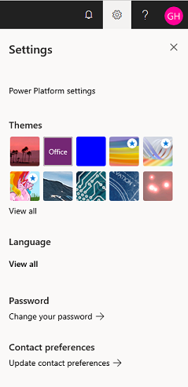

# Power Platform settings

Configuring the Power Platform admin center settings such as the view theme, language, and password are just a click away.

1. Sign in to the [Power Platform admin center](https://admin.powerplatform.microsoft.com).

2. Select the **Gear** icon () in the upper-right corner of the Power Platform site.

> [!div class="mx-imgBorder"] 
> 

Review and modify the following settings:

|Setting |Description |
|---------|---------|
|**Power Platform settings**    | Select this link to control who can create environments and allocate add-on capacity (if available).         |
|**Themes**     | Change the appearance of the Power Platform site with the provided themes.        |
|**Notifications** | By default, Microsoft 365 apps will ping you when new mail arrives and when it's time for a reminder--with a pop up or with a sound. You can change these settings at any time. |
|**Password**     | Change the password for all of your Microsoft 365 apps and services.        |
|**Contact preferences**    | Change contact preferences such as email and phone preferences.         |

