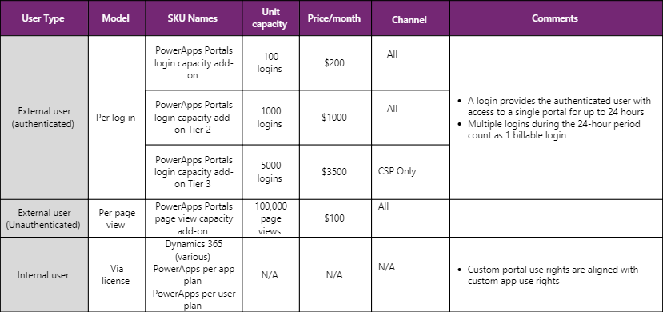

# PowerApps and Microsoft Flow licensing FAQs for October 2019

This topic provides information about the licensing changes for PowerApps and Microsoft Flow coming in October 2019. For the current licensing information, see [PowerApps plans](https://powerapps.microsoft.com/pricing/) and [Microsoft Flow plans](https://flow.microsoft.com/pricing/). 

### What licensing changes are coming to PowerApps and Microsoft Flow in October 2019?

We’re introducing two new plans for PowerApps and two new plans for Microsoft Flow on October 1, 2019.

New PowerApps plans include:
- **PowerApps per app plan** that allows individual users to run applications (two apps and a single portal) for a specific business scenario based on the full capabilities of PowerApps for \$10/user/app/month. This plan provides an easy way for customers to get started with the platform before broader scale adoption.
- **PowerApps per user plan** that equips a user to run unlimited applications (within service limits) based on the full capabilities of PowerApps for \$40/user/month.

New Microsoft Flow plans include:
- **Microsoft Flow per user plan** that equips a user to run unlimited flows (within service limits) with the full capabilities of Microsoft Flow based on their unique needs for \$15/user/month.
- **Microsoft Flow per flow plan** that enables organizations to implement flows with reserved capacity that serve teams, department, or the entire organization without having to license each end user. This plan starts at \$500/month for five flows.

### Will non-profit, government, and academic pricing be available?

Yes.

### What will happen to the existing PowerApps and Microsoft Flow plans on October 1, 2019?

The existing P1 and P2 plans for PowerApps and Microsoft Flow will transition to the new PowerApps per app and per user plans, as well as the Microsoft Flow per user and per flow plans. Existing customers will be able to maintain the P1 and P2 plans for PowerApps and Microsoft Flow for the duration of their current subscription period, and they might be eligible to also renew under current terms depending upon when their subscription period expires. Similarly, new customers might be able to purchase the existing P1 and P2 plans prior to April 1, 2020. Please contact your Microsoft account rep for more information.

### Will full Microsoft Flow capabilities still be included with the new PowerApps licenses?

<!-note from editor: When it says "Consuming standalone Microsoft Flows unrelated to ...," does this mean instances of Microsoft Flow? If so, it should just be "flows." https://styleguides.azurewebsites.net/Styleguide/Read?id=2696&topicid=38027  -->

PowerApps licenses will continue to include Microsoft Flow capabilities. However, flows will need to run within the context of the PowerApps application, which refers to using the same data sources for triggers or actions as the PowerApps application. Consuming standalone Microsoft Flows unrelated to the PowerApps applications will require purchase of a standalone Microsoft Flow license.

### Will PowerApps and Microsoft Flow use rights change for Dynamics 365 applications?

PowerApps use rights with Dynamics 365 licenses:

Dynamics 365 *Enterprise* licenses will no longer include general purpose PowerApps capabilities. Dynamics 365 Enterprise users will continue to be able to run apps and portals that extend and customize the licensed Dynamics 365 application, as long as those apps and portals are located in the same environment as their licensed Dynamics 365 application. Custom apps or portals outside of the Dynamics 365 environment will require a standalone PowerApps license.

Microsoft Flow use rights with Dynamics 365 licenses:

<!--note from editor: Similar to question above. Does the use of "Microsoft Flows" in the following paragraph mean instances of the product? If so, it should just be "flows." -->

Dynamics 365 licenses will no longer include general purpose Microsoft Flow capabilities. Microsoft Flows will need to map to licensed Dynamics 365 application context—Microsoft Flows should trigger from OR connect to data sources within use rights of licensed Dynamics 365 applications. Use of standalone flows will require a Microsoft Flow license.

### Will PowerApps and Microsoft Flow use rights change for Office 365 applications?

Effective October 1, 2019, the SQL, Azure, and Dynamics 365 connectors listed below will be reclassified from Standard to Premium. Non-Microsoft connectors that had previously been classified as standard connectors will still be available to Office 365 users. A standalone PowerApps or Microsoft Flow plan license is required to access all Premium, on-premises, and custom connectors.

<!--note from editor: The list below includes Dynamics 365 for Finance and Operations. I'm unsure if the "for" should be removed here in accordance with the naming updates now being implemented.  --> 

Azure Application Insights  
Azure Automation  
Azure Blob Storage  
Azure Container  
Azure Cosmos  
Azure Data Factory  
Azure Data Lake  
Azure DevOps  
Azure Event Grid  
Azure Event Grid Publish  
Azure File Storage  
Azure IoT Central  
Azure Kusto  
Azure Log Analytics  
Azure Log Analytics Data Collector  
Azure Queues  
Azure Resource Manager  
Azure SQL  
Azure SQL Data Warehouse  
Azure Table Storage  
Dynamics 365  
Dynamics 365 Customer Insights  
Dynamics 365 for Finance and Operations  
Dynamics 365 Sales Insights  
Dynamics 365 Business Central  
Dynamics 365 Business Central (on-premises)  
Dynamics NAV  
Event Hubs  
Service Bus  
SQL Server  

Microsoft Flow plan-based limits on trigger frequency and the number of runs allocated to a tenant per month are being removed.

PowerApps and Microsoft Flow usage will be subject to service limits described in [Requests limits and allocations](http://aka.ms/platformlimits). Per user service limits provide capacity assurance for users and alleviate the risk of one user exhausting the tenant-wide quota.

### The PowerApps per app plan allows users to run specific apps. Can you explain what this means in terms of the number and types of apps I can use?

The PowerApps per app plan is designed to help organizations solve for one business scenario at a time, which might involve a combination of individual apps. Each “per app” license provides an individual user with rights to two apps (canvas and/or model-driven) as well as one PowerApps Portal, all within a single environment. A single user might be covered by multiple “per app” licenses to allow the user to use multiple solutions targeted at various business scenarios, without requiring a per-user license. In other words, the “per app” license is stackable.

### Do embedded canvas apps in model-driven apps count toward the two-apps limits?

No. Embedded canvas components within the model-driven app will not count toward the two-apps limit in the per app licensing model.

### When would I use the Microsoft Flow per user plan versus the Microsoft Flow per flow plan?

The per user plan is intended to support the broad adoption of an automation culture in an organization. Every user with this plan is entitled to use an unlimited number of flows, within service limits. The per flow plan provides an organization with the flexibility to license by the number of flows, instead of licensing each user accessing the flows individually with the per user plan.

### Which flows count in the Microsoft Flow per flow plan?

All types of enabled flows count—scheduled flows, automated flows, instant flows, and business process flows. Flows that are triggered by another flow (child flows) or that are disabled will not count against the plan.

### Do flows always have to be purchased in units of five as part of the Microsoft Flow per flow plan?

No. After the minimum purchase of five flows, additional flows can be licensed individually at $100/month per flow.

### Do users who run flows need to be licensed, or do only users who create flows need to be licensed?

Any end user running a flow will need to be licensed either by the per user or per Microsoft Flow plans.

<!--note from editor: In the following question, does "like" mean "such as"? -->

### Do users who use Microsoft Flow features built on Common Data Service like approvals or business process flows need to be licensed?

There are features in Microsoft Flow that are not running a flow directly—such as responding to an approval request or advancing a stage in a business process.

These features are built on Common Data Service. Normally, any use of these features requires either a standalone Microsoft Flow per user plan, or that the flow that creates these business process instances or approval requests be licensed under the per flow plan.

### What Common Data Service capacity is included with the PowerApps and Microsoft Flow plans?

Every tenant with a PowerApps license gets default capacity. In addition, for each license, additional capacity (pooled) is added to the tenant.

| PowerApps capacity Limits             | Per license entitlement (PowerApps per app plan) | Per license entitlement (PowerApps per user plan) |
|---------------------------------------|--------------------------------------------------|---------------------------------------------------|
| Common Data Service Database Capacity | + 50 MB                                         | + 50 MB                                          |
| Common Data Service Log Capacity      | + 0                                             | + 0                                              |
| Common Data Service File Capacity     | + 400 MB                                        | + 400 MB                                         |

Because flows, as well as certain Microsoft Flow features such as approvals, run inside of Common Data Service, every tenant with a Microsoft Flow license gets default capacity. In addition, for each per-user or per-flow license, additional capacity is added to the tenant.

| Microsoft Flow capacity Limits                  | + Per user | + Per flow |
|---------------------------------------|-------------|-------------|
| Common Data Service Database Capacity | + 50 MB    | + 50 MB    |
| Common Data Service Log Capacity      | + 0        | + 0        |
| Common Data Service File Capacity     | + 200 MB   | + 200 MB   |

### What add-ons are available to the PowerApps and Microsoft Flow plans?

Add-ons applicable to all standalone PowerApps and Microsoft Flow plans are listed below:

- New **PowerApps Portals login capacity add-on** and **Portals page view capacity add-on** for external users of PowerApps Portals.
  - PowerApps Portals login capacity add-ons (various volume tiers start from \$200 per 100 logins per month)
  - PowerApps Portals page view capacity add-on (100,000 anonymous page views for \$100 per month)
- New **PowerApps and Microsoft Flow capacity add-on** increases daily API request limits for PowerApps, Microsoft Flow, and Dynamics 365 workloads for users who exceed their usage entitlement (10,000 daily API requests for \$50 per month).
- Common Data Service Database Capacity (1 GB) \$40 per month
- Common Data Service File Capacity (1 GB) \$2 per month
- Common Data Service Log Capacity (1 GB) \$10 per month

### Can you share more details regarding the new PowerApps Portals licensing?

PowerApps Portals can be provisioned without requiring a specific license. User access licensing is based on persona type and details are as below.

### What exactly is considered a “login” as part of the PowerApps Portals add-on?

Think of a login as a “day pass” to a portal. Once logged in to a portal, subsequent logins (potentially from different devices) during the 24-hour period will not be billable.

### Does a single login provide access to multiple PowerApps Portals during the 24-hour period?

Logins are specific to a single portal. So if you access multiple portals belonging to the same tenant, it will be counted as one login per portal.

### What is the difference between PowerApps Portals and Dynamics 365 Portals in terms of licensing?

| **Parameter**                              | **Dynamics 365 Portals**                                            | **New PowerApps Portals**                                                                                                                              |
|--------------------------------------------|---------------------------------------------------------------------|--------------------------------------------------------------------------------------------------------------------------------------------------------|
| **Provisioning a portal instance**         | **Purchase** Dynamics 365 Additional Portal SKU at \$500 per month  | **Provision** a portal—no need to purchase portal add-ons to provision a portal.                                                                         |
| **Qualifying base offers**                 | Dynamics 365 licenses only                                          | Customers can add on portal external login or page view capacity to Dynamics 365, **PowerApps and Microsoft Flow licenses**.                                      |
| **Internal use rights**                    | Dynamics 365 enterprise licenses, Dynamics 365 team member license | Internal users can now access portals with a **PowerApps per-app/per-user license**. For a **Dynamics license**, it is the same as custom PowerApps use rights**. |
| **Monetization**                           | Per portal instance Per page view                                   | **Per log in** Per page view.                                                                                                                           |
| **Entitlement for Dynamics 365 customers** | 1 portal instance for the first 10 full Dynamics 365 USLs           | Not applicable―PowerApps Portals instances can be provisioned.                                                                                          |

### Can I purchase PowerApps Portals add-on licenses with my existing PowerApps P1 or P2 plans or do I have to upgrade to the new plans to benefit from the new portal capability?

Yes. You can purchase PowerApps Portals add-on capacity if you are an existing PowerApps Plan 1 or Plan 2 customer. You can also purchase this capacity if you are a Dynamics 365 customer.

### Can you clarify the use rights to Portals for internal users?

Custom PowerApps Portals use rights:

For internal users, use rights to a “custom” portal are aligned with their “custom” PowerApps use rights. For example:
- A Dynamics 365 enterprise application license gets use rights to custom PowerApps applications within the same environment as the Dynamics 365 application. As such, a Dynamics 365 enterprise application license gets use rights to custom PowerApps Portals within the same environment as the licensed Dynamics 365 enterprise application.
- The Team Member license does not get access to a custom portal because Team Member licenses do not allow access to a custom app.

### What is the minimum number of logins and page views that I need to assign to a specific portal?

Minimum login quantity to be assigned to a portal is 100 logins/month. Once you have assigned 100 logins, you can assign them in units of 1.

For example, if you have 3 portals and bought 4 login packs (400 logins), you can assign them in the following ways:
- Portal 1: 120 (min 100)
- Portal 2: 151 (min 100)
- Portal 3: 129 (min 100)

Page views: Minimum 50,000 per portal. After that you can assign 1 at a minimum.

### Are there limits on the number of API requests PowerApps and Microsoft Flow users can make?

Yes. To help ensure service levels, availability, and quality, there are limits to the number of API requests users can make across PowerApps and Microsoft Flow. Service limits are set against normal usage patterns in both 5-minute and per 24-hour intervals, and most customers will not reach them.

API capacity is tracked based on consumption at an individual user level, and the daily limits cannot be pooled at any other level.

API limits are also applicable to application users, non-interactive users, and administrative users in the Common Data Service platform.

More information is available at [Requests limits and allocations](http://aka.ms/platformlimits).
