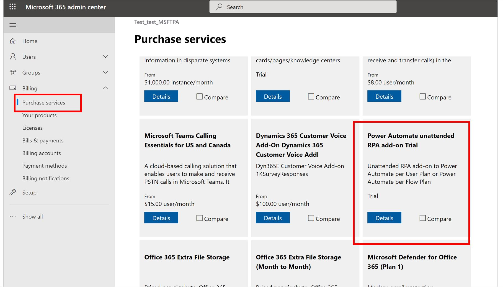

# Power Platform licensing FAQs

We have found some common questions on licensing and plan options. We’ve included several here with their answers. For more details about Microsoft Power Platform licensing, download the [Licensing Guide](https://go.microsoft.com/fwlink/?linkid=2085130).

## Power Platform product licensing

Provides answers to Power Platform products in general.

### What are the self-service purchase options for the Microsoft Power Platform products?

See the FAQ: [Self-service purchase FAQ](/microsoft-365/commerce/subscriptions/self-service-purchase-faq#admin-capabilities).

### Is non-profit, government, and academic pricing available?

Yes, non-profit, government and academic pricing is available in respective program channels.

### What happened to the Power Apps and Power Automate Plan 1 and Plan 2 plans after December 31, 2020?

Power Apps P1 and P2 and Power Automate P1 and P2 plans are no longer available for purchase, including via auto-renewal, after December 31, 2020. Customers with these plan licenses that have renewals falling on or after January 1, 2021 must transition to the Power Apps per user or per app plans, or the Power Automate per user or per flow plans to continue using the Microsoft Power Platform services. Contact your Microsoft account rep for more information.

### Is there a plan for developers?

Yes, we have a free Developer Plan to learn and build skills on Power Apps, Power Automate, and Microsoft Dataverse. [Learn more](https://powerapps.microsoft.com/developerplan/)).

### What happens when I use all the data storage, file storage, and flow runs included in my per user licenses?

You can buy additional data storage, file storage and flow runs. See [Licensing overview for Microsoft Power Platform](pricing-billing-skus.md).

### Who can buy Microsoft Platform apps plans?

Any customer can sign up for a [free trial](/power-platform/admin/try-powerapps-dynamics-365). Microsoft 365 admins can buy Power Platform apps plans for their teams or organization. Contact your Microsoft 365 admin when you’re ready to buy.

### Are there limits on the number of API requests users can make?

Yes. To help ensure service levels, availability and quality, there are limits to the number of API requests users can make across Power Platform. Service limits are set against normal usage patterns in both 5-minute and per 24-hour intervals, and most customers won't reach them.

API capacity is tracked based on consumption at an individual user level, and the daily limits can't be pooled at any other level.

API limits are also applicable to application users, non-interactive users and administrative users in Dataverse.

More information is available [here](./api-request-limits-allocations.md).

## Power Apps

### How is Microsoft Power Apps licensed? 

- **Power Apps per app plan** which allows individual users to run applications (one app or one portal) for a specific business scenario based on the full capabilities of Power Apps for $5/user/app/month. This plan provides an easy way for customers to get started with the platform before broader scale adoption.

- **Power Apps per user plan** which equips a user to run unlimited applications (within service limits) based on the full capabilities of Power Apps for $20/user/month.

- **Power Apps pay-as-you-go plan** which allows individual users to run applications (1 app or 1 portal) without any licenses via Azure subscription. You only pay for the number of users who used the app in a month. See [Preview: Pay-as-you-go plan](pay-as-you-go-overview.md).

See [Power Apps pricing](https://powerapps.microsoft.com/pricing/).

### How do I use Power Apps per app plans? 
See [About Power Apps per app plans](about-powerapps-perapp.md).

### How do I use Power Apps pay-as-you-go plan? 
See [Preview: Pay-as-you-go plan](pay-as-you-go-overview.md).

### The Power Apps per app plan allows users to run specific apps. Can you explain what this means in terms of the number and types of apps I can use?

The Power Apps per app plan is designed to help organizations solve for one business scenario at a time, which may involve a combination of individual apps. Each “per app” license provides an individual user with rights to one app (canvas and/or model-driven) or one Power Apps portal, within a single environment. A single user might be covered by multiple “per app” licenses to allow the user to use multiple apps, without requiring a per-user license. In other words, the “per app” license is stackable.

An important part of this feature simplification is that we'll no longer require any standalone plans for maker or admin capabilities. Previously admins required a Power Apps P2 license for certain management operations; this will no longer be the case.

### Do embedded canvas apps in model-driven apps count consume multiple per app plans?

No. Embedded canvas components within the model-driven app are recognized as a single app.

### What license must be assigned to a guest so they can run a canvas app shared with them?

The guest user must have a Power Apps license assigned through one of the following tenants:

- The tenant hosting the app being shared
- The home tenant of the guest user

Also, the guest must have the same license that’s required for non-guests to run an app. A collection of examples is available [here](/powerapps/maker/canvas-apps/share-app-guests#frequently-asked-questions).

### Are full Power Automate capabilities included in Power Apps licenses?

Power Apps licenses will continue to include Power Automate capabilities. However, flows will need to run within the context of the app, which refers to using the same data sources for triggers or actions as the app. Consuming standalone Power Automate flows unrelated to the app(s) will require purchase of a standalone Power Automate license.

### Do all my users need to be licensed with the same Power Apps plan, or can I mix plans?

You can mix and match Power Apps licenses, and licenses that include Power Apps capabilities, across the users in your organization.

## Power Automate

### How is Microsoft Power Automate licensed? 

See [Types of Power Automate licenses](power-automate-licensing/types.md), [Frequently asked questions about Power Automate licenses](power-automate-licensing/faqs.md) and [Microsoft Power Apps and Power Automate Licensing Guide](https://go.microsoft.com/fwlink/?linkid=2085130) for details.

### Power Automate RPA add-on

#### How can I apply unattended RPA add-ons to my flows?

Follow these steps to apply unattended RPA add-ons for your flows.

1. The tenant admin must purchase or get a trial version of the unattended RPA add-on capacity for the tenant. The tenant admin can do this from the [Microsoft 365 admin portal](https://admin.microsoft.com/AdminPortal/Home#/catalog). Just search the purchase services page for the add-on.
  
   
  
1. The environment admin must assign the available (paid or trial) unattended add-on capacities to a specific environment.
  
   
  
1. Makers can now run unattended desktop flows within the environment that has the unattended capacity.

> [!NOTE]
> The unattended add-on is environment-specific. So, if you have multiple environments that need to run unattended RPA, you need to assign add-on capacity to each of them.
> Also if you need to run multiple unattended desktop flows in parallel in a single environment, you need to assign the right number of unattended add-ons to the environment to support the flow runs.

## Power Virtual Agents

Learn more: [Assign licenses and manage access to Power Virtual Agents](/power-virtual-agents/requirements-licensing)

## Power Pages

### How is Power Pages licensed?

Power Pages (formerly Power Apps portals) licensing is capacity based and offers two types of capacities based on user type: **authenticated users per website per month** and **anonymous users per website per month**.

1. **Authenticated Users**

    1. The **authenticated user capacity** subscription license can be purchased for the anticipated number of unique, authenticated users. For example, **employees (internal)** or **non-employees (external)** accessing a website during a month. 

    1. The **authenticated user pay-as-you-go meter** enables customers to pay-as-you-go based on the actual number of authenticated users who have accessed a website in a month.

    **Meter Definition:** Power Pages authenticated user pay-as-you-go meter - A measure of the number of unique authenticated users per website per month.

1. **Anonymous Users**

    1. The **anonymous user monthly capacity** subscription license can be purchased for the anticipated number of unique, anonymous users accessing a website in a month.

    1. The **anonymous user pay-as-you-go meter** enables customers to pay-as-you-go based on the actual number of anonymous users who have accessed a website in a month.

    **Meter Definition:** Power Pages Anonymous per user/website pay-as-you-go meter - A measure of the number of unique anonymous users per website per month.

More information: [Power Pages meters](pay-as-you-go-meters.md#power-pages-meters-preview)

### What is an authenticated user and how are authenticated users/website/month calculated?

Authenticated users are users who obtain secure access to a website by logging in through an authentication provider. 

Authenticated user/website/month are calculated as unique users who log into the website in a calendar month duration. Even if a user logs in multiple times to a website in a calendar month, then that user is counted as one user. Uniqueness is determined by using the ID of the contact record (Microsoft Dataverse contact table) to which the user is mapped.

### What is an anonymous user and how are anonymous users/website/month calculated?

Anonymous users are users who browse a website and don't log in.

Anonymous users/website/month are calculated as unique users who access one or more anonymous pages of the website in a calendar month duration. Uniqueness is determined through a unique anonymous user ID stored in a browser cookie. If the user accesses the site using different browsers or devices or cleans up browser cookies, then a new anonymous user ID is generated and user would be counted as a different user.

### What are the scenarios in which a user isn't counted as anonymous user even though the user browses an anonymous page on the website?

There are several scenarios in which a user who has anonymously browsed the website won't be counted in the meter, some of these are described below: 

1. Any access of a website running in trial mode won't be counted.

1. Any access of a website running in private mode won't be counted.

1. If the user accesses specific pages on the website, then they aren't counted as anonymous users, these are:

    1. Pages related to log in like signin, register, invitation, and externalauthenticationcallback. This is done to ensure if the user is trying to authenticate to the website, they aren't counted as an anonymous user.

    1. System pages like the ones starting with **\/_** such as **\/_services** and **\/_resource**.

    1. If a page returns a redirect response (http 3xx status).

    1. If a page returns an error response (http 5xx status).

    1. If a page returns 404, or any http 4xx response.

1. Bots and crawler accessing anonymous pages of the website isn't counted.

1. If there's a monitoring system setup to test website availability periodically, it will be removed if it sends a non browser user agent. In case your monitoring system sends a user agent that is of any standard browser, it might be counted. If using a monitoring system to test website availability, we recommend targeting **/\_services/about** page of your website to ensure that it isn't counted in anonymous user access.

1. If a user is accessing only static resources (CSS, JavaScript, and images) won't be counted.

1. If a user is browsing anonymously and later logs in to the website within same day (UTC timezone), then that user will only be counted as authenticated user and won't be counted as anonymous user.

### If a user accesses a site anonymously and then logs in to the site in the same session, will the user be counted as both an anonymous and an authenticated user?

If a user accesses a site in both an anonymous and an authenticated manner in the same session or even within same day (24 hours using UTC time zone), the user will only be counted as an authenticated user and not as anonymous user.

### Access to my website is authenticated, however it has an anonymous log in page. Do I need to purchase anonymous user subscription?

No, log in page access isn't counted for calculating anonymous users. So if the only anonymous page is sign in page, then it will not require anonymous user subscription to be purchased.  

However, it's important to ensure that rest of the site is made authenticated. This can be done by using Page level permissions on home page and only making it available for authenticated user roles. If any other method is used like using a client side (JavaScript) redirect to log in page, then it might lead to some pages being available anonymously.

### How much does these licenses cost?

The Power Pages authenticated per user and Power Pages anonymous per user offers serve both small and large customer scenarios with a low barrier to entry, and easily scale for high-volume growth. Subscription and [pay-as-you-go](pay-as-you-go-meters.md?tabs=image#power-pages-meters-preview) pricing are detailed below.

#### Authenticated per user/website subscription capacity packs and pay-as-you-go meters 

| Capacity Pack Tiers | Capacity Packs Minimum purchase | Number of users (100 users/capacity pack) | Price per capacity pack/month | Pay-as-you-go |
| - | - | - | - | - |
| Tier 1 | 1 pack | 100+ users | $200 | $4.00 per user |
| Tier 2 | 100 packs | 10,000+ users | $75 |    |
| Tier 3 | 1,000 packs | 100,000+ users | $50  |  |

#### Anonymous per user/website subscription capacity packs and pay-as-you-go meters 

| Capacity Pack Tiers | Capacity Packs Minimum purchase | Number of users (500 users/capacity pack) | Price per capacity pack/month | Pay-as-you-go |
| - | - | - | - | - |
| Tier 1 | 1 pack | 500+ users | $75 | $0.30 per user |
| Tier 2 | 20 packs | 10,000+ users | $37.50 |   |
| Tier 3 | 200 packs | 100,000+ users | $25 |   |  

Price quoted above are list prices for commercial channel, special prices are offered for education and non-profit customers. 

### Does Power Pages licenses include Dataverse storage?

Yes, Dataverse database and Dataverse file capacity is included with the authenticated per user/website and the anonymous per user/website licenses. Allocated capacities differ between subscription plans and pay-as-you-go plans as detailed below.

#### Dataverse default capacity - subscription plans

| Capacity Type   | Dataverse database storage per tenant | Dataverse database storage per capacity pack | Dataverse file storage per capacity pack |
|-------------------------|-------------------------|-------------------------|-------------------------|
| Authenticated per user plan  | 5 GB | 2 GB | 16 GB |
| Anonymous per user plan  | 5 GB   | 500 MB  | 4 GB   |

#### Dataverse default capacity - pay-as-you-go plans

| Capacity Type | Dataverse Database storage per tenant | Dataverse database storage per environment | Dataverse file storage per environment |
| - | - | - | - |
| Authenticated per user plan  | N/A   | 1 GB    | 1 GB    |
| Anonymous per user plan | N/A   | 1 GB   | 1 GB   |

### How many users are included in each pack for Power Pages licenses?

1. **Subscription based**

    1. **Power Pages authenticated user/website subscription** – Each pack consists of 100 users. This is same for all tiers.

    1. **Power Pages anonymous user/website subscription –** Each pack consists of 500 users. This is same for all tiers.

1. **Pay-as-you-go based**

    1. **Power Pages authenticated user pay-as-you-go meter** - Pay-as-you-go meters aren't sold in packs rather are counted as individual users.

    1. **Power Pages anonymous user pay-as-you-go meter** - Pay-as-you-go meters aren't sold in packs rather are counted as individual users.

### What are the Power Pages use rights included with Power Apps and Dynamics 365 enterprise licenses?

Authenticated users licensed with Power Apps or Dynamics 365 enterprise licenses, are granted use rights for Power Pages as described below.

1. Power Apps per app licensed users - One Power Pages website.

1. Power Apps per user licensed users – Unlimited Power Pages websites

1. Dynamics 365 enterprise licensed users – Unlimited Power Pages websites. These websites must map to the licensed Dynamics 365 application context and map to the same environment as the licensed Dynamics 365 application.

### What are the main differences between Power Pages and Power Apps portals licensing?

| **Parameter** | **Power Apps portals licensing** | **Power Pages licensing** |
|-------------------------|-------------------------|-------------------------|
| **Provisioning a website** | Every additional website in the environment requires 1 GB of Dataverse capacity | No Dataverse capacity is required to provision a website |
| **Qualifying base offers** | Dynamics 365 and Power Apps licenses. | No base offer is required and licenses can be purchased standalone |
| **Licenses required for internal authenticated users** | Dynamics 365 enterprise licenses Power Apps per app plan Power Apps per user plan Power Apps per app pay-as-you-go meter | Dynamics 365 enterprise licenses Power Apps per app plan Power Apps per user plan (New) Authenticated per user/website subscription (New) Authenticated user pay-as-you-go meter |
| **Licenses required for external authenticated Users** | Power Apps portals logins capacity (one login = daily unique login) | Authenticated per user/website subscription Authenticated user pay-as-you-go meter |
| **Licenses required for anonymous users** | Power Apps portals page view capacity | Anonymous per user/website subscription Anonymous user pay-as-you-go meter |
| **Dataverse storage** | Not included with Power Apps portals logins and page view capacity | Included with Power Pages subscription Included with Power Pages pay-as-you-go meter |
| **Pay-as-you-go model** | Not available | Available |

### If I'm building a Power Pages website for my employees who will log in using their Azure AD credentials. What Power Pages licenses do I need?

Internal authenticated users of a Power Pages website can use one of the following type of licenses:

  1. **Subscription based**  
      1. **Power Apps per app** – Users can access one Power Pages website that should be part of environment to which Power Apps per app capacity licenses are assigned.

      1. **Power Apps per user licensed users** – Users who have been assigned Power Apps per user licenses can use unlimited Power Pages websites.

      1. **Dynamics 365 enterprise licensed users** – Users who have been assigned Dynamics 365 enterprise licenses can use unlimited Power Pages websites. These websites must map to the licensed Dynamics 365 application context and map to the same environment as the licensed Dynamics 365 application.

      1. **Power Pages authenticated user/website subscription** – Users can access one Power Pages website to which Power Pages authenticated per user/website capacity is assigned.
      If a user accessing the website has a Power Apps per user or a Dynamics 365 enterprise license assigned, then that user won't be counted in Power Pages authenticated user/website capacity.

  1. **Pay-as-you-go based**

      1. **Power Pages authenticated user pay-as-you-go meter** – Users can access Power Pages website that are present in environments enabled for pay-as-you-go licensing.  
      If a user accessing the website has a Power Apps per user or a Dynamics 365 enterprise license assigned, then that user won't be counted in Power Pages authenticated user pay-as-you-go meter.

### What is the difference between Power Apps portals login capacity and Power Pages authenticated per user/month capacity?

Power Pages Authenticated per user/month capacity count the number of unique users in a month that have accessed the website in an authenticated manner whereas Power Apps login capacity counts the number of total logins all users had on the website over a 24-hour period.    
    
For example, in a scenario where a website was accessed by a total of 100 authenticated users in a month with each user logging in once every day to the website. In this scenario, if we apply both meters, here is how they'll work;

  1. **Power Pages authenticated per user** 
    With Power Pages Authenticated per user per website monthly capacity, the total number of users would be 100 and the customer will need to purchase capacity for 100 users for the website.

  1. **Power Apps portal login** 
    With Power Apps portal logins, total number of logins would be 100 \* 30 = 3000 (as each user is logging in once every day) and customer will need to purchase capacity for 3000 logins for the website.

### If I create a Power Pages website that can potentially be used by 100,000 authenicated users, however in a given month it will only be used by 5,000 users (out of the 100,000). Do I need to purchase authenticated per user capacity for 100,000 users or 5,000 users?  
Power Pages authenticated per user/website is licensed based on the number of unique authenticated users who access the site in a month. In this example, the customer should purchase capacity for 5,000 users.  
The same is true if the users are anonymous and not authenticated.

### Do I require additional licensing for Power Pages content delivery network (CDN) and web application firewall (WAF) capabilities?

No. Both CDN and WAF capabilities are included as part of Power Pages licensing and don't require any additional licenses to be purchased.

### For subscription based licenses, what is the minimum number of authenticated and anonymous user capacity I need to assign to an environment?

1. **Authenticated Users** -&gt; Minimum quantity that needs to be assigned to an environment is 25.

    For example, if you have three websites (in three different environments) and bought one authenticated user pack (100 users), you can assign them in the following ways:

    - Environment 1: 25 (min 25)
    - Environment 2: 35 (min 25)
    - Environment 3: 40 (min 25)

1. **Anonymous Users-&gt;** Minimum 200 per environment. After that you can assign 1 at a minimum.

    For example, if you have two websites (in two different environments) and licensed one anonymous user pack (500 users), you can assign them in the following ways:

    - Environment 1: 220 (min 200)
    - Environment 2: 280 (min 200)

### Can I mix Power Pages subscription licenses and pay-as-you-go meters in same environment?

Power Pages subscription licenses can't be used in a pay-as-you-go environment.

### Can I still purchase Power Apps portals login and page view subscriptions?

Power Apps portals login and page view subscriptions will be available for purchase during transition period. 

1. **Existing customers who have Power Apps portals login and page view subscriptions**

    - Power Apps portals customers whose agreements expire before March 31, 2023 will have the option to renew their agreements using the existing Power Apps portals SKUs for one more agreement term.

    - During this transition period, existing customers will also be able to purchase more capacity for existing SKUs to create new websites or augment capacity for existing websites.  

    - Power Apps portals customers whose agreements expire after March 31, 2023, will need to transition to the new Power Pages licensing upon expiration of their Power Apps portals subscription term.

2. **New customers**

    - Power Apps portals per login and per page view SKUs will be available for new customers to purchase until March 31, 2023.

    - After March 31, 2023, new customers will purchase the new Power Pages SKUs.

### Do unused Power Pages subscription licenses (authenticated per user and anonymous per user) carry forward to the next month?

Power Pages are licensed at a monthly rate that is based on a customer's anticipated user volume. They aren't accumulated as individual assets and wouldn't carry forward month to month.

## Dataverse

### What Dataverse capacity is included with the Power Apps and Power Automate plans?

Every tenant with a Power Apps license gets default capacity. In addition, for each license there's additional capacity (pooled) added to the tenant.

| **Power Apps capacity Limits**         | **Per license entitlement (Power Apps per app plan)** | **Per license entitlement (Power Apps per user plan)** |
|---------------------------------------|------------------------------------------------------|-------------------------------------------------------|
| Dataverse Database Capacity | \+ 50 MB                                             | \+ 250 MB                                             |
| Dataverse Log Capacity      | \+ 0                                                 | \+ 0                                                  |
| Dataverse File Capacity     | \+ 400 MB                                            | \+ 2 GB                                               |

Since flows, as well as certain Power Automate features like approvals, run inside of the Dataverse, every tenant with a Power Automate license gets default capacity. In addition, for each per-user or per-flow license there is additional capacity added to the tenant.

| **Power Automate capacity Limits**    | **+ Per user** | **+ Per flow** |
|---------------------------------------|----------------|----------------|
| Dataverse Database Capacity | \+ 250 MB       | \+ 50 MB       |
| Dataverse Log Capacity      | \+ 0           | \+ 0           |
| Dataverse File Capacity     | \+ 2 GB      | \+ 200 MB      |

## Dataverse for Teams

### Are the existing Microsoft Power Platform use rights included with Microsoft 365 licenses changing?

To deliver a comprehensive low-code extensibility platform for Microsoft Teams, Microsoft Power Platform capabilities available as part of select Microsoft 365 subscriptions are expanding with the introduction of Dataverse for Teams.

Dataverse for Teams is a built-in flexible datastore that provides data storage and a one-click solution for (app/chatbot) deployment in Teams. With the addition of Dataverse for Teams:
- Power Apps capabilities seeded in Microsoft 365 licenses are expanding to enable building and deploying custom apps natively within Teams. This includes using custom [APIs built using Azure API Management](/azure/api-management/export-api-power-platform). 
-	Additionally, Power Virtual Agents capabilities are being introduced to Teams. Customers will now be able to build and deploy custom chatbots directly within Teams.

The existing Microsoft Power Platform functionality available for use in Microsoft 365 more broadly outside of Teams remains otherwise unchanged.

### Is there any new capability coming with Dataverse for Teams to Power Automate rights included with Microsoft 365?

Yes. With Dataverse for Teams, users now can build flows using Power Automate portal and that operate in a Dataverse for Teams environment. Please note that a Dataverse for Teams environment needs to be created first by either authoring an app or chatbot.

### Which Microsoft 365 subscriptions include Dataverse for Teams and Power Virtual Agents capabilities with Teams?

Dataverse for Teams and Power Virtual Agents for Teams capabilities will be available as part of select Microsoft 365 subscriptions with Microsoft Power Platform and Teams capabilities, excluding plans for EDU A1 and SUB SKUs. For more information, see the [Licensing Guide](https://go.microsoft.com/fwlink/?linkid=2085130).

### How is Dataverse for Teams environment created? 

Creation of Dataverse for Teams environments isn't available from the Power Platform admin center. Creation of new Dataverse for Teams environments will only be possible from within Teams. 

### Can Dataverse for Teams be used outside of Teams?

Dataverse for Teams is designed to work in the Teams client across web, desktop and mobile. If you’d want to use Dataverse for Teams outside of Teams, you must upgrade your environment to Dataverse. 

### Is there a limit to Dataverse for Teams capacity? How many Dataverse for Teams environments can be created in a tenant?  

Each Dataverse for Teams environment uniquely maps (1:1) to a Teams team and can store up to 1,000,000 records based on typical usage (enforced as 2 GB relational database storage per Dataverse for Teams environment). For details on service limits, including the tenant-level capacity limits associated with Dataverse for Teams, see [About the Dataverse for Teams environment](about-teams-environment.md). 

### Can we control who can create environments with Dataverse for Teams?

Teams governs who can create and join a Team. The environment is created for a team when an owner or member tries to create an application in it.

### Can a Dataverse for Teams environment be deleted?
A Dataverse for Teams environment is deleted when the associated Team is deleted.

### How does the capacity enforcement work for Dataverse for Teams environments?

When the environment capacity limits are reached (2 GB per environment) new solutions (apps, chatbots, flows) can't be created or installed in that specific Dataverse for Teams environment.

When the tenant capacity service limits are reached (grows with the # of eligible Microsoft 365 USLs in the tenant as explained [here](./about-teams-environment.md):

-	New apps, chatbots, flows, or tables can't be created or installed in any Dataverse for Teams environment. 
-	New Dataverse for Teams environments can't be created in the tenant 

In both cases:
-	Users who want to create/install new apps, chatbots, flows, or tables in that environment will be notified that the capacity limit is reached, and they need to reduce storage usage or contact their admins.
-	Existing solutions in the environment will continue to work (CRUD allowed). The environments will be able to continue to grow beyond the 2GB limit.  
-	Existing solutions within the environment can be updated.  
-	Certain options within each solution (Power Apps/Power Automate/Power Virtual Agents) will be hidden/grayed out.  

### Can customers with Power Apps, Power Automate, and Power Virtual Agents subscriptions use premium connectors with Dataverse for Teams?  
Yes. Accessing premium connectors in a specific Dataverse for Teams environment requires users in that environment to be licensed accordingly. 

Example: In a Dataverse for Teams environment, accessing premium connectors in the context of an app requires all users accessing the app to be licensed by either the Power Apps per app or per user plan depending on the customer scenario.
 
### Can I use AI Builder with Dataverse for Teams?
No. Tables for AI Builder aren't included in Dataverse for Teams.

### Can I use desktop flows with Dataverse for Teams?

No. Desktop flows aren't supported in Dataverse for Teams.

### Can I use custom connectors in Dataverse for Teams?
Custom connectors aren't supported in Dataverse for Teams but [support for Azure API Management (API-M)](https://powerapps.microsoft.com/blog/azure-api-management-connector-on-the-power-platform/) will be available later in Dataverse for Teams.

### Can customers purchase more capacity for a Dataverse for Teams environment?

No. Dataverse for Teams provides support for approximately 1 million rows per team. Although existing apps and chatbots will continue to work when a Dataverse for Teams environment reaches the per environment limit (2 GB), users who want to create a new app, flow, chatbot, or table in the environment will need to:
1.	Purchase Power Apps, Power Automate, and Power Virtual Agents subscriptions based on their needs and start building their new app, flow, or chatbot in an environment.
2.	[Upgrade](about-teams-environment.md#upgrade-process) the existing Dataverse for Teams environment to Dataverse in the Power Platform admin center and, if needed, purchase Power Apps, Power Automate, or Power Virtual Agents subscriptions based on their needs.

### Can customers package and export their solution (app/flow/chatbots) built in Dataverse for Teams, and then import that into an environment (assuming they have the corresponding license including access rights to Microsoft Dataverse)?

This capability isn't available yet, but is included in our roadmap.

### Other than adding capacity, what are the other reasons to upgrade a Dataverse for Teams environment?

[Upgrading](about-teams-environment.md#upgrade-process) an environment from Dataverse for Teams to Dataverse will enable customers to take advantage of additional capacity, capabilities, such as: 
-	Enterprise ALM, data types
-	Support for log and managed data lake
-	Rich access control, auditing
-	Governance and security

> [!NOTE]
> Accessing an environment with Dataverse requires all users to have a corresponding standalone Microsoft Power Platform license for each service being utilized. For example, a user accessing an app running on Dataverse needs to be licensed by either the Power Apps per app or per user plan depending on the customer scenario.

### Why do I see Dataverse plan in select Microsoft 365 subscriptions? Is this related to Dataverse for Teams?
No. A limited set of Dataverse capabilities were recently added to Microsoft 365 licenses to support service capabilities available (for example, Microsoft Project). A standalone Power Apps, Power Automate, or Power Virtual Agents plan is still needed to run apps/flows/bots with Dataverse. Review the [Dataverse capabilities with Microsoft 365 licenses](pricing-billing-skus.md#dataverse-capabilities-with-microsoft-365-licenses) for more details on the feature.

> [!NOTE]
> There is a service plan called *Dataverse for Teams* that is related to the Dataverse for Teams capabilities. This service plan is used by our platform for granting customer tenants Dataverse for Teams storage capacity and should not be deactivated.

### Is geo migration supported for Dataverse for Teams environments?
Geo migration isn't supported for Dataverse for Teams environments.

## AI Builder

### How is AI Builder licensed?

AI Builder is a capacity add-on to paid, standalone Power Apps, Power Automate, and Dynamics 365 licenses. Each $500 subscription includes 1 million AI Builder service credits applied at the tenant level. To use your AI Builder capacity, an administrator has to allocate AI Builder capacity to the environment where you want to use AI Builder.  

- More details about licensing can be found in the Microsoft Power Apps and Power Automate Licensing Guide. 
- Information about how to allocate capacity in the Power Platform admin center can be found [here](./capacity-add-on.md).

### How is AI Builder capacity enforced?

The AI Builder capacity add-on is an annual subscription, and capacity is enforced on a monthly basis. Capacity should be purchased for the peak utilization monthly period.

Information about how to allocate AI Builder capacity to your environment is available [here](./capacity-add-on.md).

### Can AI Builder capacity be added to the P1 and P2 plans for Power Apps and Power Automate that are being retired?

Yes. AI Builder capacity can be added to the P1 and P2 plans for Power Apps and Power Automate for customers who haven’t yet transitioned to the new Power Apps and Power Automate plans.

### What is a "service credit" and how does it work? 

AI Builder includes several model types, including custom and prebuilt – a full list is available [here](/ai-builder/model-types#model-types).

 AI models consume service credits when they are trained, used in an app or flow, or scheduled to periodically run. The amount of capacity consumed varies based the AI model, as well as the size and complexity of the data set.

### What can I do with the 5,000 AI credits included in the per user plan with attended RPA?
Each user license grants you 5000 credits, allowing you to assess the capabilities in AI Builder. For instance, you could use these credits to extract data from a few documents with *form processing* or perform hundreds of basic OCR extractions with *text recognition*.

### Which AI models are available for free in public preview and which are in paid GA status?

The release status for AI Builder features is available [here](/power-platform-release-plan/2020wave1/ai-builder/).

AI models available in public preview do not require paid AI Builder capacity. A full list of all models can be found [here](/ai-builder/model-types#model-types).

### Is a trial available for AI Builder?
Users without an existing Power Apps or Power Automate license can access AI Builder trial capacity for 30 days by signing up for either a Power Apps or Power Automate trial. Existing Power Apps and Power Automate users can access AI Builder trial capacity for 30-days by signing into the respective service and accessing AI Builder in the left navigation pane.

## Power Platform pay-as-you-go plan

Learn more:
- [How do pay-as-you-go meters work?](/power-platform/admin/pay-as-you-go-meters)
- [Frequently asked questions](/power-platform/admin/pay-as-you-go-issues-faq#frequently-asked-questions)

## Promotions and limited-time offers
What content goes here???

## License transitions
What content goes here???

## Add-ons

### What add-ons are available to the Power Apps and Power Automate plans?

A list of add-ons applicable to all standalone Power Apps and Power Automate plans are listed below:

- New **Power Apps Portals login capacity add-on** and **Portals page view capacity add-on** for external users of Power Apps Portals. External users are those outside of your organization who sign in with various identities such as LinkedIn, Microsoft Account, other commercial sign-in providers, or anonymously.

  - Power Apps Portals log in capacity add-ons (various volume tiers start from $200 per 100 logins per month)

  - Power Apps Portals page view capacity add-on (100,000 anonymous page views for $100 per month)

- New **Power Apps and Power Automate capacity add-on** increases daily API request limits for Power Apps, Power Automate, and Dynamics 365 workloads for users that exceed their usage entitlement (10,000 daily API requests for $50 per month).

- Dataverse Database Capacity (1 GB) $40 per month

- Dataverse File Capacity (1 GB) $2 per month

- Dataverse Log Capacity (1 GB) $10 per month

## Trial Licenses

### How long is the free trial period?

Free trials for Microsoft Power Apps last 30 days. For Power Automate, they're available for 90 days.

### Is there a way to develop my Microsoft Power Apps and Power Automate skills for more than 90 days?

Yes, with the Power Apps Developer Plan you get a free environment for individual use with functionality including the Dataverse. In this environment you can explore and learn everything about Power Automate and Power Apps for free, but the Power Apps Developer Plan isn't intended for production use.

[Learn more](https://powerapps.microsoft.com/pricing/).

### How do I convert my trial environment to a production environment?

More information is available [here](./trial-environments.md).

### Where can I find more information about trial environments?

For more information about trial environments in Power Apps read this [topic](./trial-environments.md).

## Microsoft 365

### What are Microsoft Power Apps and Power Automate use rights for Microsoft 365 applications?

Refer to [Licensing guide](https://go.microsoft.com/fwlink/?linkid=2085130) for Microsoft Power Apps and Power Automate use rights for Microsoft 365 applications.

Effective October 1, 2019, the SQL, Azure, and Dynamics 365 connectors listed below will be reclassified from Standard to Premium. Non-Microsoft connectors that had previously been classified as standard connectors will still be available to Microsoft 365 users. A standalone Power Apps or Power Automate plan license is required to access all Premium, on-premises and custom connectors.

Premium connectors list at October 2019 (will expand over time):
- Azure Application Insights  
- Azure Automation  
- Azure Blob Storage  
- Azure Container  
- Azure Cosmos  
- Azure Data Factory  
- Azure Data Lake  
- Azure DevOps  
- Azure Event Grid  
- Azure Event Grid Publish  
- Azure File Storage  
- Azure IoT Central  
- Azure Kusto  
- Azure Log Analytics  
- Azure Log Analytics Data Collector  
- Azure Queues  
- Azure Resource Manager  
- Azure SQL  
- Azure Synapse Analytics 
- Azure Table Storage  
- Dynamics 365  
- Dynamics 365 Customer Insights  
- Dynamics 365 Finance & Operations  
- Dynamics 365 Sales Insights  
- Dynamics 365 Business Central  
- Dynamics 365 Business Central (on-premises)  
- Dynamics NAV  
- Event Hubs  
- Service Bus  
- SQL Server

Power Automate plan-based limits on trigger frequency and the number of runs allocated to a tenant per month are being removed.

Power Apps and Power Automate usage will be subject to service limits described [here](./api-request-limits-allocations.md). Per user service limits provide capacity assurance for users and alleviate the risk of one user exhausting the tenant wide quota.

### How does the change to Power Apps and Power Automate use rights for Microsoft 365 applications affect me if I purchased the subscriptions prior to Oct 1, 2019? Will my existing apps and Power Automate workflows continue to work?

Yes, existing apps and flows will continue to work. Customers who have been using Power Apps or Power Automate with Microsoft 365 using one or more of the connectors listed above will receive a transition period before the connector reclassification goes into effect. This transition period would be until October 1, 2020 or the expiration of their current Microsoft 365 subscription term, whichever is longer. During the transition period customers can continue to create additional apps and flows using these connectors.

In addition, apps and flows created prior to October 1, 2019 that are using these connectors will receive an extended transition period until October 1, 2024. During this time, these qualifying apps and flows will be exempt from the Premium connector licensing requirements for the reclassified connectors.

The extended transition period allows for using the connectors listed above but it doesn't allow these connectors to use gateways. Gateways were a premium capability before the transition and they continue to be a premium capability.

Although apps may be granted to use the Dynamics 365 connector for an extended transition period, the ability to use the connector doesn't provide Dataverse capacity. Dataverse capacity is a prerequisite for Power Apps and Power Automate workflows to use Dataverse. 

### How many apps I can run with Microsoft 365 plans?

There's no limit on the number of applications. Customers can continue to run standalone apps to extend and customize Microsoft 365 using standard connectors. 

## Dynamics 365

### What are Microsoft Power Apps and Power Automate use rights for Dynamics 365 applications?

Refer to [Licensing guide](https://go.microsoft.com/fwlink/?linkid=2085130) for Microsoft Power Apps and Power Automate use rights for Microsoft 365 applications.

Effective October 1, 2019, there are certain changes made to use rights that are listed below:

Power Apps use rights with Dynamics 365 licenses: Dynamics 365 *Enterprise* licenses will no longer include general purpose Power Apps capabilities. Dynamics 365 Enterprise users will continue to be able to run apps and portals that extend and customize the licensed Dynamics 365 application, as long as those apps and portals are located in the same environment as their licensed Dynamics 365 application. Custom apps or portals outside of the environment will require a standalone Power Apps license.

Power Automate use rights with Dynamics 365 licenses: Dynamics 365 licenses will no longer include general purpose Power Automate capabilities. Power Automate flows will need to map to licensed Dynamics 365 application context - Power Automate flows should trigger from OR connect to data sources within use rights of licensed Dynamics 365 application(s). Use of standalone flows will require a Power Automate license.

### Can I connect to Microsoft Dynamics for finance and operations apps?

Yes, you can use the Dynamics 365 finance and operations apps connector to build canvas apps using this data.
 
[!INCLUDE[footer-include](../includes/footer-banner.md)]
