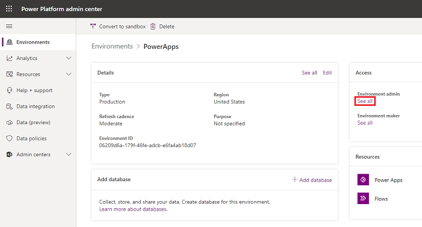
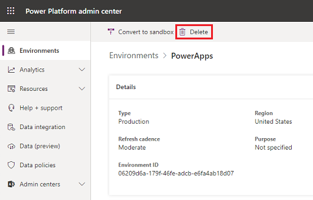

# Responding to Data Subject Rights (DSR) requests to delete Power Apps customer data

[!INCLUDE [cc-data-platform-banner](../includes/cc-data-platform-banner.md)]

The "right to erasure" by the removal of personal data from an organization's customer data is a key protection in the European Union (EU) General Data Protection Regulation (GDPR). Removing personal data includes removing system-generated logs but not audit log information.

Power Apps allows users to build line-of-business applications that are a critical part of your organization's day-to-day operations. When a user leaves your organization, you'll need to manually review and determine whether to delete certain data and resources that the user created. Other personal data will be automatically deleted whenever the user's account is deleted from Azure Active Directory.

Here is the breakdown between which personal data will be automatically deleted and which data will require your manual review and deletion:

Requires manual review and deletion |    Automatically deleted when the user is deleted from Azure Active Directory
| --- | ---| 
| Environment\** | Gateway| 
| Environment permissions\*** | Gateway permissions| 
| Canvas app\** | Power Apps notifications| 
| Canvas-app permissions | Power Apps user settings| 
| Connection\** | Power Apps user-app settings| 
| Connection permissions | | 
| Custom connector\** | | 
| Custom-connector permissions |  | 

\** Each of these resources contains "Created By" and "Modified By" records that include personal data. For security reasons, these records will be retained until the resource is deleted.

\*** For environments that include a Microsoft Dataverse database, environment permissions (that is, which users are assigned to the Environment Maker and Admin roles) are stored as records in that database. For guidance on how to respond to DSRs for users of Dataverse, see [Responding to Data Subject Rights (DSR) requests for Dataverse customer data](common-data-service-gdpr-dsr-guide.md).

For the data and resources that require manual review, Power Apps offers the following experiences to reassign (if necessary) or delete personal data for a specific user:

* Website access: [Power Apps site](https://make.powerapps.com), [Power Platform admin center](https://admin.powerplatform.microsoft.com/), and [Microsoft 365 Service Trust Portal](https://servicetrust.microsoft.com/)

* PowerShell access: Power Apps cmdlets for [app creators](https://go.microsoft.com/fwlink/?linkid=871448) and [administrators](https://go.microsoft.com/fwlink/?linkid=871804) and cmdlets for [on-premises gateways](https://go.microsoft.com/fwlink/?linkid=872238).

Here is the breakdown of which experiences are available to delete each type of resource that can contain personal data:

|Resources containing personal data | Website access    | PowerShell access|
|--- | --- | ---|
|Environment    | Power Platform admin center |     Power Apps cmdlets|
|Environment permissions**    | Power Platform admin center | Power Apps cmdlets|
|Canvas app    | Power Platform admin center <br /> Power Apps| Power Apps cmdlets|
|Canvas-app permissions    | Power Platform admin center | Power Apps cmdlets|
|Connection | | App creator: Available <br> Admin: Available|
|Connection permissions | | App creator: Available <br> Admin: Available|
|Custom connector | | App creator: Available <br> Admin: Available|
|Custom-connector permissions | | App creator: Available <br> Admin: Available|

\** With the introduction of Dataverse, if a database is created within the environment, environment permissions and model-driven app permissions are stored as records within the environment of that database. For guidance on how to respond to DSRs for users of Dataverse, see [Responding to Data Subject Rights (DSR) requests for Dataverse customer data](common-data-service-gdpr-dsr-guide.md).

## Prerequisites

### For users
Any user with a valid Power Apps license can perform the user operations outlined in this document using the [Power Apps](https://make.powerapps.com) or [PowerShell cmdlets for app creators](https://go.microsoft.com/fwlink/?linkid=871448).

#### Unmanaged tenant
If you are a member of an [unmanaged tenant](https://docs.microsoft.com/azure/active-directory/domains-admin-takeover), meaning that your Azure AD tenant does not have global administrator, then you will still be able to follow the steps outlined in this art to remove your own personal data.  However, since there is no global administrator for your tenant you will need to follow the instructions outlined in [Step 11: Delete the user from Azure Active Directory](#step-11-delete-the-user-from-azure-active-directory) below to delete your own account from the tenant.

In order to determine if you are a member of an unmanaged tenant please follow these steps:

1. Open the following URL in a browser, making sure to replace your email address in the URL: https://login.microsoftonline.com/common/userrealm/name@contoso.com?api-version=2.1

2. If you are a member of an **unmanaged tenant** then you will see an `"IsViral": true` in the response.

```powershell
{
  ...
  "Login": "name@unmanagedcontoso.com",
  "DomainName": "unmanagedcontoso.com",
  "IsViral": true,
  ...
}
```

3. Otherwise, you belong to a **managed tenant**.

### For administrators
To perform the administrative operations outlined in this document using the Power Platform admin center, Power Automate admin center, or [PowerShell cmdlets for Power Apps administrators](https://go.microsoft.com/fwlink/?linkid=871804), you'll need the following:

* A paid Power Apps plan or a Power Apps plan trial. You can sign-up for a 30-day trial at [https://make.powerapps.com/trial](https://make.powerapps.com/trial). Trial licenses can be renewed if they've expired.

* [Microsoft 365 Global admin](https://docs.microsoft.com/microsoft-365/admin/add-users/about-admin-roles?view=o365-worldwide) or [Azure Active Directory Global Administrator](https://docs.microsoft.com/azure/active-directory/active-directory-assign-admin-roles-azure-portal) permissions if you need to search through another user's resources. (Note that Environment Admins only have access to those environments and environment resources for which they have permissions.)

## Step 1: Delete or reassign all environments created by the user
As an administrator, you have two decisions to make when processing a DSR delete request for each environment that the user created:

1. If you determine that the environment is not being used by anyone else in your organization, you can choose to delete the environment.

2. If you determine that the environment is still required, you can choose not to delete the environment and add yourself (or another user in your organization) as an Environment Admin.

> [!IMPORTANT]
> Deleting an environment will permanently delete all resources within the environment, including all apps, flows, connections, etc. So please review the contents of an environment before deletion.

### Give access to a user's environments 
An admin can grant administrative access to an environment by following these steps:

1. From the [Power Platform admin center](https://admin.powerplatform.microsoft.com/), select an environment to give admin privileges to yourself or another user in your organization.

2. If the environment was created by the user from the DSR request, under **Access**, **Environment admin**, select **See all**.

> [!div class="mx-imgBorder"] 
> 

### Delete environments created by a user
An admin can review and delete environments created by a specific user by following these steps:

1. From the [Power Platform admin center](https://admin.powerplatform.microsoft.com/), select an environment.

2. If the environment was created by the user from the DSR request, select **Delete** and then proceed with the steps to delete the environment.

> [!div class="mx-imgBorder"] 
> 

### Give access to a user's environments using PowerShell
An administrator can assign themselves (or another user within their organization) access to all environments created by a user by using the **Set-AdminEnvironmentRoleAssignment** function in the [PowerShell cmdlets for Power Apps administrators](https://go.microsoft.com/fwlink/?linkid=871804):

```powershell
Add-PowerAppsAccount
$deleteDsrUserId = "0ecb1fcc-6782-4e46-a4c4-738c1d3accea"
$myUserId = $global:currentSession.UserId

#Assign yourself as an admin to each environment created by the user
Get-AdminEnvironment -CreatedBy $deleteDsrUserId | Set-AdminEnvironmentRoleAssignment -RoleName EnvironmentAdmin -PrincipalType User -PrincipalObjectId $myUserId

#Retrieve the environment role assignments to confirm
Get-AdminEnvironment -CreatedBy $deleteDsrUserId | Get-AdminEnvironmentRoleAssignment
```

> [!IMPORTANT]
> This function works only in environments that do not have an environment of a database in Dataverse.

### Delete environments created by a user using PowerShell
 An administrator can delete all environments created by a user by using the **Remove-AdminEnvironment** function in the [PowerShell cmdlets for Power Apps administrators](https://go.microsoft.com/fwlink/?linkid=871804):

```powershell
Add-PowerAppsAccount
$deleteDsrUserId = "0ecb1fcc-6782-4e46-a4c4-738c1d3accea"

# Retrieve all environments created by the user and then delete them
Get-AdminEnvironment -CreatedBy $deleteDsrUserId | Remove-AdminEnvironment
```

## Step 2: Delete the user's permissions to all other environments
Users can be assigned permissions (such as Environment Admin and Environment Maker) in an environment, which are stored in the Power Apps service as a "role assignment."
With the introduction of Dataverse, if a database is created within the environment, these "role assignments" are stored as records within the environment of that database.

### For environments without a Dataverse database

#### Power Platform admin center
An administrator can delete a user's environment permissions starting from the [Power Platform admin center](https://admin.powerplatform.microsoft.com/) by following these steps:

1. From the [Power Platform admin center](https://admin.powerplatform.microsoft.com/), select an environment.

   You must be an [Microsoft 365 Global admin](https://docs.microsoft.com/microsoft-365/admin/add-users/about-admin-roles?view=o365-worldwide) or an [Azure Active Directory Global Administrator](https://docs.microsoft.com/azure/active-directory/active-directory-assign-admin-roles-azure-portal) to be able to review all environments that have been created within your organization.

2. If your environment does not have a Dataverse database, you will see a section **Access**. Under **Access**, select either **Environment admin** or **Environment maker**, and then select **See all**.

   > [!div class="mx-imgBorder"] 
   > 

3. Select a user, select **Remove** to remove their permission, and then select **Continue**.

#### PowerShell
An administrator can delete all environment role assignments for a user across all environments without a Dataverse database by using the **Remove-AdminEnvironmentRoleAssignment** function in the [PowerShell cmdlets for Power Apps administrators](https://go.microsoft.com/fwlink/?linkid=871804):

```powershell
Add-PowerAppsAccount
$deleteDsrUserId = "0ecb1fcc-6782-4e46-a4c4-738c1d3accea"

#find all environment role assignments for the user for environments without a Dataverse environment and delete them
Get-AdminEnvironmentRoleAssignment -UserId $deleteDsrUserId | Remove-AdminEnvironmentRoleAssignment
```

> [!IMPORTANT]
> This function works only for environments that do not have an environment of a Dataverse database.

### For environments WITH a Dataverse database
With the introduction of the Dataverse, if a database is created within the environment, these "role assignments" are stored as records within the environment of that database. Please refer to the following documentation on how to remove personal data from an environment of a database in Dataverse: Common Data Serviice User personal data removal

## Step 3: Delete or reassign all canvas apps owned by a user

### Reassign a user's canvas apps using the Power Apps Admin PowerShell cmdlets
If an admin decides not to delete a user's canvas apps, they can reassign the apps owned by a user by using the **Set-AdminAppOwner** function in the [Power Apps Admin PowerShell cdmlets](https://go.microsoft.com/fwlink/?linkid=871804):

```powershell
Add-PowerAppsAccount
$deleteDsrUserId = "0ecb1fcc-6782-4e46-a4c4-738c1d3accea"
$newAppOwnerUserId = "72c272b8-14c3-4f7a-95f7-a76f65c9ccd8"

#find all apps owned by the DSR user and assigns them a new owner
Get-AdminApp -Owner $deleteDsrUserId | Set-AdminAppOwner -AppOwner $newAppOwnerUserId
```

### Delete a user's canvas app using the Power Apps site
A user can delete an app from the [Power Apps site](https://make.powerapps.com). For the full steps on how to delete an app, please see deleting an app.

### Delete a user's canvas app using the Power Platform admin center
An admin can delete apps created by a user by following these steps:

1. From the [Power Platform admin center](https://admin.powerplatform.microsoft.com/), select an environment.

   You must be a [Microsoft 365 Global admin](https://docs.microsoft.com/microsoft-365/admin/add-users/about-admin-roles?view=o365-worldwide) or an [Azure Active Directory Global Administrator](https://docs.microsoft.com/azure/active-directory/active-directory-assign-admin-roles-azure-portal) to be able to review all environments that have been created within your organization.

2. Under **Resources**, select **Power Apps**. 

3. Select an app, and then select **Delete** > **Delete from cloud**.

### Delete a user's canvas app using the Power Apps Admin PowerShell cmdlets
If an admin decides to delete all canvas apps owned by a user, they can do so using the **Remove-AdminApp** function in the [Power Apps Admin PowerShell cmdlets](https://go.microsoft.com/fwlink/?linkid=871804):

```powershell
Add-PowerAppsAccount
$deleteDsrUserId = "0ecb1fcc-6782-4e46-a4c4-738c1d3accea"

#find all apps owned by the DSR user and deletes them
Get-AdminApp -Owner "0ecb1fcc-6782-4e46-a4c4-738c1d3accea" | Remove-AdminApp
```

## Step 4: Delete the user's permissions to canvas apps
Whenever an app is shared with a user, Power Apps stores a record called a "role assignment" that describes the user's permissions (CanEdit or CanUse) to the application. For more information, see the Share an app article.

> [!NOTE]
> An app's role assignments will be deleted when the app is deleted.
> The app owner's role assignment can only be deleted by assigning a new owner for the app.

To delete user permissions to a canvas app, see [Preview: Share a model-driven app](https://docs.microsoft.com/powerapps/maker/model-driven-apps/share-model-driven-app). For step 5, remove rather than add a role from the list.

### PowerShell cmdlets for admins
An admin can delete all of a user's canvas-app role assignments by using the **Remove-AdminAppRoleAssignmnet** function in the [Power Apps Admin PowerShell cmdlets](https://go.microsoft.com/fwlink/?linkid=871804):

```powershell
Add-PowerAppsAccount
$deleteDsrUserId = "0ecb1fcc-6782-4e46-a4c4-738c1d3accea"

#find all app role assignments for the DSR user and deletes them
Get-AdminAppRoleAssignment -UserId $deleteDsrUserId | Remove-AdminAppRoleAssignment
```

## Step 5: Delete connections created by a user
Connections are used in conjunction with connectors when establishing connectivity with other APIs and SaaS systems.  Connections do include references to the user who created them and, as a result, can be deleted to remove any references to the user.

### PowerShell cmdlets for app creators
A user can delete all of their connections by using the Remove-Connection function in the [PowerShell cmdlets for app creators](https://go.microsoft.com/fwlink/?linkid=871448):

```powershell
Add-PowerAppsAccount

#Retrieves all connections for the calling user and deletes them
Get-Connection | Remove-Connection
```

### PowerShell cmdlets for Power Apps administrators
An admin can delete all of a user's connections by using the **Remove-AdminConnection** function in the [Power Apps Admin PowerShell cmdlets](https://go.microsoft.com/fwlink/?linkid=871804):

```powershell
Add-PowerAppsAccount
$deleteDsrUserId = "0ecb1fcc-6782-4e46-a4c4-738c1d3accea"

#Retrieves all connections for the DSR user and deletes them
Get-AdminConnection -CreatedBy $deleteDsrUserId | Remove-AdminConnection
```

## Step 6: Delete the user's permissions to shared connections

### PowerShell cmdlets for app creators
A user can delete all of their connection role assignments for shared connections by using the Remove-ConnectionRoleAssignment function in the [PowerShell cmdlets for app creators](https://go.microsoft.com/fwlink/?linkid=871448):

```powershell
Add-PowerAppsAccount

#Retrieves all connection role assignments for the calling users and deletes them
Get-ConnectionRoleAssignment | Remove-ConnectionRoleAssignment
```
> [!NOTE]
> Owner role assignments cannot be deleted without deleting the connection resource.

### PowerShell cmdlets for admins
An admin can delete all of a user's connection role assignments by using the **Remove-AdminConnectionRoleAssignment** function in the [Power Apps Admin PowerShell cmdlets](https://go.microsoft.com/fwlink/?linkid=871804):

```powershell
Add-PowerAppsAccount
$deleteDsrUserId = "0ecb1fcc-6782-4e46-a4c4-738c1d3accea"

#Retrieves all connection role assignments for the DSR user and deletes them
Get-AdminConnectionRoleAssignment -PrincipalObjectId $deleteDsrUserId | Remove-AdminConnectionRoleAssignment
```

## Step 7: Delete custom connectors created by the user
Custom Connectors supplement the existing out of box connectors and allow for connectivity to other APIs, SaaS and custom-developed systems. You may want to transfer Custom Connector ownership to other users in the organization or delete the Custom Connector.

### PowerShell cmdlets for app creators
A user can delete all of their custom connectors by using the Remove-Connector function in the [PowerShell cmdlets for app creators](https://go.microsoft.com/fwlink/?linkid=871448):

```powershell
Add-PowerAppsAccount

#Retrieves all custom connectors for the calling user and deletes them
Get-Connector -FilterNonCustomConnectors | Remove-Connector
```

### PowerShell cmdlets for admins
An admin can delete all custom connectors created by a user using the **Remove-AdminConnector** function in the [Power Apps Admin PowerShell cmdlets](https://go.microsoft.com/fwlink/?linkid=871804):

```powershell
Add-PowerAppsAccount
$deleteDsrUserId = "0ecb1fcc-6782-4e46-a4c4-738c1d3accea"

#Retrieves all custom connectors created by the DSR user and deletes them
Get-AdminConnector -CreatedBy $deleteDsrUserId | Remove-AdminConnector
```

## Step 8: Delete the user's permissions to shared custom connectors

### PowerShell cmdlets for app creators
A user can delete all of their connector role assignments for shared custom connectors with the Remove-ConnectorRoleAssignment function in the [PowerShell cmdlets for app creators](https://go.microsoft.com/fwlink/?linkid=871448):

```powershell
Add-PowerAppsAccount

#Retrieves all connector role assignments for the calling users and deletes them
Get-ConnectorRoleAssignment | Remove-ConnectorRoleAssignment
```

> [!NOTE]
> Owner role assignments cannot be deleted without deleting the connection resource.

### PowerShell cmdlets for admins
An admin can delete all custom connector role assignments for a user using the **Remove-AdminConnectorRoleAssignment** function in the [Power Apps Admin PowerShell cmdlets](https://go.microsoft.com/fwlink/?linkid=871804):

```powershell
Add-PowerAppsAccount
$deleteDsrUserId = "0ecb1fcc-6782-4e46-a4c4-738c1d3accea"

#Retrieves all custom connector role assignments for the DSR user and deletes them
Get-AdminConnectorRoleAssignment -PrincipalObjectId $deleteDsrUserId | Remove-AdminConnectorRoleAssignment
```

## Step 9: Delete the user's personal data in Power Automate
Power Apps licenses always include Power Automate capabilities. In addition to being included in Power Apps licenses, Power Automate is also available as a standalone service. For guidance on how to respond to DSRs for users who use the Power Automate service, see [Responding to GDPR Data Subject Requests for Power Automate](https://go.microsoft.com/fwlink/?linkid=872250).

> [!IMPORTANT]
> It is recommended that admins complete this step for a Power Apps user.

## Step 10: Delete the user's personal data in environments of Dataverse
Certain Power Apps licenses, including the Power Apps Community Plan, give the ability for users within your organization to create environments of Dataverse and to create and build apps on Dataverse. The Power Apps Community Plan is a free license that allows users to try out Dataverse in an individual environment. See the Power Apps pricing page for which capabilities are included in each Power Apps license.

For guidance on how to respond to DSRs for users who use Dataverse, see [Responding to Data Subject Rights (DSR) requests for Dataverse customer data](common-data-service-gdpr-dsr-guide.md).

> [!IMPORTANT]
> It is recommended that admins complete this step for a Power Apps user.

## Step 11: Delete the user from Azure Active Directory
Once the above steps have been complete the final step is to delete the user's account for Azure Active Directory.

### Managed tenant
As an admin of a managed Azure AD tenant you can delete the user's account by following the steps outlined in the Azure Data Subject Request GDPR documentation that can be found on the [Microsoft 365 Service Trust Portal](https://servicetrust.microsoft.com/ViewPage/GDPRDSR).

### Unmanaged tenant
If you are a member of an unmanaged tenant then you will need to follow these steps in order to delete your account from your Azure AD tenant:

> [!NOTE]
> Please see the [Unmanaged tenant section](#unmanaged-tenant) above to see how to detect if you are a member of an unmanaged or managed tenant.

1. Sign in with your Azure AD account.

2. Select **Close account** and follow the instructions to delete your account from your Azure AD tenant.

    
