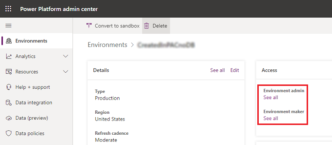

# Responding to Data Subject Rights (DSR) requests to export Power Apps customer data

[!INCLUDE [cc-data-platform-banner](../includes/cc-data-platform-banner.md)]

The "right of data portability" allows a data subject to request a copy of his or her personal data in an electronic format (that is, a structured, commonly used, machine readable and interoperable format) that may be transmitted to another data controller:

* Website access: [Power Apps portal](https://make.powerapps.com), [Power Platform admin center](https://admin.powerplatform.microsoft.com/), and [Microsoft 365 Service Trust Portal](https://servicetrust.microsoft.com/)

* PowerShell access: Power Apps [App creator cmdlets](https://go.microsoft.com/fwlink/?linkid=871448), [Admin cmdlets](https://go.microsoft.com/fwlink/?linkid=871804) and [On-premises gateway cmdlets](https://go.microsoft.com/fwlink/?linkid=872238)

Below is a summary of the types of personal data that Power Apps can store for a specific user and which experiences you can use to find and export it.

Resources containing personal data | Website access |    PowerShell access
--- | --- | --
Environment    | Power Platform admin center |     Power Apps cmdlets
Environment permissions**    | Power Platform admin center     | Power Apps cmdlets
Canvas App    | Power Apps Portal |     Power Apps cmdlets
Canvas App permissions    | Power Apps Portal    | Power Apps cmdlets
Gateway | Power Apps Portal***    | On-premises gateway cmdlets
Gateway permissions    | Power Apps Portal***    |
Custom connector | |    App creator: Available <br> Admin: Available
Custom connector permissions | |     App creator: Available <br> Admin: Available
Connection | | App creator: Available <br> Admin: Available
Connection permissions    | | App creator: Available <br> Admin: Available
Power Apps user settings, user-app settings, and notifications | | App creator: Available <br> Admin: Available

> ** With the introduction of Microsoft Dataverse, if a database is created within the environment, environment permissions and model-driven app permissions are stored as records within the Dataverse database environment. For guidance on how to respond to DSR requests for users that use Dataverse, see [Responding to Data Subject Rights (DSR) requests for Dataverse customer data](common-data-service-gdpr-dsr-guide.md).

> *** An administrator can access these resources from the [Power Apps portal](https://make.powerapps.com) only if the owner of the resource has explicitly granted him or her access. If the administrator has not been granted access, he or she will need to leverage the [Power Apps Admin PowerShell cdmlets](https://go.microsoft.com/fwlink/?linkid=871804).

## Prerequisites

### For users
Any user with a valid Power Apps license can perform the user operations outlined in this document using the [Power Apps portal](https://make.powerapps.com) or [App creator cmdlets](https://go.microsoft.com/fwlink/?linkid=871448).

### For admins
To perform the administration operations outlined in this document using the Power Platform admin center, Power Automate Admin Center, or [Power Apps Admin PowerShell cdmlets](https://go.microsoft.com/fwlink/?linkid=871804), you'll need the following:

* A paid Power Apps plan or a Power Apps trial. You can sign-up for a 30-day trial at [https://make.powerapps.com/trial](https://make.powerapps.com/trial). Trial licenses can be renewed if they've expired.

* [Microsoft 365 Global admin](https://docs.microsoft.com/microsoft-365/admin/add-users/about-admin-roles?view=o365-worldwide) or [Azure Active Directory Global Administrator](https://docs.microsoft.com/azure/active-directory/active-directory-assign-admin-roles-azure-portal) permissions if you need to search through another user's resources. (Note that Environment Admins only have access to those environments and environment resources for which they have permissions.)

## Step 1: Export personal data contained within environments created by the user

### Power Platform admin center
Administrators can export all environments created by a specific user from the [Power Platform admin center](https://admin.powerplatform.microsoft.com/) by following these steps:

1. From the Power Platform admin center, select each environment in your organization.

2. If the environment was created by the user from the DSR request, select **See all**, copy the details, and then paste them into a document editor, such as Microsoft Word.

   > [!div class="mx-imgBorder"] 
   > 

### PowerShell cmdlets for app creators
Users can export the environments they have access to in Power Apps by using the **Get-PowerAppsEnvironment** function in the [Power Apps App creator PowerShell cmdlets](https://go.microsoft.com/fwlink/?linkid=871448):

```powershell
Add-PowerAppsAccount
Get-PowerAppsEnvironment | ConvertTo-Json | Out-File -FilePath "UserDetails.json"
```

### PowerShell cmdlets for admins
Administrators can export all of the environments that have been created by a user by using the **Get-AdminEnvironment** function in the [Power Apps Admin PowerShell cdmlets](https://go.microsoft.com/fwlink/?linkid=871804):

```powershell
Add-PowerAppsAccount
$userId = "7557f390-5f70-4c93-8bc4-8c2faabd2ca0"
Get-AdminEnvironment -CreatedBy $userId | ConvertTo-Json | Out-File -FilePath "UserDetails.json"
```
 
## Step 2: Export the user's environment permissions
Users can be assigned permissions (such as Environment Admin, Environment Maker, etc.) in an environment, which are stored in Power Apps as a *role assignment*. With the introduction of Dataverse, if a database is created within the environment, the role assignments are stored as records within the Dataverse database environment. For more information, see [Administer environments within Power Apps](environments-administration.md).

### For environments without a Dataverse database

#### Power platform admin center
Administrators can export a user's environment permissions from the [Power Platform admin center](https://admin.powerplatform.microsoft.com/) by following these steps:

1. From the Power Platform admin center, select each environment in your organization. You must be an [Microsoft 365 Global admin](https://docs.microsoft.com/microsoft-365/admin/add-users/about-admin-roles?view=o365-worldwide) or an [Azure Active Directory Global Administrator](https://docs.microsoft.com/azure/active-directory/active-directory-assign-admin-roles-azure-portal) to be able to review all environments created within your organization.

2. Select both **Environment Admin** and **Environment Maker** separately, and then using the search bar, search for the user's name.

   > [!div class="mx-imgBorder"] 
   >  

   > [!div class="mx-imgBorder"] 
   > 

3. If the user has access to either role, go to the **Users** page, copy the details, and then paste them into a document editor, such as Microsoft Word.

#### PowerShell cmdlets for admins
Administrators can export all environment role assignments for a user across all environments without a Dataverse database by using the **Get-AdminEnvironmentRoleAssignment** function in the [Power Apps Admin PowerShell cdmlets](https://go.microsoft.com/fwlink/?linkid=871804):

```powershell
Add-PowerAppsAccount
$userId = "0ecb1fcc-6782-4e46-a4c4-738c1d3accea"
Get-AdminEnvironmentRoleAssignment -UserId $userId | ConvertTo-Json | Out-File -FilePath "UserDetails.json"
```

> [!IMPORTANT]
>  This function only works for environments that do not have a Dataverse database environment.

### For environments with a Dataverse database
With the introduction of the Dataverse, if a database is created within the environment, role assignments are stored as records within the Dataverse database environment. For information on how to remove personal data from a Dataverse database environment, see [Common Data Serviice User personal data removal](https://go.microsoft.com/fwlink/?linkid=871886).
 
## Step 3: Export personal data contained within canvas apps created by the user

### Power Apps portal
A user can export an app from the [Power Apps portal](https://make.powerapps.com). For step-by-step instructions on how to export a canvas app, see [Exporting a canvas app](../alm/environment-and-tenant-migration.md#exporting-a-canvas-app).

### Power Platform admin center
An administrator can export apps created by a user starting from the [Power Platform admin center](https://admin.powerplatform.microsoft.com/) by following these steps:

1. From the Power Platform admin center, select each environment in your organization. You must be an [Microsoft 365 Global admin](https://docs.microsoft.com/microsoft-365/admin/add-users/about-admin-roles?view=o365-worldwide) or an [Azure Active Directory Global Administrator](https://docs.microsoft.com/azure/active-directory/active-directory-assign-admin-roles-azure-portal) to be able to review all environments created within your organization.

2. Select **Resources**, and then select **Power Apps**.

3. Using the search bar, search for the user's name, which brings up any apps that user created within this environment:

   > [!div class="mx-imgBorder"] 
   > 

4. Select **Share** for each of the apps created by that user and give yourself **Co-owner** access to the app:

   > [!div class="mx-imgBorder"] 
   > 

   > [!div class="mx-imgBorder"] 
   > 

5. Once you have access to each of the user's apps you can export a canvas app from the [Power Apps portal](https://make.powerapps.com). For step-by-step instructions on how to export an app, see [Exporting a canvas app](../alm/environment-and-tenant-migration.md#exporting-a-canvas-app).

### PowerShell cmdlets for admins
Administrators can export apps created by a user by using the **Get-AdminApp** function in the [Power Apps Admin PowerShell cdmlets](https://go.microsoft.com/fwlink/?linkid=871804):

```powershell
Add-PowerAppsAccount
$userId = "0ecb1fcc-6782-4e46-a4c4-738c1d3accea"
Get-AdminApp -Owner $userId | ConvertTo-Json | Out-File -FilePath "UserDetails.json"
```

## Step 4: Export the user's permissions to canvas apps
Whenever an app is shared with a user, Power Apps stores a record called a *role assignment* that describes the user's permissions (CanEdit or CanUser) to the application. For more information, see [Share an app](https://docs.microsoft.com/powerapps/maker/canvas-apps/share-app#share-an-app).

### PowerShell cmdlets for app creators
Users can export the app role assignments for all apps that they have access to by using the **Get-RoleAssignment** function in the [Power Apps App creator PowerShell cmdlets](https://go.microsoft.com/fwlink/?linkid=871448):

```powershell
Add-PowerAppsAccount
Get-AppRoleAssignment | ConvertTo-Json | Out-File -FilePath "UserDetails.json"
```

### Power Platform admin center 
Administrators can export app roles assignments for a user from the [Power Platform admin center](https://admin.powerplatform.microsoft.com/) by following these steps:

1. From the Power Platform admin center, select each environment in your organization. You must be an [Microsoft 365 Global admin](https://docs.microsoft.com/microsoft-365/admin/add-users/about-admin-roles?view=o365-worldwide) or an [Azure Active Directory Global Administrator](https://docs.microsoft.com/azure/active-directory/active-directory-assign-admin-roles-azure-portal) to be able to review all environments created within your organization.

2. For each environment, select **Resources**, and then select **Power Apps**.

3. Select **Share** for each of the apps in the environment.

   > [!div class="mx-imgBorder"] 
   >   

4. If the user has access to the app, go to the app's **Share** page, copy the details, and then paste them into a document editor, such as Microsoft Word.

   > [!div class="mx-imgBorder"] 
   > 

### PowerShell cmdlets for admins
Administrators can export all app role assignments for a user across all apps in their tenant by using the **Get-AdminAppRoleAssignment** function in the [Power Apps Admin PowerShell cdmlets](https://go.microsoft.com/fwlink/?linkid=871804):

```powershell
Add-PowerAppsAccount
$userId = "0ecb1fcc-6782-4e46-a4c4-738c1d3accea"
Get-AdminAppRoleAssignment -UserId $userId | ConvertTo-Json | Out-File -FilePath "UserDetails.json"
```

## Step 5: Export personal data contained within connections created by the user 
Connections are used in conjunction with connectors when establishing connectivity with other APIs and SaaS systems. Connections include references to the user who created them and, as a result, can be deleted to remove any references to the user.

### PowerShell cmdlets for app creators
Users can export all of the connections they have access to by using the **Get-Connection** function in the [Power Apps App creator PowerShell cmdlets](https://go.microsoft.com/fwlink/?linkid=871448):

```powershell
Add-PowerAppsAccount
Get-Connection | ConvertTo-Json | out-file -FilePath "UserDetails.json"
```

### PowerShell cmdlets for admins
Administrators can export all connections created by the user using the  **Get-AdminConnection** function in the [Power Apps Admin PowerShell cdmlets](https://go.microsoft.com/fwlink/?linkid=871804):

```powershell
Add-PowerAppsAccount
$userId = "0ecb1fcc-6782-4e46-a4c4-738c1d3accea"
Get-AdminConnection -CreatedBy $userId | ConvertTo-Json | Out-File -FilePath "UserDetails.json"
```
 
## Step 6: Export the user's permissions to shared connections

### PowerShell cmdlets for app creators
Users can export the connection role assignments for all connections that they have access to by using the **Get-ConnectionRoleAssignment** function in the [Power Apps App creator PowerShell cmdlets](https://go.microsoft.com/fwlink/?linkid=871448):

```powershell
Add-PowerAppsAccount
Get-ConnectionRoleAssignment | ConvertTo-Json | Out-file -FilePath "UserDetails.json"
```

### PowerShell cmdlets for admins
Administrators can export all connection role assignments for a user using the  **Get-AdminConnectionRoleAssignment** function in the [Power Apps Admin PowerShell cdmlets](https://go.microsoft.com/fwlink/?linkid=871804):

```powershell
Add-PowerAppsAccount
$userId = "0ecb1fcc-6782-4e46-a4c4-738c1d3accea"
Get-AdminConnectionRoleAssignment -PrincipalObjectId $userId | ConvertTo-Json | Out-File -FilePath "UserDetails.json"
```

## Step 7: Export personal data contained within custom connectors created by the user
Custom Connectors supplement the existing out-of-box connectors and allow for connectivity to other APIs, SaaS, and custom-developed systems.

### Power Apps App creator PowerShell cmdlets
Users can export all custom connectors they've created by using the **Get-Connector** function in the [Power Apps App creator PowerShell cmdlets](https://go.microsoft.com/fwlink/?linkid=871448):

```powershell
Add-PowerAppsAccount  
Get-Connector -FilterNonCustomConnectors | ConvertTo-Json | Out-File -FilePath "UserDetails.json"
```

### PowerShell cmdlets for admins
Administrators can export all custom connectors created by a user using the  **Get-AdminConnector** function in the [Power Apps Admin PowerShell cdmlets](https://go.microsoft.com/fwlink/?linkid=871804):

```powershell
Add-PowerAppsAccount
$userId = "0ecb1fcc-6782-4e46-a4c4-738c1d3accea"
Get-AdminConnector -CreatedBy $userId | ConvertTo-Json | Out-File -FilePath "UserDetails.json"
```

## Step 8: Export the user's permissions to custom connectors

### PowerShell cmdlets for app creators
Users can export all connector role assignments for the custom connectors to which they have access by using the **Get-ConnectorRoleAssignment** function in the [Power Apps App creator PowerShell cmdlets](https://go.microsoft.com/fwlink/?linkid=871448):

```powershell
Add-PowerAppsAccount  
Get-ConnectorRoleAssignment | ConvertTo-Json | Out-File -FilePath "UserDetails.json"
```

### PowerShell cmdlets for admins
Administrators can export all custom connector role assignments for a user using the  **Get-AdminConnectorRoleAssignment** function in the [Power Apps Admin PowerShell cdmlets](https://go.microsoft.com/fwlink/?linkid=871804):

```powershell
Add-PowerAppsAccount
$userId = "0ecb1fcc-6782-4e46-a4c4-738c1d3accea"
Get-AdminConnectorRoleAssignment -PrincipalObjectId $userId | ConvertTo-Json | Out-File -FilePath "UserDetails.json"
```
 
## Step 9: Export Power Apps Notifications, User Settings, and User-App Settings
Power Apps sends several types of notifications to users, including when an app is shared with them and when a Dataverse export operation has completed. A user's notification history is visible to them within the [Power Apps portal](https://make.powerapps.com).

Power Apps also stores several different user preferences and settings that are used to deliver the Power Apps runtime and portal experiences, including when a user last opened an application, pinned an app, etc.

### PowerShell cmdlets for app creators
Users can export their own Power Apps notifications, user settings, and user-app settings using the **Get-AdminPowerAppsUserDetails** function in the [Power Apps App creator PowerShell cmdlets](https://go.microsoft.com/fwlink/?linkid=871448):

```powershell
Add-PowerAppsAccount  
Get-AdminPowerAppsUserDetails -WriteToFile -OutputFilePath "UserDetails.json"
```

### PowerShell cmdlets for admins
Administrators can export the Power Apps notifications, user settings, and user-app settings for a user using the  **Get-AdminPowerAppsUserDetails** function in the [Power Apps Admin PowerShell cdmlets](https://go.microsoft.com/fwlink/?linkid=871804):

```powershell
Add-PowerAppsAccount
$userId = "0ecb1fcc-6782-4e46-a4c4-738c1d3accea"
Get-AdminPowerAppsUserDetails -WriteToFile -OutputFilePath "UserDetails.json" -UserPrincipalName name@microsoft.com
```

## Step 10: Export personal data contained for a user-stored gateway or in the user's gateway permissions

### Power Apps Portal
Users can export the personal data stored within the gateway service from the [Power Apps portal](https://make.powerapps.com) by following these steps:

1. From the [Power Apps portal](https://make.powerapps.com), within the default environment for your tenant, select **Gateways**, and then select **Details** for each gateway to which you have access.

    

2. On the **Details** page, if the gateway details contain any personal data, copy the details, and then paste them into a document editor, such as Microsoft Word.

    

3. Select **Share**, copy the contents of the page, and then paste it into a document editor, such as Microsoft Word.

    

### Gateway PowerShell cmdlets
There are also PowerShell cmdlets that allow you to retrieve, manage, and delete your personal gateways. For more information, see [On-premises gateway cmdlets](https://go.microsoft.com/fwlink/?linkid=872238).

### Administrators
See [What is an on-premises data gateway?](https://docs.microsoft.com/powerapps/maker/canvas-apps/gateway-reference) for guidance around managing gateways for your organization.

## Step 11: Export the user's personal data in Power Automate
Power Apps licenses always include Power Automate capabilities. In addition to being included in Power Apps licenses, Power Automate is also available as a standalone service. For guidance on how to respond to DSR requests for users that use the Power Automate service, see [Responding to GDPR Data Subject Requests for Power Automate](https://go.microsoft.com/fwlink/?linkid=872250).

> [!IMPORTANT]
>  We recommend that administrators complete this step for Power Apps users.


## Step 12: Export the user's personal data in Dataverse environments
Anyone with a Power Apps license, provided there is 1GB available database capacity, can create Dataverse environments and create and build apps on Dataverse; this includes the Power Apps Community Plan, which is a free license that allows users to try out Dataverse in an individual environment. To see which Dataverse capabilities are included in each Power Apps license, see the [Power Apps Pricing page](https://powerapps.microsoft.com/pricing).

For guidance on how to respond to DSR requests for users that use Dataverse, see [Responding to Data Subject Rights (DSR) requests for Dataverse customer data](common-data-service-gdpr-dsr-guide.md).

> [!IMPORTANT]
>  We recommend that administrators complete this step for Power Apps users.
