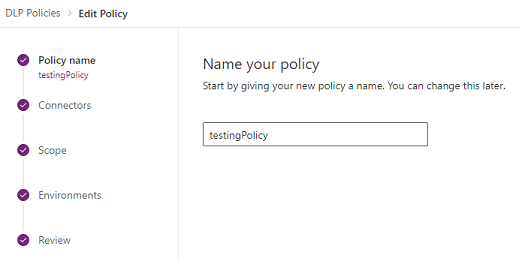

# Manage data loss prevention (DLP) policies

An organization's data is critical to its success. Its data needs to be readily available for decision-making, but the data needs to be protected so that it isn't shared with audiences who shouldn't have access to it. To protect this data, you can use Power Apps to create and enforce data loss prevention (DLP) policies that define the consumer connectors that specific business data can be shared with. For example, an organization that uses Power Apps might not want the business data that's stored in SharePoint to be automatically published to its Twitter feed.

To create, edit, or delete DLP policies, you must have either Environment Admin or Power Platform admin permissions. 

## Find and view DLP policies

1. Sign in to the Power Platform admin center.

2. In the navigation pane, select **Data policies**. If you have a long list of policies, use the **Search** box to find specific DLP policies.

   > [!div class="mx-imgBorder"] 
   > 

   The list view shows the following attributes:

   | Attribute | Description |
   | --------- | ----------- |
   | Name | The name of the policy. |
   | Scope | The type of policy, such as environment-level or tenant-level |
   | Applied to | The environment scope associated with the policy. For an environment-level policy, this is single environment name associated with the policy.   For a tenant-level policy, this can be one of the following values: - All environments - All environments, except (_n_) - (_n_) environments - A single environment name |
   | Created by | The user who created the policy. |
   | Created (On) | The date on which the policy was created. |
   | Modified by | The user who modified the policy. |
   | Modified (On) | The date on which the policy was modified. |

## Edit a DLP policy

1. Sign in to the Power Platform admin center.

2. From the list of DLP policies, select an environment, and then select **Edit Policy**. If you have a long list of policies, use the **Search** box to find specific environments.

   > [!div class="mx-imgBorder"] 
   > 

   > [!NOTE]
   > Environment admins can't edit policies that were created by the tenant admin.

3. Proceed through the steps described in [Create a DLP policy](create-dlp-policy.md), and then select **Update Policy**.

   > [!NOTE]
   > Environment-level DLP policies can't override tenant-wide DLP policies.

   > [!div class="mx-imgBorder"] 
   > 

4. (Optional) If necessary, consider enforcing DLP policies on connections. More information: [Enforce DLP policy for violating connections](powerapps-powershell.md#enforce-dlp-policy-for-violating-connections---environment)

   > [!NOTE]
   >  Enforcing DLP policies will disable existing connections that violate any DLP policies and enable any previously disabled connections that no longer violate any DLP policies.

## Delete a DLP policy

1. Sign in to the Power Platform admin center.

2. From the list of DLP policies, select an environment, and then select **Delete Policy**. If you have a long list of policies, use the **Search** box to find specific environments.

   > [!div class="mx-imgBorder"] 
   > 

   > [!NOTE]
   > Environment admins can't delete policies that were created by the tenant admin.

3. In the confirmation dialog box, select **Delete**.

## Change the default data group

1. Sign in to the Power Platform admin center as a [global admin](/microsoft-365/admin/add-users/about-admin-roles).

2. From the list of DLP policies, select an environment, and then select **Edit Policy**. If you have a long list of policies, use the **Search** box to find specific environments.

   > [!div class="mx-imgBorder"] 
   > 

   > [!NOTE]
   > Environment admins can't edit policies created by the tenant admin.

3. Select the **Connectors** step in the **Edit Policy** process.

4. In the upper-right corner, select **Set default group**.

   > [!div class="mx-imgBorder"] 
   > 

5. Choose a default group, and then select **Apply**. More information: [Connector classification](dlp-connector-classification.md) and [Default data group for new connectors](dlp-connector-classification.md#default-data-group-for-new-connectors)

6. Select **Next** as needed to close the **Edit Policy** process.

The data group you chose will be the default group to automatically classify any new connectors added to Microsoft Power Platform after your policy has been created. 

## Use DLP PowerShell commands
See [Data loss prevention (DLP) policy commands](powerapps-powershell.md#data-loss-prevention-dlp-policy-commands).

### See also

[Data loss prevention policies](wp-data-loss-prevention.md)  
[Create a data loss prevention (DLP) policy](create-dlp-policy.md)  
[Data loss prevention (DLP) policy commands](powerapps-powershell.md#data-loss-prevention-dlp-policy-commands)  
[Power Platform data loss prevention (DLP) SDK](data-loss-prevention-sdk.md)

[!INCLUDE[footer-include](../includes/footer-banner.md)]
