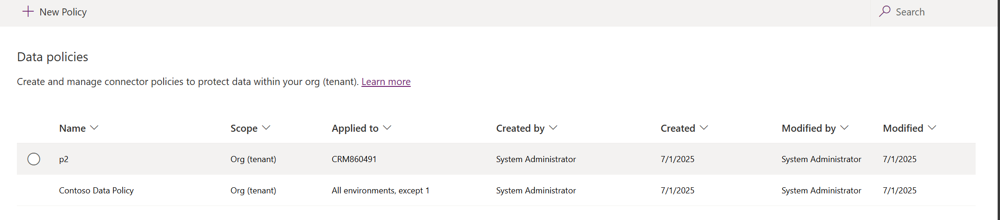

# Manage data policies

An organization's data is critical to its success. Its data needs to be readily available for decision making, but the data needs to be protected so that it isn't shared with audiences who shouldn't have access to it. To protect this data, you can use Power Apps to create and enforce data policies that define the consumer connectors that specific business data can be shared with. For example, an organization that uses Power Apps might not want the business data stored in SharePoint to be automatically published to its Twitter feed.

To create, edit, or delete data policies, you must have either Environment Admin or Power Platform admin permissions. 

## Prerequisites

### Tenant-level policies 

Tenant-level policies can be defined to include or exclude specific environments. To follow the steps described in this article for tenant-level policies, sign in as a user with the Power Platform Administrator role. Learn more about the Power Platform Administrator role at [Use service admin roles to manage your tenant](use-service-admin-role-manage-tenant.md).

### Environment-level policies

To follow the steps for environment-level policies, you need to have Power Apps Environment Admin permissions. For environments with a Dataverse database, you need to be assigned the System Administrator role instead. 

> [!NOTE] 
> If using the **SingleEnvironment** EnvironmentType parameter when using PowerShell to create a data policy, the user account used to create the policy **MUST** have **Environment-level** and **MUST NOT** have **Tenant-level** permissions as described earlier, or a Bad Request error is returned and the policy isn't created.

## Data policy process

To create a data policy, complete the following steps:

1. Assign the policy a name.
2. Classify connectors.
3. Define the scope of the policy. This step doesn't apply to environment-level policies.
4. Select environments.
5. Review settings.

These steps are explained in the following section.

## Walkthrough: Create a data policy

Use this example walkthrough to create a tenant-level data policy. In this walkthrough, you complete the following tasks:

- Add SharePoint and Salesforce to the **Business** data group of a data policy.
- Add Facebook and Twitter to the **Blocked** data group.
- Leave the remaining connectors in the **Non-Business** data group.
- Exclude test environments from the scope of this policy and apply the policy to the remaining environments, such as the default environment and production environments in the tenant.

After this policy is saved, any Power Apps or Power Automate maker, who is part of the data policy's environment, can create an app or a flow that shares data between SharePoint or Salesforce. Any Power Apps or Power Automate resource that includes an existing connection with a connector in the **Non-business** data group, isn't allowed to establish connections with SharePoint or Salesforce connectors. These makers can't add Facebook or Twitter connectors to any Power Apps or Power Automate resource.

# [New admin center](#tab/new)
 
1. Sign in to the [Power Platform admin center](https://admin.powerplatform.microsoft.com/).
1. Select **Security** in the navigation pane.
1. In the **Security** pane, under Settings, select **Data and privacy**. 
1. In the Data protection and privacy screen, select **Data policy**. 

# [Classic admin center](#tab/classic)

1. In the [Power Platform admin center](https://admin.powerplatform.microsoft.com), select **Policies** > **Data policies** > **New policy**.

    If no policies exist in the tenant, you see the following page.
   
    :::image type="content" source="media/dlp-view-no-policies.png" alt-text="No policies view":::

1. In the Policy name page, enter a policy name, and then select **Next**.

1. In the Pre-built connectors page, review the various attributes and settings you can make on the **Assign connectors** screen. 

   :::image type="content" source="media/dlp-assign-connectors.png" alt-text="Assign connectors":::

   **Attributes**   

   <table width="100%">
   <tr>
   <th>Attribute</th>
   <th>Description</th>
   </tr>
   <tr>
   <td width="20%"> Name</td>
   <td width="80%"> The name of the connector. You have alphabetical sort capability across individual columns. </td>
   </tr>
   <tr>
   <td width="20%"> Blockable</td>
   <td width="80%"> Indicates if the connectors can be blocked or not. For list of connectors that can't be blocked, see   </td> 
   </tr>
   <tr> 
   <td width="20%"> Endpoint configuration</td>
   <td width="80%"> xxxxxxxxxxxxxxxxxxxxxxxxxxxxxxx    </td>
   </tr>
   <tr> 
   <td width="20%"> Class</td>
   <td width="80%"> Indicates whether connector usage requires a Premium license or is it included in the Built-in/Standard license for Power Platform.    </td>
   </tr>
   <tr>
   <td width="20%"> Publisher</td>
   <td width="80%">  Displays the company that publishes the connector. This value can be different from the service owner. For example, Microsoft can be the publisher of the Salesforce connector, but the underlying service is owned by Salesforce, not Microsoft.  </td>
   </tr>
   <tr>
   <td width="20%"> About</td>
   <td width="80%"> Select the URL for more information about the connector. </td>
   </tr>
   </table>

   **Lists**   

   <table width="100%">
   <tr>
   <th>Pivot</th>
   <th>Description</th>
   </tr>
   <tr>
   <td width="20%"> Business  </td>
   <td width="80%"> Connectors for business-sensitive data. Connectors in this group can't share data with connectors in other groups.  </td>
   </tr>
   <tr>
   <td width="20%"> Non-Business/ Default </td>
   <td width="80%"> Connectors for non-business data, such as personal use data. Connectors in this group can't share data with connectors in other groups. Unassigned connectors will show up here by default. </td>
   </tr>
   <tr>
   <td width="20%"> Blocked     </td>
   <td width="80%"> Blocked connectors can't be used where this policy is applied.    </td>
   </tr>
   </table>

   **Actions**     

   <table width="100%">
   <tr>
   <th>Action</th>
   <th>Description</th>
   </tr>
   <tr>
   <td width="20%"> Set default group </td>
   <td width="80%"> The group that maps any new connectors added by Power Platform <i>after</i> your data policy is created. Learn more: <a href="dlp-connector-classification.md#list-of-connectors-that-cant-be-blocked">Default data group for new connectors</a>      </td>
   </tr>
   <tr>
   <td width="20%"> Search connectors </td>
   <td width="80%"> Search a long list of connectors to find specific connectors to classify. You can search on any field in the connector list view, such as <b>Name</b>, <b>Blockable</b>, <b>Type</b>, or <b>Publisher</b>.    </td>
   </tr>
   </table>

1. Select one or more pre-built connectors. For this walkthrough, select the Salesforce and SharePoint connectors, and then select **Move to Business** from the top menu bar. You can also use the ellipsis () to the right of the connector name. The connectors appear in the **Business** data group.

   :::image type="content" source="media/dlp-business-data-group.png" alt-text="Business data group":::

   Connectors can reside in only one data group at a time. By moving the Salesforce and SharePoint connectors to the **Business** data group, you're preventing users from creating flows and apps that combine these two connectors with any of the connectors in the **Non-Business** or **Blocked** groups.

   For connectors like SharePoint that aren't blockable, the **Block** action isn't available and a warning appears.

1. Review and change the default group setting for new connectors, if needed. We recommend keeping the default setting as **Non-Business** to map any new connectors added to Power Platform by default. **Non-Business** connectors can be manually assigned to **Business** or **Blocked** later by editing the data policy, after you had a chance to review and assign them. If the new connector setting is **Blocked**, any new connectors that are blockable are mapped to **Blocked**, as expected. However, any new connectors that are unblockable are mapped to **Non-Business** because by design they can't be blocked. 

   In the upper-right corner, select **Set default group**.

   :::image type="content" source="media/dlp-edit-default-group.png" alt-text="Set default group":::

1. After you complete all the connector assignments across the **Business**/**Non-Business**/**Blocked** groups and set the default group for new connectors, select **Next**.

1. In the Custom connectors page, xxxxxxxxxxxxxxxxxxxxxxxxxxxxxxxxxxxxxxxxxxxxxxxxxxxxx . Select **Next** to continue.

1. In the Scope page, choose the scope of the data policy. This step isn't available for environment-level policies, because they're always meant for a single environment.

   :::image type="content" source="media/dlp-define-scope.png" alt-text="Define scope.":::

   For this walkthrough, you exclude test environments from this policy. Select **Exclude certain environments** and select **Next**.
  
1. In the Environments page, review the various attributes and settings on the **Exclude environments** screen. For tenant-level policies, this list shows the tenant-level admin all the environments in the tenant. For environment-level policies, this list only shows the subset of environments in the tenant managed by the user who signed in as an Environment Admin or as a System Administrator for environments with Dataverse database. 

   :::image type="content" source="media/dlp-exclude-environments.png" alt-text="Exclude environments.":::

   **Attributes**   

   <table width="100%">
   <tr>
   <th>Attribute</th>
   <th>Description</th>
   </tr>
   <tr>
   <td width="20%"> Name</td>
   <td width="80%"> The name of the environment. </td>
   </tr>
   <tr>
   <td width="20%"> ID</td>
   <td width="80%"> The ID of the environment.   </td>
   </tr>
   <tr>
   <td width="20%"> Type</td>
   <td width="80%"> The type of the environment: trial, production, sandbox, default   </td>
   </tr>
   <tr>
   <td width="20%"> Region</td>
   <td width="80%"> The region associated with the environment.    </td>
   </tr>
   <tr>
   <td width="20%"> Created by  </td>
   <td width="80%">  The user who created the environment.   </td>
   </tr>
   <tr>
   <td width="20%"> Created (On) </td>
   <td width="80%"> The date on which the environment was created.  </td>
   </tr>
   </table>

   **Lists**   

   <table width="100%">
   <tr>
   <th>Pivot</th>
   <th>Description</th>
   </tr>
   <tr>
   <td width="20%"> Available    </td>
   <td width="80%"> Environments that aren't explicitly included or excluded in the policy scope. For environment-level policy and tenant-level policies with scope defined as <b>Add multiple environments</b>, this list represents the subset of environments that aren't included in the policy scope. For tenant-level policies with scope defined as <b>Exclude certain environments</b>, this pivot represents the set of environments that are included within the policy scope.   </td>
   </tr>
   <tr>
   <td width="20%"> Excluded from policy     </td>
   <td width="80%">  ***************For environment-level policy and tenant-level policies with scope defined as <b>Add multiple environments</b>, this pivot represents the subset of environments that are excluded from the policy scope. For tenant-level policies with scope defined as <b>Exclude certain environments</b>, this pivot represents the subset of environments that are excluded from the policy scope**********. ********************  </td>
   </tr>
   </table>

   **Actions**   

   <table width="100%">
   <tr>
   <th>Action</th>
   <th>Description</th>
   </tr>
   <tr>
   <td width="20%"> Add to policy   </td>
   <td width="80%"> Environments in the <b>Available</b> category can be moved to the <b>Excluded from policy</b> category by using this action. </td>
   </tr>
   <tr>
   <td width="20%"> Remove from policy  </td>
   <td width="80%">  Environments in the <b>Excluded from policy</b> category can be moved to the <b>Available</b> category by using this action.  </td>
   </tr>
   </table>

************ 

1. Select one or more environments. You can use the search bar to quickly find the environments of interest. For this walkthrough, search for test environments - type sandbox. After we select the sandbox environments, we assign them to the policy scope by using **Exclude from policy** from the top menu bar. 

   > [!div class="mx-imgBorder"] 
   > 

***************

1. Because the policy scope was initially selected as **Exclude certain environments**, these test environments are now excluded from the policy scope, and the data policy settings are applied to all the remaining (**Available**) environments. For environment-level policy, you can only select a single environment from the list of available environments. After making selections for environments, select **Next**.

1. In the Review page, review the policy settings, and then select **Create policy**.

   > [!div class="mx-imgBorder"] 
   > 

The policy is created and appears in the list of data policies. As a result of this policy, SharePoint and Salesforce apps can share data in non-test environments&mdash;such as production environments&mdash;because they're both part of the same **Business** data group. However, any connector that resides in the **Non-Business** data group&mdash;such as Outlook.com&mdash;won't share data with apps and flows by using SharePoint or Salesforce connectors. Facebook and Twitter connectors are altogether blocked from being used in any app or flow in non-test environments such as production or default environments. 

It's good practice for admins to share the list of data policies with their organization so that users are aware of the policies before they create apps.

This table describes how the data policy you created affects data connections in apps and flows.

|Connector matrix  |SharePoint (Business)  |Salesforce (Business)  |Outlook.com (Non-Business)   |Facebook (Blocked)  |Twitter (Blocked) |
|---------|---------|---------|---------|---------|---------|
|SharePoint (Business)     | Allowed        | Allowed        | Denied        |Denied        |Denied         |
|Salesforce (Business)     | Allowed        | Allowed        |  Denied       | Denied        | Denied        |
|Outlook.com (Non-Business)      |Denied         | Denied        | Allowed        |  Denied       | Denied        |
|Facebook (Blocked)     |  Denied       | Denied        |  Denied       |  Denied       |  Denied       |
|Twitter (Blocked)     |  Denied       | Denied        | Denied        | Denied        |  Denied       |

Because no data policy is applied to test environments, apps and flows can use any set of connectors together in these environments.

## Find and view data policies

# [New admin center](#tab/new)
 
1. Sign in to the [Power Platform admin center](https://admin.powerplatform.microsoft.com/).

1. In the Data protection and privacy screen, select **Data policy**. If you have a long list of policies, use the **Search** box to find specific data policies.

   > [!div class="mx-imgBorder"] 
   > 

# [Classic admin center](#tab/classic)

1. Sign in to the [Power Platform admin center](https://admin.powerplatform.microsoft.com).

2. In the navigation pane, select **Policies > Data policies**. If you have a long list of policies, use the **Search** box to find specific data policies.

   > [!div class="mx-imgBorder"] 
   > 

---

   The list view shows the following attributes:

   | Attribute | Description |
   | --------- | ----------- |
   | Name | The name of the policy. |
   | Scope | The type of policy, such as environment-level or tenant-level. |
   | Applied to | The environment scope associated with the policy. For an environment-level policy, this is single environment name associated with the policy.   For a tenant-level policy, this can be one of the following values: - All environments - All environments, except (_n_) - (_n_) environments - A single environment name |
   | Created by | The user who created the policy. |
   | Created (On) | The date on which the policy was created. |
   | Modified by | The user who modified the policy. |
   | Modified (On) | The date on which the policy was modified. |

## Edit a data policy

# [New admin center](#tab/new)
 
1. Sign in to the [Power Platform admin center](https://admin.powerplatform.microsoft.com/).

1. From the list of data policies, select a policy, and then select **Edit Policy**. If you have a long list of policies, use the **Search** box to find specific data policies.

   > [!div class="mx-imgBorder"] 
   > 

   > [!NOTE]
   > Environment admins can't edit policies that were created by the tenant admin.

1. Proceed through the steps described in [Walkthrough: Create a data policy](#walkthrough-create-a-data-policy), and then select **Update Policy**.

   > [!NOTE]
   > Environment-level data policies can't override tenant-wide data policies.

# [Classic admin center](#tab/classic)

1. Sign in to the [Power Platform admin center](https://admin.powerplatform.microsoft.com).

1. From the list of data policies, select a policy, and then select **Edit Policy**. If you have a long list of policies, use the **Search** box to find specific environments.

   > [!div class="mx-imgBorder"] 
   > 

   > [!NOTE]
   > Environment admins can't edit policies that were created by the tenant admin.

1. Proceed through the steps described in [Walkthrough: Create a data policy](#walkthrough-create-a-data-policy), and then select **Update Policy**.

   > [!NOTE]
   > Environment-level data policies can't override tenant-wide data policies.

---

(Optional) If necessary, consider enforcing data policies on connections. Learn more: [Enforce data policy for violating connections](powerapps-powershell.md#enforce-dlp-policy-for-violating-connections---environment)

   > [!NOTE]
   >  Enforcing data policies disable existing connections that violate any data policies and enable any previously disabled connections that no longer violate any data policies.

## Delete a data policy

# [New admin center](#tab/new)
 
1. Sign in to the [Power Platform admin center](https://admin.powerplatform.microsoft.com/).

1. From the list of data policies, select a policy, and then select **Delete Policy**. If you have a long list of policies, use the **Search** box to find specific data policies.

   > [!div class="mx-imgBorder"] 
   > 

   > [!NOTE]
   > Environment admins can't delete policies created by the tenant admin.

1. In the confirmation dialog box, select **Delete**.

# [Classic admin center](#tab/classic)

1. Sign in to the [Power Platform admin center](https://admin.powerplatform.microsoft.com).

2. From the list of data policies, select a policy, and then select **Delete Policy**. If you have a long list of policies, use the **Search** box to find specific environments.

   > [!div class="mx-imgBorder"] 
   > 

   > [!NOTE]
   > Environment admins can't delete policies created by the tenant admin.

3. In the confirmation dialog box, select **Delete**.

---

## Change the default data group

# [New admin center](#tab/new)

1. Sign in to the [Power Platform admin center](https://admin.powerplatform.microsoft.com) as a [Power Platform admin](use-service-admin-role-manage-tenant.md#power-platform-administrator).

1. From the list of data policies, select a policy, and then select **Edit Policy**. If you have a long list of policies, use the **Search** box to find specific environments.

   > [!NOTE]
   > Environment admins can't edit policies created by the tenant admin.

1. Select the **Prebuilt connectors** step in the **Edit Policy** process.

1. In the upper-right corner, select **Set default group**.

   > [!div class="mx-imgBorder"] 
   > 

1. Choose a default group, and then select **Apply**. Learn more: [Connector classification](dlp-connector-classification.md) and [Default data group for new connectors](dlp-connector-classification.md#default-data-group-for-new-connectors)

1. Select **Next** as needed to close the **Edit Policy** process.

# [Classic admin center](#tab/classic)

1. Sign in to the [Power Platform admin center](https://admin.powerplatform.microsoft.com) as a [Power Platform admin](use-service-admin-role-manage-tenant.md#power-platform-administrator).

1. From the list of data policies, select a policy, and then select **Edit Policy**. If you have a long list of policies, use the **Search** box to find specific environments.

   > [!NOTE]
   > Environment admins can't edit policies created by the tenant admin.

1. Select the **Prebuilt connectors** step in the **Edit Policy** process.

1. In the upper-right corner, select **Set default group**.

   > [!div class="mx-imgBorder"] 
   > 

1. Choose a default group, and then select **Apply**. Learn more: [Connector classification](dlp-connector-classification.md) and [Default data group for new connectors](dlp-connector-classification.md#default-data-group-for-new-connectors)

1. Select **Next** as needed to close the **Edit Policy** process.

---

The data group you chose will be the default group to automatically classify any new connectors added to Power Platform after your policy is created. 

## Use PowerShell commands

See [data policies policy commands](powerapps-powershell.md#data-loss-prevention-dlp-policy-commands).

### See also

[Data loss prevention policies](wp-data-loss-prevention.md)  
[data policies policy commands](powerapps-powershell.md#data-loss-prevention-dlp-policy-commands)  
[Power Platform data policies SDK](data-loss-prevention-sdk.md)

[!INCLUDE[footer-include](../includes/footer-banner.md)]
