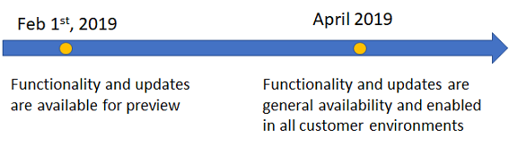
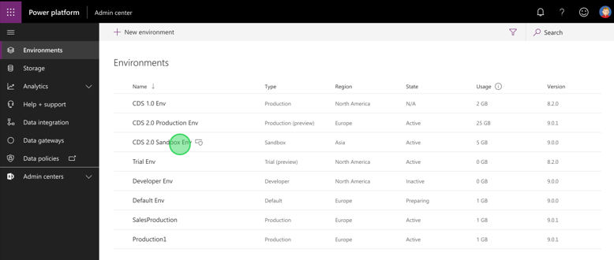
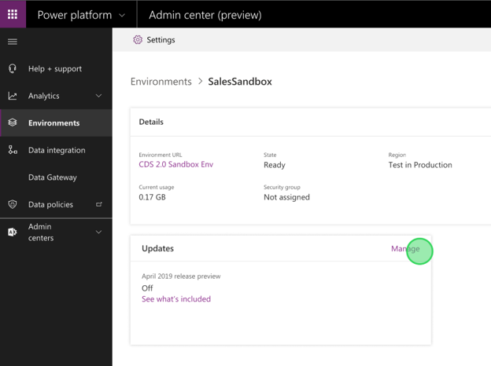
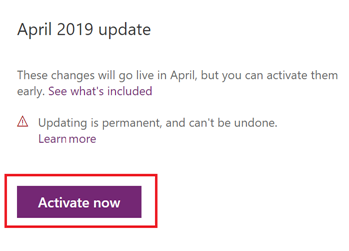
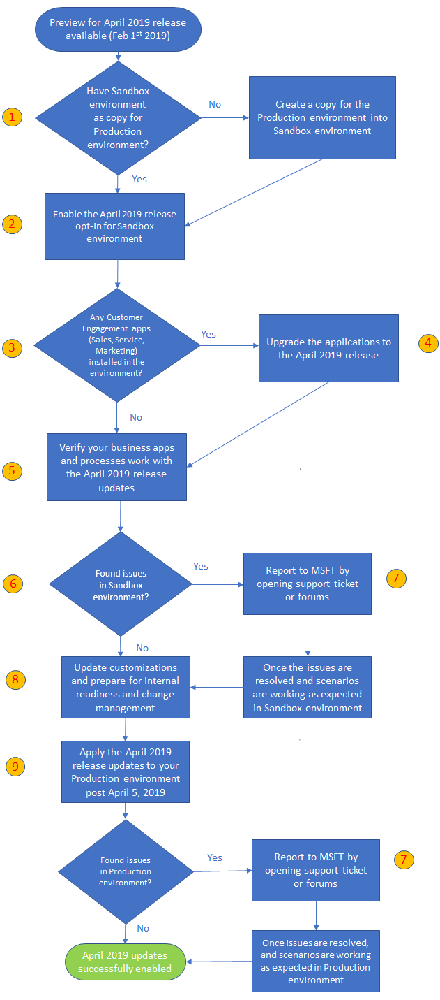

# Opt in to April 2019 updates

[!INCLUDE [cc-beta-prerelease-disclaimer](../includes/cc-beta-prerelease-disclaimer.md)]

You can enable the features coming in the April 2019 update by opting in to the updates in the Power Platform Admin center. Opting in will enable all changed user experience updates for Dynamics 365 for Customer Engagement, which will be enabled by default to everyone starting April 2019.

## Which environment can be used for previewing April 2019 updates?

The environments (instances) that are eligible for enabling April 2019 release are Production, Trial, and Sandbox. This will allow you the flexibility to explore the preview features, and then adopt them across your environments at a rate that suits your business.

> [!IMPORTANT]
> We highly recommend that you create a copy of your Production environment as a Sandbox environment to try out the April 2019 updates. After enabling the April 2019 update, it can’t be turned off. Hence, it’s necessary to first test out the updates in Sandbox environment, prior to enabling it in Production environment which could impact your users in the organization.
>
> Be sure to:
> - Understand [How do I prepare for the April 2019 update?](#how-do-i-prepare-for-the-april-2019-update)
> - Learn [what features are updated](#what-features-and-experiences-are-available-in-the-april-2019-update-) in the April 2019 update.
> - Test the updates before rolling out to production.
>
> By activating the April 2019 updates opt-in, you will get changed user experience updates only.

## How do I enable the April 2019 updates

Visit [Power platform Admin center](https://admin.powerplatform.microsoft.com/) and select the environment you want to enable the April 2019 updates.

> [!div class="mx-imgBorder"] 
> 

On selecting, it will take you to the environment’s hub where you can select to manage the updates.

> [!div class="mx-imgBorder"] 
> 

Select **Activate now** to activate the April 2019 updates.

> [!div class="mx-imgBorder"] 
>  

The April 2019 update is activated for the Dynamics 365 platform and Dynamics 365 for Sales.

You can verify activation by going to **Settings** ()> **About** where you'll see a screen like the following:

> [!NOTE]
> You need to select **About** from a Customer Engagement app page that's displayed in the [Unified Interface](https://docs.microsoft.com/dynamics365/customer-engagement/admin/about-unified-interface) such as Sales Hub or Customer Service Hub pages.
>
> The server version will not be updated to the next version after activation.

<!-- See what all is included in the April 2019 updates for platform and Sales app.--> 

For enabling the April 2019 updates for Marketing app, visit the [Dynamics 365 Admin center](https://port.crm.dynamics.com/G/manage/index.aspx) and update the Marketing app.

<!-- See what all is included in the April 2019 updates for Marketing -->

See the following section for other update information.

## What features and experiences are available in the April 2019 update?  

The April 2019 update has two kind of functionalities (as with any other update):
- Updates to existing user experience
- New functionality or updates to maker and admin functionality

By activating the April 2019 updates opt-in, you will get updates **to existing user experience only**. The exact list of features which are updates to existing user experiences are listed [here](https://go.microsoft.com/fwlink/p/?linkid=2056743). 
 
The Release Notes lists other features across Dynamics 365 – Sales, Service, Marketing and PowerApps (and platform). Features which are not updates to the existing user experience will not be part of the April 2019 updates opt-in. They can either be new functionalities or additions to maker and admin functionality.

## FAQ

### How will the April 2019 features be enabled for customers who did not opt in to the preview?

Starting April 5, 2019, we will enable the April 2019 features (end user impacting only) across our global customer base. Your environment/org will be updated based on the region they are located. Here is the current schedule.

|Japan  |South America  |Canada  |India  |Asia  |Great Britain  |Australia  |Europe  |North America|
|---------|---------|---------|---------|---------|---------|---------|---------|--------|
|Fri 4/5  | Fri 4/5  | Fri 4/5 |Fri 4/5 | Fri 4/12 | Fri 4/12 | Fri 4/12 | Fri 4/19 |Fri 4/26 |

On the above dates, your environments will have the April 2019 updates automatically applied for the Dynamics 365 platform and the Sales app. It will not require any action from you.

For Dynamics 365 Marketing, you need to explicitly upgrade your app in the Dynamics 365 Admin Center.

If you want to enable the April 2019 features (end user impacting only) before the update reaches your region, you can enable the updates yourself by opting in to the April 2019 update between February 1, 2019, and the date your region will be scheduled to have the features turned on. 

To know the list of end user impacting features, check our [Dynamics 365 features for early access](https://aka.ms/April2019Opt-ins). Note: End user impacting features for April 2019 release are targeting the Unified Interface only. Web client environments/orgs will not be impacted by these updates.

### Will the version number get updated with the April 2019 update?
No, the version number will not get changed with the April 2019 update.

### Will Microsoft provide a free Sandbox environment at no charge for testing updates? 
You will need to create a Sandbox environment (a copy of the Production environment) which is not provided for free.

### When will the updates be available for testing in the Sandbox environment?
The updates are available now. All you need to do is to activate the April 2019 update as described above.

### Which updates will have an opt-in switch and which ones will be provided by default? 

Only the existing user experience changes are provided with the April 2019 update opt-in; the rest will be available later. Existing user experiences will not get impacted with the update, unless the updates are not made to the existing solutions. Here are [all the features and updates provided](https://docs.microsoft.com/en-us/power-platform/admin/preview-april-2019-updates#what-features-and-experiences-are-available-in-the-april-2019-update-).

### What is the process for reporting issues with the update?
Create a [support ticket](get-help-support.md).

## How do I prepare for the April 2019 update?
The flow chart below shows the steps needed to enable the April 2019 release to your Production environment prior to it being enabled by default in April 2019. The table below the flow chart provides information about the steps.

> [!div class="mx-imgBorder"] 
> 

|  |  |
|---------|---------|
|(1)    | **Have a Sandbox environment as a copy for the Production environment**   We strongly recommend enabling the April 2019 release first in a Sandbox environment which is a replica or copy of the existing Production environment. This is to make sure that a customer has validated the updates in another environment prior to impacting the current Production apps and environment.    Also, once April 2019 updates are enabled for an environment, they cannot be turned off like any other setting. Learn more about it in (3) below.  **Create a copy of the Production environment into a Sandbox environment**  If you don’t have a Sandbox copy of your Production environment, you can create a [copy](https://docs.microsoft.com/dynamics365/customer-engagement/admin/copy-instance) in the Dynamics 365 admin center.  **Create a backup of the Production environment**    For restoration, if needed.   |
|(2)     | **Enable the April 2019 opt-in from the Power platform Admin center**  Starting February 1, 2019,  you will be able to enable the April 2019 release for the environment. This option will be available in **Environment** > **Settings** > **Previews and updates**. Once enabled for an environment, you cannot turn this off for the environment. To remove the April 2019 updates for your environment, you will have to either reset the environment or restore the environment to a previously backed up version. We do not recommend doing any of those options unless necessary. It's important to try the April 2019 updates in your Sandbox environment first prior to enabling it in your Production environment.        |
|(3)     |**Any Dynamics 365 for Customer Engagement apps installed on the environment?**  If you have any Dynamics 365 for Customer Engagement apps on your environment like Sales, Service and Marketing, they need to be explicitly updated to the April 2019 version.  |
|(4)     | **Update the applications from Dynamics 365 admin center**  Once you have enabled the April 2019 updates for your environment, you can update your apps from Dynamics 365 admin center > Applications. For example, if you have the Dynamics 365 for Sales application installed on your environment, then the option to update will be visible in the admin center. Please note that upgrading the app might take a few hours and you might see a downtime for your applications going through the update process.  |
|(5)     | **We recommend testing out all the scenarios exhaustively in this step**   As recommended in Step 3, if you have any Dynamics 365 for Customer Engagement apps in your environment like Sales, Service and Marketing, they need to be explicitly updated to the April 2019 version.  |
|(6) and (7)     |**Report any issues found**   As you verify the experience in your preview environment, if you find any regressions, functional, or performance issues related to the April 2019 updates that could impact your business, report them to Microsoft by opening a [support ticket](https://dynamics.microsoft.com/support/) or through the [Dynamics 365 forum](https://community.dynamics.com/f). |
|(8)     | **Enable the April 2019 updates in your Sandbox environment**  You should: <ol><li>Update customizations to leverage or respond to new capabilities.</li><li>Update internal readiness materials based on new features or user experiences.</li><li>Prepare internal change management to run in April (training, communications, etc.)</li></ol>   |
|(9)     | **Enable the April 2019 updates in your Production environment**  We recommend enabling these updates during business downtime after you have validated your key scenarios are working as expected. Please note, once the April 2019 update is enabled this cannot be reversed. However, you can restore to a prior backup version of the updated environment if needed.  |

