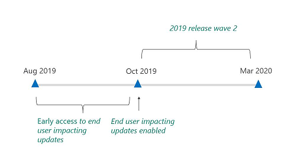
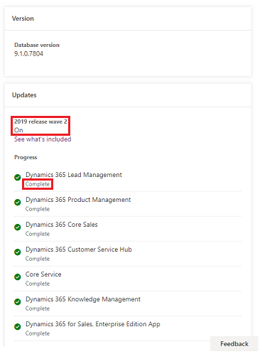
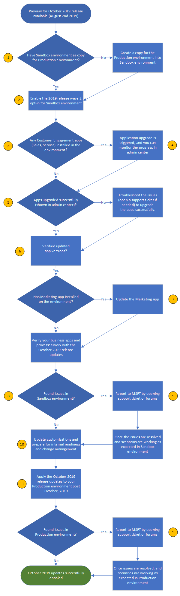

# Early opt-in to 2019 release wave 2 

Starting October 5, 2019, we will enable the 2019 release wave 2 features (end user impacting only) across our global customer base. Your environment/org will be updated during one of the [maintenance windows](https://docs.microsoft.com/dynamics365/customer-engagement/admin/policies-communications#maintenance-timeline) over a weekend, starting on the dates listed below. The specific dates that the update will occur will be published in the [Message Center](https://docs.microsoft.com/dynamics365/customer-engagement/admin/policies-communications#maintenance-timeline), and each post will include the date, maintenance window, and a link to the Weekly Release Notes that contain the list of optimizations, fixes, and enhancements. Each environment/org should see the new features and build numbers by Monday morning, local time.

> [!TIP]
> Check the schedule below, you might not need to enable early access to 2019 release.

Below are the current schedules for when the 2019 release wave 2 features will be enabled.

If you're region is currently at the date below, you don't need to enable early access to 2019 release wave 2 as the opt-in process is underway.

**Regions**

|Japan  |South  America  |Canada  |India  |Asia  | 
|---------|---------|---------|---------|---------|
|Fri, Oct 11 to Sun, Oct 13 | Fri, Oct 4 to Sun, Oct 6  | Fri, Oct 4 to Sun, Oct 6  |Fri, Oct 4 to Sun, Oct 6  | Fri, Oct 11 to Sun, Oct 13 | 

**Regions continued**

|Great  Britain  |Australia  |Europe  |North  America|  
|---------|---------|---------|---------|---------|
|Fri, Oct 11 to Sun, Oct 13| Fri, Oct 11 to Sun, Oct 13  | Fri, Oct 18 to Sun, Oct 20| Fri, Oct 25 to Sun, Oct 27 | 

**Other1**

|GCC  |GCC High  |DOD  |
|---------|---------|---------|
|Fri, Nov 1 to Sun, Nov 3| Fri, Nov 1 to Sun, Nov 3 | Fri, Nov 1 to Sun, Nov 3 |

1See: [Dynamics 365 US Government](https://docs.microsoft.com/dynamics365/customer-engagement/admin/government/microsoft-dynamics-365-government).

On the above dates, your environments will have the 2019 release wave 2 updates automatically applied for the Dynamics 365 platform and apps. It will not require any action from you.

For Dynamics 365 Marketing, you need to explicitly upgrade your app in the Dynamics 365 admin center.

If you want to enable the 2019 release wave 2 features (end user impacting only) before the update reaches your region, you can enable the updates yourself by opting in to the 2019 release wave 2 update between February 1, 2019, and the date your region will be scheduled to have the features turned on. 

To know the list of end user impacting features, check our [Dynamics 365 features for early access](https://aka.ms/EarlyAccessFeatures). Note: End user impacting features for the 2019 release wave 2 are targeting the Unified Interface only. Web client environments/orgs will not be impacted by these updates.

## About early access to 2019 release wave 2

If date in your region is before the date described above, you can enable the features coming in the 2019 release wave 2 update by opting in to the updates in the Power Platform Admin center. Opting in will enable all changed user experience updates for Dynamics 365 apps, which will be enabled by default to everyone starting in 2019 release wave 2.

> [!div class="mx-imgBorder"] 
> 

Check out the new features releasing from October 2019 through March 2020 for Dynamics 365. See [Dynamics 365 release schedule and early access](https://aka.ms/EarlyAccessFAQ).

> [!NOTE]
> Most of the early opt-in features are end user impacting changes. Check out the "Enabled for" column in the [early access features](https://aka.ms/EarlyAccessFeatures) table to know the features that will roll out to the end users automatically in October 2019. 

> [!TIP]
>  Check out the following video: [How to enable early access to 2019 release wave 2 for Dynamics 365 apps](https://youtu.be/q0jYSpsvRbI).  

## Which environment can be used for early opt-in to 2019 release wave 2 updates?

You can enable trial and Sandbox environments for the 2019 release wave 2 release. This will allow you the flexibility to explore features, and then adopt them across your environments at a rate that suits your business.

> [!IMPORTANT]
> While you can enable a Production environment, we highly recommend that you create a copy of your Production environment as a Sandbox environment to try out the 2019 release wave 2 updates. After enabling the 2019 release wave 2 update, it can’t be turned off. Therefore, it’s necessary to first test the updates in a Sandbox environment prior to enabling them in a Production environment that could impact your users in the organization.
>
> Be sure to:
> - Understand the [Dynamics 365: 2019 release wave 2 plan](https://docs.microsoft.com/dynamics365-release-plan/2019wave2/).
> - Learn [what features are included in the 2019 release wave 2 plan](https://docs.microsoft.com/power-platform-release-plan/2019wave2/microsoft-powerapps/planned-features).
> - Review [How do I prepare for the 2019 release wave 2 update?](#how-do-i-prepare-for-the-2019-release-wave-2-update)
> - Test the updates before rolling out to Production.
>
> By activating the 2019 release wave 2 updates opt-in, you will get features and updates that are end user impacting only. These and other changes will be enabled automatically for everyone in October 2019.
> 
> [Tenant to tenant migration](https://docs.microsoft.com/dynamics365/customer-engagement/admin/move-instance-tenant) is not supported for early opt-in.

## How do I enable the 2019 release wave 2 updates

Visit the [Power Platform Admin center](https://admin.powerplatform.microsoft.com/) and select the environment you want to enable for the 2019 release wave 2 updates.

> [!IMPORTANT]
> We highly recommend that you create a copy of your Production environment as a Sandbox environment to try out the 2019 release wave 2 updates. After enabling the 2019 release wave 2 update, it can’t be turned off. Therefore, it’s necessary to first test the updates in a Sandbox environment prior to enabling it in a Production environment that could impact your users in the organization.

Select **Manage**.

> [!div class="mx-imgBorder"] 
> 

Select **Update now** to activate the 2019 release wave 2 updates and proceed through confirmation dialogs. 

> [!div class="mx-imgBorder"] 
>  

The 2019 release wave 2 update is activated for the Dynamics 365 platform, Dynamics 365 Sales, Customer Service, Sales Hub, Customer Service Hub, and Marketing.

> [!NOTE]
> You will need to take additional steps to enable the 2019 release wave 2 updates for Field Service and the Marketing app. For Field Service, go to the Admin Center and apply the update for the Field Service app. For the Marketing app, see [Trials and upgrades](https://docs.microsoft.com/dynamics365/field-service/version-history#trials-and-upgrades).
>
> Current apps for which you have licenses are updated; new apps are not installed.

You can verify activation by going to **Settings** ()> **About** where you'll see a screen like the following:

|In Unified Interface  |In web client interface  | 
|---------|-------|
|        |         |

> [!NOTE]
> You need to select **About** from a Dynamics 365 apps page that's displayed in the [Unified Interface](https://docs.microsoft.com/dynamics365/customer-engagement/admin/about-unified-interface) such as Sales Hub or Customer Service Hub pages.
>
> The server version will not be updated to the next version after activation.

## What features and experiences are available in the 2019 release wave 2 update?  

The 2019 release wave 2 update has three kinds of functionalities (as with any other update):
- Updates to existing user experiences that are updated automatically.
- Updates to existing user experiences that are updated by the admin and maker.
- Updates to admin and maker functionality.

By activating the 2019 release wave 2 updates opt-in, you will get updates **to existing user experience only**. The exact list of features that are updates to existing user experiences are listed on the [early access page](https://aka.ms/EarlyAccessFeatures). 
 
The release wave 2 plan lists other features across Dynamics 365 – Sales, Service, Marketing, and PowerApps (and platform). Features that are not updates to the existing user experience will not be part of the 2019 release wave 2 updates opt-in. They can either be new functionalities or additions to maker and admin functionality.

## Check the status of the update and troubleshoot

An update can take several hours. 

To check status during the update, select the environment in the Power Platform Admin center and review the **Updates** section.

> [!div class="mx-imgBorder"] 
>  

Use the following table to check the status of the 2019 release wave 2 update and see troubleshooting recommendations.

|App/Platform  |How to identify update success  |Troubleshoot  |
|---------|---------|---------|
|Common Data Service/Platform     | 1**About** page Look for *2019 release wave 2 enabled*        |Create a [support ticket](https://dynamics.microsoft.com/support/).         |
|Dynamics 365 Sales     |2**Internal Solution History** page        |Updating the application might take few hours. Wait up to 24 hours before creating a [support ticket](https://dynamics.microsoft.com/support/).   |
|Dynamics 365 Customer Service     | 1**About** page  Look for *2019 release wave 2 enabled*            | Create a [support ticket](https://dynamics.microsoft.com/support/).   |
|Knowledge Management     | 2**Internal Solution History** page / **Application** tab         | Updating the application might take few hours. Wait up to 24 hours before creating a [support ticket](https://dynamics.microsoft.com/support/).        |
|Field Service  | 2**Internal Solution History** page / **Application** tab |  Updating the application might take few hours. Wait up to 24 hours before creating a [support ticket](https://dynamics.microsoft.com/support/). | 
|Marketing     | 1**Internal Solution History** page / **Application** tab         | Updating the application might take few hours. Wait up to 24 hours before creating a [support ticket](https://dynamics.microsoft.com/support/).  |

1Select **Settings** ()> **About**. 

2Select an environment, select **Open environment** > **Settings** > **Solutions** > **All Solutions - Internal**. Find the app in the **Display Name** column and then check the version number with the following table.

|Display name  |Version number |
|---------|---------|
|Dynamics 365 Sales Application    | 9.0.1908.3501 or greater  |
|Knowledge Management Features    | 9.0.1.8xx or 9.0.1.9xx |
|Field Service  | 8.8.5.1Y, Y is greater than or equal to 0  
|Dynamics 365 Marketing     | 1.35.10041.1071 |

## Enable the 2019 release wave 2 updates for Dynamics 365 Marketing

To enable 2019 release wave 2 early access features for Dynamics 365 Marketing:

1.	Opt in for early access on the environment where your Marketing environment is running, as described in [How do I enable the 2019 release wave 2 updates](#how-do-i-enable-the-2019-release-wave-2-updates).
2.	Run the Marketing setup wizard to update your environment to the August 2019 release. This will install both the August 2019 Production update and the early-access features when you run it on an environment where early access is enabled. For instructions, see [Re-run the Marketing setup wizard](https://docs.microsoft.com/dynamics365/customer-engagement/marketing/re-run-setup).

> [!NOTE]
> If you update your Marketing app to the August 2019 release _before_ opting in for early access, then you must re-run the Marketing setup wizard after opting in to install and enable the early access features.

For an overview of early access features being offered for Marketing, plus links to detailed documentation, see the [August 2019 release announcement for Marketing](https://cloudblogs.microsoft.com/dynamics365/it/2019/08/03/dynamics-365-for-marketing-august-update-and-early-access-are-rolling-out-now/).

## FAQ

### After updating to 2019 release wave 2, can I export solutions?
You can only export solutions to other environments which have also been updated to 2012 release wave 2.

### Will the version number be updated with the 2019 release wave 2 update?
No, the version number will not change with the 2019 release wave 2 update.

### Will Microsoft provide a free Sandbox environment at no charge for testing updates? 
You will need to create a Sandbox environment (a copy of the Production environment), which is not provided for free.

### When will the updates be available for testing in the Sandbox environment?
The updates are available now. All you need to do is activate the 2019 release wave 2 update as described above.

### Which updates will have an opt-in switch and which ones will be provided by default? 

Only the existing user experience changes are provided (and enabled by default) with the 2019 release wave 2 update opt-in; the rest will be available later. Existing user experiences will not be impacted by the update, unless the updates are not made to the existing solutions. Here are [all the features and updates provided](#what-features-and-experiences-are-available-in-the-2019-release-wave-2-update-).

### What is the process for reporting issues with the update?

Create a [support ticket](https://dynamics.microsoft.com/support/).

## How do I prepare for the 2019 release wave 2 update?
The following flow chart shows the steps needed to enable the 2019 release wave 2 release to your Production environment prior to it being enabled by default in 2019 release wave 2. The table that follows the flow chart provides information about the steps.

> [!div class="mx-imgBorder"] 
> 

|  |  |
|---------|---------|
|(1)    | **Have a Sandbox environment as a copy for the Production environment**   We strongly recommend enabling the 2019 release wave 2 release first in a Sandbox environment that is a replica or copy of the existing Production environment. This is to make sure that a customer has validated the updates in another environment prior to impacting the current Production apps and environment.    Also, once the 2019 release wave 2 updates are enabled for an environment, they cannot be turned off like any other setting.   **Create a copy of the Production environment into a Sandbox environment**  If you don’t have a Sandbox copy of your Production environment, you can create a [copy](https://docs.microsoft.com/dynamics365/customer-engagement/admin/copy-instance) in the Dynamics 365 admin center.  **Create a backup of the Production environment**    Recommended before merging Sandbox with changes into Production.    |
|(2)     | **Enable the 2019 release wave 2 opt-in from the Power Platform Admin center**  Starting August 2, 2019,  you will be able to enable the 2019 release wave 2 release for the environment. Once enabled for an environment, you cannot turn this off for the environment. To remove the 2019 release wave 2 updates from your environment, you will have to reset the environment. We do not recommend doing this unless necessary. It's important to try the 2019 release wave 2 updates in your Sandbox environment first prior to enabling them in your Production environment.        |
|(3)     |**Do you have Dynamics 365 Marketing?**  If you have the Marketing app, you will need to manually enable it according to the process listed above. Dynamics 365 apps on your environment like Sales and Service will be automatically updated to the 2019 release wave 2 version once you enable the update. |
|(4)     | **We recommend testing all the scenarios thoroughly in this step**   If you have any Dynamics 365 apps in your environment like Sales, Service, and Marketing, they need to be explicitly updated to the 2019 release wave 2 version.  |
|(5) and (6)     |Validate the app upgrade progress. See [Check status of the update and troubleshoot](#check-the-status-of-the-update-and-troubleshoot). |
|(7)     |Updating the Marketing app requires additional action. See [Enable the 2019 release wave 2 updates for Dynamics 365 Marketing](#enable-the-2019-release-wave-2-updates-for-dynamics-365-marketing).    |
|(8) and (9)    | **Report any issues found**  As you verify the experience in your preview environment, if you find any regressions, functional, or performance issues related to the 2019 release wave 2 updates that could impact your business, report them to Microsoft by opening a [support ticket](https://dynamics.microsoft.com/support/) or through the [Dynamics 365 forum](https://community.dynamics.com/f).  |
|(10)     | **Enable the 2019 release wave 2 updates in your Sandbox environment**  You should:  1. Update customizations to leverage or respond to new capabilities. 2.	Update internal readiness materials based on new features or user experiences. 3.	Prepare internal change management to run in October (training, communications, and so on). |
|(11)     |**Enable the 2019 release wave 2 updates in your Production environment**  We recommend enabling these updates during business downtime after you have validated that your key scenarios work as expected. Note that once the 2019 release wave 2 update is enabled, it cannot be reversed. However, you can restore to a prior backup version of the updated environment if needed. |

