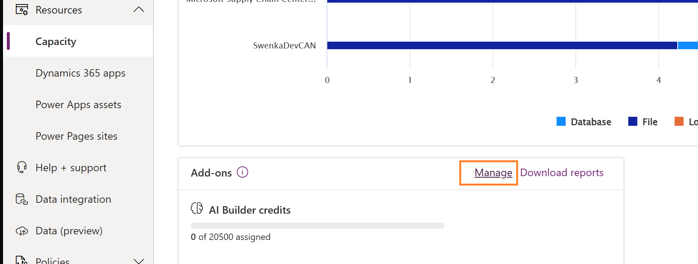
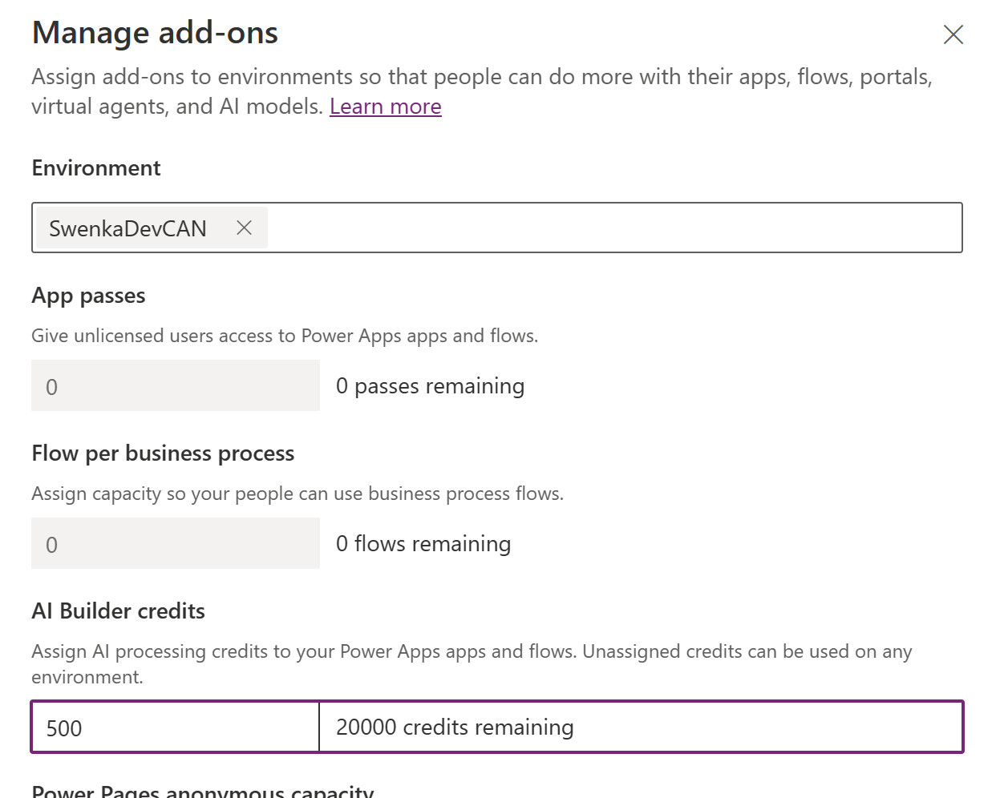

# Tutorial: Allocate add-ons to environments (preview)

[!INCLUDE [cc-beta-prerelease-disclaimer](../includes/cc-beta-prerelease-disclaimer.md)]

Add-ons provide extra capabilities that Power Apps, Power Automate Flows, and other resources can utilize.  These are assignable at the environment level in Power Platform admin center, and are made available based on prior license purchases.  To learn more about add-on management, reporting, and access control visit [Add-on capacity management](./capacity-add-on.md).

In this tutorial, you'll learn how to:

- Visit the admin center and manually allocate an add-on to an environment
- Allocate add-ons using PowerShell to perform this action at scale
- Unassign the add-on when finished

As an example of this scenario, a customer who has purchased AI Builder Credits and Power Automate per Process flows can assign those add-ons to an environment to account for usage in that environment.

> [!IMPORTANT]
> Power Platform APIs and tools are in preview.  Portions of this tutorial may change in the future.

## Login and perform the allocation

To start, we will login as a Power Platform administrator and will allocate AI Builder credits to a particular environment.  For this example, we will pick a random environment but you would want to assign the add-ons you require to the appropriate environments where they will be used.

### Before you begin

Not all add-ons are available in the admin center UI.  As new add-ons become available, they are often surfaced via API and programmability tools first to get customer feedback before making them more generally available in the UI.  Such an example is the Power Automate per Process add-on, which we will show how to allocate using PowerShell below.

# [Power Platform admin center](#tab/PPAC)

### Manual allocation from the admin center

Once logged in to the admin center, visit the **Resources** -> **Capacity** page.  From there, scroll down to the **Add-ons** section and click the **Manage** link.



On the next screen, select an environment and review all of the various add-ons you could assign.  As a reminder, you can only adjust add-ons for those you have previously purchased.  In this example, we will add 500 AI Builder Credits to the environment and click **Save**.



# [PowerShell](#tab/PowerShell)

### Automated allocation via PowerShell

Load up your PowerShell console and execute the following commands to allocate add-ons to a given environment.  In this example, we are selecting the same environment shown from the manual example in the admin center, but you could query for several environments and loop through each one as required.  Note that in the PowerShell example below, we are using the new **PowerAutomatePerProcess** add-on type, which is not yet available in the admin center UI.

For a list of all add-on types, see [Definitions: External Currency Type](/rest/api/power-platform/licensing/currency-allocation/get-currency-allocation-by-environment#externalcurrencytype).

```powershell
#Install the module
Install-Module -Name Az.Accounts

# Set variables for your session
$TenantId = "YOUR_TENANT_GUID_FROM_AAD"
$EnvironmentId = "YOUR_POWER_PLATFORM_ENVIRONMENT_ID_HERE"

Write-Host "Creating a session against the Power Platform API"

Connect-AzAccount
$AccessToken = Get-AzAccessToken -TenantId $TenantId -ResourceUrl "https://api.powerplatform.com/"

$headers = @{ 'Authorization' = 'Bearer '+$AccessToken.Token }
$headers.Add('Content-Type', 'application/json')

$patchRequestBody =  "{`"currencyAllocations`": `"[{currencyType: `"PowerAutomatePerProcess`", allocated:1}]`" }"

Write-Host "Calling patch to adjust add-on allocations..."

$patchRequestResponse = Invoke-RestMethod -Method Patch -Uri "https://api.powerplatform.com/licensing/environments/$EnvironmentId/allocations?api-version=2022-03-01-preview" 
-Headers $headers -Body $patchRequestBody

$patchRequestResponse

```
---

## Unassign the add-on when finished
In this step, we will clean up the allocation previously assigned.  This is also commonly done by admins who wish to reclaim capacity for other purposes.

# [Power Platform admin center](#tab/PPAC)

### Cleanup from the UI

Return to the Capacity page and click the **Manage** button in the Add-ons section.  From there, find the previous environment and remove the AI Builder Credits allocation and click **Save**.


# [PowerShell](#tab/PowerShell)

### Cleanup via PowerShell
Use the below script to remove the prior allocation.  Note to change the environmentID to one that matches your environment.

```powershell
#Install the module
Install-Module -Name Az.Accounts

# Set variables for your session
$TenantId = "YOUR_TENANT_GUID_FROM_AAD"
$EnvironmentId = "YOUR_POWER_PLATFORM_ENVIRONMENT_ID_HERE"

Write-Host "Creating a session against the Power Platform API"

Connect-AzAccount
$AccessToken = Get-AzAccessToken -TenantId $TenantId -ResourceUrl "https://api.powerplatform.com/"

$headers = @{ 'Authorization' = 'Bearer '+$AccessToken.Token }
$headers.Add('Content-Type', 'application/json')

$patchRequestBody =  "{`"currencyAllocations`": `"[{currencyType: `"PowerAutomatePerProcess`", allocated:0}]`" }"

Write-Host "Calling patch to adjust add-on allocations..."

$patchRequestResponse = Invoke-RestMethod -Method Patch -Uri "https://api.powerplatform.com/licensing/environments/$EnvironmentId/allocations?api-version=2022-03-01-preview" 
-Headers $headers -Body $patchRequestBody

$patchRequestResponse
```
---
