# Preview: Create a daily capacity report

The Power Platform API can be used to extract the various details and metadata from your Microsoft Power Platform environments, both those that use Microsoft Dataverse and those that don't.  The API is used internally by various clients available today such as PowerShell.

In this tutorial, you will learn how to:

- Create a Power Automate or Logic Apps workflow (Azure) or PowerShell script that authenticates with the Power Platform API.
- Call the List Environments endpoint to retrieve your Microsoft Power Platform environment details.
- Iterate through the capacity object to retrieve the actual consumption.
- Save the consumption data into a table for display.

As an example of this scenario, a customer is looking to get a handle on their capacity consumption so that they can better understand the allocation of their total tenant capacity by department.  This is so that the customer can perform some internal cost accounting functions and chargebacks based on how much each department is consuming of the total available capacity.  This customer is using the Environment Description to call out the department that owns each environment.  

> [!IMPORTANT]
> The Power Platform API is in preview. The host name and data contracts are subject to change by the time the endpoints become generally available.  At that time, this article will be updated with the final endpoint details.

## Connect and variable setup
Below are details on getting connected to the Power Platform programmatically.  You can choose between an Azure experience or PowerShell scripts using the tabs below.

# [Azure](#tab/Azure)
### Create the workflow and set up the variables
To start off, in this tutorial we will use a Logic Apps workflow.  A Power Automate flow is also acceptable, as well as any other orchestration engine that your company prefers to use for automation.  All of the calls to retrieve the data will be using RESTful APIs so any tooling that supports REST will work with this tutorial.

Visit the Azure portal, and then create a new logic app and give it a name:

> [!div class="mx-imgBorder"] 
> 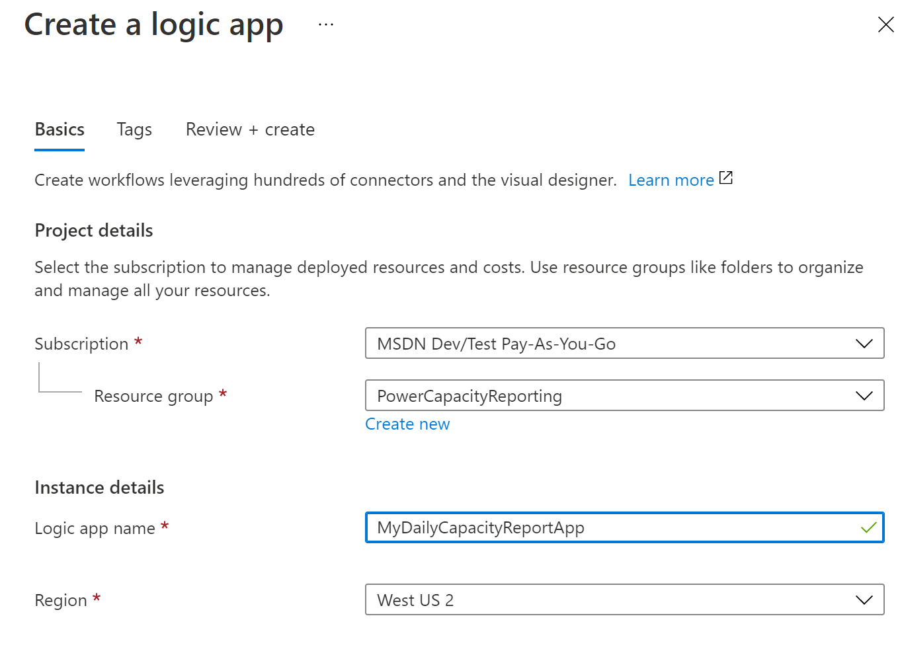

After that finishes provisioning, edit the workflow using the Designer and set up a Recurrence trigger to run daily:

> [!div class="mx-imgBorder"] 
> 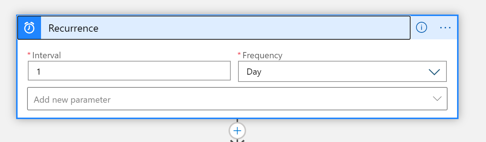

Next, we'll need to initialize five variables as detailed below:

- **SPN-Id** – This is your service principal ClientID.  It'll be used later to perform the authentication in a service principal context.  If you are using username/password context, you can skip this variable.
- **DBCapacity** – This is a Float variable for the consumed database capacity in megabytes.
- **FileCapacity** – This is a Float variable for the consumed file capacity in megabytes.
- **LogCapacity** – This is a Float variable for the consumed log capacity in megabytes.
- **SimplifiedEnvironmentArray-Init** – This is an Array variable that we will populate with a few environment properties.  This drastically simplifies the final HTML table report output.

> [!div class="mx-imgBorder"] 
> 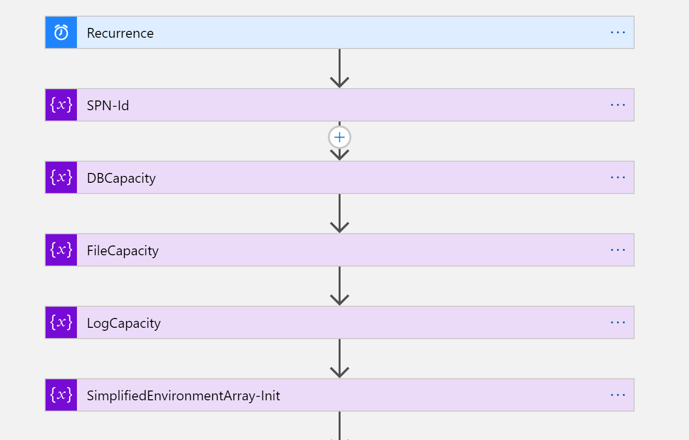

Next we will authenticate with Microsoft Azure Active Directory (Azure AD) and retrieve a token for calling the Power Platform API.  If you haven’t completed your Azure AD setup, see [Authentication](programmability-authentication.md).

In this tutorial, we are using a key vault to store our service principal secret value.  In this way, an IT administrator can make this value securely available for your workflow.  This is then populated in the POST call to Azure AD to retrieve the token as shown:

> [!div class="mx-imgBorder"] 
> 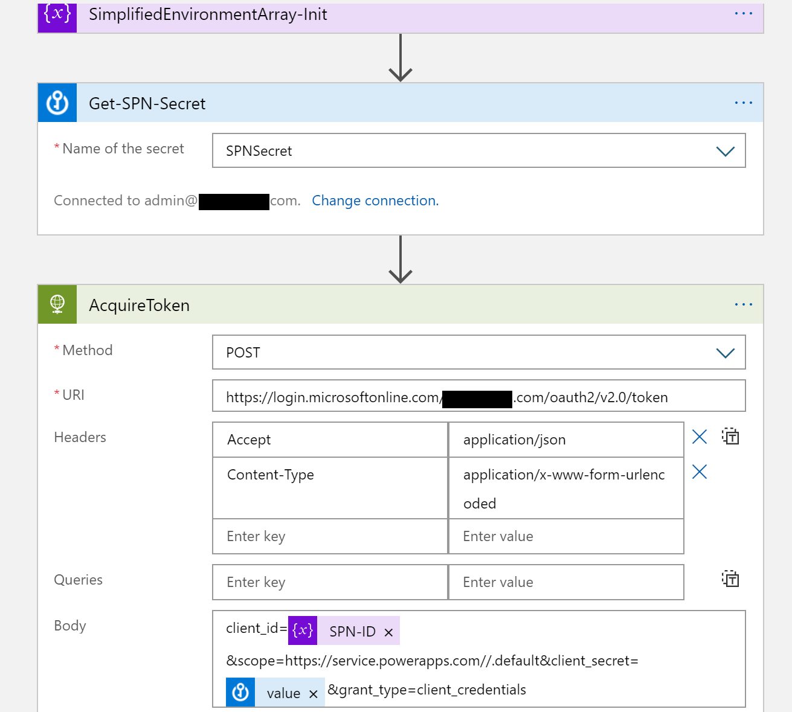

We then parse the Azure AD token response into a typed object using this JSON schema in the 'Parse JSON' action:

```json
{
    "properties": {
        "access_token": {
            "type": "string"
        },
        "expires_in": {
            "type": "integer"
        },
        "ext_expires_in": {
            "type": "integer"
        },
        "token_type": {
            "type": "string"
        }
    },
    "type": "object"
}
```

> [!div class="mx-imgBorder"] 
> 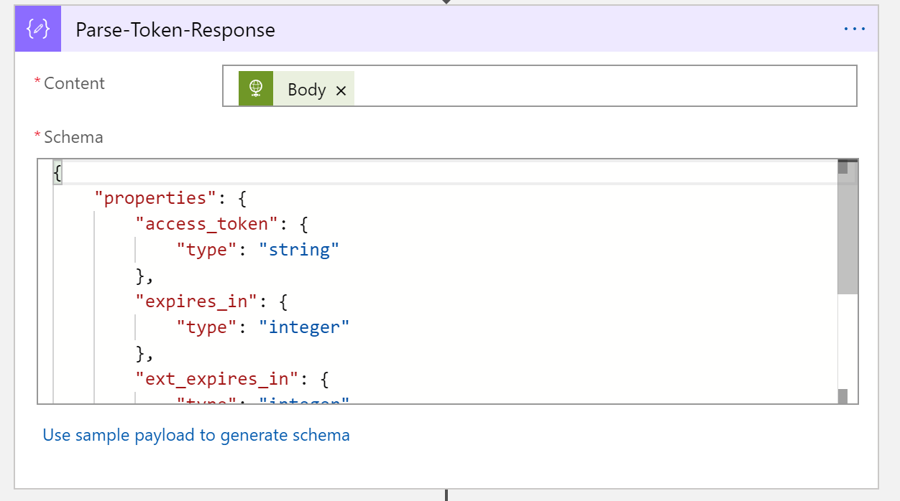

# [PowerShell](#tab/PowerShell)

### Initialize the variables and connect to Power Platform API
Use the below script to initialize some variables that we will use throughout the tutorial.  Optionally, you may use Username/Password authentication but it is not advised.

```powershell
#Install the module
Install-Module -Name Microsoft.PowerApps.Administration.PowerShell

# Set variables for your session
$TenantId = "YOUR_TENANT_GUID_FROM_AAD"
$SPNId = "YOUR_AZURE_APPLICATION_REGISTRATION_CLIENT_ID"
$ClientSecret = "YOUR_AZURE_APPLICATION_CLIENT_SECRET"
$capacityDetailsList = @()

Write-Host "Creating a session against the Power Platform API"

Add-PowerAppsAccount -Endpoint prod -TenantID $TenantId -ApplicationId $SPNId -ClientSecret $ClientSecret
```
---

## Fetch environments
In this section we will fetch the environment list that you administer.  This can be done via API as well as PowerShell.

# [Azure](#tab/Azure)

### Call the List Environments endpoint
Now is the time to call the Power Platform API.  We’ll use the List Environments endpoint to retrieve all of our environments and their metadata, specifically with the $expand parameter for capacity.  This also uses the Authorization header with the Bearer Token we received in the previous section from Azure AD.  If you used username/password context, you can also enter that Bearer Token at this step as well.

> [!div class="mx-imgBorder"] 
> 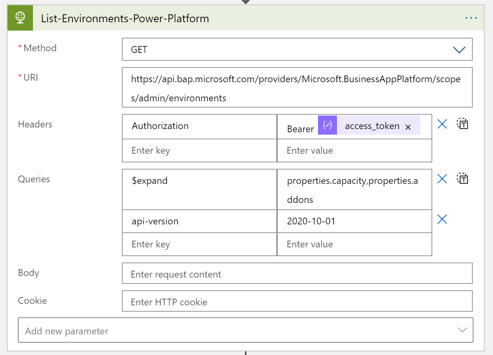

We then parse the Power Platform API response into a strongly typed object using this JSON schema with the 'Parse JSON' action:
```json
{
    "properties": {
        "value": {
            "items": {
                "properties": {
                    "description": {
                        "type": "string"
                    },
                    "id": {
                        "type": "string"
                    },
                    "location": {
                        "type": "string"
                    },
                    "name": {
                        "type": "string"
                    },
                    "properties": {
                        "properties": {
                            "addons": {
                                "type": "array"
                            },
                            "azureRegion": {
                                "type": "string"
                            },
                            "capacity": {
                                "items": {
                                    "properties": {
                                        "actualConsumption": {
                                            "type": "number"
                                        },
                                        "capacityType": {
                                            "type": "string"
                                        },
                                        "capacityUnit": {
                                            "type": "string"
                                        },
                                        "ratedConsumption": {
                                            "type": "number"
                                        },
                                        "updatedOn": {
                                            "type": "string"
                                        }
                                    },
                                    "required": [
                                        "capacityType",
                                        "actualConsumption",
                                        "ratedConsumption",
                                        "capacityUnit",
                                        "updatedOn"
                                    ],
                                    "type": "object"
                                },
                                "type": "array"
                            },
                            "clientUris": {
                                "properties": {
                                    "admin": {
                                        "type": "string"
                                    },
                                    "maker": {
                                        "type": "string"
                                    }
                                },
                                "type": "object"
                            },
                            "cluster": {
                                "properties": {
                                    "category": {
                                        "type": "string"
                                    },
                                    "number": {
                                        "type": "string"
                                    }
                                },
                                "type": "object"
                            },
                            "connectedGroups": {
                                "type": "array"
                            },
                            "createdBy": {
                                "properties": {
                                    "displayName": {
                                        "type": "string"
                                    },
                                    "id": {
                                        "type": "string"
                                    },
                                    "type": {
                                        "type": "string"
                                    }
                                },
                                "type": "object"
                            },
                            "createdTime": {
                                "type": "string"
                            },
                            "creationType": {
                                "type": "string"
                            },
                            "databaseType": {
                                "type": "string"
                            },
                            "displayName": {
                                "type": "string"
                            },
                            "environmentSku": {
                                "type": "string"
                            },
                            "isDefault": {
                                "type": "boolean"
                            },
                            "linkedEnvironmentMetadata": {
                                "properties": {
                                    "backgroundOperationsState": {
                                        "type": "string"
                                    },
                                    "baseLanguage": {
                                        "type": "number"
                                    },
                                    "createdTime": {
                                        "type": "string"
                                    },
                                    "domainName": {
                                        "type": "string"
                                    },
                                    "friendlyName": {
                                        "type": "string"
                                    },
                                    "instanceApiUrl": {
                                        "type": "string"
                                    },
                                    "instanceState": {
                                        "type": "string"
                                    },
                                    "instanceUrl": {
                                        "type": "string"
                                    },
                                    "platformSku": {
                                        "type": "string"
                                    },
                                    "resourceId": {
                                        "type": "string"
                                    },
                                    "scaleGroup": {
                                        "type": "string"
                                    },
                                    "uniqueName": {
                                        "type": "string"
                                    },
                                    "version": {
                                        "type": "string"
                                    }
                                },
                                "type": "object"
                            },
                            "protectionStatus": {
                                "properties": {
                                    "keyManagedBy": {
                                        "type": "string"
                                    }
                                },
                                "type": "object"
                            },
                            "provisioningState": {
                                "type": "string"
                            },
                            "retentionDetails": {
                                "properties": {
                                    "backupsAvailableFromDateTime": {
                                        "type": "string"
                                    },
                                    "retentionPeriod": {
                                        "type": "string"
                                    }
                                },
                                "type": "object"
                            },
                            "retentionPeriod": {
                                "type": "string"
                            },
                            "runtimeEndpoints": {
                                "properties": {
                                    "microsoft.ApiManagement": {
                                        "type": "string"
                                    },
                                    "microsoft.BusinessAppPlatform": {
                                        "type": "string"
                                    },
                                    "microsoft.CommonDataModel": {
                                        "type": "string"
                                    },
                                    "microsoft.Flow": {
                                        "type": "string"
                                    },
                                    "microsoft.PowerApps": {
                                        "type": "string"
                                    },
                                    "microsoft.PowerAppsAdvisor": {
                                        "type": "string"
                                    }
                                },
                                "type": "object"
                            },
                            "states": {
                                "properties": {
                                    "management": {
                                        "properties": {
                                            "id": {
                                                "type": "string"
                                            }
                                        },
                                        "type": "object"
                                    },
                                    "runtime": {
                                        "properties": {
                                            "id": {
                                                "type": "string"
                                            }
                                        },
                                        "type": "object"
                                    }
                                },
                                "type": "object"
                            },
                            "updateCadence": {
                                "properties": {
                                    "id": {
                                        "type": "string"
                                    }
                                },
                                "type": "object"
                            }
                        },
                        "type": "object"
                    },
                    "type": {
                        "type": "string"
                    }
                },
                "required": [
                    "id",
                    "type",
                    "location",
                    "name",
                    "properties"
                ],
                "type": "object"
            },
            "type": "array"
        }
    },
    "type": "object"
}
```

> [!div class="mx-imgBorder"] 
> 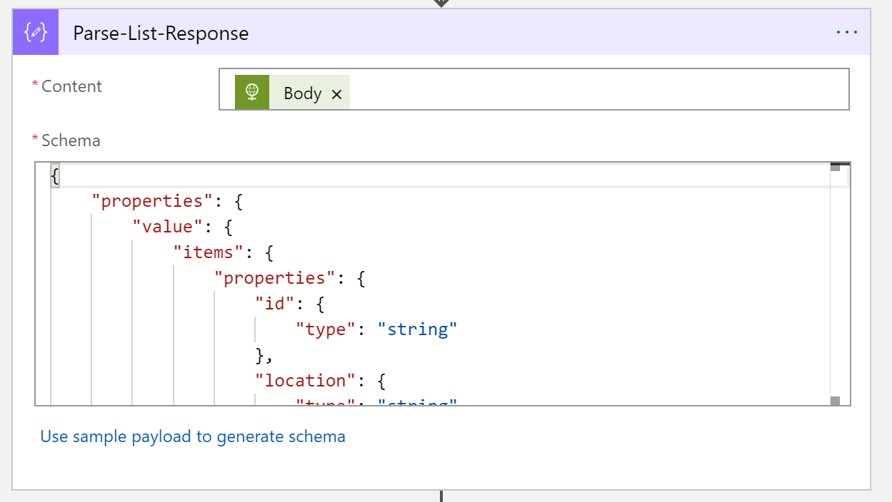

# [PowerShell](#tab/PowerShell)

### Pass capacity flag
Use the below script to pull a list of all environments you are the administrator over.  Using the new "-Capacity" flag you can add capacity consumption information for each environment retrieved.

```powershell
#fetch environment list with capacity populated.  This is only possible when calling full environment list
$environmentsList = Get-AdminPowerAppEnvironment -Capacity
```
---

## Iterate through the Capacity object
This is the most complex part of the tutorial.  Here we'll use a loop inside of a loop to iterate each environment in the List Environment response, and each environment has an array of capacity details that we will iterate as well.  This will let us capture the necessary information for each environment row in our capacity report table.

# [Azure](#tab/Azure)

### For-each and parsing

Let’s take this step by step.  First, we will use a For Each control using the ‘value’ of the Parse-List-Response output:

> [!div class="mx-imgBorder"] 
> 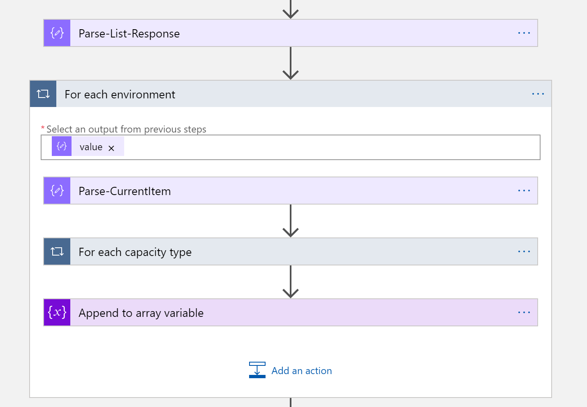

Then we parse this single environment into a strongly typed object using this JSON schema:

```json
{
    "properties": {
        "description": {
            "type": "string"
        },
        "id": {
            "type": "string"
        },
        "location": {
            "type": "string"
        },
        "name": {
            "type": "string"
        },
        "properties": {
            "properties": {
                "addons": {
                    "type": "array"
                },
                "azureRegion": {
                    "type": "string"
                },
                "capacity": {
                    "items": {
                        "properties": {
                            "actualConsumption": {
                                "type": "number"
                            },
                            "capacityType": {
                                "type": "string"
                            },
                            "capacityUnit": {
                                "type": "string"
                            },
                            "ratedConsumption": {
                                "type": "number"
                            },
                            "updatedOn": {
                                "type": "string"
                            }
                        },
                        "required": [
                            "capacityType",
                            "actualConsumption",
                            "ratedConsumption",
                            "capacityUnit",
                            "updatedOn"
                        ],
                        "type": "object"
                    },
                    "type": "array"
                },
                "clientUris": {
                    "properties": {
                        "admin": {
                            "type": "string"
                        },
                        "maker": {
                            "type": "string"
                        }
                    },
                    "type": "object"
                },
                "cluster": {
                    "properties": {
                        "number": {
                            "type": "string"
                        }
                    },
                    "type": "object"
                },
                "connectedGroups": {
                    "type": "array"
                },
                "createdBy": {
                    "properties": {
                        "displayName": {
                            "type": "string"
                        },
                        "id": {
                            "type": "string"
                        },
                        "type": {
                            "type": "string"
                        }
                    },
                    "type": "object"
                },
                "createdTime": {
                    "type": "string"
                },
                "creationType": {
                    "type": "string"
                },
                "databaseType": {
                    "type": "string"
                },
                "displayName": {
                    "type": "string"
                },
                "environmentSku": {
                    "type": "string"
                },
                "isDefault": {
                    "type": "boolean"
                },
                "linkedEnvironmentMetadata": {
                    "properties": {
                        "backgroundOperationsState": {
                            "type": "string"
                        },
                        "baseLanguage": {
                            "type": "integer"
                        },
                        "createdTime": {
                            "type": "string"
                        },
                        "domainName": {
                            "type": "string"
                        },
                        "friendlyName": {
                            "type": "string"
                        },
                        "instanceApiUrl": {
                            "type": "string"
                        },
                        "instanceState": {
                            "type": "string"
                        },
                        "instanceUrl": {
                            "type": "string"
                        },
                        "resourceId": {
                            "type": "string"
                        },
                        "scaleGroup": {
                            "type": "string"
                        },
                        "uniqueName": {
                            "type": "string"
                        },
                        "version": {
                            "type": "string"
                        }
                    },
                    "type": "object"
                },
                "protectionStatus": {
                    "properties": {
                        "keyManagedBy": {
                            "type": "string"
                        }
                    },
                    "type": "object"
                },
                "provisioningState": {
                    "type": "string"
                },
                "retentionDetails": {
                    "properties": {
                        "backupsAvailableFromDateTime": {
                            "type": "string"
                        },
                        "retentionPeriod": {
                            "type": "string"
                        }
                    },
                    "type": "object"
                },
                "retentionPeriod": {
                    "type": "string"
                },
                "runtimeEndpoints": {
                    "properties": {
                        "microsoft.ApiManagement": {
                            "type": "string"
                        },
                        "microsoft.BusinessAppPlatform": {
                            "type": "string"
                        },
                        "microsoft.CommonDataModel": {
                            "type": "string"
                        },
                        "microsoft.Flow": {
                            "type": "string"
                        },
                        "microsoft.PowerApps": {
                            "type": "string"
                        },
                        "microsoft.PowerAppsAdvisor": {
                            "type": "string"
                        }
                    },
                    "type": "object"
                },
                "states": {
                    "properties": {
                        "management": {
                            "properties": {
                                "id": {
                                    "type": "string"
                                }
                            },
                            "type": "object"
                        },
                        "runtime": {
                            "properties": {
                                "id": {
                                    "type": "string"
                                }
                            },
                            "type": "object"
                        }
                    },
                    "type": "object"
                },
                "updateCadence": {
                    "properties": {
                        "id": {
                            "type": "string"
                        }
                    },
                    "type": "object"
                }
            },
            "type": "object"
        },
        "type": {
            "type": "string"
        }
    },
    "type": "object"
}
```
Next, we will use another For Each control using the ‘capacity’ of the Parse-CurrentItem output. Then we parse this into a strongly typed object using this JSON schema:

> [!div class="mx-imgBorder"] 
> 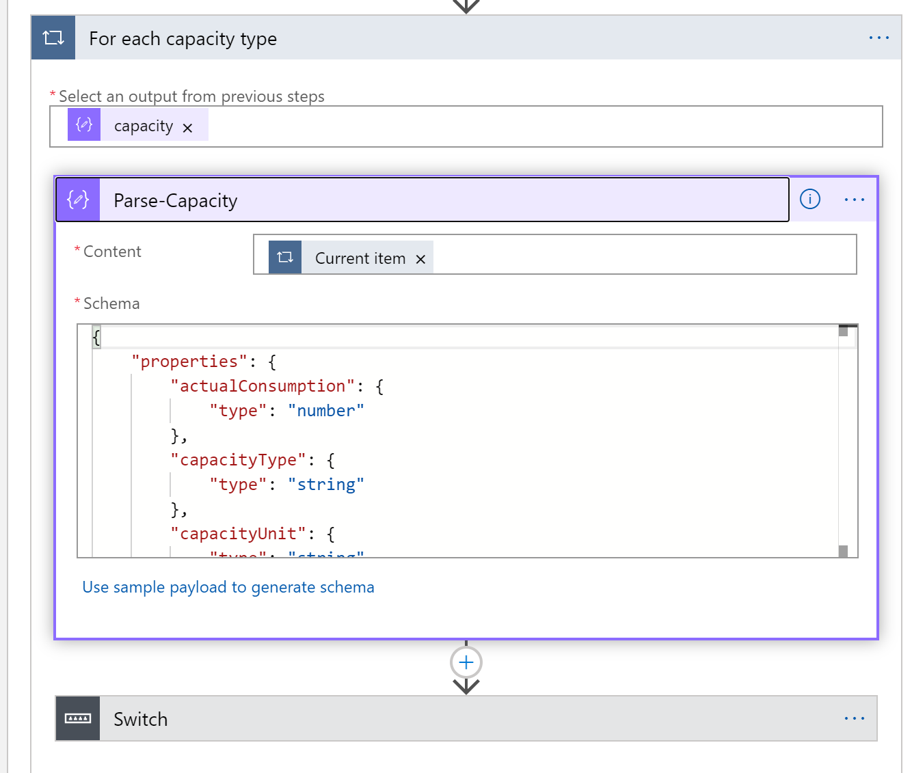

Now we can use the Switch control on the CapacityType property from the Parse-Capacity output.  This will either be a value of ‘Database’, ‘File’, or ‘Log’.  Under each switch case, capture the related ‘actualConsumption’ property into the related variable.  In the case below, you’ll see we are capturing Database capacity:

> [!div class="mx-imgBorder"] 
> 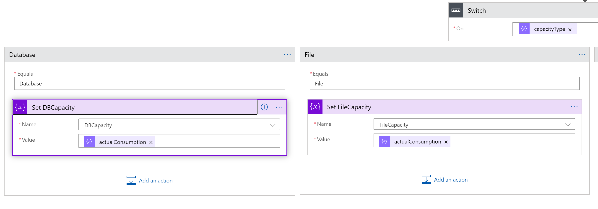

As the last step in the ‘For each environment’ loop, we now can capture the environment details for this row in the report.  Using the Append to array variable control, use the following JSON schema:
```json
{
    "properties": {
        "actualConsumption": {
            "type": "number"
        },
        "capacityType": {
            "type": "string"
        },
        "capacityUnit": {
            "type": "string"
        },
        "ratedConsumption": {
            "type": "number"
        },
        "updatedOn": {
            "type": "string"
        }
    },
    "type": "object"
}
```

> [!div class="mx-imgBorder"] 
> 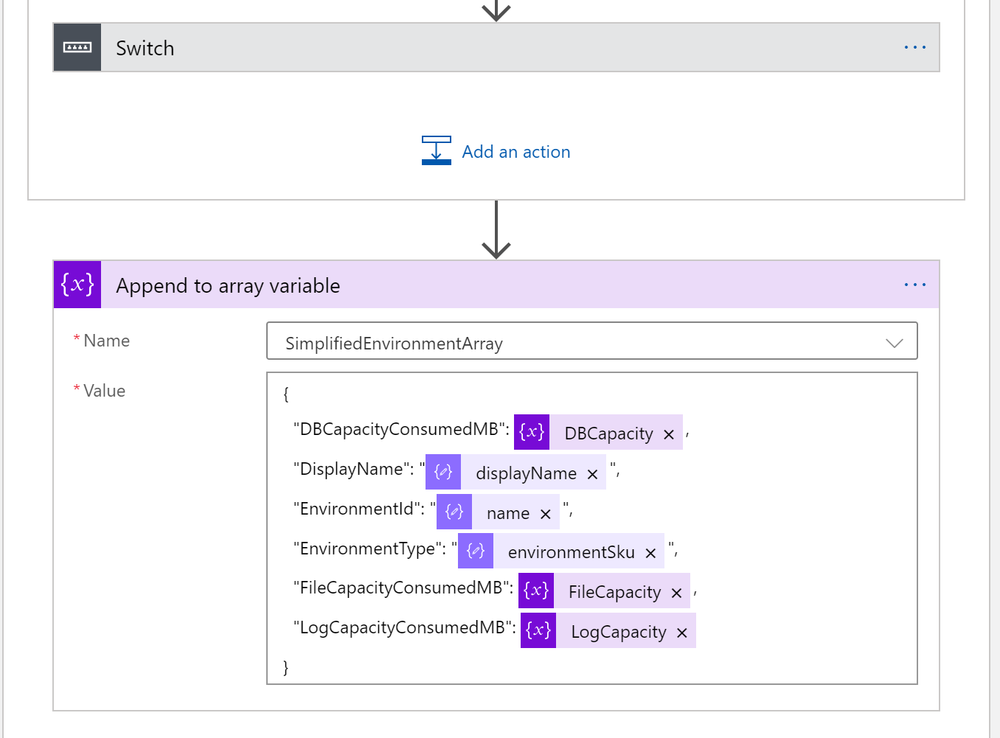

# [PowerShell](#tab/PowerShell)

### Construct detailed capacity array
 We will construct a PSObject that contains relevant properties from each pass through the environment objects.

```powershell
foreach($environment in $environmentsList)
{
    Write-Host "Traversing environment " $environment.DisplayName " capacity metadata..."
    #Write-Host $environment
   
    foreach($capacityObject in $environment.Capacity)
    {
        $EnvironmentCapacity = New-Object -TypeName PSObject `
        | Add-Member -PassThru -MemberType NoteProperty -Name EnvironmentName -Value $environment.DisplayName `
        | Add-Member -PassThru -MemberType NoteProperty -Name Description -Value $environment.Description `
        | Add-Member -PassThru -MemberType NoteProperty -Name Type -Value $environment.EnvironmentType `
        | Add-Member -PassThru -MemberType NoteProperty -Name ActualConsumption -Value $capacityObject.actualConsumption `
        | Add-Member -PassThru -MemberType NoteProperty -Name CapacityType -Value $capacityObject.capacityType `
        | Add-Member -PassThru -MemberType NoteProperty -Name CapacityUnit -Value $capacityObject.capacityUnit `
        | Add-Member -PassThru -MemberType NoteProperty -Name UpdatedOn -Value $capacityObject.updatedOn
        
        $capacityDetailsList += $EnvironmentCapacity
    }
    
    Write-Host "==============================="
    
}
```

---
## Build report table
Congratulations, you’ve now made it to the easy part!  Now that we have our fully populated and simplified environment capacity array, we can display it in tabular format.

# [Azure](#tab/Azure)

### Use the HTML Table connector
> [!div class="mx-imgBorder"] 
> 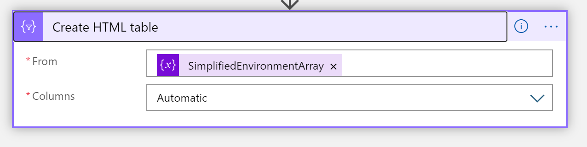

Running the logic app, we can now see the output of the HTML table report:

> [!div class="mx-imgBorder"] 
> 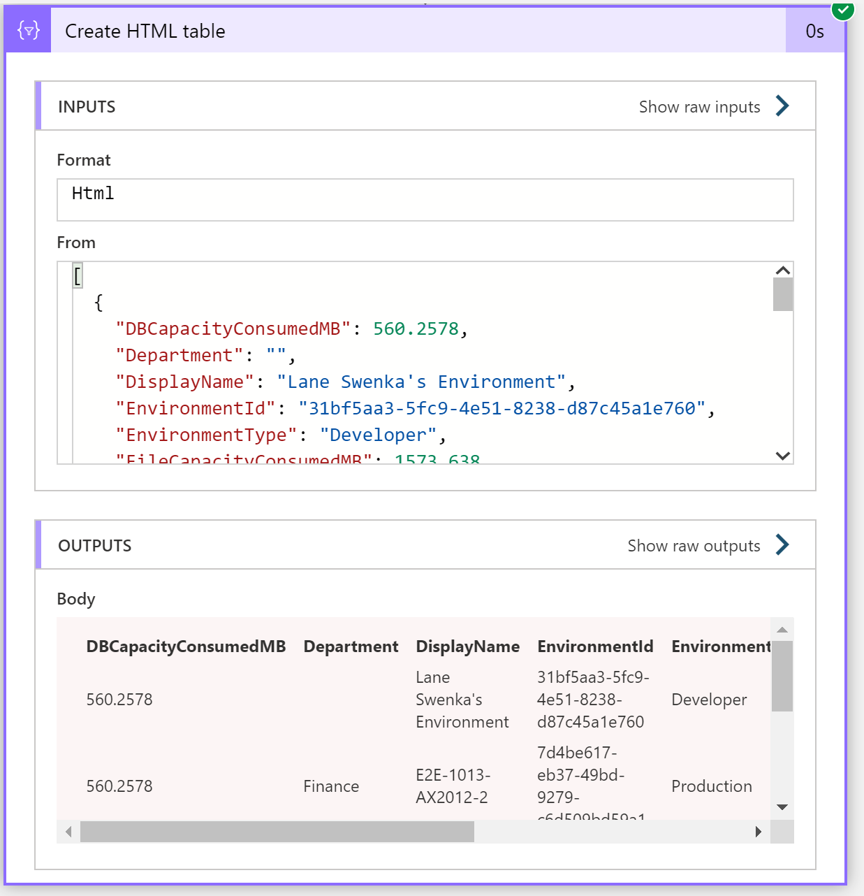

The report could be optionally emailed to stakeholders in this example for Cost Accounting purposes, or the data could be saved into a database for further analysis and historical trending.  

# [PowerShell](#tab/PowerShell)

### Output to a table
Congratulations, you’ve now made it to the easy part!  Now that we have our fully populated and simplified environment array, we can pass our array to the Format-Table commandlet for output:

```powershell
$capacityDetailsList | Format-Table -AutoSize
```

---