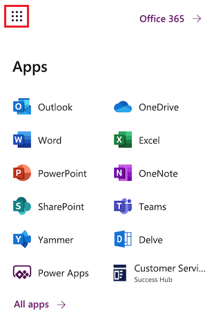

# Quickly navigate with the Microsoft 365 app launcher

   
## Quickly move between apps with the app launcher  
 The app launcher is built in to all Dynamics and [!INCLUDE[pn_Office_365](../includes/pn-office-365.md)] apps. Use the app launcher in the top left corner to quickly navigate to your Dynamics application of choice.  
 
 > [!div class="mx-imgBorder"]
 >   

  
> [!NOTE]
>  For [!INCLUDE[pn_CRM_Online_Government_Full](../includes/pn-crm-online-government-full.md)] subscriptions, the [!INCLUDE[pn_Office_365](../includes/pn-office-365.md)] app launcher will take users to either Dynamics 365 apps or the [!INCLUDE[pn_dyn_365_admin_center](../includes/pn-dyn-365-admin-center.md)]. Admins will go to the [!INCLUDE[pn_dyn_365_admin_center](../includes/pn-dyn-365-admin-center.md)].  

  
For other navigation information, including the new app switcher, see:
- [Improved model-driven app header, sitemap, and app switching](https://docs.microsoft.com/power-platform-release-plan/2020wave2/power-apps/improved-model-driven-app-header-sitemap-app-switching)
- [Basic navigation in a model-driven app](https://docs.microsoft.com/powerapps/user/navigation)

## Your business apps have moved
The home for all of your business applications across Dynamics and the Power Platform has moved from [https://home.dynamics.com](https://home.dynamics.com) to [office.com](https://office.com/apps). 

