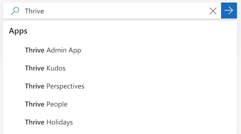
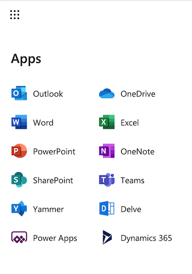

# Quickly navigate with the Microsoft 365 app launcher and the Dynamics 365 home page

   
## Quickly move between apps with the app launcher  
 The app launcher is built in to all Dynamics and [!INCLUDE[pn_Office_365](../includes/pn-office-365.md)] apps. Use the app launcher in the top left corner to quickly navigate to your Dynamics application of choice.  
 
 > [!div class="mx-imgBorder"]
 >   

  
> [!NOTE]
>  For [!INCLUDE[pn_CRM_Online_Government_Full](../includes/pn-crm-online-government-full.md)] subscriptions, the [!INCLUDE[pn_Office_365](../includes/pn-office-365.md)] app launcher will take users to either Dynamics 365 apps or the [!INCLUDE[pn_dyn_365_admin_center](../includes/pn-dyn-365-admin-center.md)]. Admins will go to the [!INCLUDE[pn_dyn_365_admin_center](../includes/pn-dyn-365-admin-center.md)].  

  
   
## Search your apps 
 If you have a lot of apps, you can also search for specific ones by using the global search bar that is found on most Microsoft products.
 
 > [!div class="mx-imgBorder"]
 >   

   
## Viewing all of your business applications  

To see all of the business apps that you have access to across Dynamics 365 and the Power Platform, you can navigate to the Dynamics home page by selecting the **Dynamics 365** tile from the app launcher  

> [!div class="mx-imgBorder"]
>   
  
 This will bring you to the Dynamics 365 home page.  
  
   

> [!NOTE]
>  The Dynamics 365 home page is not part of the [!INCLUDE[pn_CRM_Online_Government_Full](../includes/pn-crm-online-government-full.md)] subscription. Clicking Dynamics 365 takes [!INCLUDE[pn_CRM_Online_Government_Full](../includes/pn-crm-online-government-full.md)] users to your environment of Dynamics 365 or to the [!INCLUDE[pn_dyn_365_admin_center](../includes/pn-dyn-365-admin-center.md)].  
  
  
> [!TIP]
>  If you've just started a trial or upgraded to Dynamics 365, you might need to refresh or open a new browser session to see your apps. There might be a delay for your environment to fully provision.  
  

## Your business apps are moving
In the future, the home for all of your business applications across Dynamics and the Power Platform will move to the apps page on [office.com](https://office.com/apps).
This will help ensure that your end-users have a single spot to find all of their apps across the Microsoft ecosystem. Once the apps on the Dynamics home page have
moved to [office.com](https://office.com/apps), we will provide a banner redirecting users to their new home.

After October 1, 2020, when users navigate to https://home.dynamics.com, they will be redirected to https://www.office.com/apps with a deep link to their business applications.
  

