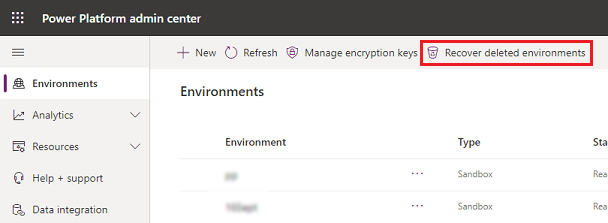
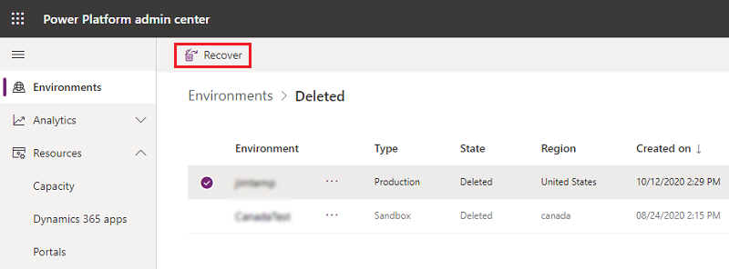
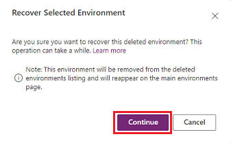

# Recover environment

[!INCLUDE[new-PPAC-banner](~/includes/new-PPAC-banner.md)]

You can recover a recently deleted environment ([within seven days of deletion](backup-restore-environments.md#how-long-are-my-manual-on-demand-backups-and-system-backups-retained)) by using the Microsoft Power Platform admin center or the [Recover-AdminPowerAppEnvironment](/powershell/module/microsoft.powerapps.administration.powershell/recover-adminpowerappenvironment?view=pa-ps-latest) Power Apps cmdlet. Production environments with Dynamics 365 applications will be available for up to 28 days.

> [!NOTE]
> Available storage capacity might be required in order to successfully recover an environment depending on the type of environment being recovered. For information on viewing your current storage capacity, see [Microsoft Dataverse storage capacity](capacity-storage.md). 
> 
> Review the following topics that discuss how environments could become marked for deletion and how to restore environments.
>
> - [Automatic environment cleanup](automatic-environment-cleanup.md)
> - [Back up and restore environments](backup-restore-environments.md)

## Power Platform admin center

An administrator can recover a recently deleted environment by using the Power Platform admin center.

1. Sign in to the [Power Platform admin center](https://admin.powerplatform.microsoft.com) as an admin (Dynamics 365 admin or Power Platform admin).
2. In the navigation pane, select **Environments**, and then select **Recover deleted environments**.

    > [!div class="mx-imgBorder"] 
    > 

3. Select an environment to recover, and then select **Recover**.

    > [!div class="mx-imgBorder"] 
    > 

4. Select **Continue** to confirm the recovery. 

    > [!div class="mx-imgBorder"] 
    > 

It could take several hours for the environment to be recovered. During this period, the environment to be recovered will continue to show in the list of deleted environments. Once recovered, you'll see the environment in the **Environments** page.

## PowerShell

An administrator can recover a recently deleted environment by using the following PowerShell cmdlet.

```powershell  
## List soft-deleted environments
Get-AdminPowerAppSoftDeletedEnvironment
 
## Attempt a recover operation on a soft-deleted environment
Recover-AdminPowerAppEnvironment -EnvironmentName $environmentName -WaitUntilFinished $true
```

To learn more on using PowerShell cmdlets for environments, see [Power Apps cmdlets for administrators](powerapps-powershell.md#power-apps-cmdlets-for-administrators).

## Next steps after recovering an environment

- **Flows** – Solution flows will be disabled so enable flows as needed.

### See also 

[Back up and restore environments](backup-restore-environments.md)<br>
[Automatic environment cleanup](automatic-environment-cleanup.md)<br>
[Manage sandbox environments](sandbox-environments.md)<br>
[Environments overview](environments-overview.md)<br>
[Microsoft.PowerApps.Administration.PowerShell](/powershell/module/microsoft.powerapps.administration.powershell/?view=pa-ps-latest)<br>
[Licensing overview for Microsoft Power Platform](pricing-billing-skus.md)

[!INCLUDE[footer-include](../includes/footer-banner.md)]
