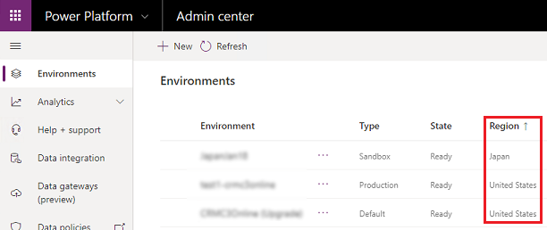

# Regions overview 

For multinational companies with employees and customers distributed around the world, you can create and manage environments specific to your global regions. You can create an environment in a different region than where your tenant resides. Local environments can provide quicker data access for users in that region. Be sure to read [A multi-environment deployment](multiple-online-environments-tenants.md#a-multi-environment-deployment) to understand the features of multiple environments.  

## How do I find out where my app is deployed?

Your app is deployed in the region that hosts the environment. For example, if your environment is created in the Europe region, then your app is deployed in Europe data centers.

### Using Power Platform admin center
If you're an administrator, you can determine the region of each environment in the Power Platform admin center.

- Browse to the [admin center](https://admin.powerplatform.microsoft.com), and sign in with your admin account.
  
  From the left-side menu, select **Environments**.
  
  > [!div class="mx-imgBorder"] 
  > 

## What regions are available?

Select the **View Report** button in [Dynamics 365 and Power Platform availability](https://dynamics.microsoft.com/geographic-availability/).

## Who can create environments in these regions?

With Power Apps, you can create environments in various regions across the globe, which benefits your business in these ways:

- Store your data closer to your users
- Maintain the compliance requirement of your geography

You can create a database for an environment in one region (for example, United States) even if the Azure Active Directory (Azure AD) tenant is in another region (for example, Canada or Europe). Note the following:

- Tax laws prevent you from creating a database for an environment in India and Australia, if your Azure AD tenant is not in India and Australia respectively. You can get an exception for Australia.
- You can create an environment in the Preview (United States) region, regardless of where the Azure AD tenant is, but you can’t provision a database in that region.
- Only a US Government associated organization can create an environment in US Government (GCC).

|Your Azure AD tenant's home location  |Regions where you can create a database  |
|---------|---------|
|India     | Any region except Australia and Preview (United States)        |
|Australia     | Any region except India and Preview (United States)           |
|Any other location     | Any region except India, Australia, and Preview (United States)           |

## What features are specific to a given region?

Environments can be created in different regions, and are bound to that geographic location. When you create an app in an environment, that app is deployed in datacenters in that geographic location. This applies to any items you create in that environment, including  databases in the Microsoft Dataverse, apps, connections, gateways, and custom connectors.

For optimal performance, if your users are in Europe, create and use the environment in the Europe region. If your users are in the United States, create and use the environment in the U.S.

> [!NOTE]
> On-premises data gateways aren't available in the India region.

## Can I create an environment outside of my tenant region?

Currently, there are limits to creating an environment for a region that differs from your tenant region. Please contact your account manager or [Technical Support](get-help-support.md).
