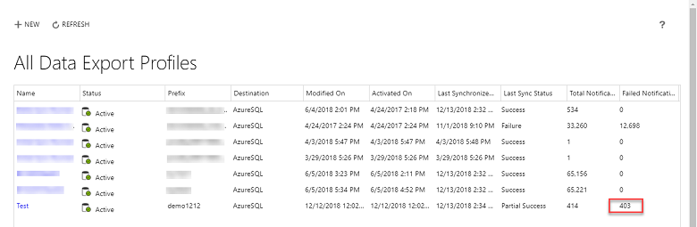
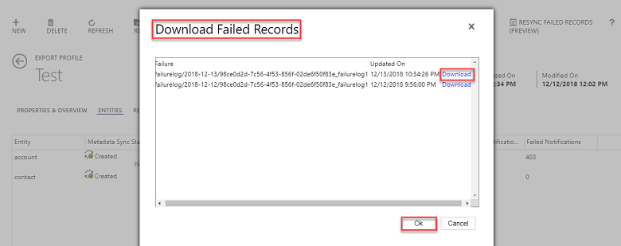
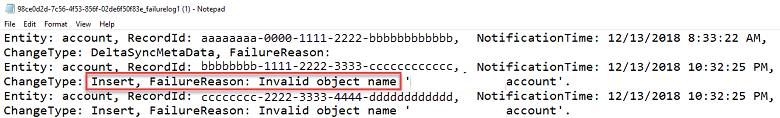

# Replicate data to Azure SQL Database using Data Export Service

[!INCLUDE [cc-data-platform-banner](../includes/cc-data-platform-banner.md)]

The [!INCLUDE[cc_Data_Export_Service](../includes/cc-data-export-service.md)] is an add-on service made available on [!INCLUDE[pn_microsoft_appsource](../includes/pn-microsoft-appsource.md)] that adds the ability to replicate data from Microsoft Dataverse database to a [!INCLUDE[pn_ms_azure_sql_database](../includes/pn-ms-azure-sql-database.md)] store in a customer-owned [!INCLUDE[pn_Windows_Azure](../includes/pn-windows-azure.md)] subscription. The supported target destinations are [!INCLUDE[pn_ms_azure_sql_database](../includes/pn-ms-azure-sql-database.md)] and [!INCLUDE[pn_SQL_Server_short](../includes/pn-sql-server-short.md)] on [!INCLUDE[pn_Windows_Azure](../includes/pn-windows-azure.md)] virtual machines.  The [!INCLUDE[cc_Data_Export_Service](../includes/cc-data-export-service.md)] intelligently synchronizes the entire data initially and thereafter synchronizes on a continuous basis as changes occur (delta changes) in the system. This helps enable several analytics and reporting scenarios on top of data with [!INCLUDE[pn_azure_shortest](../includes/pn-azure-shortest.md)] data and analytics services, and opens up new possibilities for customers and partners to build custom solutions.  
  
> [!NOTE]
> - You can use the [!INCLUDE[cc_Data_Export_Service](../includes/cc-data-export-service.md)] with customer engagement apps (Dynamics 365 Sales, Dynamics 365 Customer Service, Dynamics 365 Field Service, Dynamics 365 Marketing, and Dynamics 365 Project Service Automation). <br />
> - We're now previewing a similar capability to export your Dataverse data to Azure Data Lake Gen2. You'll be able to link your Dataverse environment to a data lake in your Azure subscription, select standard or custom entities, and then export data to the data lake. All data or metadata changes (initial and incremental) in Dataverse are automatically pushed to Azure Data Lake Gen2 without any additional action. More information: [Exporting Dataverse data to Azure Data Lake](https://powerapps.microsoft.com/blog/exporting-cds-data-to-azure-data-lake-preview/) 
  
For information about the programmatic interface for managing configuration and administration of the [!INCLUDE[cc_Data_Export_Service](../includes/cc-data-export-service.md)], see [Data Export Service](https://docs.microsoft.com/powerapps/developer/common-data-service/data-export-service) in the developer guide.
  
<a name="Prereq_DES"></a>   
## Prerequisites for using [!INCLUDE[cc_Data_Export_Service](../includes/cc-data-export-service.md)]  
 To start using the [!INCLUDE[cc_Data_Export_Service](../includes/cc-data-export-service.md)], the following prerequisites are required.  
  
### Azure SQL Database service  
  
- A customer owned [!INCLUDE[pn_Azure_SQL_Database_long](../includes/pn-azure-sql-database-long.md)] subscription. This subscription must allow the volume of data that is synchronized.  
  
- Firewall settings.  We recommend that you turn off **Allow access to Azure services** and specify the appropriate client IP addresses listed in this topic. More information: [Azure SQL database static IP addresses used by the Data Export Service](#SQLDB_IP_addresses)  
  
   Alternatively, you can turn on **Allow access to Azure services** to allow all Azure services access.  
  
   For [!INCLUDE[pn_SQL_Server_short](../includes/pn-sql-server-short.md)] on [!INCLUDE[pn_azure_shortest](../includes/pn-azure-shortest.md)] VM, the "Connect to SQL Server over the Internet" option should be enabled. More information: [Azure: Connect to a SQL Server Virtual Machine on Azure](https://docs.microsoft.com/azure/azure-sql/virtual-machines/windows/ways-to-connect-to-sql)  

   Additionally, configure your firewall rules to allow communication between Data Export Service and SQL Server.
  
- The database user must have permissions at the database and schema level according to the following tables. The database user is used in the data export connection string.  
  
   Database permissions required.  
  
  |Permission type code|Permission name|  
  |-|-|  
  |CRTB|CREATE TABLE|  
  |CRTY|CREATE TYPE|  
  |CRVW|CREATE VIEW|  
  |CRPR|CREATE PROCEDURE|  
  |ALUS|ALTER ANY USER|  
  |VWDS|VIEW DATABASE STATE|
  
   Schema permissions required.  
  
  |Permission type code|Permission name|  
  |-|-|  
  |AL|ALTER|  
  |IN|INSERT|  
  |DL|DELETE|  
  |SL|SELECT|  
  |UP|UPDATE|  
  |EX|EXECUTE|  
  |RF|REFERENCES|  
  
### Azure Key Vault service  
  
- Customer owned Key Vault subscription, which is used to securely maintain the database connection string.  
  
- Grant PermissionsToSecrets permission to the application with the id "b861dbcc-a7ef-4219-a005-0e4de4ea7dcf." This can be completed by running the [!INCLUDE[pn_azure_shortest](../includes/pn-azure-shortest.md)][!INCLUDE[pn_PowerShell_short](../includes/pn-powershell-short.md)] command below and is used to access the Key Vault that contains the connection string secret. [!INCLUDE[proc_more_information](../includes/proc-more-information.md)] [How to set up Azure Key Vault](#SetupAzureKV)  
  
- The Key Vault should be tagged with the organization (OrgId) and tenant ids (TenantId).  This can be completed by running the [!INCLUDE[pn_azure_shortest](../includes/pn-azure-shortest.md)][!INCLUDE[pn_PowerShell_short](../includes/pn-powershell-short.md)] command below. [!INCLUDE[proc_more_information](../includes/proc-more-information.md)] [How to set up Azure Key Vault](#SetupAzureKV)  
  
- Configure your firewall rules to allow communication between Data Export Service and Azure Key Vault.

### Customer engagement apps
  
- A version 9.0 or later version environment.  
  
- The [!INCLUDE[cc_Data_Export_Service](../includes/cc-data-export-service.md)] solution must be installed.  
    - Go to **Settings** > **Microsoft Appsource** > search or browse to **Microsoft Dynamics 365 - Data Export Service**, and then select **Get it now**. 
    - Or, find it on [Microsoft AppSource](https://appsource.microsoft.com/product/dynamics-365/mscrm.44f192ec-e387-436c-886c-879923d8a448).  
  
- The entities that will be added to the Export Profile must be enabled with change tracking. To ensure a standard or custom entity can be synchronized go to **Customization** > **Customize the System**, and then click the entity. On the **General** tab make sure the **Change Tracking** option under the **Data Services** section is enabled.  
  
- You must have the System Administrator security role in the environment.  
  
### Web browser  
 Enable pop-ups for the domain https://discovery.crmreplication.azure.net/ in your web browser. This is required for auto-sign in when you navigate to Settings > Data Export.  
  
<a name="perms"></a>   
## Services, credentials, and privileges required  
 To use the [!INCLUDE[cc_Data_Export_Service](../includes/cc-data-export-service.md)] feature, you must have the following services, credentials, and privileges.  
  
- A subscription. Only users that are assigned the System Administrator security role can set up or make changes to an Export Profile.  
  
- [!INCLUDE[pn_Windows_Azure](../includes/pn-windows-azure.md)] subscription that includes the following services.  
  
  - [!INCLUDE[pn_Azure_SQL_Database_long](../includes/pn-azure-sql-database-long.md)] or [!INCLUDE[pn_azure_shortest](../includes/pn-azure-shortest.md)][!INCLUDE[pn_SQL_Server_short](../includes/pn-sql-server-short.md)] on [!INCLUDE[pn_azure_shortest](../includes/pn-azure-shortest.md)] virtual machines.  
  
  - [!INCLUDE[pn_azure_key_vault](../includes/pn-azure-key-vault.md)].  
  
> [!IMPORTANT]
>  To use the [!INCLUDE[cc_Data_Export_Service](../includes/cc-data-export-service.md)] the customer engagement apps and [!INCLUDE[pn_azure_key_vault](../includes/pn-azure-key-vault.md)] services must operate under the same tenant and within the same [!INCLUDE[pn_microsoft_azure_active_directory](../includes/pn-microsoft-azure-active-directory.md)]. [!INCLUDE[proc_more_information](../includes/proc-more-information.md)] [Azure integration with Microsoft 365](https://support.office.com/article/Azure-integration-with-Office-365-a5efce5d-9c9c-4190-b61b-fd273c1d425f)  
> 
>  The [!INCLUDE[pn_Azure_SQL_Database_long](../includes/pn-azure-sql-database-long.md)] service can be in the same or a different tenant from the service.  
  
<a name="shouldknowDES"></a>   
## What you should know before using the Data Export Service  
  
- Export Profiles must be deleted and then re-created whenever you perform any of the following actions on an environment. 
  - Restore an environment.
  - Copy (either full or minimal) an environment.
  - Reset an environment.
  - Move an environment to a different country or region.

  To do this, delete the Export Profile in the EXPORT PROFILES view, then delete the tables and stored procedures, and then create a new profile. [!INCLUDE[proc_more_information](../includes/proc-more-information.md)] [How to delete all Data Export Profile tables and stored procedures](#Delete_DEP)  
  
- The [!INCLUDE[cc_Data_Export_Service](../includes/cc-data-export-service.md)] doesn't work for sandbox or production environments that are configured with **Enable administration mode** turned on. [!INCLUDE[proc_more_information](../includes/proc-more-information.md)] [Administration mode](sandbox-environments.md#administration-mode)

- The [!INCLUDE[cc_Data_Export_Service](../includes/cc-data-export-service.md)] does not drop (delete) the associated tables, columns, or stored procedure objects in the destination Azure SQL database when the following actions occur.
  - An entity is deleted.
  - A field is deleted.
  - An entity is removed from an Export Profile.
   
    These items must be dropped manually.  [How to delete Data Export Profile tables and stored procedures for a specific entity](#drop_entity)
    Metadata delete notifications are logged in the unprocessablemessages folder. [Error handling and monitoring](#error_handling)
  
<a name="dataexportprofile"></a>   
## Export Profile  
 To export data from customer engagement apps, the administrator creates an Export Profile.  Multiple profiles can be created and activated to synchronize data to different destination databases simultaneously.  
  
 The Export Profile is the core concept of  the [!INCLUDE[cc_Data_Export_Service](../includes/cc-data-export-service.md)]. The Export Profile gathers set up and configuration information to synchronize data with the destination database. As part of the Export Profile, the administrator provides a list of entities to be exported to the destination database. Once activated, the Export Profile starts the automatic synchronization of data. Initially, all data that corresponds to each selected entity is exported. Thereafter, only the changes to data as they occur to the entity records or metadata in customer engagement apps are synchronized continuously using a push mechanism in near real time. Therefore, you don't need to set up a schedule to retrieve data from customer engagement apps.  
  
 Only entities that have change tracking enabled can be added to the Export Profile. Notice that, most of the standard entities which capture data are change tracking enabled. Custom entities must be explicitly enabled for change tracking before you can add them to an Export Profile. [!INCLUDE[proc_more_information](../includes/proc-more-information.md)] [Enable change tracking to control data synchronization](../admin/enable-change-tracking-control-data-synchronization.md)  
  
 The [!INCLUDE[cc_Data_Export_Service](../includes/cc-data-export-service.md)] does both metadata and data synchronization. Each entity translates into one table, and each field translates into a column in the destination database table. Table and column names use the schema name of the metadata.  
  
 Once activated, an Export Profile gathers statistics for data synchronization that helps in operational visibility and diagnostics of the data exported.  
  
### Data synchronization available with an Export Profile  
  
|Category|Feature|Supported data types|  
|-|-|-|  
|Initial Sync|Metadata - Basic Data Types|Whole Number, Floating Point Number, Decimal Number, Single Line of Text, Multi Line of Text, Date and Time data types.|  
|Initial Sync|Metadata - Advanced Data Types|Currency, PartyList, Option Set, Status, Status Reason, Lookup (including Customer and Regarding type lookup). PartyList is only available for export version 8.1 and above.|  
|Initial Sync|Data - Basic Types|All basic data types.|  
|Initial Sync|Data - Advanced Types|All advanced data types.|  
|Delta Sync|Modify Schema - Basic Types|Add or modify field change, all basic data types.|  
|Delta Sync|Modify Schema - Advanced Types|Add or modify field change, all advanced data types.|  
|Delta Sync|Modify Data - Basic Types|All basic data types.|  
|Delta Sync|Modify Data - Advanced Types|All advanced data types, such as PartyList.|  
  
<a name="createdataexportprofile"></a>   
## Create an Export Profile  
 Ensure that following requirements are met before creating an Export Profile.  
  
- The [!INCLUDE[cc_Data_Export_Service](../includes/cc-data-export-service.md)] solution is installed in your environment.  
  
- Maintain the [!INCLUDE[pn-sql](../includes/pn-sql.md)] Database connection string in the Key Vault and copy the Key Vault URL to provide in the Export Profile. More information: [Azure: Get started with Azure Key Vault](https://azure.microsoft.com/documentation/articles/key-vault-get-started/)  
  
- The entities to be added to the Export Profile are enabled for change tracking. [!INCLUDE[proc_more_information](../includes/proc-more-information.md)] [Enable change tracking to control data synchronization](../admin/enable-change-tracking-control-data-synchronization.md)  
  
- Your [!INCLUDE[pn-sql](../includes/pn-sql.md)] Database service has enough storage space to store the data.  
  
- You are a System Administrator in the environment.  
  
1. Go to **Settings** > **Data Export**.  
  
2. Review the notice, and click **Continue** or **Cancel** if you don't want to export data.  
  
3. Click **New** to create a new Export Profile.  
  
4. In the **Properties** step, enter the following information, and then click **Next** to continue without connecting to the Key Vault. Clicking **Validate** uses the Key Vault URL you provided to connect to the Key Vault.  
  
   - **Name**. Unique name of the profile. This field is mandatory.  
  
   - **Key Vault Connection URL**. Key Vault URL pointing to the connection string stored with credentials used to connect to the destination database. This field is mandatory. [!INCLUDE[proc_more_information](../includes/proc-more-information.md)] [How to set up Azure Key Vault](#SetupAzureKV)  
  
     > [!IMPORTANT]
     >  The Key Vault Connection URL is case-sensitive. Enter the Key Vault Connection URL exactly as it is displayed after you run the [!INCLUDE[pn_PowerShell](../includes/pn-powershell.md)] commands in this topic.  
  
   - **Schema**.  Name for an alternative database schema. Only alphanumeric characters are valid. This field is optional. By default, dbo is the schema that is used for the destination [!INCLUDE[pn-sql](../includes/pn-sql.md)] Database.  
  
   - **Prefix**. Prefix to be used for the table names created in the destination database. This helps you easily identify the tables created for the Export Profile in the destination database. When specified, make sure that the prefix is less than 15 characters.  This field is optional and only alphanumeric characters are allowed.  
  
   - **Retry count**. The number of times a record is retried in case of a failure to insert or update in the destination table. This field is mandatory. Acceptable values are 0-20  and the default is 12.  
  
   - **Retry interval**. The number of seconds to wait before a retry in case of a failure. This field is mandatory. Acceptable values are 0-3600 and the default is 5.  
  
   - **Write Delete Log**. Optional setting for logging deleted records.  
  
     
  
5. In the **Select Entities** step, select the entities that you want to export to the destination [!INCLUDE[pn-sql](../includes/pn-sql.md)] Database, and then click **Next**.  
  
     
  
6. In the **Select Relationships** step, you can synchronize  the M:N (many-to-many) [relationships](https://docs.microsoft.com/powerapps/maker/common-data-service/create-edit-entity-relationships) that exist with the entities you selected in the previous step. Click **Next**.  
  
     
  
7. In the **Summary** step, click **Create and Activate** to create the profile record and connect to the Key Vault, which begins the synchronization process. Otherwise, click **Create** to save the Export Profile and activate later.  
  
     
  
<a name="modify_export_profile"></a>   
## Modify an existing Export Profile  
 You can add or remove the entities and relationships in an existing Export Profile that you want to replicate.  
  
1. Go to **Settings** > **Data Export**.  
  
2. In the All Data Export Profile view, select the Export Profile that you want to change.  
  
     
  
3. On the Actions toolbar, click **MANAGE ENTITIES** to add or remove entities for data export. To add or remove entity relationships, click **MANAGE RELATIONSHIPS**.  
  
     
  
4. Select the entities or entity relationships that you want to add or remove.  
  
     
  
5. Click **Update** to submit your changes to the Export Profile.  
  
> [!IMPORTANT]
>  When you remove an entity or entity relationship from an Export Profile it doesn't drop the corresponding table in the destination database. Before you can re-add an entity that has been removed, you must drop the corresponding table in the destination database.  To drop an entity table, see [How to delete Data Export Profile tables and stored procedures for a specific entity](#drop_entity).  
  
<a name="table_details"></a>   
## Table details for the destination Azure SQL Database  
 The [!INCLUDE[cc_Data_Export_Service](../includes/cc-data-export-service.md)] creates tables for both data and metadata. A table is created for each entity and M:N relationship that is synchronized.  
  
 Once an Export Profile is activated, these tables are created in the destination database.   These are system tables and will not have the SinkCreatedTime and SinkModifiedTime fields added.  
  
|Table name|Created|  
|----------------|-------------|  
|\<Prefix>_GlobalOptionsetMetadata|Upon Export Profile activation.|  
|\<Prefix>_OptionsetMetadata|Upon Export Profile activation.|  
|\<Prefix>_StateMetadata|Upon Export Profile activation.|  
|\<Prefix>_StatusMetadata|Upon Export Profile activation.|  
|\<Prefix>_TargetMetadata|Upon Export Profile activation.|  
|\<Prefix>_AttributeMetadata|Upon Export Profile activation.|  
|\<Prefix>_DeleteLog|Upon Export Profile activation when the delete log option is enabled.|  
  
<a name="resolve_issues"></a>   
## Resolving synchronization issues  
 Even after several retry attempts, record synchronization failures  may occur from database storage constraints or table locking due to long running queries. To resolve these failures you can force a resynchronization of only failed records or a  resynchronization of all records.  
  
1. View your export profiles to look for any that have record synchronization failures. You do this by viewing the data profiles in the Synchronization area or by opening a Export Profile , such as this profile that has a contact entity record synchronization failure.  
  
     
  
2. Examine the source of the synchronization failure and resolve it. [!INCLUDE[proc_more_information](../includes/proc-more-information.md)] [Error handling and monitoring](#error_handling)  
  
3. After the problem has been resolved, resynchronize the failed records.  
  
   > [!NOTE]
   >  Failed records synchronization is a public preview feature.  
   > 
   > - [!INCLUDE[cc_preview_features_definition](../includes/cc-preview-features-definition.md)]  
   >   - [!INCLUDE[cc_preview_features_expect_changes](../includes/cc-preview-features-expect-changes.md)]  
   >   - [!INCLUDE[cc_preview_features_no_MS_support](../includes/cc-preview-features-no-ms-support.md)]  
  
   1. Sign in to your environment and go to **Settings** > **Data Export**.  
  
   2. Open the Export Profile that includes record synch failures.  
  
   3. On the Export Profile toolbar, click **RESYNC FAILED RECORDS**.  
  
   4. Click **Ok** upon successful resynchronization of the failed records on the confirmation dialog.  
  
     
  
   5.  Verify that the Export Profile doesn't contain failed record notifications by opening the data export profile and viewing the **Failed Notifications** counter on the **PROPERTIES & OVERVIEW** tab, which should be **0**. Click **REFRESH** on the Export Profile toolbar to make sure the **Failed Notifications** value is current.  
  
     
  
4.  If the record synchronization failures persist after you've tried resynchronizing by following the previous steps, contact [Microsoft Customer Support Services](get-help-support.md).  
  
<a name="error_handling"></a>   
## Error handling and monitoring  
 To view the synchronization status of an Export Profile, go to **Settings** > **Data Export** and open the Export Profile. On the **ENTITIES** tab, the synchronization status is displayed including a **Failed Records** column for records that could not be synchronized. For any failed records, a list of those records including the status reason can be downloaded by clicking **FAILED RECORDS** on the command bar.  
  
   
  
 In the Export Profile you can click **PROPERTIES & OVERVIEW** to display the properties of the profile. Click **RELATIONSHIPS** to view the relationships synchronization status.  
  
<a name="view_failure_records"></a>   
### How to view detailed information about the records that failed to sync  
 Viewing the failed record logs can help you determine the cause of synchronization failures. To view failed records in the destination Azure destination database, use Azure Storage Explorer, a free standalone app that allows you to easily work with Azure Storage data. More information:  [Azure Storage Explorer](https://storageexplorer.com/).  
  
1. Go to **Settings** > **Data Export**.  
  
2. In the In the All Data Export Profile view, select the Export Profile that has failed notifications.  
  
     
  
3. On the Actions toolbar, click **FAILED RECORDS**.  
  
     
  
4. In the Download Failed Records dialog box, click **Copy Blob URL**, and then click **Ok**.  
  
     
  
   > [!NOTE]
   >  The blob URL is valid for up to 24 hours. If the URL exceeds the 24 hour period, repeat the steps described earlier to generate a new blob URL.  
  
5. Start Azure Storage Explorer.  
  
6. In Azure Storage Explorer, click **Connect to Azure Storage**.  
  
7. Paste the URL from your clipboard in to the **Connect to Azure Storage** box, and then click **Next**.  
  
     
  
8. On the Connection Summary page, click **Connect**.  
  
9. Azure Storage Explorer connects to the destination database. If failed records exist for the Export Profile, Azure Storage Explorer displays failed record  synchronization folders.  
  
#### How to view detailed information about the records that failed to sync (Preview)

You can now download the failed records directly from within the Data Export Service user interface. This feature is currently in Preview and would be great for you to test and provide feedback.

**Steps to download failed records:**

1. Identify the profile with failed records.

   > [!div class="mx-imgBorder"] 
   > 

2. Select the profile and select **Download Failed records (Preview)** from the top menu bar.

   > [!div class="mx-imgBorder"] 
   > ")

3. In the **Download Failed records** dialog box, you will see a sorted list of last 20 (max) blob files. Select the one you want to download, and then select **Ok**.

   > [!div class="mx-imgBorder"] 
   > 

4. Once downloaded, open the file in a text editor of your choice (for example, Notepad) and view the details for failures.

   > [!div class="mx-imgBorder"] 
   > 

#### Failed record synchronization folder structure and log files  
 The Failed Records Azure Blob storage URL points to a location that has the following folder structure:  
  
- **data**. This folder contains failed data notifications and the associated JSON for record data.  
  
- **metadata**. This folder contains failed metadata notifications and the associated JSON for metadata.  
  
- **failurelog**. This folder contains logs that provides information about the synchronization failure and the reason the failure occurred.  
  
- **forcerefreshfailurelog**. This folder contains errors from the last run of the [!INCLUDE[cc_Data_Export_Service](../includes/cc-data-export-service.md)] Failed Records command used to resynchronize failed records.  
  
- **unprocessablemessages**.  This folder contains the data notifications that were not processed either due to deletion of  data or metadata and the associated JSON.  
  
  The failurelog and forcerefreshfailurelog folders are structured  *Year*\\*Month*\\*Day*\\*Hour* so that you can quickly locate the latest failures. All failure records older than 30 days  are deleted.  
  
  Here's an example log file that indicates a contact entity record synchronization failure.  
  
```Output  
Entity: contact, RecordId: 459d1d3e-7cc8-e611-80f7-5065f38bf1c1, NotificationTime: 12/28/2016 12:32:39 AM, ChangeType: Update, FailureReason: The database 'tempdb' has reached its size quota. Partition or delete data, drop indexes, or consult the documentation for possible resolutions.  
The statement has been terminated.  
```  
  
<a name="recordsync_failure_reason"></a>   
#### Common reasons for record synchronization failures  
 Here are a few reasons why record synchronization failures may occur.  
  
- Insufficient storage for the destination database.  Before you try to resynchronize the failed records, increase or free [!INCLUDE[pn_Azure_SQL_Database_long](../includes/pn-azure-sql-database-long.md)] storage as appropriate. When this problem occurs, a message similar to this is recorded to the failure log.  
  
   The database 'databasename' has reached its size quota. Partition or delete data, drop indexes, or consult the documentation for possible resolutions.  
  
- Synchronization timeouts with [!INCLUDE[pn_Azure_SQL_Database_long](../includes/pn-azure-sql-database-long.md)]. This can occur during the initial synchronization of a data export profile when large amounts of data are processed at one time. When this issue occurs, resynchronize the failed records. [Resolving synchronization issues](#resolve_issues)  
  
<a name="DES_best_practice"></a>   
## Best practices when using Azure SQL Database with Data Export  
  
- To avoid synchronization errors due to resource throttling, we recommend that you have an [!INCLUDE[pn_Azure_SQL_Database_long](../includes/pn-azure-sql-database-long.md)] Premium P1 or better plan when you use the [!INCLUDE[cc_Data_Export_Service](../includes/cc-data-export-service.md)]. [!INCLUDE[proc_more_information](../includes/proc-more-information.md)] [Azure SQL Database resource limits](https://docs.microsoft.com/azure/sql-database/sql-database-resource-limits) and [SQL Database Pricing](https://azure.microsoft.com/pricing/details/sql-database/)  
  
- Set the [!INCLUDE[pn_Azure_SQL_Database_long](../includes/pn-azure-sql-database-long.md)] to use read committed snapshot isolation (RCSI) for workloads running concurrently on the destination database that execute long running read queries, such as reporting and ETL jobs. This reduces the occurrence of timeout errors that can occur with the [!INCLUDE[cc_Data_Export_Service](../includes/cc-data-export-service.md)] due to read\write conflicts.  

- To help improve query performance we recommend the [!INCLUDE[cc_Data_Export_Service](../includes/cc-data-export-service.md)] database max degree of parallelism (MAXDOP) be set to 1. More information: [MSDN: Server Memory Options](https://msdn.microsoft.com/library/ms178067.aspx)

- Frequently assess the amount of fragmentation, and when necessary, rebuild the indexes in the [!INCLUDE[cc_Data_Export_Service](../includes/cc-data-export-service.md)] database. More information: [Reorganize and Rebuild Indexes](https://docs.microsoft.com/sql/relational-databases/indexes/reorganize-and-rebuild-indexes?view=sql-server-2017)

- Periodically update database statistics on tables and indexed views in the [!INCLUDE[cc_Data_Export_Service](../includes/cc-data-export-service.md)] database. More information: [Update Statistics](https://docs.microsoft.com/sql/relational-databases/statistics/update-statistics?view=sql-server-2017) 

- Monitor the [!INCLUDE[cc_Data_Export_Service](../includes/cc-data-export-service.md)] database's utilization. More information: [Perf monitoring](https://docs.microsoft.com/azure/sql-database/sql-database-single-database-monitor)

  
## About data synchronization latency

The [!INCLUDE[cc_Data_Export_Service](../includes/cc-data-export-service.md)] is architected to synchronize data changes to the destination database using a push mechanism by listening to changes as they happen in customer engagement apps. The service strives to push data within a few minutes, but there are number of factors that can influence end-to-end synchronization latency. 

Factors that influence the duration of synchronization include the following: 

- The current work load on customer engagement apps. 
- The data change rate in customer engagement apps. 
- The number of entities added to each export profile and their attributes. 
- SQL Server performance. For example:
  - SQL connection setup time. 
  - SQL statement execution time. 

Based on our monitoring of the service it's been observed that most on-going delta synchronization finishes in 15 minutes when the service operates under the following conditions:

- The synchronization that occurs is a delta synchronization and not the initial synchronization. Delta synchronization is only for data change operations, which include record create, update, and delete transactions. Note that delta synchronization begins once the initial synchronization has finished.
- The maximum data change rate in customer engagement apps for all the entities in the export profile is less than 3000 records per hour. Any sudden increase in the data change rate due to bulk change of records exceeding the maximum change rate will cause additional latency.
- Each entity added to an export profile has less than 150 attributes.
- Database connection or SQL statement execution finishes in less than 10 seconds. If this limit is exceeded it will result in additional latency. 
- No destination database connection or SQL execution errors occur during synchronization.


When the above conditions are met, 15 minutes is a typical synchronization latency. Microsoft provides no service level agreement (SLA) for the [!INCLUDE[cc_Data_Export_Service](../includes/cc-data-export-service.md)] and makes no guarantees or commitments regarding synchronization latency times.

<a name="SetupAzureKV"></a>   
## How to set up Azure Key Vault  
 Run the [!INCLUDE[pn_PowerShell](../includes/pn-powershell.md)] script described here as an [!INCLUDE[pn_azure_shortest](../includes/pn-azure-shortest.md)] account administrator to give permission to the [!INCLUDE[cc_Data_Export_Service](../includes/cc-data-export-service.md)] feature so it may access your Azure Key Vault. This script displays the key vault URL required for creating the Export Profile that is used to access the connection string.  
  
 Before running the script, replace the placeholders for the following variables.  
  
- $subscriptionId. The Key Vault resource group you want to use. If a resource group doesn't already exist a new one with the name you specify will be created. In this example, *ContosoResourceGroup1* is used.  
  
- $location. Specify the location where the resource group is, or should be, located, such as *West US*.  
  
- $connectionString. The connection string to the [!INCLUDE[pn_ms_azure_sql_database](../includes/pn-ms-azure-sql-database.md)]. You can use the ADO.NET connection string as it is displayed in your [!INCLUDE[pn_azure_shortest](../includes/pn-azure-shortest.md)] dashboard.  
  
- $organizationIdList = Comma separated list of allowed organizations, listed by organization Id (organizationId), to enable for [!INCLUDE[cc_Data_Export_Service](../includes/cc-data-export-service.md)].  To find an organization's Id, go to **Settings** > **Customizations** > **Developer Resources**. The organization Id is under **environment Reference Information**.  
  
- $tenantId.  Specifies the [!INCLUDE[pn_azure_shortest](../includes/pn-azure-shortest.md)] Active Directory tenant Id to which the Key Vault subscription.  
  
> [!IMPORTANT]
>  An [!INCLUDE[pn_azure_shortest](../includes/pn-azure-shortest.md)] subscription can have multiple [!INCLUDE[pn_azure_shortest](../includes/pn-azure-shortest.md)] Active Directory tenant Ids. Make sure that you select the correct [!INCLUDE[pn_azure_shortest](../includes/pn-azure-shortest.md)] Active Directory tenant Id that is associated with the environment that you will use for data export.  

```powershell
# -------------------------------------------------------------------------------- #
    #  Provide the value for the following parameters before executing the script
$subscriptionId = 'ContosoSubscriptionId'    
$keyvaultName = 'ContosoKeyVault'
    $secretName = 'ContosoDataExportSecret'
    $resourceGroupName = 'ContosoResourceGroup1'
    $location = 'West US'
    $connectionString = 'AzureSQLconnectionString'
$organizationIdList = 'ContosoSalesOrg1_id, ContosoSalesOrg2_id'
$tenantId = 'tenantId'
    # -------------------------------------------------------------------------------- #

# Login to Azure account, select subscription and tenant Id
connect-azaccount -Tenant $tenantId -Subscription $subscriptionId

# Create new resource group if not exists.
$rgAvail = Get-AzureRmResourceGroup -Name $resourceGroupName -Location $location -ErrorAction SilentlyContinue
if(!$rgAvail){
    New-AzureRmResourceGroup -Name $resourceGroupName -Location $location
}

# Create new key vault if not exists.
$kvAvail = Get-AzureRmKeyVault -VaultName $keyvaultName -ResourceGroupName $resourceGroupName -ErrorAction SilentlyContinue
if(!$kvAvail){
    New-AzureRmKeyVault -VaultName $keyvaultName -ResourceGroupName $resourceGroupName -Location $location
    # Wait few seconds for DNS entry to propagate
    Start-Sleep -Seconds 15
}

# Create tags to store allowed set of Organizations.
$secretTags = @{}
foreach ($orgId in $organizationIdList.Split(',')) {
    $secretTags.Add($orgId.Trim(), $tenantId)
}

# Add or update a secret to key vault.
$secretValue = ConvertTo-SecureString $connectionString -AsPlainText -Force
$secret = Set-azKeyVaultSecret -VaultName $keyvaultName -Name $secretName -SecretValue $secretValue -Tags $secretTags

# Authorize application to access key vault.
$servicePrincipal = 'b861dbcc-a7ef-4219-a005-0e4de4ea7dcf'
set-azkeyvaultaccesspolicy -VaultName $keyvaultName -ServicePrincipalName $servicePrincipal -PermissionsToSecrets get

# Display secret url.
Write-Host "Connection key vault URL is "$secret.id.TrimEnd($secret.Version)""
```


<a name="Delete_DEP"></a>   
## How to delete all Data Export Profile tables and stored procedures

> [!IMPORTANT]
>  Before you run this SQL statement make sure that you have correctly defined the @prefix and @schema values in the statement. 
>  The Export Profile will need to be re-created after you run this SQL statement. 

```sql
-----------------------------------------------------------------
-- Provide the value for the following parameters
DECLARE @prefix nvarchar(32) =''
DECLARE @schema nvarchar(32) ='dbo'
-----------------------------------------------------------------

DECLARE @sql nvarchar(max) = '';

SELECT @sql += 'DROP TABLE ' + QUOTENAME([TABLE_SCHEMA]) + '.' + QUOTENAME([TABLE_NAME]) + ';'
FROM [INFORMATION_SCHEMA].[TABLES]
WHERE [TABLE_TYPE] = 'BASE TABLE' AND [TABLE_NAME] like @prefix + '_%' AND [TABLE_SCHEMA]= @schema;

PRINT @sql
EXEC SP_EXECUTESQL @sql;

PRINT 'Finished dropping all tables. Starting to drop all stored procedures now.'

SELECT @sql='';
SELECT @sql += 'DROP PROCEDURE ' + QUOTENAME([ROUTINE_SCHEMA]) + '.' + QUOTENAME([ROUTINE_NAME]) + ';'
FROM [INFORMATION_SCHEMA].[ROUTINES]
WHERE [ROUTINE_TYPE] = 'PROCEDURE' AND [ROUTINE_NAME] like @prefix + '_%' AND [ROUTINE_SCHEMA]= @schema;
PRINT @sql
EXEC SP_EXECUTESQL @sql;

PRINT 'Finished dropping all stored procedures. Starting to drop all types now.'

SELECT @sql=''; 
SELECT @sql += 'DROP TYPE ' + QUOTENAME(SCHEMA_NAME([SCHEMA_ID])) + '.' +  QUOTENAME([NAME]) + ';'
FROM SYS.TYPES
WHERE is_user_defined = 1 AND [NAME] LIKE @prefix + '_%' AND [SCHEMA_ID]=SCHEMA_ID(@schema);

PRINT @sql
EXEC SP_EXECUTESQL @sql;
```

<a name="drop_entity"></a> 
## How to delete Data Export Profile tables and stored procedures for a specific entity

> [!IMPORTANT]
>  Before you run this SQL statement make sure that you have correctly defined the @prefix, @schema, and @entityName values in the statement. In this example, the leads entity table, types, and stored procedures are dropped. 

```sql
-----------------------------------------------------------------
-- Provide the value for the following parameters
DECLARE @prefix nvarchar(32) ='crm'
DECLARE @schema nvarchar(32) ='dbo'
DECLARE @entityName nvarchar(32) ='lead'
-----------------------------------------------------------------
DECLARE @sql nvarchar(max) = '';

IF @prefix != '' 
BEGIN
       SET @prefix = @prefix + '_'
END

SELECT @sql += 'DROP TABLE ' + QUOTENAME([TABLE_SCHEMA]) + '.' + QUOTENAME([TABLE_NAME]) + ';'
FROM [INFORMATION_SCHEMA].[TABLES]
WHERE [TABLE_TYPE] = 'BASE TABLE' AND [TABLE_NAME] like @prefix + @entityName  AND [TABLE_SCHEMA]= @schema;
PRINT @sql
EXEC SP_EXECUTESQL @sql;
PRINT 'Finished dropping the entity. Starting to drop the types associated with the entity'

SELECT @sql='';
SELECT @sql += 'DROP TYPE ' + QUOTENAME(SCHEMA_NAME([SCHEMA_ID])) + '.' + QUOTENAME([NAME]) + ';'
FROM SYS.TYPES
WHERE
  is_user_defined = 1
  AND (
    [NAME] LIKE @prefix + @entityName +'Type' 
    OR [NAME] LIKE @prefix + @entityName +'IdType'
  )
  AND [SCHEMA_ID] = SCHEMA_ID(@schema);
PRINT @sql
EXEC SP_EXECUTESQL @sql;
```

## Find the Azure Active Directory tenant Id for your tenant

1. Sign in to the [Azure portal](https://portal.azure.com/).
2. Under **Azure services** select **Tenant properties**. 
3. Select the value in the **Tenant ID** field.

<a name="SQLDB_IP_addresses"></a>   
## Azure SQL database static IP addresses used by the Data Export Service  
 In [!INCLUDE[pn_Azure_SQL_Database_long](../includes/pn-azure-sql-database-long.md)], click **Set server firewall**, turn **Allow access to Azure services** to **OFF**, click **Add client IP**, and then add the IP addresses appropriate for the region of your Dynamics 365 environment. [!INCLUDE[proc_more_information](../includes/proc-more-information.md)] [Azure: Configure an Azure SQL Database server-level firewall rule using the Azure Porta](https://azure.microsoft.com/documentation/articles/sql-database-configure-firewall-settings/)l  
  
|Region|IP address|  
|------------|----------------|  
|West US|40.112.139.218|  
|East US|23.96.92.86|  
|West Europe|40.68.252.224|  
|East Asia|52.175.24.148|  
|Southeast Asia|52.163.231.218|  
|Central India|52.172.191.195|  
|South India|52.172.51.15|  
|North Europe|52.169.117.212|  
|Japan West|138.91.22.196|  
|Japan East|13.73.7.177|  
|Brazil South|191.235.81.249|  
|Australia Southeast|40.115.78.163|  
|Australia East|13.73.202.160|  
|Canada Central|52.228.26.31|  
|Canada East|40.86.251.81|  
|United Kingdom South|51.140.71.166|  
|United Kingdom West|51.141.44.218|  
  
> [!NOTE]
> North America customers should add IP addresses to an approved list for both East US and West US.

<a name="DES_knownissues"></a>   
## Known issues  
  
### Deleted records may get reinserted into entity table after a synchronization failure  
 When you recover from synchronization failures, records that had been previously deleted may get reinserted back into the originating entity table. To work around this issue when synchronization failures occur, follow these steps.  
  
1. Create Export Profiles that are Write Delete Log enabled. Re-create existing Export Profiles that don't have Write Delete Log enabled.  
  
2. Create and execute a SQL query for the Azure SQL destination database that searches for records in the DeleteLog table. If one or more records are found it indicates the presence of deleted records.  
  
3. If one or more records exist in the DeleteLog table, create and run a SQL query that detects environments where the record Id for a record found in the DeleteLog table matches the record Id for a record in an *EntityName* table and the versionNumber in the deleteLog is greater than the versionNumber on the record in the *EntityName* table. When a record Id match occurs, delete the record from the *EntityName* table. For example, if a record Id in the AccountId column of the DeleteLog table matches a record Id in the AccountId column of the AccountBase entity table and the versionNumber in the DeleteLog is greater than the versionNumber in the Account table, delete the record from the AccountBase entity table.  
  
   > [!IMPORTANT]
   >  Depending on your business needs and requirements, we recommend that you execute the SQL queries for record deletion frequently, but during non-operational hours.

   Example query for entity record deletion.

```sql
DELETE FROM [dbo].[prefix_account] A
WHERE id IN (SELECT CONVERT(uniqueidentifier, recordid) FROM [dbo].[prefix_DeleteLog] DL WHERE DL.entityname ='account'
AND DL.VersionNumber &gt; A.VersionNumber)
```

### Entities that don't support data export  
 The entities listed here, although they support change tracking, aren't supported for data export using the [!INCLUDE[cc_Data_Export_Service](../includes/cc-data-export-service.md)].  
  
|Entity|Table Name|Work Around|  
|------------|----------------|-----------------|  
|Activity|ActivityPointerBase|Select the specific activity entities for export, such as Phone Call, Appointment, Email, and Task.|  
 
### Unable to create a row greater than the allowable maximum row size (8K)

If your error logs show "Cannot create a row of size <size> which is greater than the allowable maximum row size of 8060", you are running into an issue where you are exceeding the maximum allowable row size limit. The Data Export Service does not support row size greater than maximum allowable row size of 8k. To mitigate this, you need to ensure that you honor the row size limits.

### Length of string in source is longer than destination schema for ColumnName

If your error logs show "String length in source longer than destination schema for [ColumnName, MaxDataLength]" you are running into an issue where the string length of your source data is longer than destination. If the string length of your source data is longer than destination, writes to destination will fail.To mitigate this issue, you would either need to reduce size of data or increase the length of column, greater than MaxLength manually in the DB.
  
## Privacy notice  
[!INCLUDE[cc_privacy_data_export](../includes/cc-privacy-data-export.md)]
  
### See also  
 [Entity relationships overview](https://docs.microsoft.com/powerapps/maker/common-data-service/create-edit-entity-relationships)<br />
 [AppSource: Data Export Service](https://appsource.microsoft.com/product/dynamics-365/mscrm.44f192ec-e387-436c-886c-879923d8a448)   <br />
 [Data Export Service](https://docs.microsoft.com/powerapps/developer/common-data-service/data-export-service) <br />
 [Team Blog: Introduction to Data Export Service](https://blogs.msdn.microsoft.com/crm/2017/04/11/introduction-to-dynamics-365-data-export-service/)
