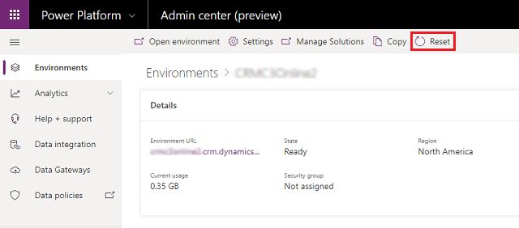
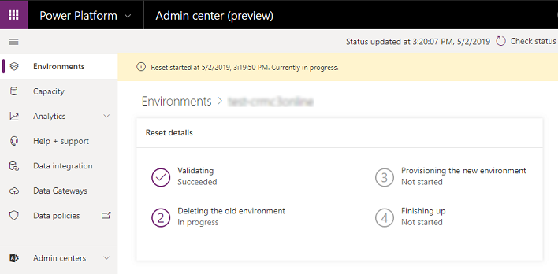

# Reset environment

Reset a sandbox environment to delete and re-provision it. Consider a reset when you want to:  
  
- Create a new project  
- Free up storage space  
- Remove an environment containing Personally Identifiable Information (PII) data  
  
> [!IMPORTANT]
> - You can only reset sandbox environments. 
> - A reset will permanently delete environment components such as canvas apps, flows, custom connectors, and connections.

 **An example scenario**  
  
 Thomas is looking at the storage consumed by the various Contoso environments and is getting concerned that they'll run out of space in one of their production environments.  He'd like to free up some space so he can give the production environment some additional storage.  He's also been notified that the Legal department has set a retention policy on the use of production data in the test environment.  
  
 After contacting Isaac, Thomas resets the Sales department's complete sandbox environment. The environment is re-provisioned to factory settings and ready for future use as a sandbox environment for a future project.  
 
### To reset an environment  

1. Go to the [Power Platform admin center](https://admin.powerplatform.microsoft.com) and sign in using Environment Admin or System Administrator role credentials.
  
2. From the left-side menu, select **Environments**, and then select an environment to reset.

3. Select **Reset** from the top menu bar.
  
   > [!div class="mx-imgBorder"] 
   > 

4. On the **Reset environment** page, adjust the environment settings as needed and then select **Reset**.  
  
   > [!WARNING]
   >  The sandbox environment will be deleted and reset to factory settings. You will not be able to recover any deleted data.  
  
5. Select **Confirm** to reset the selected environment.

The reset process starts.

> [!div class="mx-imgBorder"] 
> 
  