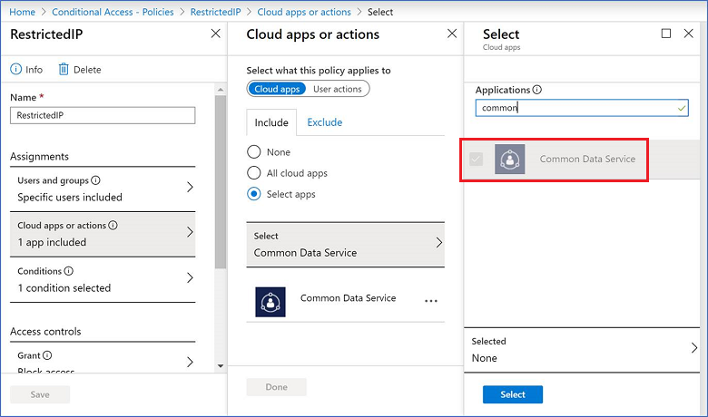

# Block access by location with Azure AD Conditional Access

You can limit access to users with block access by location to reduce unauthorized access. When block access by location restrictions are set in a user’s profile and the user tries to log in from a blocked location, access to customer engagement apps (Dynamics 365 Sales, Dynamics 365 Customer Service, Dynamics 365 Field Service, Dynamics 365 Marketing, and Dynamics 365 Project Service Automation), are blocked.  
  
 **Requirements**  
  
- A subscription to [Azure Active Directory Premium](https://www.microsoft.com/cloud-platform/azure-active-directory).  
  
- A federated [!INCLUDE[pn_azure_active_directory](../includes/pn-azure-active-directory.md)] tenant. See [What is Conditional Access?](https://docs.microsoft.com/azure/active-directory/conditional-access/overview)
  
   

## Additional security considerations  
Block access is only enforced during user authentication.  This is done by the [!INCLUDE[pn_azure_active_directory](../includes/pn-azure-active-directory.md)] Conditional Access capability. Customer engagement apps set a session timeout limit to balance protecting user data and the number of times users are prompted for their sign-in credentials. Block access for devices (including laptops) is not applied until the session timeout expires.  
  
 For example, block access is setup to only allow access to customer engagement apps when users are working from a corporate office.  When a user signs in into customer engagement apps using their laptop from their office and establishes a session, the user can continue to access customer engagement apps after leaving the office until the session timeout expires.  This behavior also applies to mobile and offsite connections such as: Dynamics 365 for Phones and Tablets, and [!INCLUDE[pn_crm_app_for_outlook_short](../includes/pn-crm-app-for-outlook-short.md)].  
  
   

## Create a security group (optional)  
You can block access to all Users or groups of users.  It's more efficient to restrict by a group if only a subset of your Azure Active Directory (Azure AD) users are accessing customer engagement apps.  

For information, see: [Create a basic group and add members using Azure Active Directory](https://docs.microsoft.com/azure/active-directory/fundamentals/active-directory-groups-create-azure-portal).
  
   

## Create a block access by location
Block access by location is set using Azure Active Directory (AD) Conditional Access. For the cloud app, select **Common Data Service** to control access to customer engagement apps (such as Dynamics 365 Sales and Customer Service).
  
> [!NOTE]
>  Setting Conditional Access is only available with an [!INCLUDE[pn_azure_active_directory](../includes/pn-azure-active-directory.md)] Premium license.  Upgrade your Azure AD to a Premium license in the Microsoft 365 admin center (**<https://admin.microsoft.com>** > **Billing** > **Purchase services**).  
  
**To create a block access by location for your users:**

1. Create a Named location. See [Define locations](https://docs.microsoft.com/azure/active-directory/conditional-access/howto-conditional-access-policy-location#define-locations). 
2. Create a Conditional Access policy. See [Create a Conditional Access policy](https://docs.microsoft.com/azure/active-directory/conditional-access/howto-conditional-access-policy-location#create-a-conditional-access-policy).

   For **Step 6. Under Cloud apps or actions**, select the Microsoft Dataverse application.

  > [!div class="mx-imgBorder"] 
  > 

### See also  
 [How to set Azure Active Directory device-based conditional access policy for access control to Azure Active Directory connected applications](https://azure.microsoft.com/documentation/articles/active-directory-conditional-access-policy-connected-applications/)   
