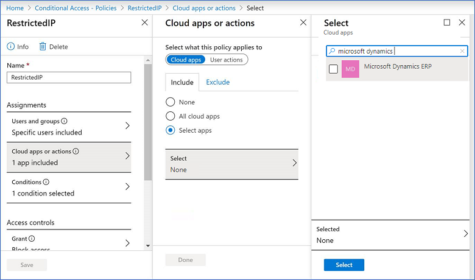

# Block access by location with Microsoft Entra Conditional Access

[!INCLUDE[new-PPAC-banner](~/includes/new-PPAC-banner.md)]

You can limit access to users with block access by location to reduce unauthorized access. By using Conditional Access policies, you can apply the right access controls when needed to help keep your organization secure and stay out of your user's way when not needed. Conditional Access analyses signals such as user, device, and location to automate decisions and enforce organizational access policies for resources. For example, when location restrictions are set in a user’s profile and the user tries to sign in from a blocked location, access to customer engagement apps (Dynamics 365 Sales, Dynamics 365 Customer Service, Dynamics 365 Field Service, Dynamics 365 Marketing, Dynamics 365 Project Service Automation), and finance and operations apps are denied. For more information about Conditional Access, see the [Conditional Access](/azure/active-directory/conditional-access/) documentation.

**Requirements**  
  
- A subscription to [Microsoft Entra ID P1 or P3](https://www.microsoft.com/security/business/identity-access-management/azure-active-directory).  
  
- A federated [!INCLUDE[pn_azure_active_directory](../includes/pn-azure-active-directory.md)] tenant. See [What is Conditional Access?](/azure/active-directory/conditional-access/overview)

## Additional security considerations  
Block access is only enforced during user authentication.  This is done by the [!INCLUDE[pn_azure_active_directory](../includes/pn-azure-active-directory.md)] Conditional Access capability. Customer engagement and finance and operations apps set a session timeout limit to balance protecting user data and the number of times users are prompted for their sign-in credentials. Block access for devices (including laptops) is not applied until the session timeout expires.  
  
 For example, block access is set up to only allow access to customer engagement and finance and operations apps when users are working from a corporate office.  When a user signs in into customer engagement and finance and operations apps using their laptop from their office and establishes a session, the user can continue to access customer engagement and finance and operations apps after leaving the office until the session timeout expires.  This behavior also applies to mobile and offsite connections such as: Dynamics 365 for Phones and Tablets, [!INCLUDE[pn_crm_app_for_outlook_short](../includes/pn-crm-app-for-outlook-short.md)], and finance and operations (Dynamics 365) mobile app.
  
## Create a security group (optional)  
You can block access to all Users or groups of users.  It's more efficient to restrict by a group if only a subset of your Microsoft Entra users are accessing customer engagement and finance and operations apps.  

For information, see: [Create a basic group and add members using Microsoft Entra ID](/azure/active-directory/fundamentals/active-directory-groups-create-azure-portal).

## Create a block access by location
Block access by location is set using Microsoft Entra ID (AD) Conditional Access. For the cloud app, select **Common Data Service** to control access to customer engagement apps (such as Dynamics 365 Sales and Customer Service), or for the cloud app, select **Microsoft Dynamics ERP** to control access to finance and operations apps.
  
> [!NOTE]
> Setting Conditional Access is only available with an [!INCLUDE[pn_azure_active_directory](../includes/pn-azure-active-directory.md)] Premium license.  Upgrade your Microsoft Entra to a Premium license in the Microsoft 365 admin center (**<https://admin.microsoft.com>** > **Billing** > **Purchase services**).  
  
**To create a block access by location for your users:**

1. Create a Named location. See [Define locations](/azure/active-directory/conditional-access/howto-conditional-access-policy-location#define-locations). 
2. Create a Conditional Access policy. See [Create a Conditional Access policy](/azure/active-directory/conditional-access/howto-conditional-access-policy-location#create-a-conditional-access-policy).

  For **Step 6. Under Cloud apps or actions**, select the Microsoft Dataverse application.

  > [!div class="mx-imgBorder"] 
  > 

  or

  For **Step 6. Under Cloud apps or actions**, select the Microsoft Dynamics ERP for finance and operations application.

  > [!div class="mx-imgBorder"] 
  > 

### See also  
[How to set Microsoft Entra device-based conditional access policy for access control to Microsoft Entra connected applications](/azure/active-directory/conditional-access/require-managed-devices)  
[Conditional Access docs](/azure/active-directory/conditional-access/)  
[Restrict access with Conditional access for finance and operations apps](https://github.com/microsoft/Dynamics-365-FastTrack-Implementation-Assets/blob/master/CloudSecurity/ConditionalAccess/readme.md)

[!INCLUDE[footer-include](../includes/footer-banner.md)]
