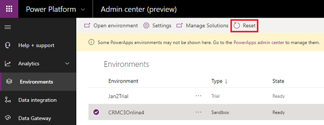

# Sandbox environments

A Sandbox environment is any non-production environment of Common Data Service for apps. Isolated from production, a Sandbox environment is the place to safely develop and test application changes with low risk.

## View your Sandbox environments  

Manage your Sandbox environments from the Power Platform Admin center.  
  
1. Go to [https://admin.powerplatform.microsoft.com/](https://admin.powerplatform.microsoft.com), and sign in as an admin.
  
2. Open the **Environments** page. Select the **Type** tab to sort by environment type.
  
   > [!div class="mx-imgBorder"] 
   > 

## Reset a Sandbox environment  

Reset a Sandbox environment to delete and re-provision it. Consider a reset when you want to:  
  
- Change to a different version of Common Data Service for apps  
  
- Create a new project  
  
- Free up storage space  
  
- Remove an environment containing Personally Identifiable Information (PII) data  
  
> [!NOTE]
> You can only reset Sandbox environments.  
  
### To reset an environment  
  
1. Go to [https://admin.powerplatform.microsoft.com/](https://admin.powerplatform.microsoft.com), and sign in as an admin.
  
2. Open the **Environments** page, select the environment to reset, and then select **Reset**.

   > [!div class="mx-imgBorder"] 
   > 
  
3. On the **reset environment** page, adjust the environment settings as needed and then click **Reset**.  
  
   > [!WARNING]
   >  The Sandbox environment will be deleted and reset to factory settings. You will not be able to recover any deleted data.  
  
6. Select **Confirm** in the confirmation dialog box.  

