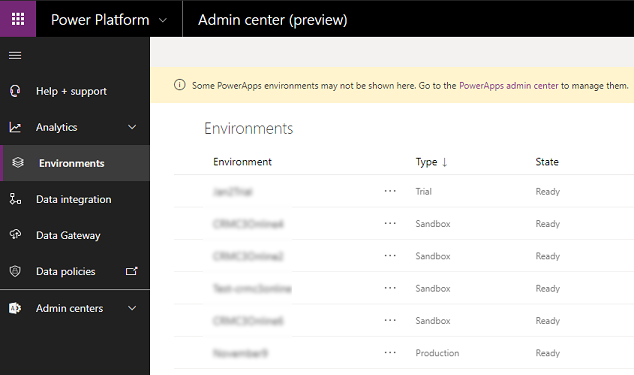

# Manage sandbox environments

A sandbox environment is any non-production environment of Common Data Service. Isolated from production, a sandbox environment is the place to safely develop and test application changes with low risk.

## View your sandbox environments  

Manage your sandbox environments from the Power Platform admin center.  
  
1. Go to [https://admin.powerplatform.microsoft.com/](https://admin.powerplatform.microsoft.com), and sign in using Environment Admin or System Administrator role credentials.
  
2. Open the **Environments** page. Select the **Type** tab to sort by environment type.
  
   > [!div class="mx-imgBorder"] 
   > 

## Create a sandbox environment

See [Create and manage environments in the Power Platform admin center](create-environment.md).

## Change a production environment to sandbox

1. Sign in to the Power Platform admin center at [https://admin.powerplatform.microsoft.com](https://admin.powerplatform.microsoft.com) as an admin (Service admin, Global admin, or Delegated admin).

2. From the left-side menu, select **Environments**, and then select a production environment.

3. Select **Edit**

   > [!div class="mx-imgBorder"] 
   > 

4. Under **Type**, choose the sandbox environment type. 

   > [!div class="mx-imgBorder"] 
   > 

5. Select **Save**.

## Reset a sandbox environment  

Reset a sandbox environment to delete and re-provision it. Consider a reset when you want to:  
  
- Create a new project  
- Free up storage space  
- Remove an environment containing Personally Identifiable Information (PII) data  
  
> [!IMPORTANT]
> - You can only reset sandbox environments. 
> - A reset will permanently delete environment components such as canvas apps, flows, custom connectors, and connections.

 **An example scenario**  
  
 Thomas is looking at the storage consumed by the various Contoso environments and is getting concerned that they'll run out of space in one of their production environments.  He'd like to free up some space so he can give the production environment some additional storage.  He's also been notified that the Legal department has set a retention policy on the use of production data in the test environment.  
  
 After contacting Isaac, Thomas resets the Sales department's complete sandbox environment. The environment is re-provisioned to factory settings and ready for future use as a sandbox environment for a future project.  
 
### To reset an environment  

1. Go to the [Power Platform admin center](https://admin.powerplatform.microsoft.com) and sign in using Environment Admin or System Administrator role credentials.
  
2. From the left-side menu, select **Environments**, and then select an environment to reset.

3. Select **Reset** from the top menu bar.
  
   > [!div class="mx-imgBorder"] 
   > 

4. On the **Reset environment** page, adjust the environment settings as needed and understand the following consequences:  
  
   > [!WARNING]
   > - The sandbox environment will be deleted and reset to factory settings. You will not be able to recover any data that was previously in the environment. 
   > - When you reset an environment, the security group specified on the **Reset environment** page will be applied. If a security group isn’t specified during the reset, no security group will be assigned to the environment after the reset is completed.  Any existing security group configured before the reset is performed will no longer be applied to the environment. More information: [Control user access to environments: security groups and licenses](control-user-access.md)   
  
5. Select **Reset**, and then select **Confirm** to reset the selected environment.

The reset process starts.

> [!div class="mx-imgBorder"] 
> 
  
## Administration mode  
 When you place a sandbox environment in administration mode only users with System Administrator or System Customizer security roles will be able to sign in to that environment. Administration mode is useful when you want to make operational changes and not have regular users affect your work, and not have your work affect regular users.  
  
> [!NOTE]
> - You can only place sandbox environments in administration mode.  
> - Processes that use code, such as plug-ins or custom workflow assemblies, continue to be processed by the Common Data Service platform when administration mode is enabled and background operations are disabled.
  
 On the **Details** page, you can set the following.  
  
|Setting|Description|  
|-------------|-----------------|  
|Administration mode | Select to enable administration mode for the selected sandbox environment. Only System Administrators or System Customizers will be able to sign in to the selected sandbox environment.|  
|Background operations | Select to disable all asynchronous operations (see [Asynchronous service](https://docs.microsoft.com/powerapps/developer/common-data-service/asynchronous-service)) such as workflows and synchronization with Exchange. Emails will not be sent and server-side synchronization for appointments, contacts, and tasks are disabled. **Note:**  Administration mode must be enabled to disable background operations.|  
|Custom message | Enter a message that will be displayed to all users when they attempt to sign in.|  
  
### Set administration mode  
  
1. Go to the [Power Platform admin center](https://admin.powerplatform.microsoft.com) and sign in using Environment Admin or System Administrator role credentials.
  
2. From the left-side menu, select **Environments**, and then select a sandbox environment.
  
3. Select **See all**.
  
4. On the **Details** page, select **Edit**. 
  
5. Under **Administration mode**, toggle **Disabled** to **Enabled**.

6. Set **Background operations** and **Custom message**, and then select **Save**.