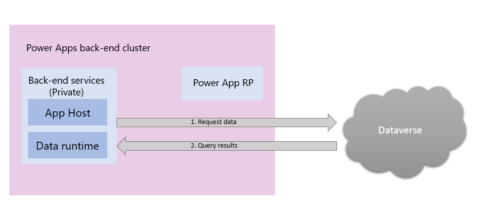
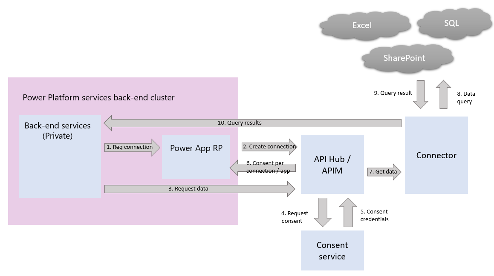

# Connect to data sources

> **Working notes**
>
> This topic is all about connecting to data and associated security:
>
> - Explain the various data sources that Power Platform components can connect to; talk in detail about Dataverse (data platform), connectors, on-premises data gateways, VNets
> - Talk about data centers and residency/sovereignty

## Connecting and authenticating to data sources

Connecting and authenticating to an external data source is an explicit and separate step from authenticating to a Power Platform service. The credentials may be the same for both steps but they may explicitly vary as well depending on your needs for your application.  

Additionally, while the specific pattern of how a Power Platform service connects to external data sources may vary, the general pattern is the same.  It can be very important to understand the specifics of how a Power Platform service connects and authenticates depending on your usage pattern. Details on how each Power Platform service varies is called out below.

### Dataverse

Generally, Power Platform services use connectors to work with external data sources.  However, Power Apps (canvas and model driven apps) connect directly to Dataverse. No connectors are involved. Power Apps (canvas) does store consent to work with other Dataverse environments in the Power Apps RP.  Similarly, Power Automate first authenticates via API Hub but all data interactions after that are direct to Dataverse.  Both Power Apps and Power Automate support legacy connectors that access Dataverse via connectors [e.g., via D365 and CDS].

Below is a image that illustrates how Power Apps (canvas) works with Dataverse.

## Connectors

Power Platform services use connectors to work with all other data sources. The sequence of operations in working with a connector is:

1. Power Platform service requests a connection of the Power Apps RP service.  Power Apps RP requests API Hub to create and store the connection and credentials. (Arrows 1 - 2)
2. When a user requests data via a query, having previously secured an authenticated connection, the request goes directly to APIM. (Arrows 3 - 6)
3. APIM uses the consent service to get user permission to access the data source.  For Power Apps, the consent triple (Connection, Application, User) is stored in Power Apps RP so that when the user requests data again we do not again prompt for consent. Note that consent for a given connection application combination does not give consent for all applications.  Each application connection consent per user is separate. For Power Automate this is the double (Connection, User).  Consent is not required for subsequent use of the connection.
4. The data query is passed on to the connector which then passes it on to the actual data source. (Arrows 7 - 8)
5. The data result is passed to the connector and then back to the Power Platform service back end cluster. (Arrows 9 - 10)

## Authentication to data sources

Again, authentication of an end user to a Power Platform data source is a separate and distinct step from authentication to the Power Platform service. First each user authenticates to the Power Platform service and then the credentials required by the connector are used to authenticate to the data source. In all cases credentials are stored and managed by the API Hub credentials service.  It is important to note that some connector types support more than one authentication method. Authentication to a data source for a Power Platform service is then specific to each data source instance and is based on the authentication choice made when creating the connection for the service.

For Power Apps specifically, there are two types of Power Apps data source authentication: explicit and implicit. And it’s important to know the difference to keep your data secure.  Explicit authentication means that only the end user’s credentials will be used to access the data source. Implicit authentication means that the credentials the author used when creating the connection for the Power Apps will be used. The most secure connection type is explicit and we recommend it. [Canvas Apps SQL Server security](https://docs.microsoft.com/en-us/powerapps/maker/canvas-apps/connections/sql-server-security).

## Data residency

To understand how Power Platform stores data, it’s important to make a distinction between Personal data and more general Customer data.

- Personal data is information about people which contains Personally Identifiable Information (PII) and is subject to the control of GDPR/Schrems II.  
- Customer data includes Personal data but also includes other customer data like URLs, metadata and employee authentication information such as DNS names.

Power Platform protects all Customer Data with care and unless otherwise indicated in documentation, stores Customer data in an Azure geography that is assigned when an Azure AD tenant signs up for Power Platform services for the first time. An Azure AD tenant houses the user and application identities, groups, and other relevant information that pertain to an organization and its security.

### Regions

An Azure geography for tenant data storage is assigned by mapping the country or region selected as part of the Azure AD tenant setup to the most suitable Azure geography where a Power Platform deployment exists. Once this determination is made, all Power Platform customer data will be stored in this selected Azure geography (also known as the home geo), except in cases where organizations utilize multi-geo deployments.
Multiple geographies (multi-geo)

Some organizations have a global presence and may require Power Platform services in multiple Azure geographies. For example, a business may have their headquarters in the United States but may also do business in other geographical areas, such as Australia. In such cases the business may require that certain Power Platform data remain stored at rest in the remote region to comply with local regulations. This feature of the Power Platform service is referred to as multi-geo.

Only the Environment related metadata is stored in the home tenant. All metadata/data for products within that environment will be stored in the selected target geo environment. Microsoft may replicate data to other regions for data resiliency but will not replicate or move Personal data outside the geo. Data replicated to other regions may include non-Personal Data such as employee authentication information.

Power Platform services are available in specific Azure geographies as described in the Microsoft Trust Center. For more information about where your data is stored and how it is used, please refer to the Microsoft Trust Center. Commitments concerning the location of customer data at rest are specified in the Data Processing Terms of the Microsoft Online Services Terms. Microsoft also provides datacenters for sovereign entities. See [Regions Overview.](https://docs.microsoft.com/en-us/power-platform/admin/regions-overview)

## Data handling

This section outlines Power Platform data handling practices when it comes to storing, processing, and transferring customer data.

### Data at rest

- Azure SQL Databases
- Azure Storage (various types)

Unless otherwise stated in documentation, customer data remains in its original data source location (e.g., Dataverse, SharePoint, SQL Server, … ) while the Power Platform app is stored in Azure Storage as part of an environment. For mobile scenarios, data is encrypted and stored in SQL Express.
In the majority of scenarios, Azure Storage is utilized to persist the data of Power Platform artifacts, while Azure SQL Databases are used to persist artifact metadata.

All data persisted by Power Platform is encrypted by default using Microsoft-managed keys. Customer data stored in Azure SQL Databases is fully encrypted using Azure SQL's Transparent Data Encryption (TDE) technology. Customer data stored in Azure Blob storage is encrypted using Azure Storage Encryption. (?? What specific algorithm is being used?)

### Data in processing

Data is in processing when it is either actively being used by one or more users as part of an interactive scenario, or when a background process, such as refresh, touches this data. Power Platform loads actively processed data into the memory space of one or more service workloads. To facilitate the functionality required by the workload, the processed data in memory is not encrypted.

### Data in transit

Power Platform requires all incoming HTTP traffic to be encrypted using TLS 1.2 or above. Any requests attempting to use the service with TLS 1.1 or lower will be rejected.

## Network isolation

This section outlines advanced security features in Power Platform. Some of the features have specific licensing requirements. See the sections below for details.

### Service tags

A service tag represents a group of IP address prefixes from a given Azure service. It helps minimize the complexity of frequent updates to network security rules. Customers can use service tags to define network access controls on Network Security Groups or Azure Firewall. Customers can use service tags in place of specific IP addresses when creating security rules. By specifying the service tag name (e.g., PowerBI) in the appropriate source or destination (for APIs) field of a rule, customers can allow or deny the traffic for the corresponding service. Microsoft manages the address prefixes encompassed by the service tag and automatically updates the service tag as addresses change.

### Data loss prevention

Finally, the Power Platform has an extensive set of [Data Loss Prevention (DLP) features](https://docs.microsoft.com/en-us/power-platform/admin/prevent-data-loss) to help you manage security.  

### See also

[Add related articles]
