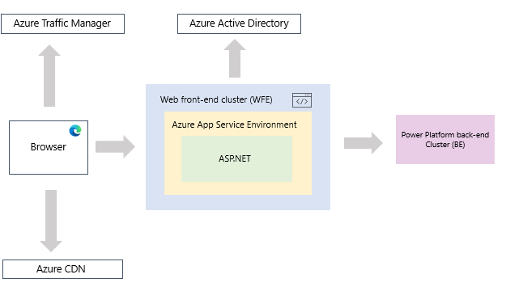
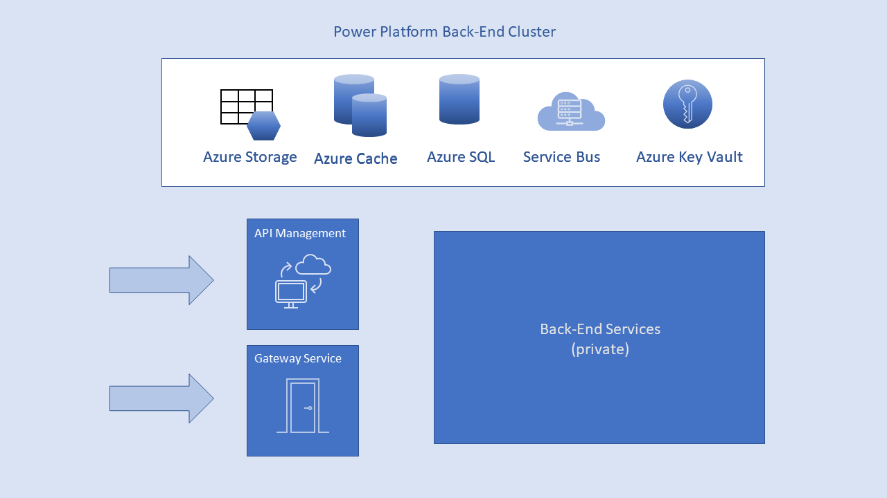

# Overview: Security in Microsoft Power Platform

The articles in this section give security professionals an overview of how Power Platform handles security. Power Platform embodies many different technologies and this article will provide a general overview with additional resources to specific technologies that differ from the standard practice. Microsoft Dataverse has a rich set of security practices that are optimized around data storage. Whereas other Power Platform services such as Power Apps and Power Automate have a rich set of practices oriented towards a web-based technology.

Microsoft Power Platform enables both non-professional and professional developers to quickly and easily create end-to-end solutions. These solutions may include applications, databases, and workflows both for small work groups or the entire organization. Security is critical for these solutions and Power Platform is built to provide industry-leading complete protection.  

As organizations accelerate their transition their work to the cloud, we see a massive increase in remote working, increased customer demand for online services, and increased use of advanced technologies in operations and business decision-making.  Power Platform enables these scenarios with applications on the cloud in a secure way.

Traditional on-premise application security will not suffice.  Organizations must look for a cloud-native, multi-tiered, defense-in-depth security solution for their business intelligence data. Power Platform was built to provide industry-leading complete protection for data. Today, many national security agencies, financial institutions, and health care providers entrust it with their most sensitive information.

It all starts with the foundation. After a rough period in the early 2000s, Microsoft made massive investments to address its security vulnerabilities, and in the following decades built a very strong security stack that goes as deep as the machine on-chip bios kernel and extends all the way up to end-user experiences. These deep investments continue and today over 3,500 Microsoft engineers are engaged in building and enhancing Microsoft's security stack and proactively addressing the ever-shifting threat landscape. With billions of computers, trillions of logins, and countless zettabytes of information entrusted to Microsoft's protection, the company now possesses the most advanced security stack in the tech industry and is broadly viewed as the global leader in the fight against malicious actors.

Power Platform builds on this very strong foundation. It uses the same security stack that earned Azure the right to serve and protect the world's most sensitive data, and it integrates with the most advanced information protection and compliance tools of Microsoft 365. On top of this, it delivers security through multi-layered security measures, resulting in end-to-end protection designed to deal with the unique challenges of the cloud era.

To provide an end-to-end solution for protecting sensitive assets, the product team addressed challenging customer concerns on multiple simultaneous fronts:

- How do we control who can connect, where they connect from, and how they connect? How can we control the connections?
- How is the data stored? How is it encrypted? What controls do I have on my data?
- How do I control and protect my sensitive data? How do I ensure this data cannot leak outside the organization?
- How do I audit who conducts what operations? How do I react quickly if there's suspicious activity on the service?

## Common security topics

The following security articles provide a comprehensive answer to all questions mentioned above. As Power Platform includes several services, some of the security concepts are broadly used by all the services. However, some are specific to individual services. For instance, security articles dedicated to [Dataverse](../wp-security.md) since the security concepts around it are scoped to the data-layer concerns.  

The first few articles in this section give an overview of the common security concepts in Power Platform, but with an emphasis on traditional web-based services such as Power Apps and Power Automate. While majority of concepts apply to all of the services for a given area, there are some differences between services. In places where services differ, they are specifically called out. Specific security topics such as Data Loss Prevention (DLP) are covered as specific articles, available under the section [Security and governance](/power-platform/admin/security).

Security topics that are common to all of Power Platform include:

- The Power Platform service architecture - how the main flows in the system work
- Authentication to the service for the Power Platform services
- Data connections including authentication
- Data at rest and encryption

The Power Platform service is governed by the [Microsoft Online Services Terms](https://www.microsoftvolumelicensing.com/DocumentSearch.aspx?Mode=3&DocumentTypeId=31), and the [Microsoft Enterprise Privacy Statement](https://www.microsoft.com/privacystatement/OnlineServices/Default.aspx). For the location of data processing, refer to the Location of Data Processing terms in the [Microsoft Online Services Terms](https://www.microsoftvolumelicensing.com/DocumentSearch.aspx?Mode=3&DocumentTypeId=31) and to the [Data Protection Addendum](https://www.microsoft.com/download/details.aspx?id=101581).

For compliance information, the [Microsoft Trust Center](https://www.microsoft.com/trustcenter) is the primary resource for Power Platform. The Power Platform team is working hard to bring its customers the latest innovations and productivity. Learn more about compliance in the [Microsoft compliance offerings](/compliance/regulatory/offering-home). 

The Power Platform service follows the Security Development Lifecycle (SDL), strict security practices that support security assurance and compliance requirements. The SDL helps developers build more secure software by reducing the number and severity of vulnerabilities in software, while reducing development cost. Learn more at [Microsoft Security Development Lifecycle Practices](https://www.microsoft.com/securityengineering/sdl/practices).

## Power Platform service architecture

The Power Platform services are built on Azure, Microsoft's cloud computing platform. The Power Platform services are currently deployed in many datacenters around the world. There are many active deployments made available to customers in the regions served by those datacenters and an equal number of passive deployments that serve as backups for each active deployment.

    flowing to Power Platform back-end clusters.")

### Web front-end cluster 

For the Power Platform services that display UI, the web front-end cluster provides the user's browser with the initial HTML page contents on site load and manages the initial connection and authentication process using Azure Active Directory (Azure AD) to authenticate clients and provide tokens for subsequent client connections to the Power Platform back-end service.

  

A web front-end  cluster consists of an ASP.NET website running in the Azure App Service Environment. When users attempt to connect to a Power Platform service, the client's DNS service may communicate with the Azure Traffic Manager to find the most appropriate (usually nearest) datacenter with the Power Platform service's deployment. For more information about this process, see [Performance traffic-routing method for Azure Traffic Manager](/azure/traffic-manager/traffic-manager-routing-methods#performance-traffic-routing-method).

The web front-end cluster assigned to the user manages the login and authentication sequence (described later in this article) and obtains an Azure AD access token once authentication is successful. The ASP.NET component within the web front-end cluster parses the token to determine which organization the user belongs to, and then consults the Power Platform service back-end global service. The web front-end specifies to the browser which back-end cluster houses the organization's tenant.

Once a user is authenticated, subsequent client interactions for customer data occur with the back-end  cluster directly without the web front-end being an intermediator for those requests. Static resources such as *.js,*.css, and image files are mostly stored on Azure Content Delivery Network and retrieved directly by the browser.

Note that Sovereign Government cluster deployments are an exception to this rule, and for compliance reasons will omit the Azure Content Delivery Network and instead use a web front-end cluster from a compliant region for hosting static content.

### Power Platform back-end clusters

The back-end cluster for a given Power Platform service is the backbone of all the functionality available in the service. It consists of several service endpoints consumed by Web Front End and API clients as well as background working services, databases, caches, and various other components. The back end is available in most Azure regions, and is deployed in new regions as they become available. A single Azure region hosts one or more back-end clusters that allow unlimited horizontal scaling of the Power Platform services once the vertical and horizontal scaling limits of a single cluster are exhausted.

Each back-end cluster is stateful and hosts all the data of all the tenants assigned to that cluster. A cluster that contains the data of a specific tenant is referred to as the tenant’s home cluster. An authenticated user's home cluster information is provided by Global Service and used by the Web Front End to route requests to the tenant’s home cluster.

Each back-end cluster consists of multiple virtual machines combined into multiple resizable-scale sets tuned for performing specific tasks, stateful resources such as SQL Azure databases, storage accounts, service buses, caches, and other necessary cloud components.

Tenant metadata and data are stored within cluster limits, except for data replication to a secondary back-end cluster in a paired Azure region in the same Azure geography. The secondary back-end cluster serves as a failover cluster in case of regional outage, and is passive at any other time. The back-end functionality is also serviced by micro-services running on different machines within the cluster’s virtual network that are not accessible from the outside, except for two components that can be accessed from the public internet:

- Gateway Service
- Azure API Management

### Power Platform Premium infrastructure

Power Platform Premium offers access to a set of connectors as a premium offering. The Power Platform authors are not restricted in the use of these connectors but users of an app are.  These connectors include, for instance, Dataverse and Microsoft SQL Azure. End users of an app created using Power Apps must have the correct license to access these premium connectors. The Power Platform back-end service determines if a user has access to premium connectors or not.

### Mobile

Mobile supported on the three primary mobile platforms: Android, iOS, and Windows (UWP). Security considerations for mobile apps fall into two categories:

- Device communication
- The application and data on the device

For device communication, all Power Platform mobile applications communicate with the service and use the same connection and authentication sequences used by browsers. The mobile applications for iOS and Android bring up a browser session within the application itself, while the Windows mobile app brings up a broker to establish the communication channel with the Power Platform services (for the sign-in process).

The following table shows certificate-based authentication (CBA) support for mobile, based on mobile device platform:

|CBA support |iOS |Android |Windows |
---- | ---- | ---- | ----
Sign in to service | Supported | Supported | Not supported
SSRS ADFS on-prem (connect to SSRS server) |Not supported |Supported |Not supported
SSRS App Proxy |Supported |Supported |Not supported

Mobile apps actively communicate with the Power Platform services. Telemetry is used to gather mobile app usage statistics and similar data, which is transmitted to services that are used to monitor usage and activity; no customer data is sent with telemetry.

The Power Platform services securely store data on the device that facilitates use of the mobile app:

- Azure AD and refresh tokens are stored in a secure mechanism on the device, using industry-standard security measures.
- Data and settings (key-value pairs for user configuration) are cached in storage on the device, and can be encrypted by the OS. In iOS this is automatically done when the user sets a passcode. In Android this can be configured in the settings. In Windows it is accomplished by using BitLocker.
- For Android and iOS apps, the data and settings (key-value pairs for user configuration) are cached in storage on the device in a sandbox and internal storage which is accessible only to the app. For the Windows app, the data is only accessible by the user (and system admin).
- Geolocation is enabled or disabled explicitly by the user. If enabled, geolocation data is not saved on the device and is not shared with Microsoft.
- Notifications are enabled or disabled explicitly by the user. If enabled, Android and iOS do not support geographic data residency requirements for notifications.

Data encryption can be enhanced by applying file-level encryption via Microsoft Intune, a software service that provides mobile device and application management. All three platforms for which the Power Platform Mobile apps are available support Intune. With Intune enabled and configured, data on the mobile device is encrypted, and the Power Platform application itself cannot be installed on an SD card. Learn more about [Microsoft Intune](https://www.microsoft.com/cloud-platform/microsoft-intune). The Windows app also supports [Windows Information Protection (WIP)](/windows/security/information-protection/windows-information-protection/protect-enterprise-data-using-wip).  

In order to implement SSO, some secured storage values related to the token-based authentication are available for other Microsoft apps (such as Microsoft Authenticator) and are managed by the Azure Active Directory Authentication Library SDK.

Mobile cached data is deleted when the app is removed, when the user signs out of the Power Platform service for Mobile, or when the user fails to sign in (such as after a token expiration event or password change). The data cache includes dashboards and reports previously accessed from the Power Platform Mobile app.

The Power Platform Mobile services do not access other application folders or files on the device.

### Related topics

[Authenticating to Power Platform services](authenticate-services.md) 
[Data storage in Power Platform](data-storage.md) 
[Connecting and authenticating to data sources](connect-data-sources.md) 
[Security in Microsoft Dataverse](../wp-security.md)
