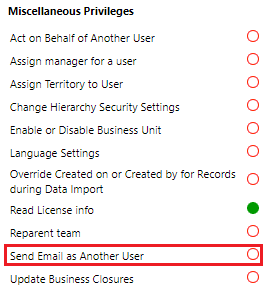
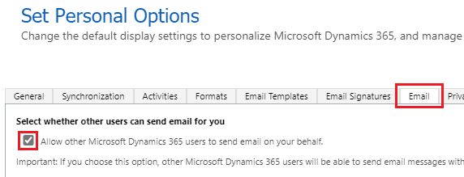

# Send email on behalf of another user 

Dynamics 365 users can send an outgoing email on behalf of another user by updating the **From** field to another user or queue.

## Prerequisites

- An admin should verify that the user has a role in Dynamics 365 that includes the Send Email as Another User privilege (**Settings** > **Advanced settings** > **Settings** > **Security** > **Security Roles** > select a role > **Business Management** tab > **Miscellaneous Privileges**).
  > [!div class="mx-imgBorder"] 
  > 
-	The other user being set as the sender on the email needs to select the **Allow other Microsoft Dynamics CRM users to send e-mail on your behalf** check box in their personal options (**Settings** > **Personalization Settings** > **Email** tab).
  > [!div class="mx-imgBorder"] 
  > 
-	The user sending the email needs to have read access to the queue. Note that this requirement only applies to the Send on Behalf permission for the queue. 

## Optional: Send outgoing email as another user with Exchange mailbox delegation

For the email to be shown as "send on behalf"of another user in Microsoft Outlook, ensure that the following prerequisites are met: 

- All prerequisites outlined in the previous section have been met.
- The OrgDbOrSetting **EnableMailboxDelegationForOutgoingEmail** is enabled.
- The user who is submitting the send request for the outgoing email in Dynamics 365 must have at least one of these three permissions:
  - Full Access
  - Send As or Send on Behalf permissions on the Exchange mailbox of the user in the **From** field.
  - Exchange permissions. More information: [Manage permissions for recipients](/Exchange/recipients/mailbox-permissions)

> [!NOTE]
> This feature is only available for the Exchange Server (on-premises) or Exchange Online email server profiles.
> 
> After the feature is enabled, all users in Dynamics 365 need to have proper permissions set up in Exchange if they want to use any other email address in the **From** field apart from their own email address. Otherwise, sending will fail with Exchange errors such as **ErrorSendAsDenied**.
>
> If your organization has configured multiple automated workflows owned by the same user to send emails via multiple users or queues, Dynamics 365 and Exchange throttling might occur because just the one mailbox (the workflow owner's) will be used to send all these emails.
