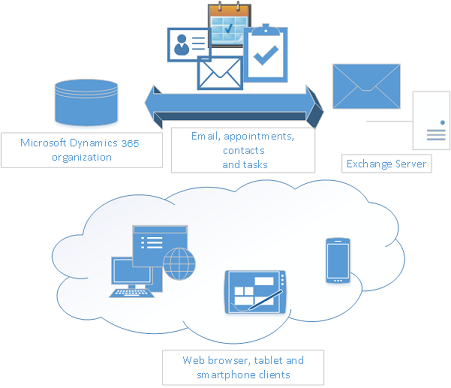

# Server-side synchronization

Server-side synchronization is the preferred option for organizations with users who run customer engagement apps (Dynamics 365 Sales, Dynamics 365 Customer Service, Dynamics 365 Field Service, Dynamics 365 Marketing, and Dynamics 365 Project Service Automation) in a web browser or on a mobile device, such as a tablet or smartphone. Server-side synchronization provides direct apps-to-email server synchronization. When you use [!INCLUDE[pn_Exchange](../includes/pn-exchange.md)], this includes bidirectional synchronization of email, contacts, tasks, and appointments. The data synchronized for each user can be controlled by using synchronization filters that are available on the **Synchronization** tab in the user options dialog box.  
  
If you use a POP3 email server, the data that is synchronized includes email only.  
  
Using server-side synchronization makes messaging data available to a web browser, tablet, or smartphone that's running customer engagement apps. More information: [Server-side synchronization of email, appointments, contacts, and tasks](../admin/set-up-server-side-synchronization-of-email-appointments-contacts-and-tasks.md)
  
  
  
> [!NOTE]
> A user can only map to a single [!INCLUDE[pn_Exchange](../includes/pn-exchange.md)] or POP3 mailbox. Similarly, an [!INCLUDE[pn_Exchange](../includes/pn-exchange.md)] or POP3 mailbox can only be mapped to a single user. When customer engagement apps detect that an [!INCLUDE[pn_Exchange](../includes/pn-exchange.md)] or POP3 mailbox has already been mapped to a user, a dialog box is displayed to present a choice to the user whether to map the user to the [!INCLUDE[pn_Exchange](../includes/pn-exchange.md)] mailbox. When the user selects **Yes**, it breaks the previous user-to-[!INCLUDE[pn_Exchange](../includes/pn-exchange.md)]-mailbox mapping and, subsequently, the synchronization that would occur between the user and the [!INCLUDE[pn_Exchange](../includes/pn-exchange.md)] mailbox.
  
## Server-side synchronization frequency
Server-side synchronization runs on a schedule for each mailbox and has different synchronization delays based on the workload processed. Available workloads are incoming emails, outgoing emails, and appointments, contacts, and tasks synchronization.

After a mailbox has been successfully tested and enabled, server-side synchronization will start processing for the configured workloads continuously. When workload processing starts, server-side synchronization will interact with your mailbox on the external email service provider, and also with your data in the Dynamics 365 environment. These interactions can take time based on the responsiveness of the email service provider, the number of items being synchronized, connection throttling, the amount of data exchanged, and the number of attachments. Furthermore, these interactions can take additional time based on the active customizations deployed to Dynamics 365.

Because the next scheduled synchronization time for a given workload is calculated at the end of its processing cycle, this means that a prolonged synchronization cycle for a workload might affect the overall throughput of a mailbox. As such, there is no defined SLA for the duration of a synchronization cycle because it's directly influenced by the external factors mentioned previously.

### Incoming sync frequency

After an incoming sync cycle is completed, a mailbox will postpone the processing of incoming emails for five minutes. This means the mailbox will be ready for processing again in five minutes.  

> [!IMPORTANT]
> Having long-running synchronous customizations (plug-ins and workflows) in the email delivery flow can lead to lower throughput. Moving these customizations to async execution can improve throughput.

### Outgoing sync frequency

Server-side synchronization scans your Dynamics 365 environment for outgoing email messages that are in a "Pending Send" status and have been sent by using the Send SDK request. It updates the status on outgoing email messages as "Pending Send" for the active mailbox at a frequency of every five minutes and submits these email messages to the configured email service provider.  

> [!IMPORTANT]
> Generating a massive amount of outgoing email messages in Dynamics 365 that exceeds your email service capacity can cause a backlog and a delay of new email messages from the same mailbox. 
>
> Before creating bulk outgoing email messages, review your email service throttling limits:
> - For Gmail: [Gmail sending limits in Google Workspace](https://support.google.com/a/answer/166852?hl=en)
> - For Exchange Online: [Sending limits](/office365/servicedescriptions/exchange-online-service-description/exchange-online-limits#sending-limits)

### Appointments, contacts, and tasks sync frequency
After a sync cycle is completed for appointments, contacts, and tasks, a mailbox will be postponed for processing for 5 to 12 minutes after the synchronization. This means that the mailbox will be ready for processing again in 5 to 12 minutes, based on how active the mailbox has been in the last sync cycles.

If the mailbox is enabled for appointments, contacts, and tasks and incoming email as well, the postpone time will be from 5 to 15 minutes.  

## Features available with server-side synchronization

 Some features offered by server-side synchronization include the following:  
  
- **Sent Items folder**: If your server version is 9.1.0000.16819 or later, email messages sent from Dynamics 365 apps by using a server-side synchronization&ndash;enabled Exchange mailbox will be visible in the **Sent Items** folder in the Exchange sender's mailbox. To determine your version, sign in, and in the upper-right corner of the screen, select **Settings**  > **About**.  

  **Note**: This functionality can be disabled by toggling the SSSSaveOutgoingEmailToExchangeSentFolder [OrgDbOrgSetting](https://support.microsoft.com/en-us/topic/orgdborgsettings-tool-for-microsoft-dynamics-crm-20a10f46-2a24-a156-7144-365d49b842ba) to false. 

- **Email folder tracking**: You can simply drag email to a folder to track it. Folder tracking works on any mobile device that supports [!INCLUDE[pn_Microsoft_Exchange](../includes/pn-microsoft-exchange.md)], which means you can track email from just about any device.  
  
- **Doesn't require Outlook**: You don't have to have the [!INCLUDE[pn_crm_for_outlook_short](../includes/pn-crm-for-outlook-short.md)] add-in open to synchronize records. You can still use [!INCLUDE[pn_crm_for_outlook_short](../includes/pn-crm-for-outlook-short.md)] to track records manually even if you do server-side synchronization. This also helps to boost the performance of the Outlook add-in.  
  
- **Support for [!INCLUDE[pn_crm_app_for_outlook_short](../includes/pn-crm-app-for-outlook-short.md)]**: You can track incoming email with the new [!INCLUDE[pn_crm_app_for_outlook_short](../includes/pn-crm-app-for-outlook-short.md)]. [!INCLUDE[pn_crm_app_for_outlook_short](../includes/pn-crm-app-for-outlook-short.md)] works with [!INCLUDE[pn_Outlook_short](../includes/pn-outlook-short.md)] on the web, so all you need is a browser to track incoming email.  
  
## Features available with server-side synchronization in both customer engagement apps and Customer Engagement (on-premises)

 Some features offered by server-side synchronization include the following:  
  
- **Efficient resource utilization**: Server-side synchronization provides integrated mailbox management. You can disable inactive mailboxes that have permanent errors. It prevents resource hogging by applying an upper limit on the allocated capacity and time-out requests.  
  
- **Connection throttling**: Server-side synchronization provides a way to control the number of parallel connections opened against an email server, to prevent overloading the mail server.  
  
- **Data migration**: Server-side synchronization supports migrating configuration data from the Email Router to server-side synchronization by using the migration wizard.
  
- **Service isolation**: Server-side synchronization has separate queue-management and configuration settings for asynchronous operations, outgoing activities, and mailboxes. It's based off of asynchronous service architecture and might share the same process. In all cases, it manages server resources while maintaining isolation with the asynchronous service.  
  
- **Error reporting for users and administrators**: Server-side synchronization supports logging and reporting of errors specific to an email or one or more mailboxes. [!INCLUDE[proc_more_information](../includes/proc-more-information.md)] [Error logging for server-side synchronization](../admin/error-logging-server-side-synchronization.md)  
  
> [!NOTE]
> In customer engagement apps, you can synchronize emails by using [!INCLUDE[pn_crm_for_outlook_short](../includes/pn-crm-for-outlook-short.md)] or server-side synchronization. If server-side synchronization is selected, the synchronization doesn't require that you run [!INCLUDE[pn_crm_for_outlook_short](../includes/pn-crm-for-outlook-short.md)]. However, you'll still need [!INCLUDE[pn_crm_for_outlook_short](../includes/pn-crm-for-outlook-short.md)] to promote an item from [!INCLUDE[pn_Outlook_short](../includes/pn-outlook-short.md)].  
  
### See also

 [Set up server-side synchronization of email, appointments, contacts, and tasks](../admin/set-up-server-side-synchronization-of-email-appointments-contacts-and-tasks.md)   
 [Synchronizing data with Outlook or Exchange FAQ](frequently-asked-questions-synchronizing-records-dynamics-365-and-outlook.yml)

[!INCLUDE[footer-include](../includes/footer-banner.md)]