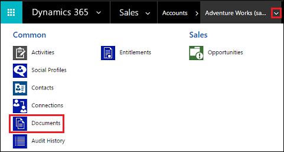
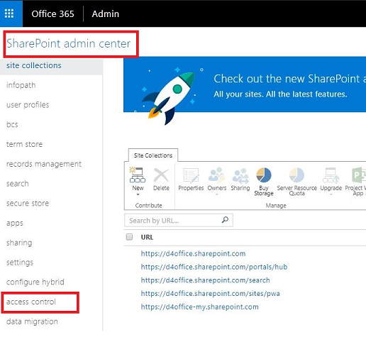
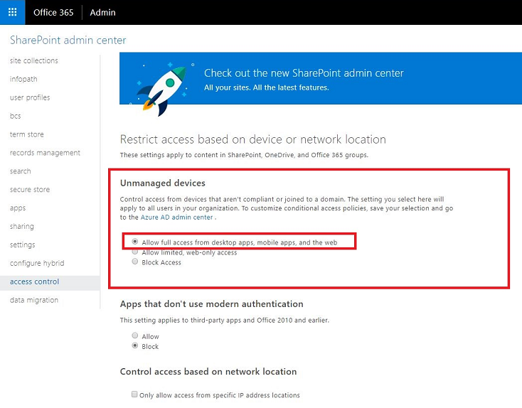

# Set up customer engagement apps to use SharePoint Online

[!INCLUDE [cc-data-platform-banner](../includes/cc-data-platform-banner.md)]

When you use [!INCLUDE[pn_microsoft_sharepoint_online](../includes/pn-microsoft-sharepoint-online.md)] with customer engagement apps (Dynamics 365 Sales, Dynamics 365 Customer Service, Dynamics 365 Field Service, Dynamics 365 Marketing, and Dynamics 365 Project Service Automation), you can:  
  
- Create, upload, view, and delete documents stored in [!INCLUDE[pn_SharePoint_short](../includes/pn-sharepoint-short.md)] from within customer engagement apps.  
  
- Use the [!INCLUDE[pn_SharePoint_short](../includes/pn-sharepoint-short.md)] document management abilities within customer engagement apps, such as checking the document in and out and changing document properties.  
  
- Enable non-customer engagement apps users, such as customers who want to review a bid, to directly access the [!INCLUDE[pn_SharePoint_short](../includes/pn-sharepoint-short.md)] documents, provided they have the appropriate permissions.  
  
> [!IMPORTANT]
>  This topic is for organizations who wish to deploy for the first time or upgrade to server-based [!INCLUDE[pn_SharePoint_short](../includes/pn-sharepoint-short.md)] integration. After you enable server-based [!INCLUDE[pn_SharePoint_short](../includes/pn-sharepoint-short.md)] integration, you can't revert to the previous client-based authentication method.  
> 
> [!TIP]
>  Check out the following video: [Connect to SharePoint Online](https://go.microsoft.com/fwlink/p/?linkid=837790)  
  
 To set up customer engagement apps to use [!INCLUDE[pn_sharepoint_online](../includes/pn-sharepoint-online.md)], complete the following steps.  
  
   

## Assign user permissions to the Team SharePoint site  
 Your customer engagement apps and [!INCLUDE[pn_MS_Office_365](../includes/pn-ms-office-365.md)] users are not automatically allowed access to your [!INCLUDE[pn_SharePoint_short](../includes/pn-sharepoint-short.md)] sites. You must work within the [!INCLUDE[pn_SharePoint_short](../includes/pn-sharepoint-short.md)] site to assign specific permission levels to individual users or groups.  
  
#### Assign users to the Team site  
  
1. [!INCLUDE[proc_office365_signin](../includes/proc-office365-signin.md)]  
  
2. Open the [!INCLUDE[pn_Office_365](../includes/pn-office-365.md)] app launcher, and then select **SharePoint**.  
  
3. On the left-side menu, select **Team Site**.  
  
4. On the Home page, select **SHARE** (upper-right corner).  
  
     
  
5. To view the default permissions for your team site, select **lots of people**.  
  
     
  
6. By default, all users in your [!INCLUDE[pn_MS_Office_365](../includes/pn-ms-office-365.md)] organization are able to add and edit documents on the Team [!INCLUDE[pn_SharePoint_short](../includes/pn-sharepoint-short.md)] site. To invite others, choose **Invite people** and add people external to your organization to share documents.  
  
For more information about [!INCLUDE[pn_SharePoint_short](../includes/pn-sharepoint-short.md)] permissions, see [Introduction: Control user access with permissions](https://support.office.com/Article/Introduction-Control-user-access-with-permissions-ab2d1ab1-07cf-4c69-bdd9-390bfd787b26)  
  
  
 
## Configure customer engagement apps for SharePoint document management  
 If you are a new organization and have not yet deployed document management, see [Configure a new organization](../admin/set-up-dynamics-365-online-to-use-sharepoint-online.md#BKMK_ConfigNewOrg).  
  
 If your organization is already using document management with [!INCLUDE[pn_list_component_short](../includes/pn-list-component-short.md)], you must switch to server-based [!INCLUDE[pn_SharePoint_short](../includes/pn-sharepoint-short.md)] integration. [!INCLUDE[proc_more_information](../includes/proc-more-information.md)] [Switching from the list component or changing the deployment](switching-list-component-changing-deployment.md)  
  
> [!IMPORTANT]
>  Server-based [!INCLUDE[pn_SharePoint_short](../includes/pn-sharepoint-short.md)] integration uses the entity display name to build the SharePoint library. When you upgrade to server-based [!INCLUDE[pn_SharePoint_short](../includes/pn-sharepoint-short.md)] integration, be sure to check that the display names in your document library on [!INCLUDE[pn_SharePoint_short](../includes/pn-sharepoint-short.md)] match the entity display names. [!INCLUDE[proc_more_information](../includes/proc-more-information.md)] ["Validation Error" when you try to configure server-based SharePoint integration for Microsoft Dynamics CRM Online and SharePoint Online](https://go.microsoft.com/fwlink/p/?LinkID=402112).  
  
   
  
 These names should match.  
  
   

### Configure a new organization  
 If your organization has not deployed document management, when a System Administrator logs in an alert message will be displayed to enable server-based [!INCLUDE[pn_SharePoint_short](../includes/pn-sharepoint-short.md)] integration.  
  
   
  
> [!NOTE]
>  If you don't see the alert and have not previously enabled server-based [!INCLUDE[pn_SharePoint_short](../includes/pn-sharepoint-short.md)] integration, clear your browser cache or open customer engagement apps using [!INCLUDE[pn_Internet_Explorer](../includes/pn-internet-explorer.md)] with InPrivate browsing to have the alert display again. Once you configure server-based integration, the alert will no longer appear.  
  
1. In the Power Platform admin center, select an environment. 

2. Select **Settings** > **Integration** > **Document management settings**, and then select **Enable server-based SharePoint integration**.

3. In the Enable Server-based SharePoint Integration alert select **Next**.  
  
4. Choose **Online** for where your [!INCLUDE[pn_SharePoint_short](../includes/pn-sharepoint-short.md)] sites are located, and then choose **Next**.  
  
     
  
5. If your customer engagement apps are not connected to a [!INCLUDE[pn_SharePoint_short](../includes/pn-sharepoint-short.md)] online site, enter the URL (for example <https://contoso.sharepoint.com>) of your [!INCLUDE[pn_SharePoint_short](../includes/pn-sharepoint-short.md)] site that you will use for auto folder creation, and then choose **Next**.  
  
   > [!TIP]
   >  To see your [!INCLUDE[pn_SharePoint_short](../includes/pn-sharepoint-short.md)] site collections, in the [!INCLUDE[pn_office_365_admin_center](../includes/pn-office-365-admin-center.md)], select **Admin centers** > **SharePoint**, and then select **site collections**.  
  
     
  
6. The URL will be checked for being a valid [!INCLUDE[pn_SharePoint_short](../includes/pn-sharepoint-short.md)] online site and for existing in the same [!INCLUDE[pn_Office_365](../includes/pn-office-365.md)] tenant as your organization. After enabling server-based [!INCLUDE[pn_SharePoint_short](../includes/pn-sharepoint-short.md)] integration you can't go back to the previous client-side integration. Choose **Enable**.  

### Next steps  
Once server-based [!INCLUDE[pn_SharePoint_short](../includes/pn-sharepoint-short.md)] integration is enabled you will need to enable the entities you want available for document management integration. [!INCLUDE[proc_more_information](../includes/proc-more-information.md)] [Enable document management on entities](enable-sharepoint-document-management-specific-entities.md)    

Once server-based [!INCLUDE[pn_SharePoint_short](../includes/pn-sharepoint-short.md)] integration is enabled you can also enable integration with OneNote and OneDrive. More information: [Set up OneNote integration](set-up-onenote-integration-in-dynamics-365.md) and [Enable OneDrive for Business (online)](enable-onedrive-for-business.md)

   

## Using Document Management  
 You are now ready to add document storage locations to the entities you enabled above and start managing documents. Begin by opening a document management-enabled record (for example, Contact).  
  
1. Browse to your web application.  
  
2. Choose an account, such as the **Adventure Works** sample account.  
  
3. On the nav bar, select the down arrow next to the account name, and then select **Documents**.  
  
     
  
4. Select **Upload**, and then browse to a document to upload to the new folder in your [!INCLUDE[pn_MS_Office_365](../includes/pn-ms-office-365.md)][!INCLUDE[pn_sharepoint_online](../includes/pn-sharepoint-online.md)] Team site.  
  
     
  
5. Select a folder location, and then select **Ok**.  
  
6. To see the document in your [!INCLUDE[pn_MS_Office_365](../includes/pn-ms-office-365.md)][!INCLUDE[pn_sharepoint_online](../includes/pn-sharepoint-online.md)] Team site, select to the left of the document name (you'll see a check mark), and then select **Open Location**.  
  
  
  
7. Select **Site Contents** to see all the document libraries created for the managed entities you selected.  
  
    The entities you selected to be managed by Document Management appear as document libraries (for example: Account, Article, Case, Lead, Opportunity, Product, Quote, and Sales Literature).  
  
     
 
## Known issue

SharePoint Online has introduced a new feature that enables a SharePoint or global administrator in Microsoft 365 to block or limit access to SharePoint and OneDrive content from unmanaged devices. For more information, see [Control access from unmanaged devices](https://docs.microsoft.com/sharepoint/control-access-from-unmanaged-devices).

You can set access at three levels:
1. Allow full access  from desktop apps, mobile apps and the web
2. Allow limited, web-only access
3. Block access

For "Block Access" level, only devices that satisfy the AD trust policy defined by the SharePoint or global admin can open SharePoint site and perform operations.

### Impact on customer engagement apps and SharePoint Online integration

When SharePoint Online is configured for "Block Access", customer engagement apps receives a 401 UnAuthorized response from SharePoint Online for all operations triggered using server-to-server integration. This is because SharePoint Online rejects the AppAssertedUser token (the claims-based token which is used for server-to-server authentication between customer engagement apps and SharePoint Online).

### Work around

As a workaround, you can set the unmanaged devices policy to "Allow full access from desktop apps, mobile apps, and the web" on SharePoint Online.

1. Sign in to [https://admin.microsoft.com](https://admin.microsoft.com) as a global or SharePoint admin. If you see a message that you don't have permission to access the page, you don't have Microsoft 365 administrator permissions in your organization.
2. In the left pane, select **Admin centers** > **SharePoint**.
3. In the SharePoint admin center, select **access control** in the left pane.

   > [!div class="mx-imgBorder"] 
   > 

4. Under **Unmanaged devices**, select **Allow full access from desktop apps, mobile apps, and the web**.

   > [!div class="mx-imgBorder"] 
   > 

5. Select **Ok**.

   

## Information transmitted between customer engagement apps and SharePoint when you use server-based SharePoint integration  
 When you use the document management feature in customer engagement apps by using server-based [!INCLUDE[pn_SharePoint_short](../includes/pn-sharepoint-short.md)] integration, the following information is transmitted between customer engagement apps and [!INCLUDE[pn_SharePoint_short](../includes/pn-sharepoint-short.md)]:  
  
- Entity name for the entity that is used to create folders in [!INCLUDE[pn_SharePoint_short](../includes/pn-sharepoint-short.md)], such as Account, Article, or Lead. To configure the entities that are integrated, go to **Settings** > **Document Management** > **Document Management Settings**.

### See also  
 [Manage your documents using SharePoint](manage-documents-using-sharepoint.md)   

