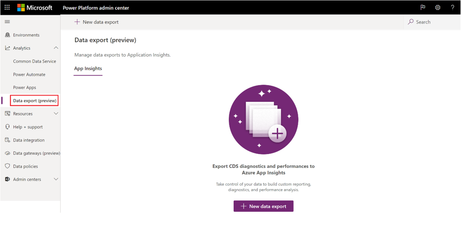
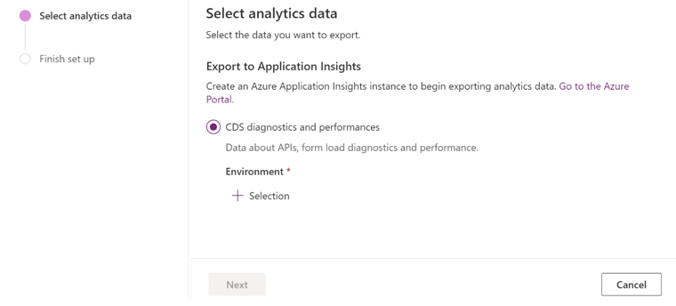
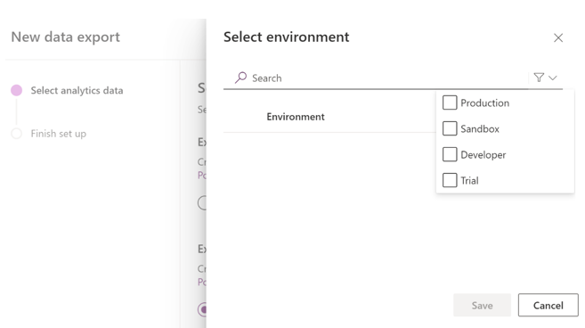
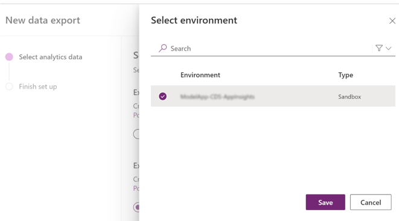
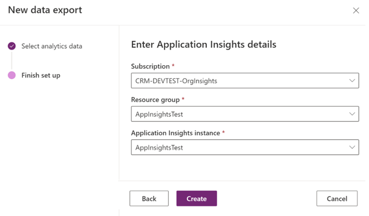
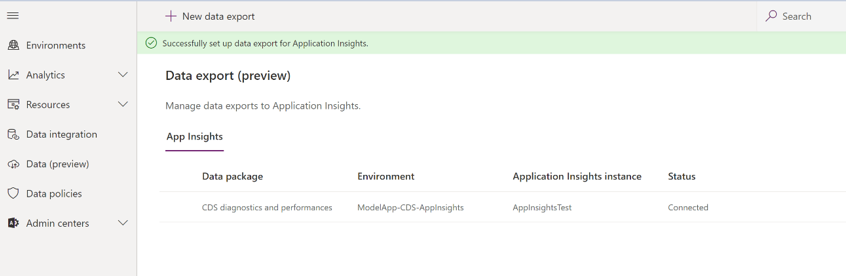
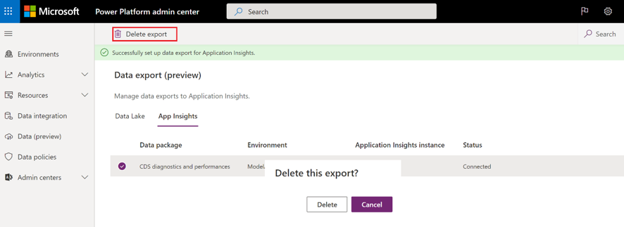

# Set up exporting to Application Insights  

## Prerequisites

1. Ensure that you have an [Application Insights environment](/azure/azure-monitor/app/create-new-resource) set up for receiving the data, in addition to the [environment](environments-overview.md) that has a database. 
   - For the Application Insights environment, you must have contributor, writer, or admin rights.
   - The Application Insights environment must be unique for an environment or tenant. Note that Application Insights out-of-the-box reports won't function correctly if a single Application Insights environment contains data from multiple environments.
2. To set up data export in the [Power Platform admin center](https://admin.powerplatform.microsoft.com/) you'll need one of these roles: Power Platform Service admin, Dynamics 365 admin, or Microsoft 365 Global admin. 

## Set up export to your Applications Insights environment from the Power Platform admin center

1. In the Power Platform admin center, select **Data Export** > **New data export**.

   > [!div class="mx-imgBorder"] 
   > 

2. Select **Export to Application Insights**. 

   > [!div class="mx-imgBorder"] 
   > 

3. Search for the environment that you'll set up for the Application Insights data export setup. You can choose to filter based on the environment type.

   > [!div class="mx-imgBorder"] 
   > 

   Choose the environment you want, and then select **Save**.

   > [!div class="mx-imgBorder"] 
   > 

4. Choose the Azure subscription, resource group, and Application Insights environment, and then select **Create**. You must have contributor, writer, or admin rights to the Application Insights environment. Typically, one production environment or tenant maps to one Application Insights environment. 

   > [!div class="mx-imgBorder"] 
   > 

5. The data export connection should now be set up. In the next 24 hours, data will start being exported to your Application Insights environment.

   > [!div class="mx-imgBorder"] 
   > 

6. To stop the data export to Application Insights, select **Delete export**. You can set up a new connection whenever you decide to restart the data export.

   > [!div class="mx-imgBorder"] 
   > 

## Regional availability 

|Zone  | Available |Public Preview availability  |
|---------|---------|---------|
|Canada     | Yes |  Yes |
|EMEA     | Yes |  Jan 2021        |
|North America     | Yes |  Jan 2021        |
|Germany  | Yes |  Jan 2021       |
|France     | Yes | March 2021        |
|South America     | Yes | Jan 2021        |
|Asia Pacific     |  Yes | Jan 2021       |
|Japan     |  Yes | Jan 2021       |
|UK     | Yes | Jan 2021        |
|OCE     | Yes | Jan 2021        |
|India     | Yes | March 2021        |
|South Africa (ZAF)     |  Yes | Jan 2021       |
|UAE     | Yes | March 2021        |
|Switzerland (CHE)     | Yes | Jan 2021       |
|Mooncake     | No |  June 2021 |
|GCC     | No |  May 2021 |
|GCC-Mod     | No |  May 2021 |
|GCC-DOD     | No |  TBD |

