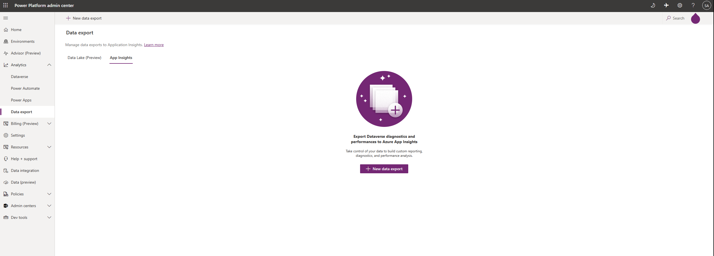
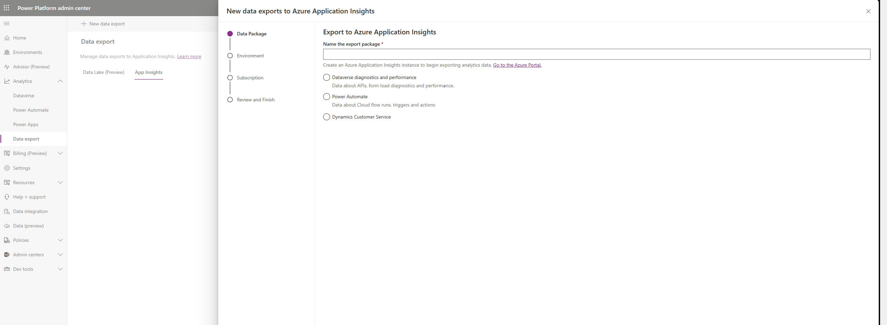
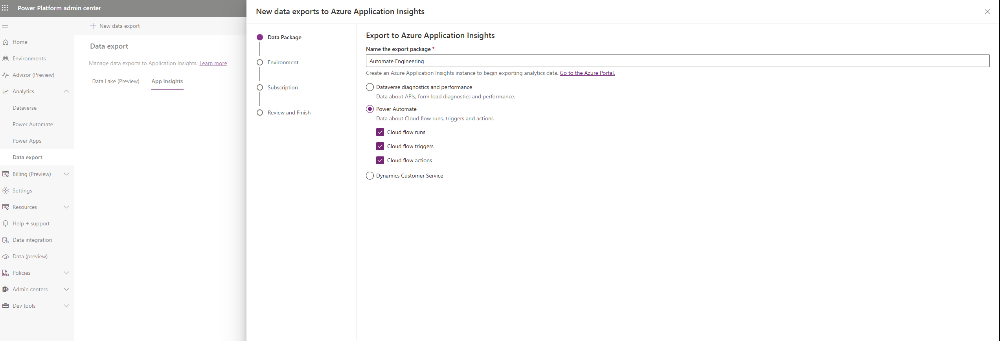
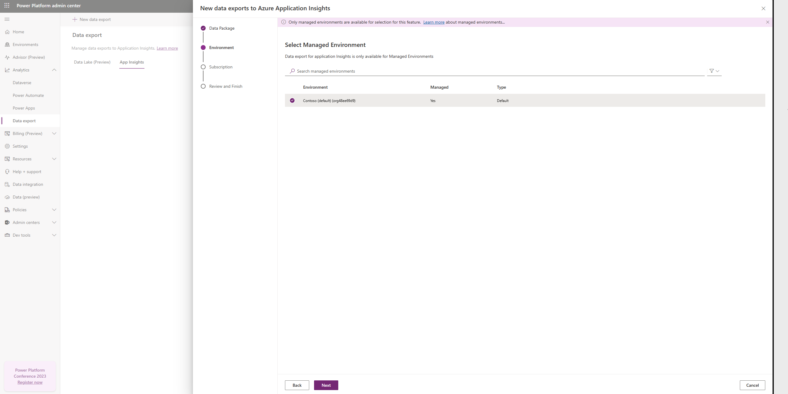
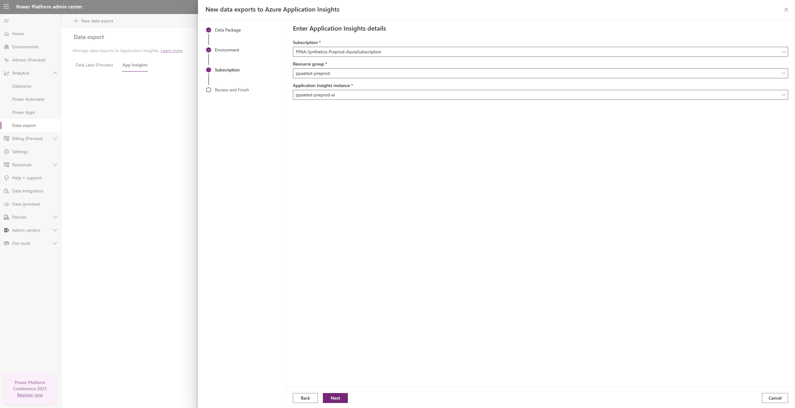
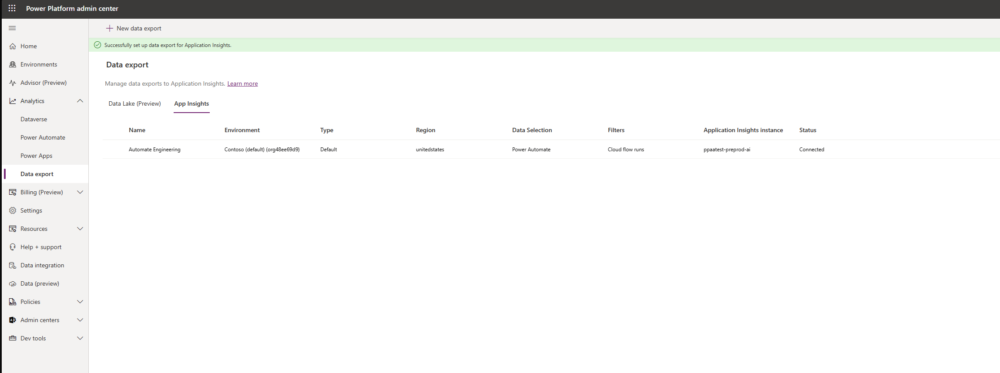
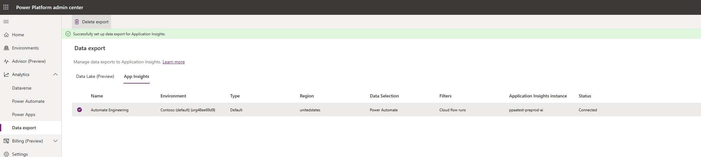

# Set up exporting to Application Insights 

## Prerequisites

1. Ensure that you have an [Application Insights environment](/azure/azure-monitor/app/create-workspace-resource) set up for receiving the data, in addition to the [environment](environments-overview.md) that has a database. 
   - For the Application Insights environment, you must have contributor, writer, or admin rights.
   - The Application Insights environment must be unique for an environment or tenant. Note that Application Insights out-of-the-box reports won't function correctly if a single Application Insights environment contains data from multiple environments.

2. To set up data export in the [Power Platform admin center](https://admin.powerplatform.microsoft.com/) you'll need to be a member of one of these roles: Power Platform admin, Dynamics 365 admin, or Microsoft 365 Global admin. 

## Set up export to your Applications Insights environment from the Power Platform admin center

1. In the Power Platform admin center, select **Data Export** > **App Insights** > **New data export**.

   > [!div class="mx-imgBorder"] 
   > 

2. Name the export package to be used as an Azure Application Insights instance. Select the specific data type you would like to export, whether it’s Dataverse, Power Automate, or Dynamics. 

   > [!div class="mx-imgBorder"] 
   > 

   For Automate, select whether to export cloud flow runs, triggers, or actions.
   > [!div class="mx-imgBorder"] 
   > 

3. Select the environment that you'll set up for the Application Insights data export setup. You can choose to filter based on the environment type.  

   > [!div class="mx-imgBorder"] 
   > 

   Click **Next** when you’ve selected an environment. 

4. Select the right Azure subscription, resource group, and Application Insights environment, and then click **Next**. You must have contributor, writer, or admin rights to the Application Insights environment. Typically, one production environment or tenant maps to one Application Insights environment. 

   > [!div class="mx-imgBorder"] 
   > 

5. Review the details of your new export package, and then click **Create** to set up the data export connection. 

   > [!div class="mx-imgBorder"] 
   > 

   The data export connection should now be set up. In the next 24 hours, data will start being exported to your Application Insights environment.

   > [!div class="mx-imgBorder"] 
   > 

7. To stop the data export to Application Insights, select **Delete export**. You can set up a new connection whenever you decide to restart the data export.

   > [!div class="mx-imgBorder"] 
   > 

  > [!IMPORTANT] 
  > - The export function for Dynamics is currently only available in private preview, while Power Automate’s is only available in public preview. 

[!INCLUDE[footer-include](../includes/footer-banner.md)]
